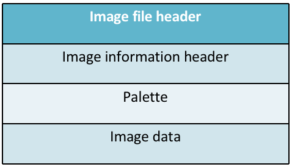

#### 1.BMP的文件格式：

​	BMP（Bitmap）是一种常见的图像文件格式，是Windows系统的一种标准文件格式。BMP 位图文件默认的文件扩展名是 bmp 或者 dib。大多数情况下，BMP 图像采用非压缩方式；然而，它也支持图像压缩，例如 RLE 格式。下面介绍BMP文件的具体文件结构。

> BMP 图像每一行扫描由表示图像像素的连续的字节组成，每一行以四字节对齐（以0补齐）。图像的扫描行是由底向上存储的，这就是说，阵列中的第一个字节表示位图左下角的像素，而最后一个字节表示位图右上角的像素。

##### （1）BMP文件整体结构：

##### 

​	BMP 文件 大体上分为四个部分:图像文件头（Image file header）、图像信息头（Image information header）、调色板（Palette）、图像数据字节阵列（Image data）。对用到调色板的位图，图像数据为该像素颜色在调色板中的索引值。对于真彩色图，图像数据就是实际的 R、G、B 值。

##### （2）BMP图像文件头（Image file header）

<table>
  
  <tr>
    <td>Start</td> 
    <td>Size(Byte)</td> 
    <td>Name</td> 
    <td>Purpose</td> 
  </tr>
  <tr>
    <td>1</td> 
    <td>2</td> 
    <td>bfType</td> 
    <td>Must always be set to 'BM' to declare that this is a .bmp-file</td> 
  </tr>
  <tr>
    <td>3</td> 
    <td>4</td> 
    <td>bfSize</td> 
    <td>Specifies the size of the file in bytes.</td> 
  </tr>
  <tr>
    <td>7</td> 
    <td>2</td> 
    <td>bfReserved1</td> 
    <td>Must always be set to zero.</td> 
  </tr>
  <tr>
    <td>9</td> 
    <td>2</td> 
    <td>bfReserved2</td> 
    <td>Must always be set to zero.</td> 
  </tr>
  <tr>
    <td>11</td> 
    <td>4</td> 
    <td>bfOffBits</td> 
    <td>Specifies the offset from the beginning of the file to the bitmap data</td> 
  </tr>
</table>

##### （3）BMP图像信息头（image information header）

<table>
  
  <tr>
    <td>Size(Byte)</td> 
    <td>Name</td> 
    <td>Purpose</td> 
  </tr>
  <tr>
    <td>4</td> 
    <td>biSize</td> 
    <td>Number of bytes to define BITMAPINFOHEADER structure</td> 
  </tr>
  <tr>
    <td>4</td> 
    <td>biWidth</td> 
    <td>Image width (number of pixels)</td> 
  </tr>
  <tr>
    <td>4</td> 
    <td>biHeight</td> 
    <td>Image height (number of pixels). </td> 
  </tr>
  <tr>
    <td>2</td> 
    <td>biPlane</td> 
    <td>Number of planes. Always be 1.</td> 
  </tr>
  <tr>
    <td>2</td> 
    <td>biBitCount</td> 
    <td>Bits per pixel (Bits/pixel), which is 1, 4, 8, 16, 24 or 32. </td> 
  </tr>
  <tr>
    <td>4</td> 
    <td>biCompression</td> 
    <td>Compression type. Only non-compression is discussed here: BI_RGB.</td> 
  </tr>
  <tr>
    <td>4</td> 
    <td>biSizeImage</td> 
    <td>Image size with bytes. When biCompression=BI_RGB, biSizeImage=0.</td> 
  </tr>
  <tr>
    <td>4</td> 
    <td>biXPelsPerMeter</td> 
    <td>Horizontal resolution, pixels/meter.</td> 
  </tr>
  <tr>
    <td>4</td> 
    <td>biYPelsPerMeter</td> 
    <td>Vertical resolution, pixels/meter</td> 
  </tr>
  <tr>
    <td>4</td> 
    <td>biClrUsed</td> 
    <td>Number of color indices used in the bitmap (0->all the palette items are used).</td> 
  </tr>
  <tr>
    <td>4</td>
    <td>biClrImportant</td>
    <td>Number of important color indices for image display. 0->all items are important.</td>
  </tr>
  
</table>

* 注明  $biHeight$ 可以表示图像是否倒置，$biHeight$ 为正数表示倒置（inverted）， 负数表示正常（upright)，大多数BMP文件是倒置的位图，即 $biHeight$>0。

（4）调色板（Palette）

调色板的大小为$N*4$ (bytes)。调色板中的每一项用1 字节表示蓝色分量、1 字节表示绿色分量、1 字节表示红色分量、1 字节用于填充符 (设置为 0)。

##### （5）图像数据字节阵列（Image data）

图像数据字节阵列存储了调色板的索引号，或者取决于颜色深度的RGB值。其大小取决于图像大小和颜色深度。

#### 2.BMP文件的读入和存储

利用 C 语言中的 *fopen* *fread* *fwrite* 进行读入、写出即可。在读入与写出的过程中，需要注意 BMP文件信息的调整，例如由24位彩色BMP转为灰色图时，需要注意调色板、位深等的调整。

#### 3.RGB 和 YUV 的相互转化

RGB（红绿蓝）和YUV是两种颜色表示方式，常用于图像和视频处理中。RGB是一种直接表示颜色的方式，其中红色（R）、绿色（G）和蓝色（B）分量的值决定了颜色的具体外观。RGB可以浮点表示方式：取值范围为 `0.0 ~ 1.0`；或以整数表示：取值范围为 `0 ~ 255` 或者 `00 ~ FF`。RGB 颜色模型 通常用于彩色阴极射线管和彩色光栅图形显示器(计算机和电视机采用)。

YUV是一种颜色空间，基于 `YUV` 的颜色编码是流媒体的常用编码方式，这种表达方式起初是为了彩色电视与黑白电视之间的信号兼容；其中：Y：表示明亮度（Luminance 或 Luma），也称灰度图。U、V：表示色度（Chrominance 或 Chroma），作用是描述影像的色彩及饱和度，用于指定像素的颜色。

</table>

* RGB转化为YUV的公式如下：

  $\begin{gathered}\begin{bmatrix} Y  \\ U \\ V\end{bmatrix}=\begin{bmatrix} 0.299 & 0.587 & 0.114  \\ −0.147& −0.289 &0.435 \\0.615 &−0.515& −0.100\end{bmatrix}\begin{bmatrix} R \\ G\\ B\end{bmatrix}\quad\end{gathered}$

* YUV 转化为RGB的公式如下：

$\begin{gathered}\quad\quad\begin{bmatrix} R  \\ G \\ B\end{bmatrix}=\begin{bmatrix} 1.0000 &0.0000& 1.3707  \\1.0000& −0.3376 &-0.6980 \\ 1.0000&1.7324& 0.0000\end{bmatrix}\begin{bmatrix} Y \\ U\\ V\end{bmatrix}\quad\end{gathered}$

</table>

由BMP彩色图转为灰度图时，只需将RGB转为YUV，并只保留 Y分量 即可得到灰度图在调节BMP图片亮度时，只需将RGB转为YUV，改变 Y 分量的值，随后将 YUV 转回 RGB 即可得到被更改过亮度的图片。

