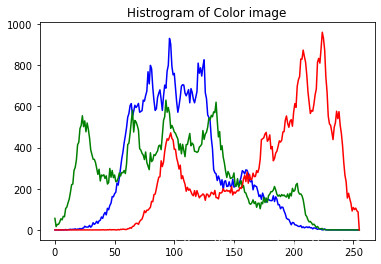
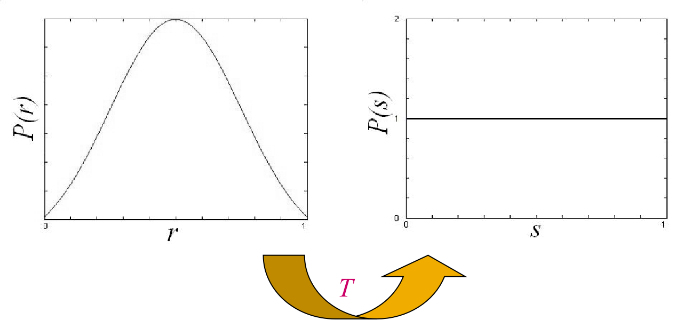

#### 1.增强图像的可视性

为了增强图像的可视信息，对图像中的像素进行基于对数的操作
$$
L_d =  \frac{log{({L_{w}+1})}}{log{({L_{max}+1})}}
$$
其中，$Ld $是显示亮度，$Lw $是真实世界亮度，$Lmax$是场景中的最亮值。

* 这个映射能够确保不管场景的动态范围是怎么样的，其最大值都能映射到 1(白)，其他的值能够比较平滑地变化。

#### 2.直方图均衡化

##### (1)直方图

###### a.灰度直方图

* 灰度直方图是一种统计图，它表示给定图像中不同灰度级的像素数占总像素数的比例。
* 计算公式如下：

$$
p(rk)=\frac{nk}{MN}\\
rk -- 像素的灰度级\\
nk -- 具有灰度rk的像素的个数\\
MN -- 图像中总的像素个数\\
\sum_{k=0}^{MN-1}P(rk)=1
$$

###### b.彩色直方图

* 彩色直方图表示给定图像中不同 R、G、B等级的像素数占总像素数的比例,计算方法与灰度直方图类似

  

##### （2）直方图均衡化

直方图均衡化（Histogram Equalization）是一种用于增强数字图像对比度的图像处理技术。它通过重新分布图像的像素值，使直方图变得更均匀，从而改善图像的视觉质量。直方图均衡化常被用于提高图像的可视性、分析性能和自动图像处理应用中。例如，过曝光图像的灰度级集中在高亮度范围内，而曝光不足将使图像灰度级集中在低亮度范围内。采用直方图均衡化，可以把原始图像的直方图变换为均匀分布(均衡)的形式，这样就增加了像素之间灰度值差别的动态范围，从而达到增强图像整体对比度的效果。

换言之，直方图均衡化的基本原理是:对在图像中像素个数多的灰度值(即对画面起主要作用的灰度值)进行展宽，而对像素个数少的灰度 值(即对画面不起主要作用的灰度值)进行归并，从而增大对比度，使图像清晰，达到增强的目的。

尽管直方图均衡化具有显著的优点，但它也有一些限制。它可能导致图像出现噪点或过度增强细节，特别是在噪音存在的情况下。此外，均衡化可能改变图像的整体亮度，这可能不适用于所有图像。

* 连续情况的转换$T$:

  

  - 设 r 为转换前的灰度级， s 为变换前后的灰度级

  - $0 ≤ r,s ≤ 1$ [对应$(0,255)$]

  - P(r) 和 P(s) 是对应于 r 和 s 的概率。转换规则为:

    * T(r)是单调递增函数，$0≤r≤1$且$0≤T(r)≤1$

    * 逆变换 r = $T^{-1}(s)$也是一个单调递增函数 考虑到灰度变换不会改变位置和像素数，我们有
      $$
      \int_0^rP(r)dr = \int_0^sP(s)ds=\int_0^s 1*ds = s = T(r)\\
      Thus: T(r)=\int_0^rP(r)dr
      $$
      

* 离散情况的转换 $T$:

设一幅图像的像素总数为n，分L个灰度级，$n_k$为第k个灰度级出现的像素数，则第$k$个灰度级出现的概率为：
$$
P(r_k)= \frac{n_k}{n}(0≤n_k ≤1,k=0,1,2,...,MN−1)
$$

* 离散灰度直方图均衡化的转换公式为
  $$
  s_k = T(r_k)=\sum_{i=0}^kP(ri)=\frac{1}{n}\sum_{i=0}^{k}ni
  $$

