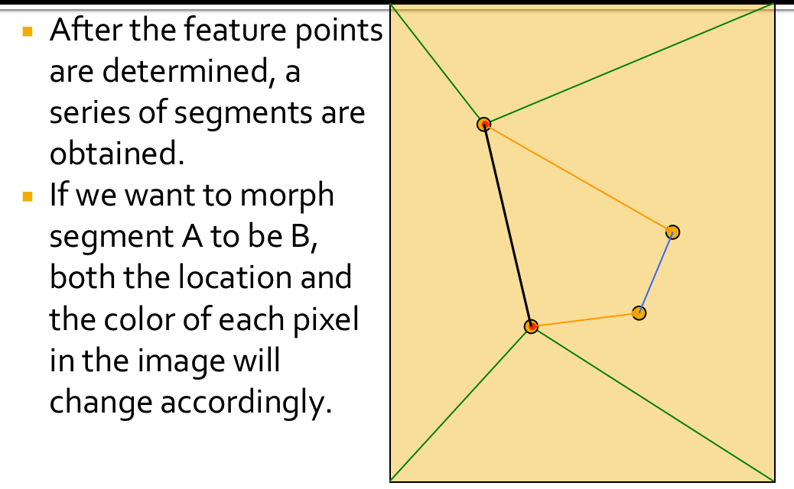
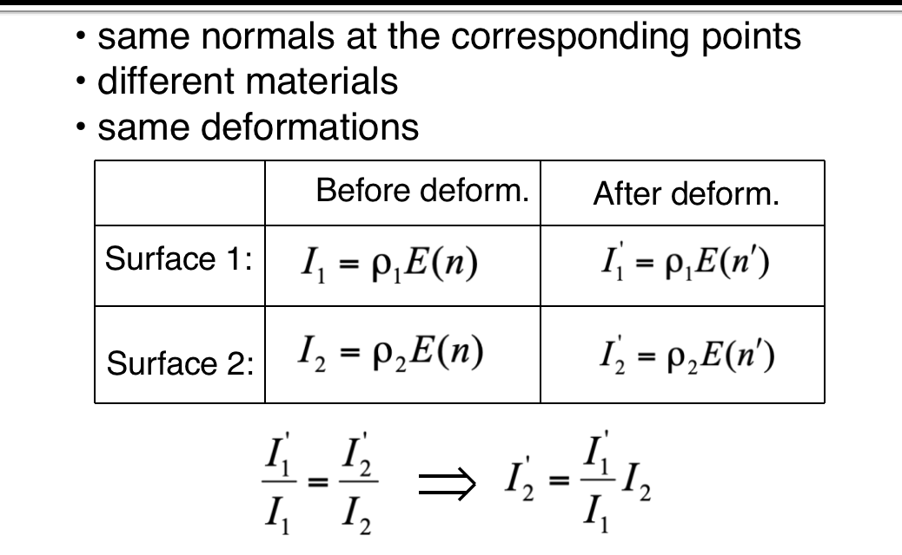
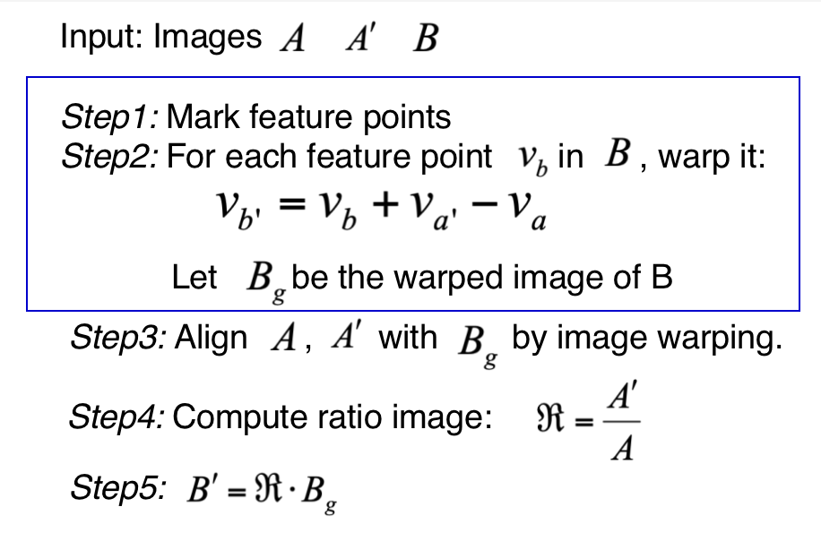

# Morph

Morph is not warp (geometric transformation)Morph is a kind of morphological changing, which makes an image change to another image gradually. Morph handles both the location and the intensity of a pixel.The beginning image and end image are two key frames. Other frames between the two key frames are generated automatically. 

* 大小相同的两幅图的转换作静态变换从一幅图a逐渐变化成第二幅图b 
  * 原理：让图a中每个像素的颜色，逐渐变成图b相同位置像素的颜色
  * 方法：根据变换的快慢，设置相应的步长，将图a每一点的RGB逐渐变成图b相同位置象素的RGB,可以选择等比或等差的方式，或其它方式让：$ra-->rb$
  * 对于灰度图像，可以直接用等比或等差级数定义步长，使颜色从原图变到目标图。

* 对于彩色图像，RGB三色同时从原图变到目标图像。可以分别变化，也可考虑RGB的相对比例关系同时变化。

* 选择两幅结构相似、大小相同的画面作为起始和结束关键帧，这样才能比较容易地实现自然、连续的中间变形过程。

* 在起始和结束画面上确定和勾画出各部分（主要轮廓）的结构对应关系，也即从起始画面上的一个点变到结束画面上的另一个对应点的位置，这是变形运算所需要的参数

  根据需要，对应点的位置可以任意移动。调整起始帧的对应点位置，可以模拟摄像中的镜头渐变效果

## Morph based on segment (two points)

## Morph based on grid

* 视点变换就是求在视点移动后原始图像变换生成的新视图

* 在用相机拍摄物体时，保持物体的位置不动，而将相机移离物体，这就相当于视点变换

* 如果我们保持相机固定位置，将物体移离相机，这就相当于模型转换。视点变形要求对物体有三维坐标知识。

## Application

**Expressive Expression Mapping with Ratio Images**

### Lambertian model

Assume there are m point light sources:

$I=\rho\sum_{1\le i\le m}S_iI_in·l_i=\rho E(n)$ 

$S_i=\left\{\begin{array}{ll}0 & \text{if the point cannot be seen from light i }\\1& \text{Otherwise}\end{array}\right.$ 

* 其中 $l_i$ 第 i 个光源照过来的角度

* $n$ 表示当前这个曲面的法向量，所以$n·l_i$相当于余弦关系

* $I_i$ 表示第 i 个光源的亮度

* $S_i$表示曲面能不能被第 i 个点光源照到

* $\rho$ 表示曲面的材质

### Expression ratio image

* Before deformation $I=\rho E(n)$
* After deformation $I'=\rho E(n')$
* Expression ratio image $\frac{I'}{I}=\frac{E(n')}{E(n)}$

### Surface deformation mapping

* Assumption : HUman faces have approxiamtely the same normals

### Algorithm

### Image alignment

* Use image wraping to obtain pixel correspondence
