## Convolutional Networks

* Refer to Slides

### Pytorch

```python
torch.nn.Conv1d(in_channels,out_channels,lernel_size,stride=1,padding=0,dilation =1,grounps=1,bias=True,padding_mode='zeros')
```

```python
torch.nn.Conv3d(in_channels,out_channels,kernel_size,stride=1,padding=0.dilation=1,groups=1,bias=True,padding_mode='zeros')
```

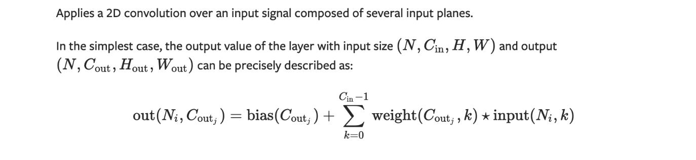

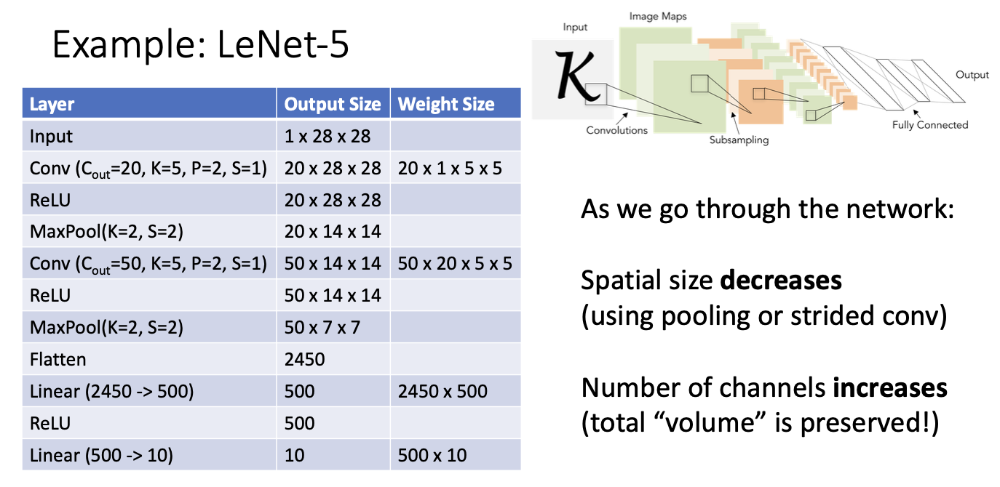

**Problem: Deep Networks very hard to train!**

### Normalization

https://medium.com/techspace-usict/normalization-techniques-in-deep-neural-networks-9121bf100d8

https://zhuanlan.zhihu.com/p/56542480

#### Batch Normalization

* Idea: “Normalize” the outputs of a layer so they have zero mean and unit variance

> Why? Helps reduce “internal covariate shift”, improves optimization

* We can normalize a batch of activations like this:

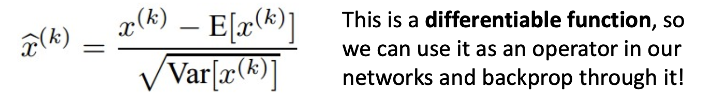

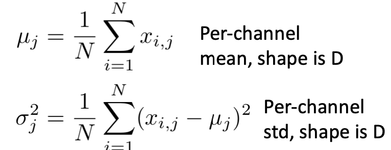

* **Problem: What if zero-mean, unit variance is too hard of a constraint?**

  > **Learnable scale and shift parameters:** $\gamma\ \beta$​

   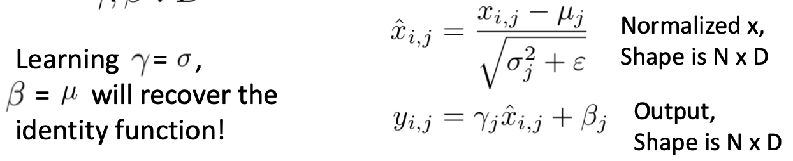

**problem : If in two pics,one has a batch of a cat and the other has a batch of dog, we donot expect them to be in different classes,but the batch normalization will cause such problems**

> Use constant $\mu$ and $\sigma$​  !
>
> * During testing batchnorm becomes a linear operator! Can be fused with the previous fully-connected or conv layer

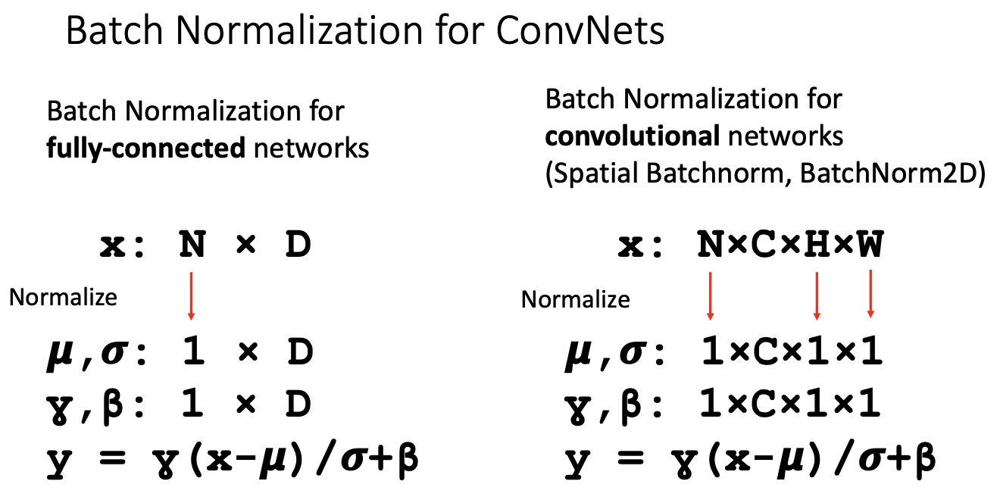

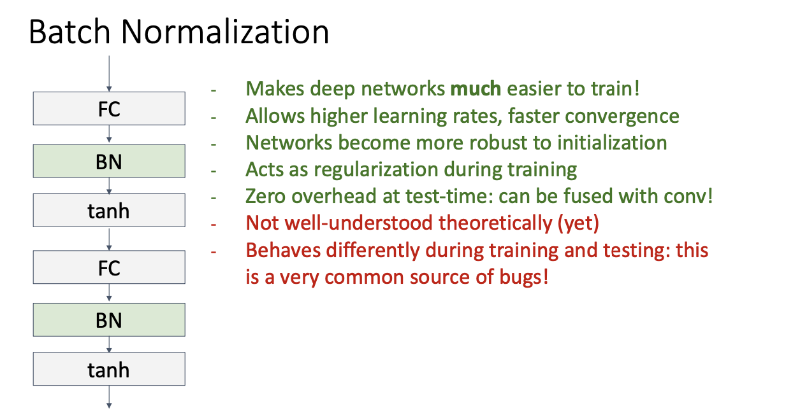

#### Layer Normalization

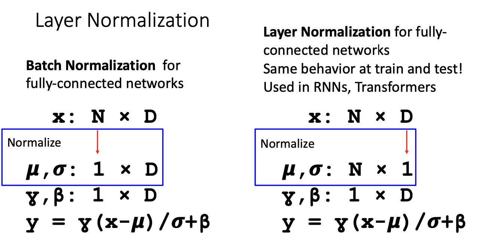

#### Instance Normalization

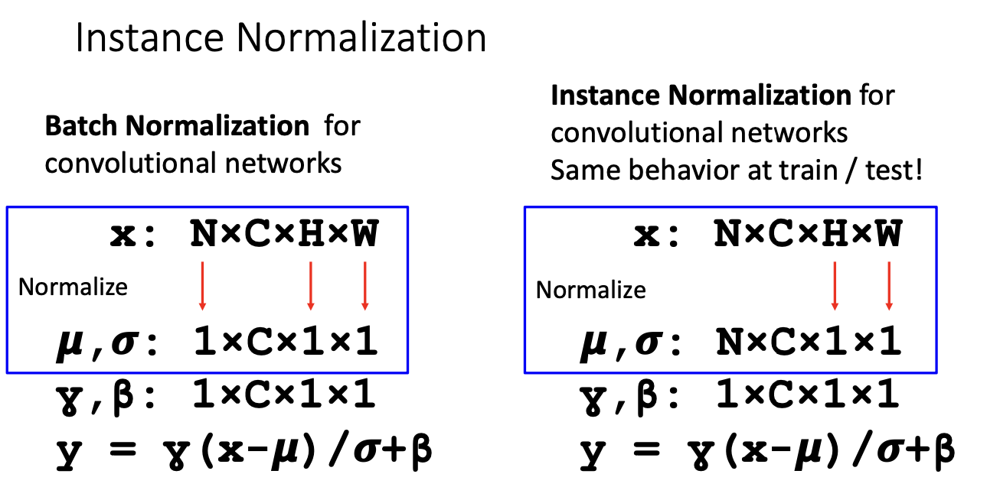

#### Group Normalization

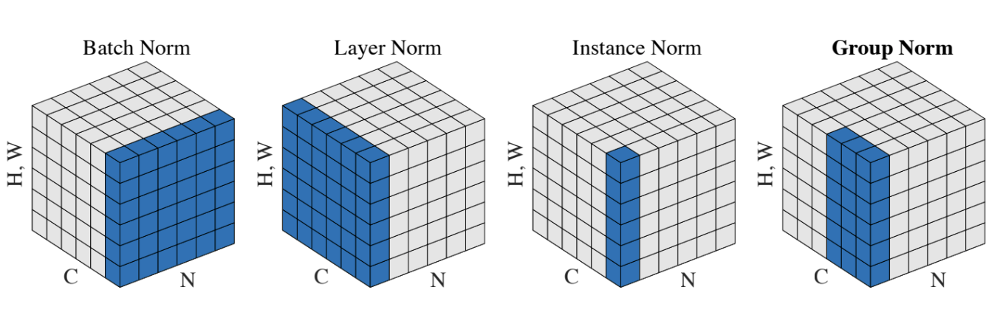

### Summary

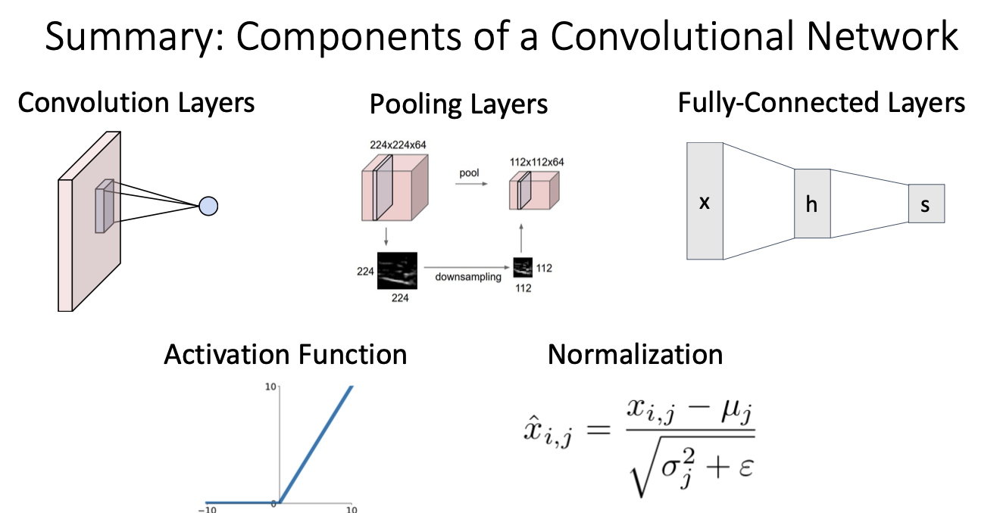

## CNN Architectures

