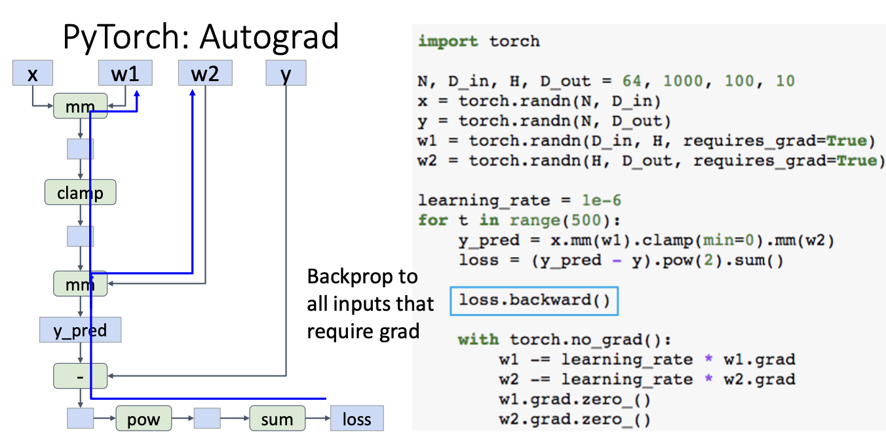
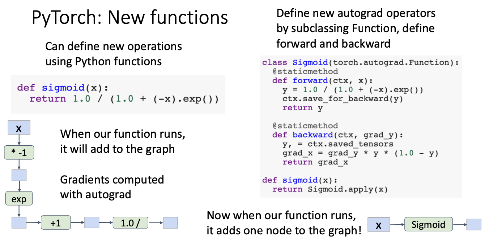
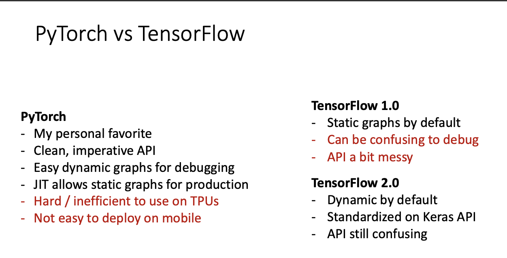

<font face = 'Times New Roman'>

## Deep Learning Hardware

* Refer to Slides

## Deep Learning Software

### Pytorch

#### Basic Concepts

* **Tensor**

  * Create

  ```python
  x = torch.empty(3, 4)
  print(type(x))
  print(x)
  '''Out:
  <class 'torch.Tensor'>
  tensor([[0., 0., 0., 0.],
          [0., 0., 0., 0.],
          [0., 0., 0., 0.]])
  '''
  zeros = torch.zeros(2, 3)
  ones = torch.ones(2, 3)
  torch.manual_seed(1729)
  random = torch.rand(2, 3)
  ```

  * `_like methods`

  ```python
  x = torch.empty(2, 2, 3)
  print(x.shape)
  print(x)
  
  empty_like_x = torch.empty_like(x)
  print(empty_like_x.shape)
  print(empty_like_x)
  
  zeros_like_x = torch.zeros_like(x)
  print(zeros_like_x.shape)
  print(zeros_like_x)
  
  ones_like_x = torch.ones_like(x)
  print(ones_like_x.shape)
  print(ones_like_x)
  
  rand_like_x = torch.rand_like(x)
  print(rand_like_x.shape)
  print(rand_like_x)
  ```

#### Fundamental Concepts

* **Tensor**: Like a numpy array, but can run on GPU 

  ```python
  import torch
  device = torch.device('cpu')
  #device = torch.device('cuda:0')
  #device = torch.device('mps')
  N,D_in,H,D_out = 64,1000,100,10
  x = torch.randn(N,D_in,device=device)
  y = torch.randn(N,D_out,device=device)
  w1 = torch.randn(D_in,H,device=device)
  w2 = torch.randn(H,D_out,device=device)
  learning_rate=1e-6
  for t in range(500):
    h = x.mm(w1)
    h_relu = h.clamp(min=0)
    y_pred = h_relu.mm(w2)
    loss = (y_pred-y).pow(2).sum
    
    grad_y_pred = 2.0*(y_pred-y)
    grad_w2 = h_relu.t().mm(grad_y_pred)
    grad_h_relu = grad_y_pred.mm(w2.t())
    grad_h = grad_h_relu.clone()
    grad_h[h<0]=0
    grad_21 = x.t()mm(grad_h)
    
    w1 -= learning_rate * grad_w1
    w2 -= learning_rate * grad_w2
  ```

  * Data types : `a = torch.ones((2, 3), dtype=torch.int16)`
  * Tensor Broadcasting
    * Broadcasting is a way to perform an operation between tensors that have similarities in their shapes. In the example below, the one-row, four-column tensor is multiplied by *both rows* of the two-row, four-column tensor.

  ```python
  rand = torch.rand(2, 4)
  doubled = rand * (torch.ones(1, 4) * 2)
  print(rand)
  print(doubled)
  ```

  * Moving to GPU

    ```python
    device = torch.device("mps")
    model = ModelName(xxx).to(device)
    data = torch.Tensor(dataset.x).to(device)
    ```

  * Changing dimensions

    ```python
    a = torch.rand(3, 226, 226)
    b = a.unsqueeze(0)
    print(a.shape)
    print(b.shape)
    ```

  * numpy

    ```python
    import numpy as np
    
    numpy_array = np.ones((2, 3))
    print(numpy_array)
    
    pytorch_tensor = torch.from_numpy(numpy_array)
    print(pytorch_tensor)
    ```

* **Autograd**: Package for building computational graphs out of Tensors, and automatically computing gradients

  ```python
  import torch
  N,D_in,H,D_out = 64,1000,100,10
  x = torch.randn(N,D_in)
  y = torch.randn(N,D_out)
  w1 = torch.randn(D_in, H ,requires_grad=True)
  w2 = torch.randn(H,D_out,requires_grad=True)
  learning_rate=1e-6
  for t in range(500):
    y_pred = x.mm(w1).clamp(min=0).mm(w2)
    loss = (y_pred-y).pow(2).sum()
    loss.backward()
    with torch.no_grad():
    # Don't do computational graph in this stage [donnot do grad computation in this stage]
      w1 -= learning_rate * w1.grad
    	w2 -= learning_rate * w2.grad
      w1.grad.zero_()
      w2.grad.zero_()
  ```

  

  >* After backward finishes, gradients are **accumulated** into $w1.grad$ and $w2.grad$ and the graph is destroyed -- FORGET this is a common bug!
  >
  >* Can define new operations using Python functions
  >
  >  ```python
  >  def sigmoid(x):
  >    return 1.0/(1.0+(-x).exp())
  >  # y_pred = sigmoid(x.mm(w1)).mm(w2)
  >  ```

* **new functions**

  ```python
  def sigmoid(x):
    return 1.0/(1.0+(-x).exp())
  import torch
  N,D_in,H,D_out = 64,1000,100,10
  x = torch.randn(N,D_in)
  y = torch.randn(N,D_out)
  w1 = torch.randn(D_in, H ,requires_grad=True)
  w2 = torch.randn(H,D_out,requires_grad=True)
  learning_rate=1e-6
  for t in range(500):
    y_pred = sigmoid(x.mm(w1)).mm(w2)
    loss = (y_pred-y).pow(2).sum()
    loss.backward()
    with torch.no_grad():
    # Don't do computational graph in this stage [donnot do grad computation in this stage]
      w1 -= learning_rate * w1.grad
    	w2 -= learning_rate * w2.grad
      w1.grad.zero_()
      w2.grad.zero_()
  ```

  * Improvement

    ```python
    class Sigmoid(torch.autograd.Function):
      @staticmethod
      def forward(ctx,x):
        y = 1.0/(1.0+(-x).exp())
        ctx.save_for_backward(y)
        return y
     	def backward(ctx,grad_y):
        y,=ctx.saved_tensors
        grad_x = grad_y*y*(1.0-y)
        return grad_x
    def sigmoid(x):
      return SIgmoid.apply(x)
    ```

    

    

    
    
    * In practice this is pretty rare – in most cases Python functions are good enough

* **Module**: A neural network layer ; may store state or learnable weights

* **nn ** : Higher-level wrapper for working with neural nets

  ```python
  import torch
  N,D_in,H,D_out = 64,1000,100,10
  
  x = torch.randn(N,D_in)
  y = torch.randn(N,D_out)
  '''
  Object-oriented API: Define model object as sequence of layers objects, each of which holds weight tensors
  '''
  model = torch.nn.Sequential(
    torch.nn.Linear(D_in,H),
    torch.nn,ReLU(),
    torch.nn.Linear(H,D_out)
  )
  learning_rate = 1e-4
  optimizer = torch.optim.Adam(model.parameters(),lr=learning_rate)
  for t in range(500):
    y_pred = model(x)
    loss = torch.nn.functional.mse_loss(y_pred,y)#torch.nn.functional has useful helpers like loss functions
    loss.backward()
    with torch.no_grad():
      for param in model.parameters():
        param -= learning_rate * param.grad
     model.zero_grad( )
    
  ```
  
  *  Use an optimizer for different update rules
  
  ```python
  import torch
  N,D_in,H,D_out = 64,1000,100,10
  
  x = torch.randn(N,D_in)
  y = torch.randn(N,D_out)
  '''
  Object-oriented API: Define model object as sequence of layers objects, each of which holds weight tensors
  '''
  model = torch.nn.Sequential(
    torch.nn.Linear(D_in,H),
    torch.nn,ReLU(),
    torch.nn.Linear(H,D_out)
  )
  learning_rate = 1e-4
  optimizer = torch.optim.Adam(model.parameters(),lr=learning_rate)
  for t in range(500):
    y_pred = model(x)
    loss = torch.nn.functional.mse_loss(y_pred,y)#torch.nn.functional has useful helpers like loss functions
    loss.backward()
    optimizer.step()
    optimizer.zero_grad()
  ```
  
*  **nn Defining Modules**

  ```python
  import torch 
  class TwoLayerNet(torch.nn.Module):
    def __init__(self,D_in,H,D_out):
      super(TwoLayerNet,self).__init__()
      self.linear1 = torch.nn.Linear(D_in,H)
      self.linear2 = torch.nn.Linear(H,D_out)
    def forward(self,x):
      h_relu = self.linear1(x).clamp(min=0)
      y_ored = self.linear2(h_relu)
      return y_pred
  N,D_in,H,D_out = 64,1000,100,10
  x = torch.randn(N,D_in)
  y = torch.randn(N,D_out)
  model = TwoLayerNet(D_in,H,D_out)
  optimizer = torch.optim.SGD(model.parameters(),lr=1e-4)
  for t in range(500):
    y_pred = model(x)
    loss = torch.nn.functional.mse_loss(y_pred,y)
    loss.backward()
    optimizer.step()
    optimizer.zero_grad()
  ```
  
  *  Very common to mix and match custom Module subclasses and Sequential containers
  * Very easy to quickly build complex network architectures!
  
  ```python
  import torch
  class ParallelBlock(torch.nn.Module):
    def __init__(self,D_in,D_out):
      super(ParallelBlock,self)._init__()
      self.linear1 = torch.nn.Linear(D_in,D_out)
      self.linear2 = torch.nn.Linear(D_in,D_out)
    def forward(self,x):
      h1 = self.linear1(x)
      h2 = self.linear2(x)
      return (h1*h2).clamp(min = 0)
  N,D_in,H,D_out = 64,1000,100,10
  x = torch.randn(N,D_in)
  y = torch.randn(N,D_out)
  model = torch.nn.Sequential(
    ParallelBlock(D_in,H),
    ParallelBlock(H,H),
    torch.nn.Linear(H,D_out)
  )
  optimizer = torch.optim.Adam(model.parameters(),lr = 1e-4)
  for t in range(500):
    y_pred = model(x)
    loss = torch.nn.functional.mse_loss(y_pred,y)
    loss.backward()
    optimizer.step()
    optimizer.zero_grad()
  ```
  
* **DataLoaders**

  ```python
  import torch
  from torch.utils.data import TensorDataset,DataLoader
  N,D_in,H,D_out = 64,1000,100,10
  x = torch.randn(N,D_in)
  y = torch.randn(N,D_out)
  loader = DataLoader(TensorDataset(x,y),batch_size = 8)
  model = TwoLayerNet(D_in,H,D_out)
  optimizer = torch.optim.SGD(model.parameters(),lr= = 1e-2)
  for epoch in range(20):
    # Iterate over loader to form minibatches
    for x_batch,y_batch in loader:
      y_pred = model(x_batch)
      loss = loss.nn.functional.mse_loss(y_pred,y_batch)
      loss.backward()
      optimizer.step()
      optimizer.zero_grad()
  ```

* **Pretrained Models**

  ```python
  import torch
  import torchvision
  alexnet = torchvision.models.alexnet(pretrained = True)
  vgg16 = torchvision.models.vgg16(pretrained = True)
  resnet101 = torchvision.models.resnet101(pretrained = True)
  ```

* **Dynamic Computation Graphs**

  Note : this model doesn’t makes sense! Just a simple dynamic example

  ```python
  import torch
  N,D_in,H,D_out = 64,1000,100,10
  x = torch.randn(N,D_in)
  y = torch.randn(N,D_out)
  w1 = torch.randn(D_in,H,requires_grad = True)
  w2a = torch.randn(H,D_out,requires_grad = True)
  w2b = torch.randn(H,D_out,requires_grad = True)
  learning_rate=1e-6
  for t in range(500):
    # Decide which one to use at each layer based on loss at previous iteration
    w2 = w2a if prev_loss <5.0 else w2b
    y_pred = x.mm(w1).clamp(min=0).mm(w2)
    loss = (y_pred - y).pow(2).sum
    loss.backward()
    prev_loss = loss.item()
  ```

* **Static Computation Graphs**

  * Step 1: Build computational graph describing our computation (including finding paths for backprop)
  * Step 2: Reuse the same graph on every iteration

  ```python
  import torch 
  def model(x,y,w1,w2a,w2b,prev_loss):
  	w2 = w2a if prev_loss <5.0 else w2b
    y_pred = x.mm(w1).clamp(min=0).mm(w2)
    loss = (y_pred - y).pow(2).sum
    return loss
  N,D_in,H,D_out = 64,1000,100,10
  x = torch.randn(N,D_in)
  y = torch.randn(N,D_out)
  w1 = torch.randn(D_in,H,requires_grad = True)
  w2a = torch.randn(H,D_out,requires_grad = True)
  w2b = torch.randn(H,D_out,requires_grad = True)
  #Just-In-Time compilation: Introspect the source code of the function, compile it into a graph object.
  graph = torch.jit.script(model)
  prev_loss = 5.0
  learning_rate = 1e-6
  for t in range(500):
    loss = graph(x,y,w1,w2a,w2b,prev_loss)
    loss.backward()
    prev_loss = loss.item()
  ```

  * Even easier: add **annotation** to function, Python function compiled to a graph when it is defined

  ```python
  import torch
  @torch.jit.script
  def model(x,y,w1,w2a,w2b,prev_loss):
  	w2 = w2a if prev_loss <5.0 else w2b
    y_pred = x.mm(w1).clamp(min=0).mm(w2)
    loss = (y_pred - y).pow(2).sum
    return loss
  N,D_in,H,D_out = 64,1000,100,10
  x = torch.randn(N,D_in)
  y = torch.randn(N,D_out)
  w1 = torch.randn(D_in,H,requires_grad = True)
  w2a = torch.randn(H,D_out,requires_grad = True)
  w2b = torch.randn(H,D_out,requires_grad = True)
  prev_loss = 5.0
  learning_rate = 1e-6
  for t in range(500):
    loss = model(x,y,w1,e2a,w2b,prev_loss)
    loss.backward()
    prev_loss = loss.item()
  ```

* Static vs Dynamic Graphs: Debugging

  **Static**

  * With static graphs, framework can **optimize** the graph for you before it runs!

  * Once graph is built, can **serialize** it and run it without the code that built the graph!

    **e.g. train model in Python, deploy in C++**

  * Lots of indirection between the code you write and the code that runs – can be hard to debug, benchmark, etc

  **Dynamic**

  * Graph building and execution are intertwined, so always need to keep code around

  * The code you write is the code that runs! Easy to reason about, debug, profile, etc

* **Dynamic Graph Applications**

  Model structure depends on the input: 

  - Recurrent Networks 
  -  Recursive Networks 
  - Modular Networks

### TensorFLow

* TensorFlow 1.0 : Static Graphs

  * First **define** computational graph

  * Then **run** the graph many times

  ```python
  import numpy as np
  import tensorflow as tf
  N,D,H = 64,1000,100
  x = tf.placeholder(tf.float32,shape = (N,D))
  y = tf.placeholder(tf.float32,shape = (N,D))
  w1 = tf.placeholder(tf.float32,shape = (D,H))
  w2 = tf.placeholder(tf,float32,shape = (H,D))
  
  h = tf.maximum(tf.matmul(x,w1),0)
  y_pred = tf.matmul(h,w2)
  diff = y_pred - y
  loss = tf.reduce_mean(tf.refuce_sum(diff ** 2,axis = 1))
  grad_w1,grad_e2 = tf.grafients(loss,[w1,w2])
  
  with tf.Session() as sess :
    values = {
      x:np.random.randn(N,D),
      w1:np.random.randn(D,H),
      w2:np.random.randn(H,D),
      y:np.random.randn(N,D),
    }
    out = sess.run(
      [loss,grad_w1,grad_w2],
      feed_dict = values
    )
    loss_val,grad_w1_val,grad_w2_val = out
  ```

* TensorFlow 2.0: Dynamic Graphs

  * Create TensorFlow Tensors for data and weights

  * Weights need to be wrapped in tf.Variable so we can mutate them

  ```python
  import tensorflow as tf
  N,Din,H,Dout = 16,1000,100,10
  x = tf.random.noraml((N,Din))
  y = tf.random,normal((N,Dout))
  w1 = tf.Variable(tf.random.normal(Din,H))
  w2 = tf.Variable(tf.random.normal(H,Dout))
  for t in range(1000):
    #Scope forward pass under a GradientTape to tell TensorFlow to start building a graph
    with tf,GradientTape() as tape :
      h = tf.maximum(tf.matmul(x,w1),0)
      y_pred = tf.matmul(h,w2)
      diff = y_pred - y
      loss = tf.reduce_mean(tf.reduce_sum(diff **2 , axis = 1))
      #Ask the tape to compute gradients
     	grad_w1,grad_e2 = tape.gradient(loss,[w1,w2])
      # Gradient descent step, update weights
    	w1.assign(w1-learning_rate*grad_w1)
      w2.assign(w2-learning-learning_rate*grad_w2)
  learning_rate
  ```

* TensorFlow 2.0: Static Graphs

  ```python
  @tf.function
  def step(x,y,w1,w2):
   with tf,GradientTape() as tape :
      h = tf.maximum(tf.matmul(x,w1),0)
      y_pred = tf.matmul(h,w2)
      diff = y_pred - y
      loss = tf.reduce_mean(tf.reduce_sum(diff **2 , axis = 1))
      #Ask the tape to compute gradients
    grad_w1,grad_e2 = tape.gradient(loss,[w1,w2])
    w1.assign(w1-learning_rate*grad_w1)
    w2.assign(w2-learning-learning_rate*grad_w2)
    return loss
  N,Din,H,Dout = 16,1000,100,10
  x = tf.random.noraml((N,Din))
  y = tf.random,normal((N,Dout))
  w1 = tf.Variable(tf.random.normal(Din,H))
  w2 = tf.Variable(tf.random.normal(H,Dout))
  learning_rate = 1e-6
  for t in range(1000):
    loss = step(x,y,w1,w2)
  ```

* Keras: High-level API

  ```python
  import tensorflow as tf
  from tensorflow.keras.models import Sequential
  from tensorflow.keras.layers import InputLayer,Dense
  N,Din,H,Dout = 16,1000,100,10
  
  model = Sequential()
  model.add(InputLayer(input_shape=(Din,)))
  model.add(Dense(units = H,activation = 'relu'))
  model.add(Dense(units = Dout))
  
  params = model.trainable_variables
  loss_fn = tf.keras.losses.MeanSquaredError()
  opt = tf.kears.optimizers.SGD(learning_rate = 1e-6)
  x = tf.random.normal((N,Din))
  y = tf.random.noraml((N,Dout))
  def step():
    y_pred = model(x)
    loss = loss_fn(y_pred,y)
    return loss
  for t in range(1000):
    opt.minimize(step,params)
  ```




</font>
