# Training Neural Networks

## One time setup

### Activation Functions

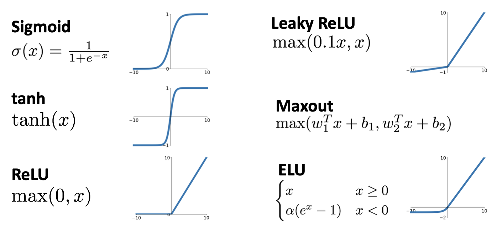

#### Sigmoid

$\sigma(x)=\frac{1}{1+e^{-x}}$

**3 problems**

* Saturated neurons “kill” the gradients > Zero gradients

  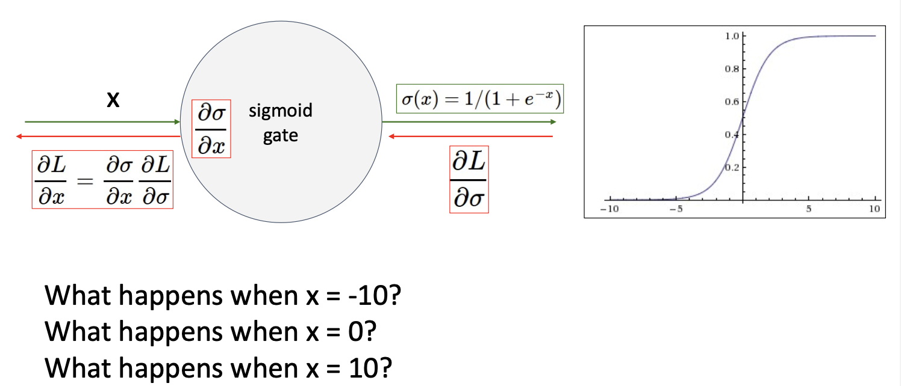

* Sigmoid outputs are not zero-centered > Always positive

  > What can we say about the gradients on **w**?
  >
  > * Always all positive or all negative :(
  > * For a single element! Minibatches help

* $exp()$ is a bit compute expensive

#### Tanh

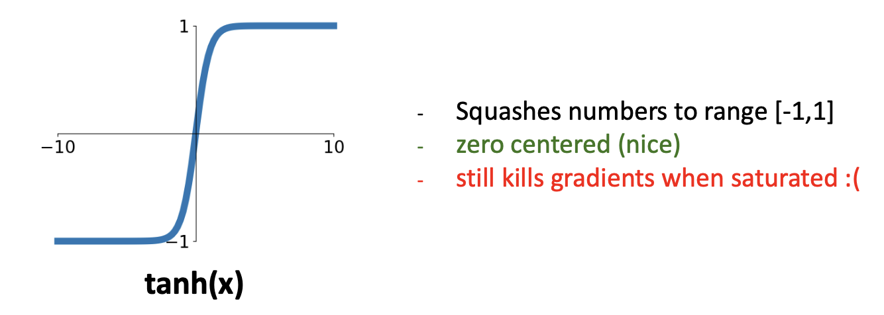

#### Relu

$f(x) = max(0,x)$​

\-  Does not saturate (in +region)

\-  Very computationally efficient

\-  Converges much faster than sigmoid/tanh in practice (e.g. 6x)

**Not zero-centered output**

**what is the gradient when x < 0?**

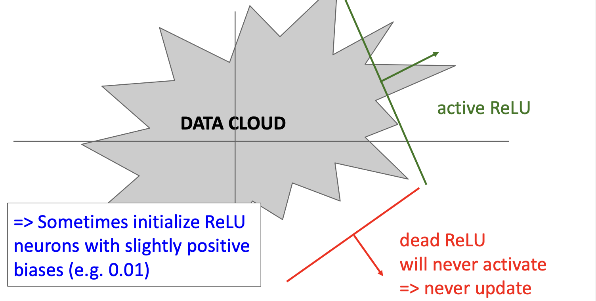

#### Leaky ReLU

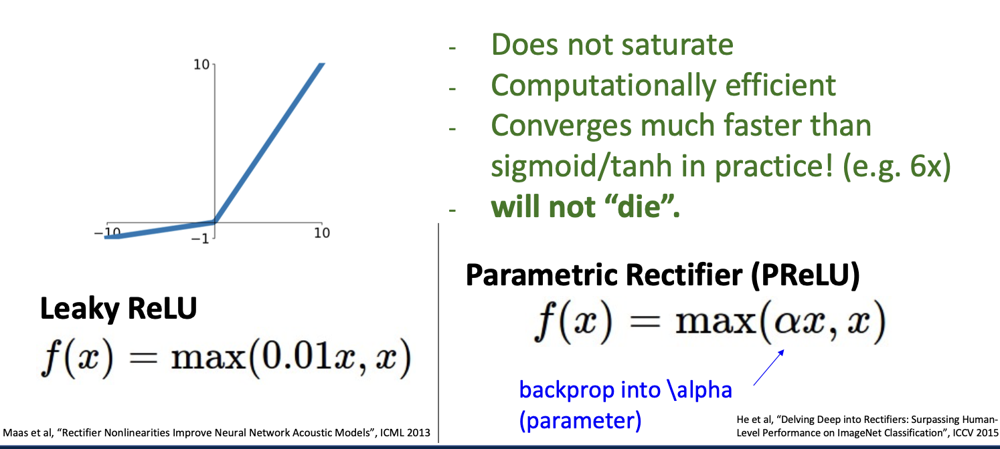

#### Exponential Linear Unit (ELU)

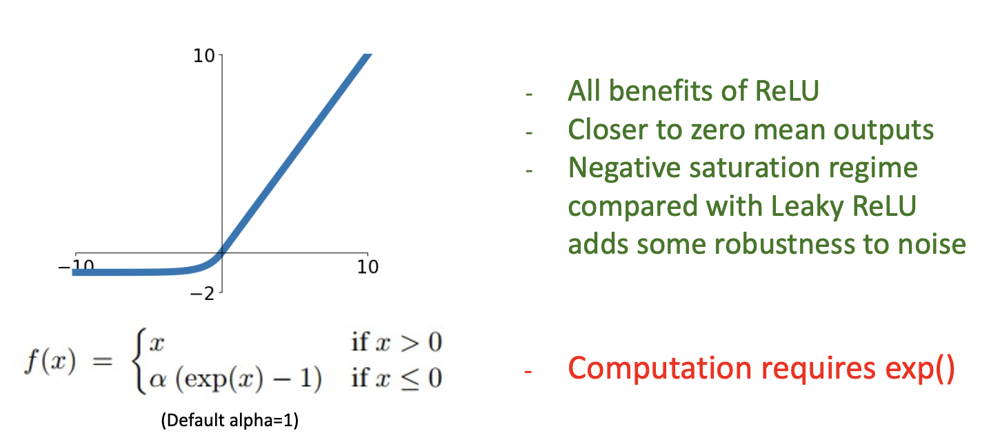

#### Scaled Exponential Linear Unit (SELU)

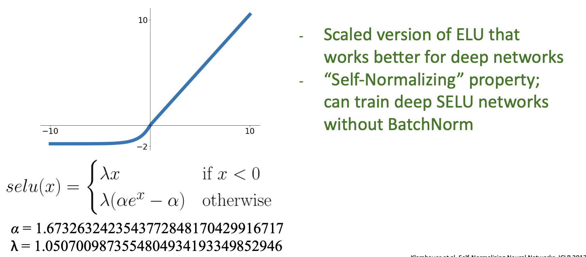

* Scaled version of ELU that works better for deep networks
*  “Self-Normalizing” property; can train deep SELU networks without BatchNorm

> Derivation takes 91 pages of math in appendix...

#### Activation Functions: Summary

- Don’t think too hard. Just use ReLU
- Try out Leaky ReLU / ELU / SELU / GELU if you need to squeeze that last 0.1%
- Don’t use sigmoid or tanh

### Data Preprocessing

* Refer to Slides (lec 10)

### Weight Initialization

**Q**: What happens if we initialize all W=0, b=0?

**A**: All outputs are 0, all gradients are the same! No “symmetry breaking”

* Next idea: **small random numbers** (Gaussian with zero mean, std=0.01)

  ```python
  w = 0.01 * np.random.randn(Din,Dout)
  ```

  Works ~okay for small networks, but problems with deeper networks.

  * Example

  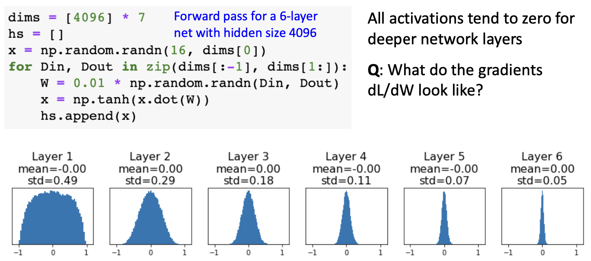

  All activations tend to zero for **deeper network layers**

  **Q**: What do the gradients $dL/dW$ look like? -- All zero, no learning 

* Activation Statistics

  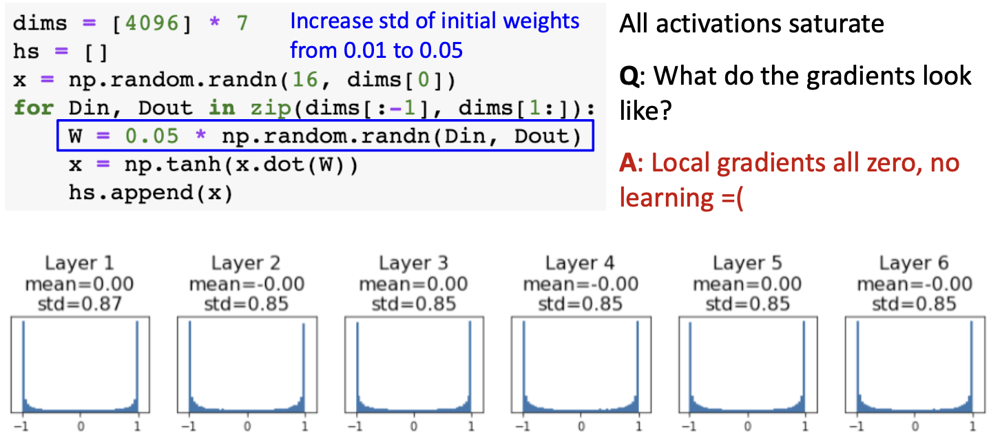

* Xavier Initialization

  > For CNN : Din will be $input\_channels*kernel\_size*kernel\_size$​
  >
  > Remeber?
  >
  > 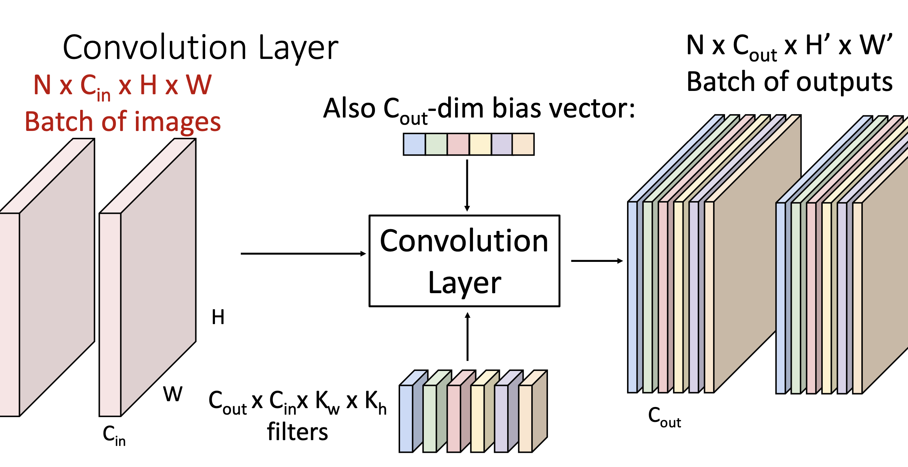

  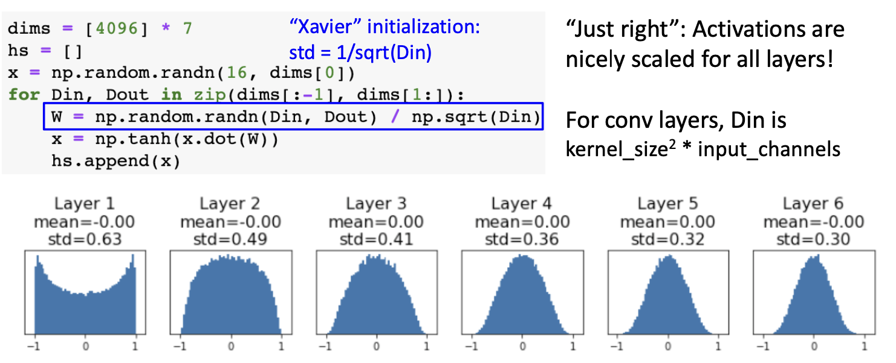

  **Derivation:** 

  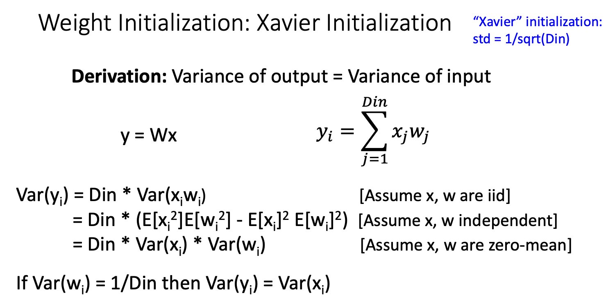

* What about ReLU? 

  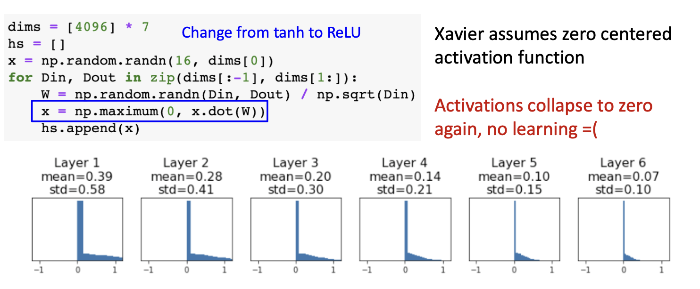

* Kaiming / MSRA Initialization

  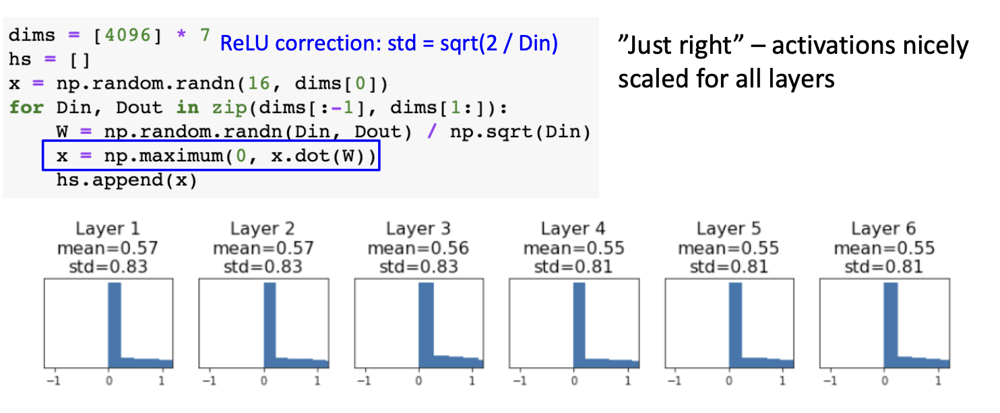

* Residual Networks

  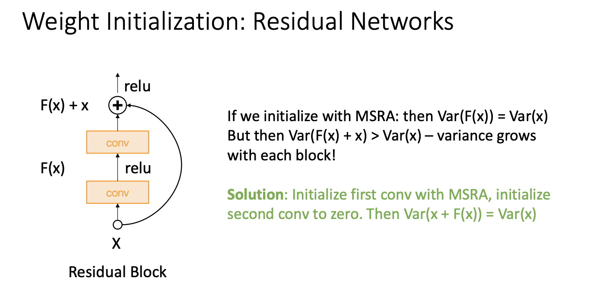

### Regularization

#### Add term to the loss

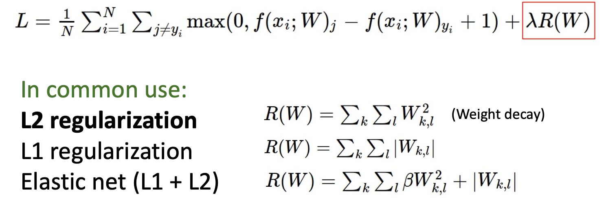

#### Dropout

* In each forward pass, randomly set some neurons to zero Probability of dropping is a hyperparameter; 0.5 is common

```python
p = 0.5
import numpy as np
def train_step(X):
  H1 = np.maximum(0,np.dot(W1,X)+b1)
  U1 = np.random.rand(*H1.shape)<p 
  H1 *=U1
  H2 = np.maximum(0,np.dot(W2,H1)+b2)
  U2 = np.random.rand(*H2.shape)<p
  H2* = U2
  out = np.dot(W3,H2)+b3
```

Dropout makes our output random! -- Want to “average out” the randomness at test-time

$y = f(x) = E_z[f(x,z)]=\int p(z)f(x,z)dz$​

But this integral is actually a bit hard

> Consider a single neuron

* During Traning

  $E[a]=\frac{1}{4}(w_1x+w_2y)+\frac{1}{4}(w_1x+0y)+\frac{1}{4}(0x+0y)+\frac{1}{4}(0x+w_2y)\\=\frac{1}{2}(w_1x+w_2y)$

* During Testing

  $E[a]=w_1x+w_2y$

* At test time, drop nothing and **multiply** by dropout probability

  ```python
  def predict(x):
    H1 = np.maximum(0,np.dot(W1,X)+b1)*p
    H2 = np.maximum(0,np.dot(W2,H1)+b2)*p
    out = np.dot(W3,H2)+b3
  ```

* At test time all neurons are active always.

* We must scale the activations so that for each neuron: output at test time = expected output at training time

```python
p = 0.5
def train_step(X):
  H1 = np.maximum(0,np.dot(W1,X)+b1)
  U1 = np.random.rand(*H1.shape)<p 
  H1 *=U1
  H2 = np.maximum(0,np.dot(W2,H1)+b2)
  U2 = np.random.rand(*H2.shape)<p
  H2* = U2
  out = np.dot(W3,H2)+b3
def predict(x):
  H1 = np.maximum(0,np.dot(W1,X)+b1)*p
  H2 = np.maximum(0,np.dot(W2,H1)+b2)*p
  out = np.dot(W3,H2)+b3
```

**More common: “Inverted dropout”**

```python
p = 0.5
def train_step(X):
  H1 = np.maximum(0,np.dot(W1,X)+b1)
  U1 = np.random.rand(*H1.shape)<p /p
  H1 *=U1
  H2 = np.maximum(0,np.dot(W2,H1)+b2)
  U2 = np.random.rand(*H2.shape)<p /p
  H2* = U2
  out = np.dot(W3,H2)+b3
def predict(x):
  H1 = np.maximum(0,np.dot(W1,X)+b1)
  H2 = np.maximum(0,np.dot(W2,H1)+b2)
  out = np.dot(W3,H2)+b3
```

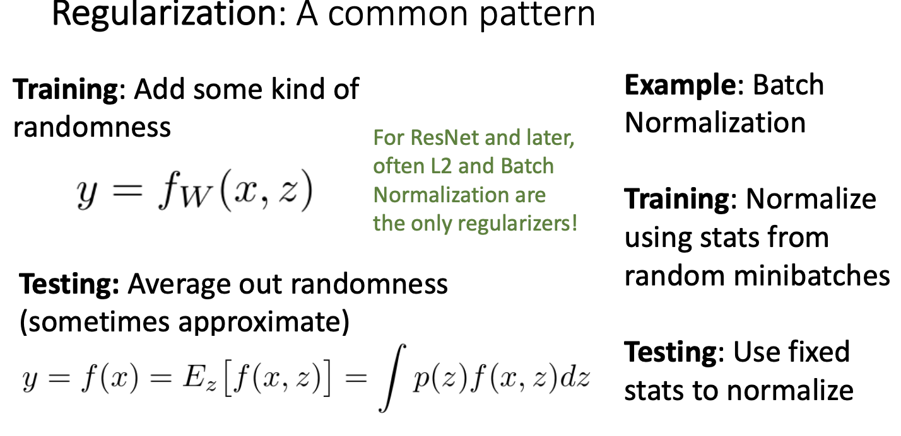

#### Data Augmentation

#### DropConnect

#### Fractional Pooling

#### Stochastic Depth

#### Mixup

* All above refer to slides

## Training dynamics

### Learning rate schedule

### hyperparameter optimization

## After training

### Model ensemble

###  transfer learning

### large-batch training
