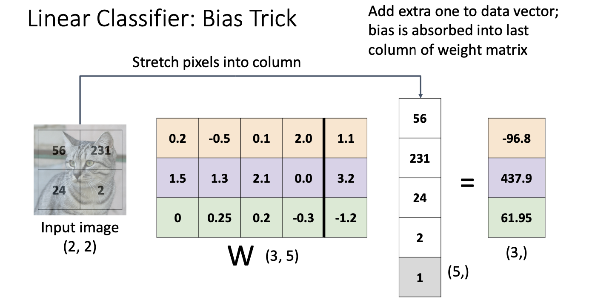

## Image Classifications

**Challenges : **

* Fine-Grained Categories(eg.different kinds of cats)

* Background Clutter

  

* illumination Changes

* Deformation

* Occlusion

**Machine Learning: Data-Driven Approach**

* Collect a dataset of images and labels
* Use Machine Learning to train a classifier
* Evaluate the classifier on new images

### Image Classification Datasets

* MNIST

  > 10 classes: Digits 0 to 9 
  > 28x28 grayscale images 
  > 50k training images 
  > 10k test images
  > Results from MNIST often do not hold on more complex datasets!
  
* CIFAR10

  > 10 classes
  >
  > 50k training images (5k per class) 
  >
  > 10k testing images (1k per class) 
  >
  > 32x32 RGB images

* CIFAR100

  > 100 classes
  >
  > 50k training images (500 per class) 
  >
  > 10k testing images (100 per class) 
  >
  > 32x32 RGB image
  >
  > 20 superclasses with 5 classes each:
  >
  > Aquatic mammals: beaver, dolphin, otter, seal, whale
  >
  > Trees: Maple, oak, palm, pine, willow

* ImageNet

  > 1000 classes
  >
  > $\approx$ 1.3M training images (~1.3K per class) 
  >
  > 50K validation images (50 per class) 
  >
  > 100K test images (100 per class)
  >
  > Performance metric: Top 5 accuracy Algorithm predicts 5 labels for each image
  >
  > one of them needs to be right 
  >
  > test labels are secret!
  >
  > Images have variable size, but often resized to 256x256 for training
  >
  > There is also a 22k category version of ImageNet, but less commonly used

* MIT Places

  > 365 classes of different scene types
  >
  > $\approx$ 8M training images
  >
  > 18.25K val images (50 per class) 
  >
  > 328.5K test images (900 per class)
  >
  > Images have variable size, often resize to 256x256 for training

* Omniglot

  > 1623 categories: characters from 50 different alphabets
  >
  > 20 images per category
  >
  > Meant to test few shot learning

### First classifier: Nearest Neighbor

```python
def train(imgaes,labels):
  #Machine learning!
  return model
def predict(model,test_images):
  #Use model to predict labels
  return test_labels
```

#### Distance

* $L_1 \ distance$​ $d_1(I_1,I_2)=\sum_p|I_1^p-I_2^p|$

  

  ```python
  import numpy as np
  class NearestNeightbor:
    def __init__(self):
      pass
    def train(self,X,y):
      '''X is NxD where each row is an example;y is a 1-dimension f size N'''
      self.Xtr = X
      self.ytr = y
    def predict(self,X):
      '''X is NxD where each row is an example we wish to predict label for'''
      num_test = X.shape[0]
      Ypred = np.zeros(num_test,dtype = self.ytr.dtype)
      for i in xrange(num_test):
        distances = np.sum(np.abs(Self.Xtr - X[i,:]),axis = 1)
        min_index = np.argmin(distances)
        Ypred[i]=self.ytr[min_index]
  		return Ypred
  ```

> 补：numpy
>
> ```python
> import numpy as np
> # 生成示例数据
> N, D = 5, 3
> a = np.random.rand(N, D)  # 生成一个形状为 (N, D) 的随机数组
> b = np.random.rand(D)     # 生成一个形状为 (D,) 的随机数组
> # 使用广播进行减法
> result = a - b
> # 对每一行求和，得到形状为 (N, 1) 的数组
> sum_result = np.sum(result, axis=1, keepdims=True)
> print(sum_result)
> ```

* With N examples, how fast is training?  **A**: O(1)
* With N examples, how fast is testing? **A**: O(N) **BAD!!**


#### K-Nearest Neighbors

* Instead of copying label from nearest neighbor, take **majority vote** from K closest points
* Using more neighbors helps smooth out rough decision boundaries
* Using more neighbors helps reduce the effect of outliers

​	

* When $K > 1$ there can be ties between classes. Need to break somehow!

​	

**Distance Metric**

* $L_1$ (Manhattan) distance
* $L_2$ (Euclidean) distance : $d_2(I_1,I_2)=\sqrt{\sum_p(I_1^p-I_2^p)^2}$​

* With the right choice of distance metric, we can apply K-Nearest Neighbor to any type of data!

#### Hyperparameters

**hyperparameters**: choices about our learning algorithm that we don’t learn from the training data; instead we set them at the start of the learning process

* Very problem-dependent. In general need to try them all and see what works best for our data / task.

**Setting Hyperparameters**


#### K-Nearest Neighbor: Universal Approximation

* As the number of training samples goes to infinity, nearest neighbor can represent any(*) function!

**Example **:  Refer to PPT

* Problem: Curse of Dimensionality

**Curse of dimensionality**: For uniform coverage of space, number of training points needed grows exponentially with dimension

Original image is CC0 public domain

**K-Nearest Neighbor on raw pixels is seldom used**

- \-  Very slow at test time
- \-  Distance metrics on pixels are not informative


* Nearest Neighbor with ConvNet features works well!

## Linear Classifiers


#### Bias Trick



* Less commonly used in computer vision

#### Predictions are Linear!

```tex
f(x, W) = Wx (ignore bias)
f(cx, W) = W(cx) = c * f(x, W)
```

* A single template cannot capture multiple modes of the data !


* Explain : 这里是简化成为二维的形式来理解的(eg.pixel -- (x,y))

  沿着梯度方向 z(which is the score) 增长最快

* Hard Cases for a **Linear Classifier**


* Perceptron couldn’t learn XOR


#### Loss Function

* Use a **loss function** to quantify how good a value of W is
*  Find a W that minimizes the loss function (**optimization**)

A **loss function**(Also called: **objective function**; **cost function**) tells how good our current classifier is

> Low loss = good classifier 
>
> High loss = bad classifier

* Negative loss function sometimes called **reward function**, **profit function**, **utility function**, **fitness function**, etc

Given a dataset of examples $\{(x_i,y_i)\}_{i=1}^N$ where $x_i$ is image and $y_i$ is (integer) label

Loss for a single example is $L_i(f(x_i,W),y_i)$

Loss for the dataset is average of per-example losses : $L=\frac{1}{N}\sum_iL_i(f(x_i,W),y_i)$​

* Multiclass SVM Loss


* Example


$L=(2.9+0+12.9)/3$​

* What are the min and max possible loss?

  > min - 0
  >
  > max - infinity

* If all the scores were random, what loss would we expect?

  > May achieve a $L = 1$  (all are small scores randomly)

* What would happen if the sum were over all classes? (including $i = y_i$)

  >All scores be inflatted by a constant one

* What if the loss used a mean instead of a sum?

* What if we used this loss instead? $L_i = \sum_{j\ne y_i}max(0,s_y-s_{y_i}+1)^2$​

* Suppose we found some W with L = 0. Is it unique?

  > **No! 2W is also has L = 0 !**
  >
  > How to Address this problem ? -- Regularization!

#### Regularization: Beyond Training Error

$L(W) = \frac{1}{N}\sum_{i=1}^NL_i(f(x_i,W),y_i)+\lambda R(W)$​

$\lambda = $​  regularization strength (hyperparameter)


**Purpose of Regularization:**

-  Express preferences in among models beyond ”minimize training error”

-  Avoid **overfitting**: Prefer simple models that generalize better
-   Improve optimization by adding curvature


#### Cross-Entropy Loss (Multinomial Logistic Regression)


* What is the $min / max$ possible loss $L_i$?  **A**: Min - 0, max - +infinity

* If all scores are small random values, what is the loss? **A**: -log(C) (near log(10) ≈ 2.3 at the beginning stage)

  > 在这个问题中，我们假设有一个分类任务，模型输出的分数经过softmax函数转换成概率分布。由于所有的分数都是小随机值，这意味着模型对每个类别的预测概率都会接近于均匀分布，即每个类别被预测为正类的概率都接近于1/类别数。
  >
  > 假设有C个类别，那么每个类别被预测为正类的概率大约是1/C。根据交叉熵的定义，当真实标签的概率分布接近于均匀分布时，交叉熵的值大约是-log(1/C)。由于-log(1/C) = log(C)，所以交叉熵的值大约是log(C)。
  >
  > log(10)是以10为底的对数，约等于2.3。所以当所有分数都是小随机值时，交叉熵的值大约是2.3。这意味着模型的预测与真实标签之间的差异性比较大，因为预测的概率分布接近于均匀分布，而真实标签的概率分布是非均匀的。

#### Compare

**Q**: What happens to each loss if I slightly change the scores of the last datapoint?

**A**: Cross-entropy loss will change; SVM loss will stay the same

**Q**: What happens to each loss if I double the score of the correct class from 10 to 20?

**A**: Cross-entropy loss will decrease, SVM loss still 0


## Optimization

$w^* = argmin_wL(w)$​

### idea 

#### #1: Random Search (bad idea!)

* 15.5% accuracy! not bad!

```python
bestloss = float("inf")
for num in xrange(1000):
  W = np.random.randn(10,3073)*0.0001
  loss = L(X_train,Y_train,W )
  if loss < bestloss:
    bestloss = loss
    bestW = W
   print 'in attemp %d the loss was %f , best %f' %(num,loss,bestloss)

# Assume X_test is [3073 x 10000], Y_test [10000 x 1]
scores =  Wbest.dot(Xte_cols)  
# 10X10000,the class scores for all test examples
Yte_predict = np.argmax(scores,axis=0) 
# and calculate accuracy (fraction of predictions that are correst)
np.mean(Yte_predict == Yte)
# returns 0.1555
```

#### #2: Follow the slope

##### Computing Gradients

\- **Numeric gradient**: approximate, slow, easy to write

$\frac{df(x)}{dx}=lim_{h\to 0}\frac{f(x+h)-f(x)}{h}$

\- **Analytic gradient**: exact, fast, error-prone

* Loss is a function of W : Use calculus to compute an **analytic gradient**

In practice: Always use analytic gradient, but check implementation with numerical gradient. This is called a **gradient check.**

```python
def grad_check_sparse(f,x,analytic_grad,num_checks = 10,h=1e-7):
  '''
  sample a few random elements and only return numerical in this dimensions
  '''
```

```python
from pytorch import torch
torch.autograd.gradcheck(func,inputs,eps=1e-06,atol = 1e-05,rtol = 0.001,raise_exception = True,check_sparse_nnz=False,nodet_tol = 0.0)
```

##### Gradient Descent

```python
w = initialize_wights()
for t in range(num_steps):
  dw = compute_gradient(loss_fn,data,w)
  w-=learning_rate*dw
```

**Hyperparameters**:

 \- Weight initialization method - Numberofsteps
 \- Learningrate

**Stochastic Gradient Descent**


* Think of loss as an expectation over the full **data distribution** $p_{data}$
* Approximate expectation via sampling

$L(W)=E_{(x,y)-p_{data}}[L(x,y,W)]+\lambda R(W) \approx \frac{1}{N}\sum_{i=1}^NL(x_i,y_i,W)+\lambda R(W)$​

$\triangledown L(W)=\triangledown_W E_{(x,y)-p_{data}}[L(x,y,W)]+\lambda \triangledown _WR(W)$​

**Problems with SGD**


* What if the loss function has a **local minimum** or **saddle point**? : Zero gradient, gradient descent.

* Our gradients come from minibatches so they can be noisy!


\- Build up “velocity” as a running mean of gradients

\- Rho gives “friction”  typically rho=0.9 or 0.99

You may see SGD+Momentum formulated different ways, but they are equivalent - give same sequence of x

**Nesterov Momentum**

$v_{t+1} = \rho v_t -\alpha \triangledown f(x_t +\rho v_t)$​

$x_{t+1}=x_t + v_{t+1}$


* However the $x_t + \rho v_t$ term is really annoying because we want to update in terms of $x_t \ \triangledown f(x_t)$ 

  Change of variables $\tilde{x_t}=x+t +\rho v_t$​ and we get :

  $ v_{t+1} = \rho v_t -\alpha \triangledown f(\tilde{x_t})$​

  $\tilde x_{t+1} =\rho v_t +(1+\rho )v_{t+1}=\tilde{x_t}+v_{t+1}+\rho(v_{t+1}-v_t)$​

  ```python
  v = 0
  for t in range(num_steps):
    dw = compute_gradient(w)
    old_v = v
    v = rho*v -learning_rate*dw
    w -= rho* old_v -(1+rho)*v
  ```

**AdaGrad**

* Added element-wise scaling of the gradient based on the historical sum of squares in each dimension.
* “Per-parameter learning rates” or “adaptive learning rates”

```python
grad_squared = 0
for t in range(num_steps):
  dw = compute_gradient(w)
  grad_square += dw*dw
  w -= learning_rate * dw / (frad_square.sqrt()+1e-7)
```

**Q**: What happens with AdaGrad?

> Progress along “steep” directions is damped; progress along “flat” directions is accelerated !

* Problem : slow down step eventually


**Adam(almost):RMSProp + Momentum**

```python
# Adam & Momentum
moment1 = 0
moment2 = 0
for t in range(num_steps):
  dw = compute_gradient(w)
  moment1 = beta1*moment1 + (1-beta1)*dw
  moment2 = beta2*moment2+(1-beta2)*dw*dw
  w -= learning_rate*moment1 / (moment2.sqrt()+ 1e-7)
```

**Q**: What happens at t=0? (Assume $beta_2$ = 0.999)

* At the very beginning, may dividing a num close to ZERO

**Bias correction**

```python
moment1 = 0
moment2 = 0
for t in range(num_steps):
  dw = compute_gradient(w)
  moment1 = beta1*moment1 + (1-beta1)*dw
  moment2 = beta2*moment2+(1-beta2)*dw*dw
  moment1_unbias = moment1 / (1-beta1 ** t)
  moment2_unbias = moment2 / (1-beta2 ** t)
  w -= learning_rate*moment1 / (moment2.sqrt()+ 1e-7)
```


### Second-Order Optimization

#### First-Order Optimization

1. Use gradient to make linear approximation 
2.  Step to minimize the approximation

#### Second-Order Optimization

1. Use gradient and Hessian to make quadratic approximation 
2. Step to minimize the approximation

Second-Order Taylor Expansion:

$L(w)\approx L(w_0)+(w-w_0)^T\triangledown _wL(w_0)+\frac{1}{2}^TH_wL(w_0)(w-w_0)$​

Solving for the critical point we obtain the Newton parameter update:

$w^* = w_0 -H_wL(w_0)^{-1}\triangledown_wL(w_0)$

**Q**: Why is this impractical?  Hessian has $O(N^2)$ elements Inverting takes $O(N^3)$ with $N = $​(Tens or Hundreds of) Millions

**In practice:**

- \-  **Adam** is a good default choice in many cases **SGD+Momentum** can outperform Adam but may require more tuning
- \-  If you can afford to do full batch updates then try out **L-BFGS** (and don’t forget to disable all sources of noise)
