

* Question $p_x=i\bar{h}\frac{\partial}{\partial x}$

?(12-17课程结束)

The wave function of a particular quantum state of the hydrogen atom can be labeled by a set of quantum numbers $(n, l, m_l)$.

* The corresponding energy only depends on the **principal quantum number** $n = 1,2,3,....$

* The **orbital quantum number** $l = 0, 1, 2, . . . , n − 1$ is a measure of the magnitude of the angular momentum of the quantum state. States with $l = 0, 1, 2, 3$ are called $s, p, d, f$ . 

* The **orbital magnetic quantum number**

  $ml =−l,−l+1,...,l−1,l$  is related to the space orientation of this angular momentum vector.

## Classical Loop Model for Electron Orbits

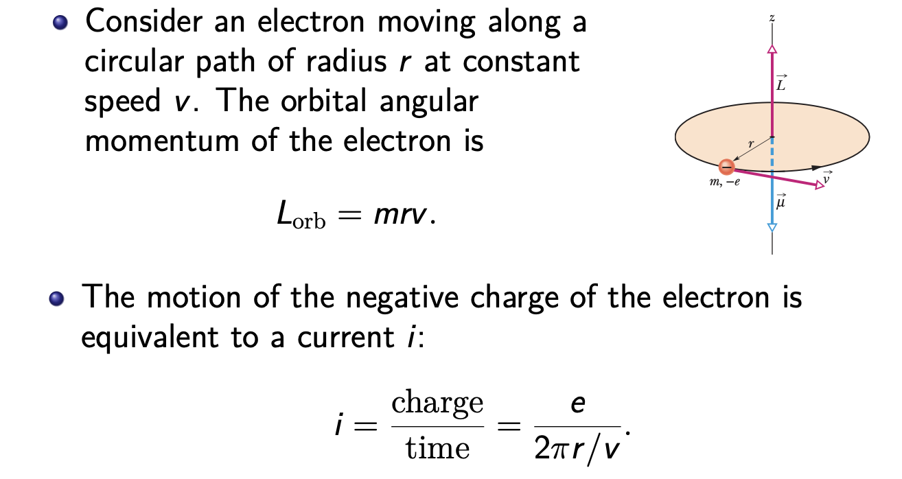

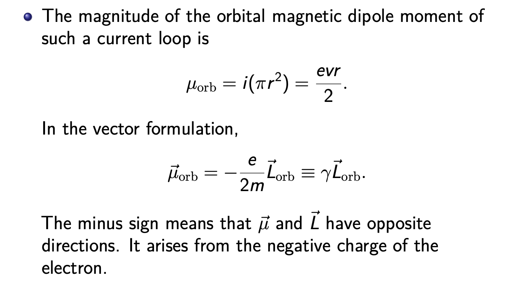

* Heuristically,$∆L_x,∆L_y$ involves $∆_z,∆p_z$, therefore cannot vanish due to the uncertainty principle. In other words, one cannot simultaneously measure any two components of $L$. However, one can simultaneously measure $L^2$ and $L_z$ .

  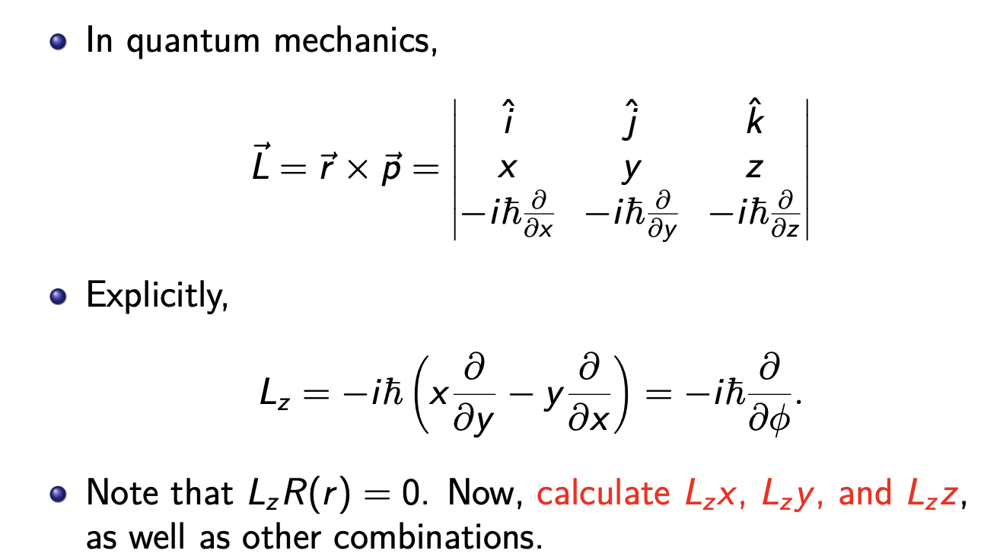

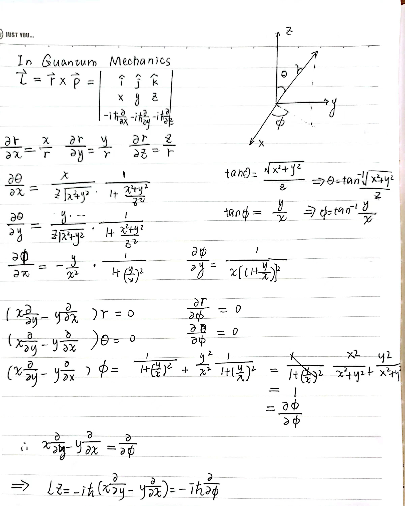

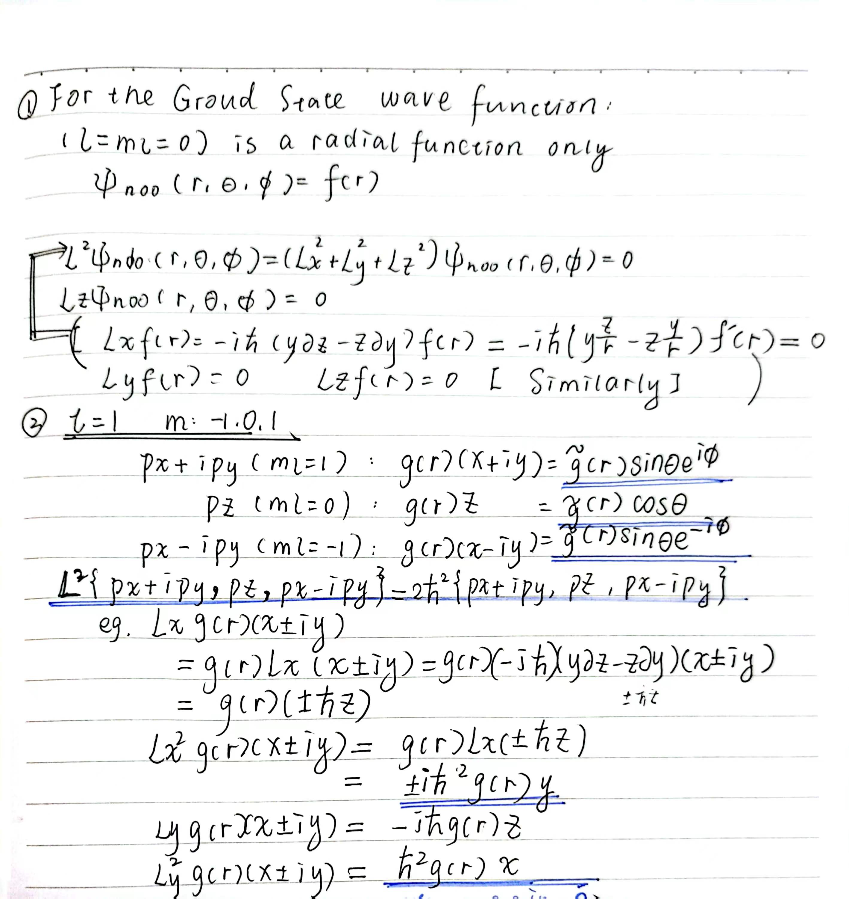

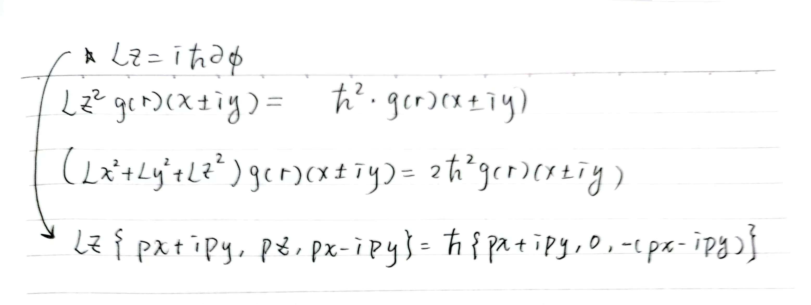

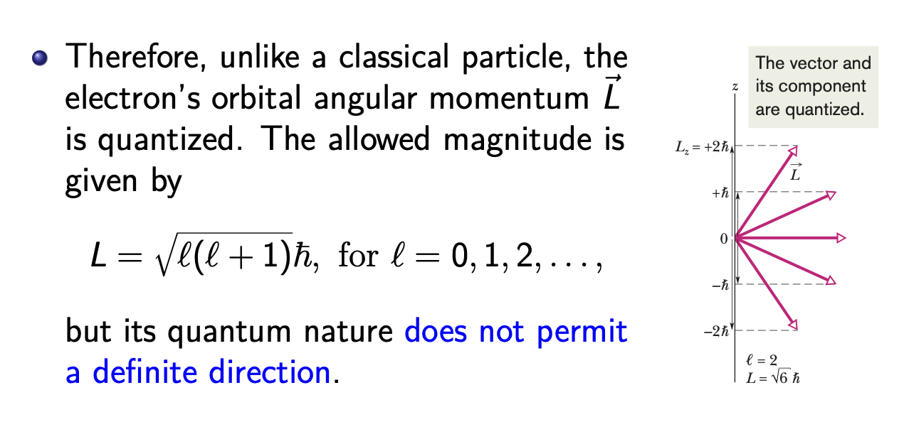

* Quantized by $\bar{h}$

* We can measure definite values of a component $L_z$ along a chosen measurement axis(usally taken to be a z axis) as given by $L_z=m_l\bar{h}$ for $m_l=0,±1,±2,……±l$

* In general , if the electron has a definite value of $L_z$ it may not have definite values of $L_x$ and $L_y$

* This is a manifestation of Heisenberg's uncertainty principle.

* Therefore, the orbital magnetic dipole moment is also quantized

  $\mu_{orb}=|\gamma|L=\frac{e}{2m}\sqrt{l(l+1)}\bar{h}$

  $\mu_{orb},z=\gamma L_z=-m_l\frac{e\bar{h}}{2m}=-m_l\mu_B$

​	Define the **Bohr magneton** $\mu_B=\frac{eh}{4\pi m}=\frac{e\bar{h}}{2m}=9.274*10^{-24}J/T$

## Dynamics in a Uniform Magnetic Field

 An external magnetic field B⃗ will rotate a magnetic dipole moment μ⃗ with a total torque $\vec{\tau}=\vec{\mu}\times\vec{B}$ , or, for an electron with orbital angular momentum $\vec{L}$ , $\vec{\tau}=\frac{d\vec{L}}{dt}=\gamma\vec{L}\times\vec{B}$

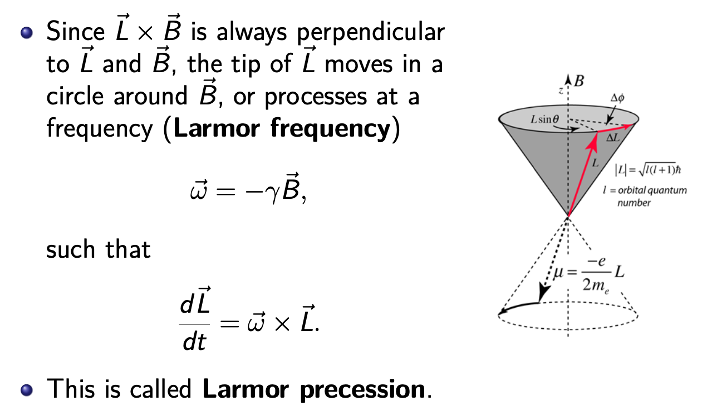

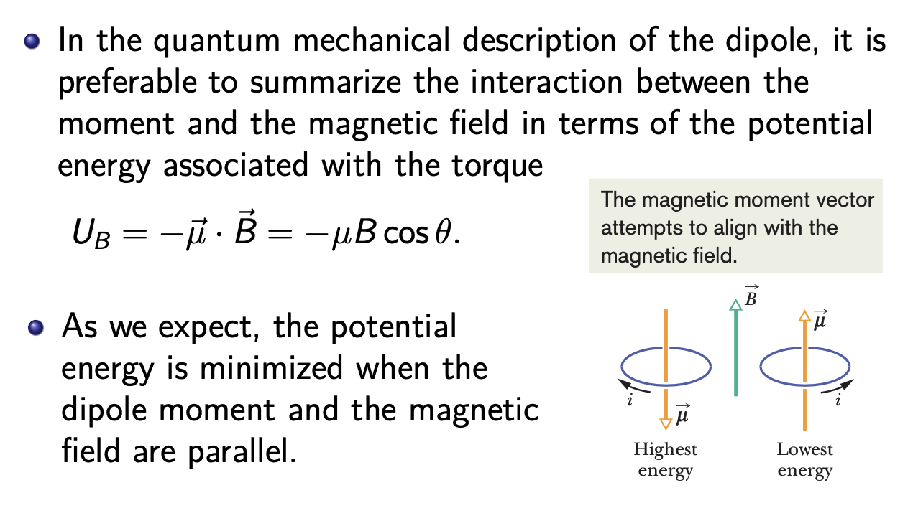

### Dipole in a Nonuniform Magnetic Field

「diphole parallel to the magnetic field.」

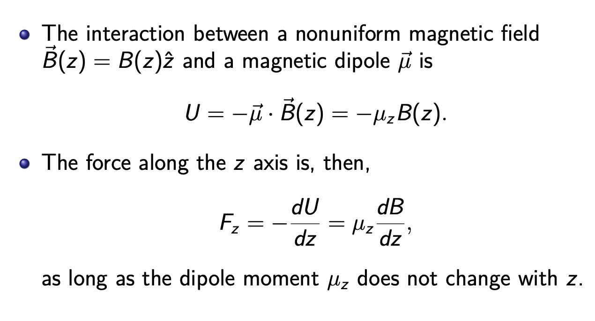

## The Stern-Gerlach Experiment

In the Stern-Gerlach experiment, a narrow beam of silver atoms passes through an electromagnet (with a nonuniform magnetic field) and then lands on a glass detector plate.

* Classical View

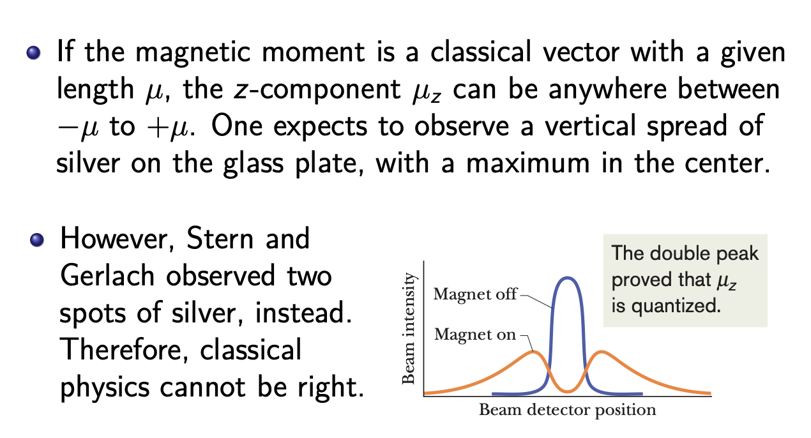

* In the old quantum theory by Bohr (and Sommerfeld)

  An atom in a state with angular momentum equal to one $(L = 1)$ would have a magnetic moment with **two components** relative to the direction of the magnetic field.

  In this case the spot on the receiving plate will therefore be split into two, each of them having the same size but half the intensity of the original spot.

* In (Then) New Quantum Theory

  The later, or new, quantum theory developed by Heisenberg, Schroedinger, and others, predicted that for an $L = 1$ state the beam should split into three components.

  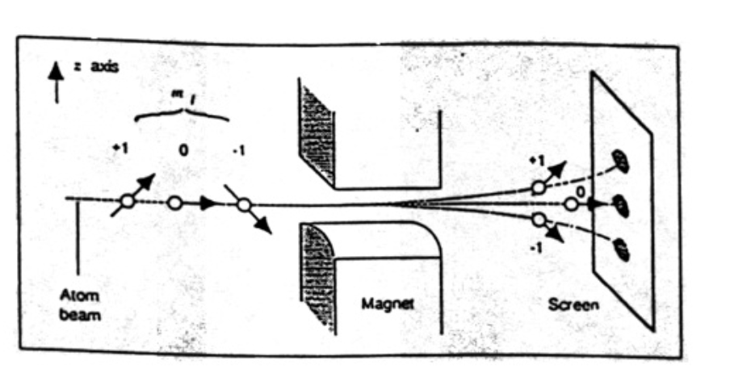

In fact, we now know that a silver atom consists of many electrons ([Kr]4d105s1).

We also know that all those magnetic moments vectorially cancel out except for a single electron $(5s1)$, and the orbital dipole moment of that electron is zero.

Therefore, the Stern-Gerlach result posed a serious problem for the new quantum theory.

This was solved when Uhlenbeck and Goudsmit (1925, 1926) proposed that the electron had an **intrinsic angular momentum**, not associated with its orbital motion. 

## Spin

The Stern-Gerlach experiment belongs to a class of quantum phenomena involving a quantum degree of freedom called **spin**, which has no classical counterpart.

Fortunately, one can describe spin and its dynamics without appealing to any mechanical model (such as that of a spinning top), starting with just the observed fact that it is a form of angular momentum.

### Electron Spin

Every electron, whether trapped in an atom or free, has a **spin angular momentum** and a **spin magnetic dipole moment** that are as **intrinsic** as its mass and charge. The existence of electron spin was postulated on experimental evidence by George Uhlenbeck and Samuel Goudsmit from their studies of atomic spectra.

For every electron, $spin s = 1/2$ and the electron is said to be a $spin-1/2$ particle. (Protons and neutrons are also $spin-1/2$ particles.)

As with the angular momentum associated with motion, spin angular momentum can have a definite magnitude but does not have a definite **direction**.

The best we can do is to measure its component along the $z$ axis (or along any axis), and that component can have only the definite values given by $S_z =m_s\bar{h}, for\ m_s =±s=±1/2$.

Here $m_s$ is the spin magnetic quantum number, which can have only two values: $m_s = +s = +1/2$ (the electron is said to be **spin up**) and $m_s = −s = −1/2$ (the electron is said to be **spin down**).

* The electron is not spinning
* As with the orbital angular momentum, a magnetic dipole moment is associated with the spin angular momentum. Let us write $\vec{\mu}_s = g γ\vec{S}$ where $γ = −e/(2m)$ and the constant g is referred to as the $g-factor$.
* It turns out that the spin angular momentum generates a magnetic moment twice as large as the orbital angular momentum does, i.e. **g = 2.**

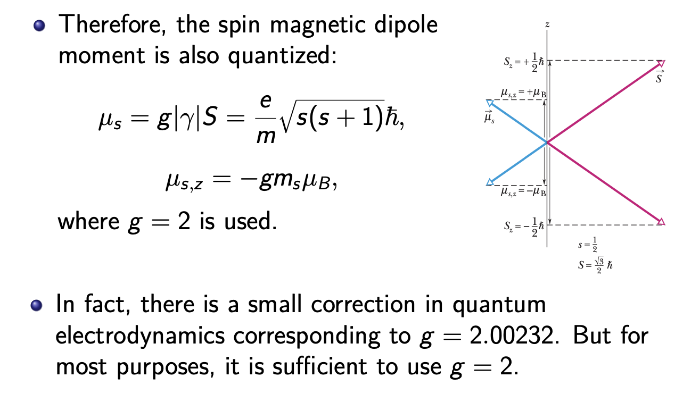

### Nuclear Spin and Magnetic Resonance

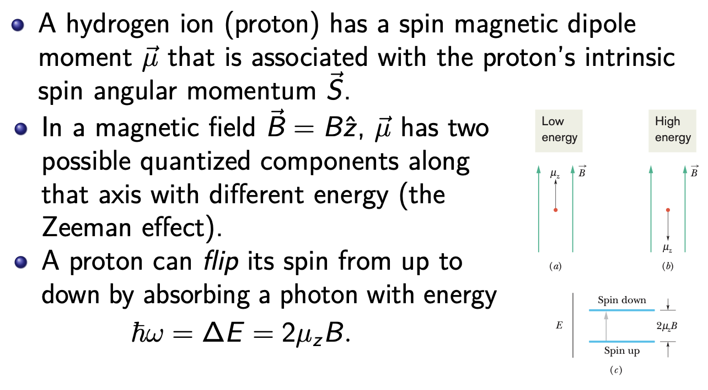

* Such absorption is called **magnetic resonance** or, as originally, **nuclear magnetic resonance (NMR)**.
* In practice, the photons required for magnetic resonance have an associated frequency in the radio-frequency (RF)range.
*  NMR is usually detected by sweeping the magnitude $B_{ext}$ through a range of values while the frequency $ω$ of the RF source is kept at a **predetermined value** and the **energy loss of the RF** source is monitored.

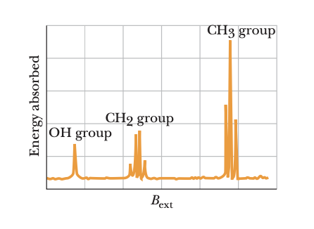

**Proton NMR**, which studies the precession of the proton spin in the magnetic field, is a practical medical imaging technique.

> * A strong magnetic field produces partial polarization of the protons (hydrogen nuclei) in a human body.
> * A strong RF field is also imposed to excite some of the nuclear spins into their higher energy state.
> * When this strong RF signal is switched off, the spins tend to return to their lower state, producing a small amount of **radiation** at the Larmor frequency associated with that field.
> * The emission of radiation is associated with the “spin relaxation” of the protons from their excited state.
> * It induces a radio frequency (RF) signal in a detector coil which is amplified to display the NMR signal.

Since the Larmor frequency depends on the applied magnetic field, placing a magnetic field gradient across the human body allows you to locate the source of the MRI signal (hence the name Magnetic Resonance Imaging).

### Spin-Orbit Coupling

* Crudely speaking, to the electron the nucleus appears to rotate around it and the moving nuclear charge or current creates a magnetic field $B^∗ ∝ L$.

  > Orbital motion cause relative motion of the nucleus to the electron ,creating a magnetic filed(connected with spin)

* The spin–orbit interaction Hamiltonian is given by $H_{SO}=\epsilon_{nl}\vec{L}\vec{S}$  where the **spin-orbit coupling constant** $ξ_{nl}$, which is positive, is essentially the averaged gradient of the Coulomb interaction.

  * To solve the Hamiltonian with such an interaction, we need to introduce the total angular momentum $\vec{J}=\vec{L}+\vec{S}$ and and use the expression $\vec{J}·\vec{J}=(\vec{L}+\vec{S})·(\vec{L}+\vec{S})=\vec{S}·\vec{S}+2\vec{L}·\vec{S}+\vec{L}·\vec{L}$

  * $S^2 =s(s+1)\bar{h} \\ L^2 =l(l+1)\bar{h}^2\\J^2=j(j+1)\bar{h}^2$

  * $\vec{L}\vec{S}=\frac{\bar{h}^2}{2}[j(j+1)-l(l+1)-s(s+1)]$

## The Pauli Exclusion Principle

For multiple electrons in the same trap, we must consider the Pauli exclusion principle, named after $Wolfgang\ Pauli$.

 The Pauli principle states that **no two electrons** confined to the same trap can have the same set of values for their **quantum numbers**.In other words, there can be two electrons at most at any energy level; they have opposite spins.

This principle applies not only to electrons but also to protons and neutrons, all of which have $s = 1/2$; they are known as **fermions**.

**A remark on fermions and bosons**

More generally, fermions are particles with half-integer spin s $(i.e., s = 1/2, 3/2, etc.)$. On the other hand, particles with integer s $(i.e., s = 0, 1, 2, etc.)$ are called **bosons**. 

Fermions follow the Pauli principle, but bosons do not. 

Many particles consisting of matter, such as electrons, protons, and neutrons (s = 1/2 for either of them) are fermions. On the other hand, **photons**(s = 1) are bosons. 

Regarding composite particles consisting of multiple fermions (such as atoms), those with odd number of fermions can behave as **fermions** while those with even number of fermions as **bosons**. ($^3He$: $2p + 1n + 2e →$ fermion; $^4He: 2p + 2n + 2e$ → boson) 

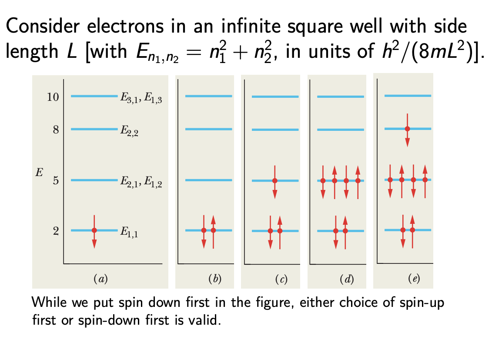

### The Helium Atom

The second simplest atom is the heliuxim atom, which has two 1s electrons (spin up and spin down) in the Coulomb potential of the charge 2e nucleus that obey time-independent Schroedinger’s equation of the form  $(H_1+H_2+V_{12})Ψ(\vec{r_1},\vec{r_2})=EΨ(\vec{r_1},\vec{r_2})$ where $H_i=-\frac{\bar{h^2}}{2m}\triangledown_i^2（Kinetic）-\frac{2e^2}{4\pi\epsilon_0r_i}（Potential）\ and\ V_{12}=\frac{e^2}{4\pi\epsilon_0|\vec{r_1}-\vec{r_2}|}$

* An approximation starts from throwing away the interaction term, which we have not learned to deal with, i.e.,$(H_1 + H_2) Ψ_0 = E_0Ψ_0$, 

* The ground state of either $H_1$ or $H_2$ has an energy $−4E_R$ (Because of two protons so raidus gets smaller)

* and a wave function $ψ_{100}(\vec{r})=\frac{1}{\pi}(\frac{2}{a_B})^{3/2}e^{-2r/a_B}$

* One may verify that $Ψ_0(\vec{r}_1,\vec{r}_2)=ψ_{100}(\vec{r_1})ψ_{100}(\vec{r_2})$  is an exact solution.

* The corresponding energy is $E_0=-8E_R\approx -109eV$

  **Others pleae refer to the related PPT**

### Shells and Subshells

