## PreKnowledge

* consider $cos(kx+wt)$ and $cos(kx-wt)$
  * $cos(kx+wt)$  propagate along -x axis
  * $cos(kx-wt)$ propogate along +x axis
* Linear Waves

## Polarization 

To observe interference of the two waves

* two beams must have (nearly) the same frequency ω
*  interfering waves have comparable amplitude
* the phase difference between sources must remains constant.

In this lecture we consider the direction of $\vec{E}$

Light is a transverse electromagnetic wave. Thus far we have considered only light for which the orientation of the electric field is constant, although its magnitude and sign vary in time.

In general, we can consider two such harmonic lightwaves of the same frequency, moving through the same region of space, in the same direction $\hat{z}$

$\vec{E}_x(z,t)=\hat{i}E_{0x}cos(kz−ωt)$

$\vec{E}_y(z,t)=\hat{j}E_{0y}cos(kz−ωt+\epsilon)$

### Polarization and Its Mathematical Description

#### Linear polarization

If $ε$ is zero or an integral multiple of $±2π$, the resultant wave is $\vec{E}=(\hat{i}E_{0x}+\hat{j}E_{0y})cos(kz-wt)$

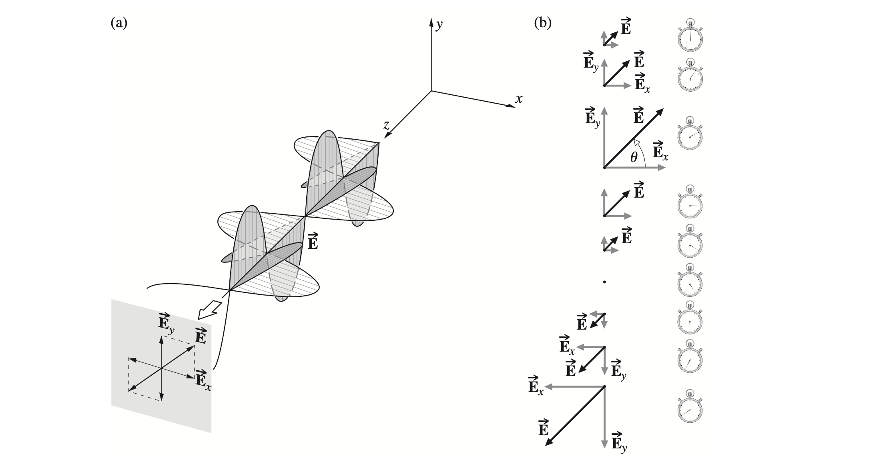

#### Circular polarization
When both constituent waves have equal amplitudes and $\epsilon=-\pi/2+2m\pi$(m is an integer) the resultant wave is $\vec{E}=E_0(\hat{i}cos(kz-wt)+\hat{j}sin(kz-wt))$

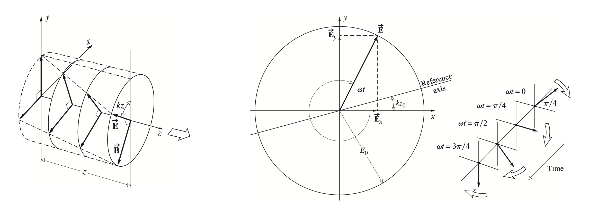

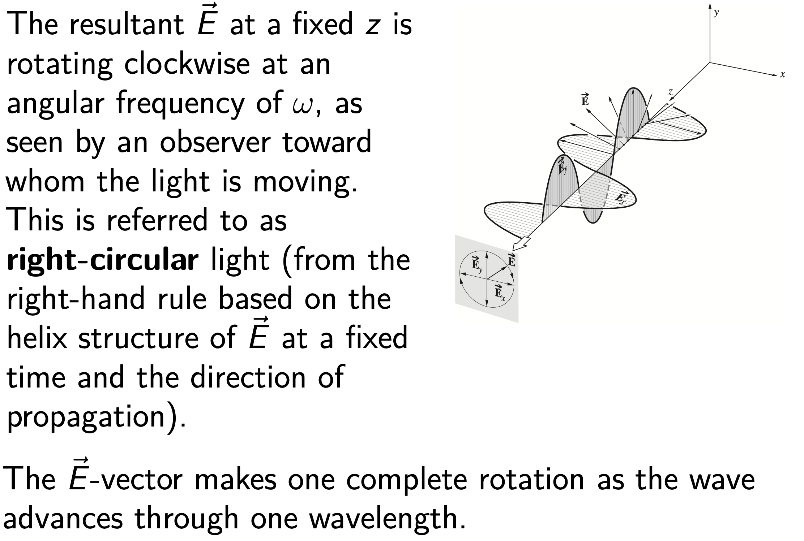

When both constituent waves have equal amplitudes and $\epsilon=\pi/2+2m\pi$(m is an integer) the resultant wave is $\vec{E}=E_0(\hat{i}cos(kz-wt)-\hat{j}sin(kz-wt))$

The amplitude is unaffected, but $\vec{E}$ at a fixed z now rotates counterclockwise, and the wave is **left-circularly polarized**.

A linearly polarized wave can be synthesized from two oppositely polarized circular waves of equal amplitude.

#### A Math Description of Polarization

* Jones vector

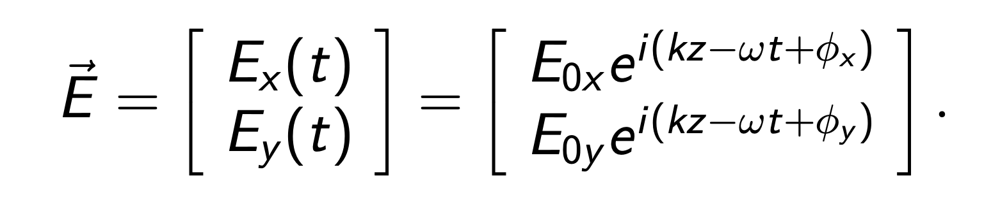

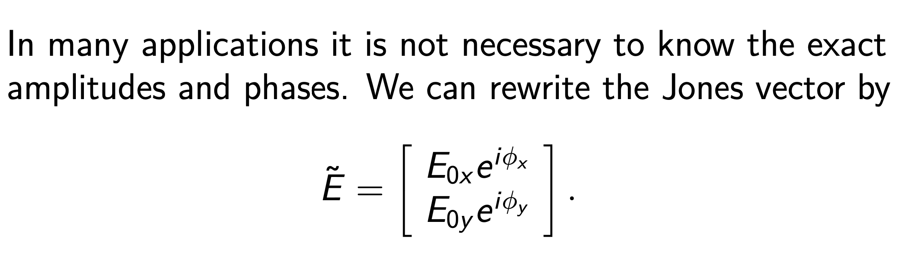

* Horizontal and vertical linearly polarized are thus given by

$|H⟩=\begin{pmatrix}1\\0\end{pmatrix}\\|V⟩=  \begin{pmatrix}0\\1\end{pmatrix}$

* Linearly polarized at +45◦ from the x-axis (diagonal) and at −45◦ from the x-axis (anti-diagonal) are given by 

$|D⟩=\frac{1}{\sqrt{2}}(|H⟩+|V⟩)=\frac{1}{\sqrt{2}}\begin{pmatrix}1\\1\end{pmatrix}$

$|A⟩=\frac{1}{\sqrt{2}}(|H⟩−|V⟩)=\frac{1}{\sqrt{2}}\begin{pmatrix}1\\-1\end{pmatrix}$

**Note that we are only interested in polarization, so the vectors are normalized, or in one unit length**

* Right-circular light is given by

$|R⟩=\frac{1}{\sqrt{2}}(|H⟩−i|V⟩)=\frac{1}{\sqrt{2}}\begin{pmatrix}1\\-i\end{pmatrix}$

* Left-circular light is given by

$|L⟩=\frac{1}{\sqrt{2}}(|H⟩+i|V⟩)=\frac{1}{\sqrt{2}}\begin{pmatrix}1\\i\end{pmatrix}$

#### Orthogonal

Note that in the lecture on interference, we discussed the addition in a two-dimensional real space $R_2$.
 The space is also equivalent to a one-dimensional complex space $C_1$, or a two-component real vector space.

Now, with polarization, we have generalized the one-dimensional complex space $C_1$ to a two-dimensional complex space $C2 = C1 ⊗ C1$, or a two-component complex vector space (in Jones’ vector representation). The additional $C_1$ space is spanned by the two orthogonal, linearly polarized states $|H⟩$ and $|V⟩$.

* Two vectors A⃗ and B⃗ are said to be orthogonal whenA⃗ · B⃗ = 0.

  similarly, two complex vectors A⃗ and B⃗ are said to be orthogonal when $⟨A|B⟩ ≡ \vec{A}^{*} · \vec{B} = 0$.

* Any polarization state will have a corresponding orthogonal state. 

  Notice that$⟨H|V⟩ = ⟨D|A⟩ = ⟨L|R⟩ = 0$.

As we have seen, any polarization state can be described by a linear combination of the vectors in either one of the orthogonal sets. 

These same ideas are of considerable importance in quantum mechanics, where one deals with orthonormal wave functions.

### Monochromatic Light and Natural Light

#### Light Trains and Monochromatic Light

In reality, a non-laser source emits, to the best, quasimonochromatic light trains, whose frequency can be represented by a bell-shaped Gaussian function.

> "准单色"（quasi-monochromatic）是指光波在频率上的分布相对狭窄，但并非完全单一频率的光。准单色光通常具有一个主导的中心频率，而在该中心频率周围有一定的频率宽度。这种光的频谱形状可能类似于高斯分布或其他近似单峰的分布。

That is, the irradiance (hence its square root, the amplitude) versus frequency is found to be Gaussian with a width $∆ω = 2π∆ν.$

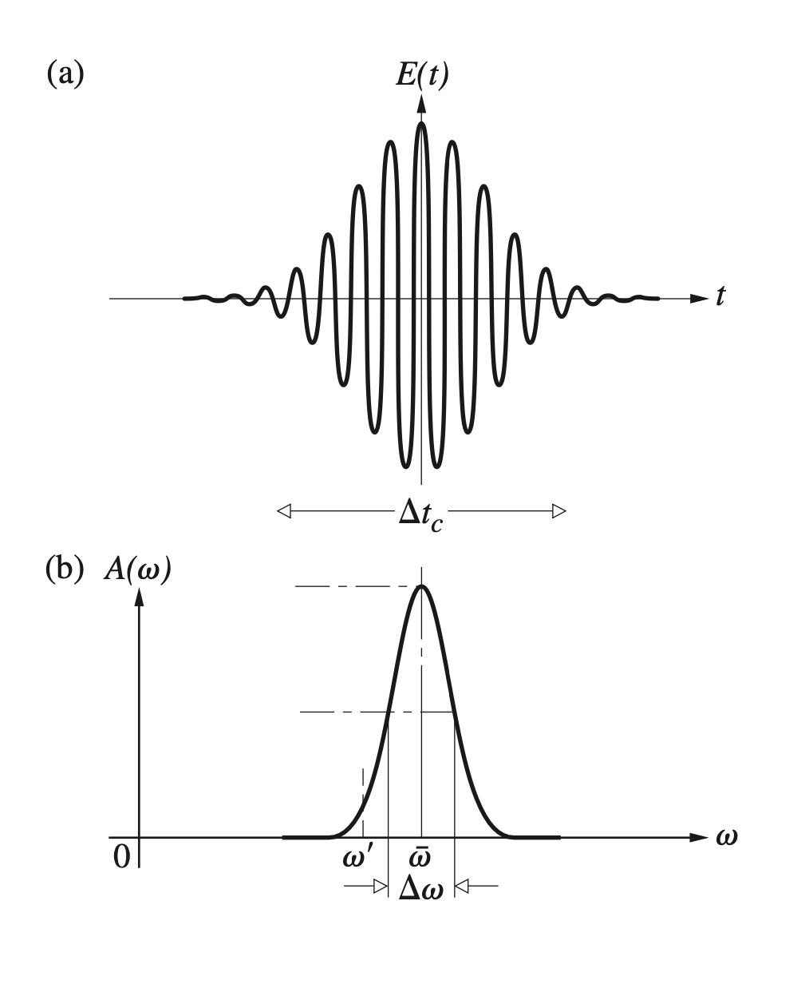

Quasimonochromatic light resembles a series of randomly phased finite wave trains.Such a disturbance is nearly sinusoidal,although the frequence dose vary slowly  about some mean value.

Moreover,the amplitude fluctuates as well,but this too is a comparatively slow variation.

The average constittuent wavetrain exists roughly for the coherence time $\triangle t_c=\frac{1}{\triangle v}$

> 两列波能发生干涉的最大光程差叫相干长度$\delta_M=\frac{\lambda^2}{\triangle\lambda}$  $\lambda$为中心波长
>
> 光通过相干长度所需时间叫相干时间
>
> 相干时间的定义是基于光的波动性和干涉性的。当两束光同时照射在同一点，如果它们的相位关系保持不变，那么它们就会发生干涉。相干时间就是描述这种相位关系保持不变的时间。具体来说，如果光的电磁场在一个相干时间内的平均值不变，那么我们就说这束光在这个时间内是相干的。相干时间的计算公式为$T_c=1/Δν$，其中Δν为光的频率宽度
>
> 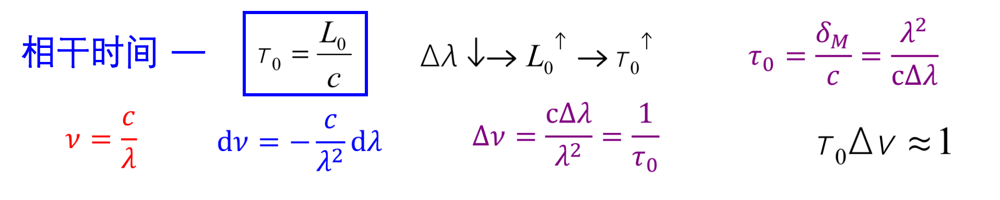
>
> 光的单色性好，相干长度和相干时间就长，时间相干性也就好

An idealized **monochromatic plane wave** must be depicted as an infinite wavetrain. If this disturbance is resolved into two orthogonal components perpendicular to the direction of propagation, they, in turn, must have the same frequency, be infinite in extent, and therefore be mutually coherent (i.e., $ε = constant$).

$\vec{E}_x(z,t)=\hat{i}E_{0x}cos(kz−ωt)$

$\vec{E}_y(z,t)=\hat{j}E_{0y}cos(kz−ωt+\epsilon)$

**A perfectly monochromatic plane wave is always polarized.**

The most spectacular of all present-day sources is the laser. Under optimum conditions, with temperature variations and vibrations meticulously suppressed, a laser was actually operated at quite close to its theoretical limit of **frequency constancy**.

For example, a short-term frequency stability of about 8 parts per $10^{14}$ was attained with a He–Ne continuous gas laser at $λ0 = 1153 nm$ [Jaseja et al., Phys. Rev. Lett. 10, 165 (1963)]. 

That corresponds to a remarkably narrow bandwidth of about $∆ν = 20 Hz$.

#### Natural Light

**Natural light** is composed of a rapidly varying succession (~$10^{−8}$ s) of the different polarization states. It is also known as **unpolarized** or **randomly polarized** light.

 We can mathematically represent natural light in terms of **two arbitrary, incoherent, orthogonal, linearly polarized waves** of equal amplitude (i.e., waves for which the relative phase difference varies rapidly and randomly).

#### Coherence

Coherence is a measure of the correlation between the phases measured at different (temporal and spatial) points on a wave.

 **Temporal coherence** is a measure of the correlation of light wave’s phase at different points along the direction of propagation – it tells us how monochromatic a source is. (Think about the description of quasimonochromatic light.) 

**Spatial coherence** is a measure of the correlation of light wave’s phase at different points transverse to the direction of propagation – it tells us how uniform the **phase of the wavefront** is. (Think about Young’s interference experiment.)

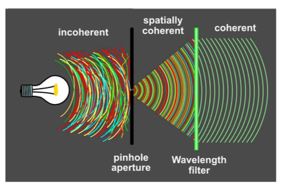

The figure illustrates how to prepare a monochromatic wave that is both temporally and spatially coherent from incoherent natural light.

In reality, light is generally neither completely polarized nor completely unpolarized.

 More often, the electric-field vector varies in a way that is neither totally regular nor totally irregular, and such an optical disturbance is **partially polarized**. 

One useful way of describing this behavior is to envision it as the result of the **superposition** of specific amounts of natural and polarized light.

### Polarizing Sheets

Unpolarized visible light can be transformed into polarized light by sending it through a polarizing sheet,or a Polaroid sheet.

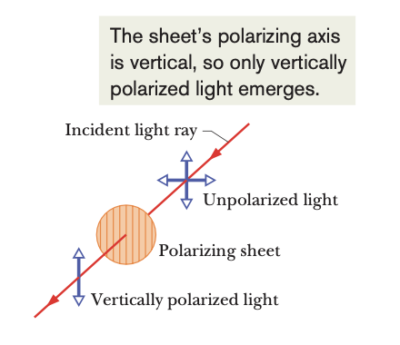

* A polarizing sheet consists of certain long molecules embedded in plastic.
* When light is then sent through the sheet,the electric field component parallel to the polarizing direction is passed(transmitted);the component perpendicular to it is absorbed.

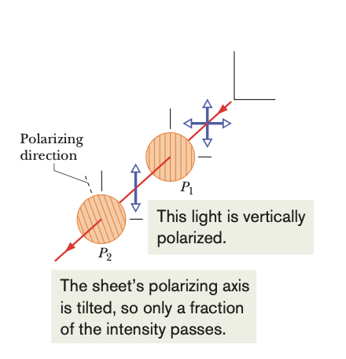

**Electric field oscillations of unpolarized light can resolve into two components with equal intensity**

* Therefore, the intensity I of the polarized light emerging from a polarizing sheet is then half the intensity $I_0$ of the original light $I=I_0/2$

**For polarized light**,obly the component $E_y$=$Ecos\theta$ parallel to the polarizing direction of the sheet can be transmitted.Therefore,the intensity of the emerging wave is $I_0=I_0cos^2\theta$

* Initially unpolarized light is sent through two polarizing sheets P1 (polarizer) and P (analyzer). In general, some of the light transmitted by P1 will be transmitted by P2.
* If their polarizing directions are parallel,all the light passed through P1 is transmitted by P2
* If perpendicular, no light is passed by the second sheet

#### Quiz 23-1: Polarizing Sheets

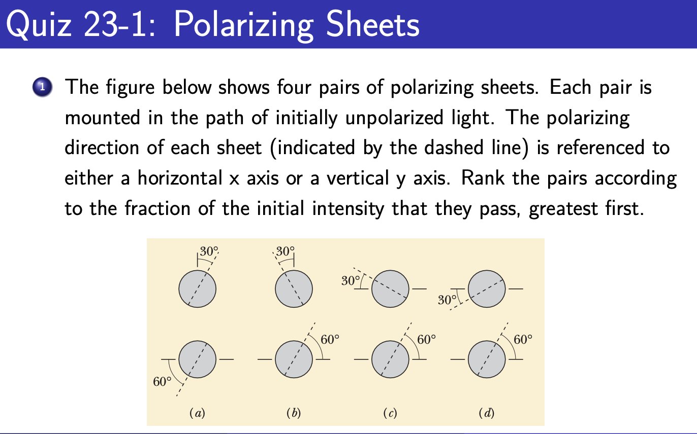

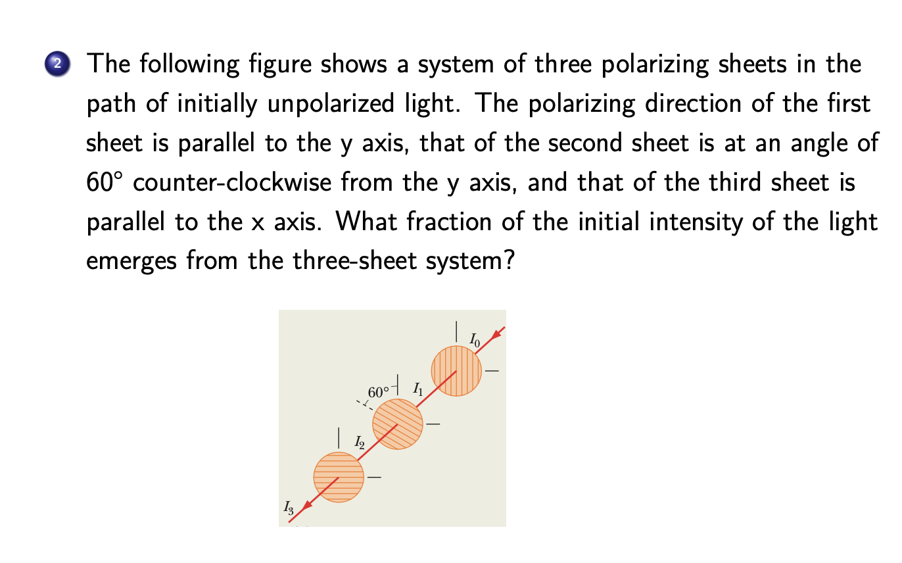

### Polarization by Reflection

One of the most common sources of polarized light is the ubiquitous process of reflection from dielectric media. 

Consider a ray of unpolarized light incident on a glass surface. The field $\vec{E}$ of the incident light can be decomposed into two components of equal magnitude, one perpendicular and another parallel to the plane of incidence. 

In general, the reflected light is partially polarized.

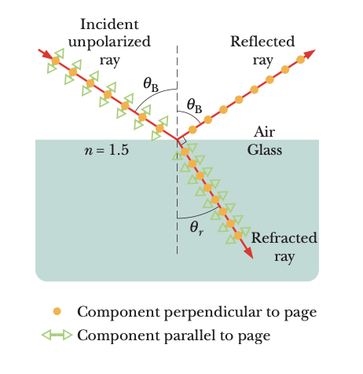

When the light is incident at a particular incident angle, called the **Brewster angle** $θ_B$ , the reflected light is fully polarized.

One finds experimentally that at the incident angle $θ_B$, the reflected and refracted rays are perpendicular to each other: $\theta_B+\theta_r=\frac{2}{\pi}$

> According to Snell’s law $n_i sinθ_B = n_r sinθ_r$
>
> we have $n_i sinθ_B =n_r sinθ_r =n_r sin(\frac{\pi}{2}−θ_B)=n_r cosθ_B$ or $\theta_B=tan^{-1}\frac{n_r}{n_i}$
>
> If the incident and reflected rays travel in air, we can approximate $n_i$ as unity, so $n_r$=$tan\theta_B$

