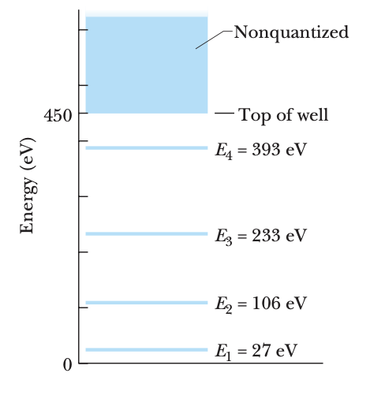

# Quantum Wells

On a stretched string, we can set up both traveling waves and standing waves.

* A traveling wave, on a long string, can have any frequency.
* A standing wave, set up on a string with a finite length, can have only discrete frequencies. 

In other words, **confining the wave to a finite region of space** leads to quantization of the motion — to the existence of discrete states for the wave, each state with a sharply defined frequency.

This observation applies to waves of all kinds, including matter waves. For matter waves, however, it is more convenient to deal with the **energy E** of the associated particle than with the frequency f of the wave. 

Consider the matter wave associated with an electron moving in the positive x direction and subject to **no net force** — a so-called free particle. The energy of such an electron can have any **reasonable value**, just as a wave traveling along a stretched string of infinite length can have any reasonable frequency.

Consider next the matter wave associated with an atomic electron, perhaps the **valence** (least tightly bound) electron. 

The electron — held within the atom by the attractive Coulomb force between it and the positively charged nucleus — is a bound particle. It can exist only in **a set of discrete states**, each having **a discrete energy E**. This sounds much like the discrete states and quantized frequencies that apply to a stretched string of finite length. 

For matter waves, then, as for all other kinds of waves, we may state a confinement principle: **Confinement of a wave leads to quantization — that is, to the existence of discrete states with discrete energies**.

## One-Dimensional Infinite Potential Well

Consider a nonrelativistic electron confined to a one-dimensional electron trap (or a limited region of space).

#### Standing Waves in a 1D Trap

We examine by analogy with standing waves on a string of finite length, stretched along an x axis and confined between rigid supports.

* Because the supports are rigid, the two ends of the string are nodes, or points at which the string is always at rest. The states, or discrete standing wave patterns in which the string can **oscillate**, are those for which the length L of the string is equal to an integer number of half-wavelengths

* That is, the string can occupy only states for which $L=\frac{n\lambda}{2}$

  Each value of the integer n identifies a state of the oscillating string. For a given n, the transverse displacement of the string at any position x $(0 ≤ x ≤ L)$ along the string is given by $y_n(x)=Asin(\frac{n\pi}{L}x)$where A is the amplitude of the standing wave

  > For the n state $\lambda_n=\frac{2L}{n}$ Thus $sinkx=sin\frac{2\pi}{\lambda_n}x=sin(\frac{n\pi}{L}x)$

  For the electron in the trap, we promote the transverse displacement to wave function $ψ_n(x)$.

#### Probability of Detection

**Classically**, we expect to detect the electron anywhere in the infinite well with a constant probability density.

**Quantum mechanically**, we find the probability density $p_n(x) = |ψ_n(x)|^2 = |A|^2 sin^2(\frac{n\pi}{L}x)$ for **given n**

> If don't satisfy $L=\frac{n\lambda}{2}$ no stable wave formation!

The constant A (up to a phase) can be determined by the **normalization** condition

$\int_{-∞}^{+∞}|ψ_n(x)|^2dx =\int_0^L|ψ_n(x)|^2dx = 1$,  so $A=\sqrt{2/L}$

#### Energies of the Trapped Electron

The de Broglie wavelength λ of the electron is defined as $λ=\frac{h}{p}=\frac{h}{\sqrt{2mk}}$,where $K=\frac{p^2}{2m}$is the kinetic enerrgy of the nonrelativistic electron

For an electron moving within the central cylinder, where U = 0, the total (mechanical) energy E is equal to the kinetic energy K.

* Therefore , total energy for an electron moving in the central cylinder is $E_n=(\frac{h}{\lambda})^2/2m=\frac{h^2}{8mL^2}n^2 ∝ n^2$  ($\lambda_n=\frac{2L}{n}$)
* Narrower well $(smaller\ L)$ $⇒ E_n ↗$.

* The positive integer n is the quantum number of the electron's quantum state in the trap

* The quantum state with the lowest possible energy level $E_1$ with quantum number n = 1 is called the **ground state** of the electron.

* Why is $n = 0$ not allowed? 

  Choosing n = 0 would indeed yield a lower energy of zero. However, as we will see below, the corresponding probability density is $|ψ|^2 = 0$, which we can interpret only to mean that there is no electron in the well

  so $n = 0$ is not a possible quantum number.

* It is an important conclusion of quantum physics that confined systems must always have a certain **non-zero minimum** energy called the **zero-point energy**.

* Electrons can be excited or de-excided bynthe absorption or emission of a photon with energy $\bar{h}w=\frac{hc}{\lambda}=\triangle E=E_{High}-E_{Low}$

#### Wave Functions of the Trapped Electron

If we solve time-independent Schroedinger’s equation, as in the previous lecture, for an electron trapped in the 1D infinite well of width L, we could write the solutions as $ψ_n(x)=exp (i\frac{n\pi}{L}x)$or$ψ_n(x)=exp(-i\frac{n\pi}{L}x)$.

* However, the above traveling waves do not satisfy the boundary conditions $ψ_n(0) = ψ_n(L) = 0.$

The appropriate solutions can only be certain linear combinations of the traveling wave functions, given by $ψ_n(x)=Asin(\frac{n\pi}{L}x)$ The constant A is to be determined.

* Note that the wave functions $ψ_n(x)$ have the same form as the displacement functions $y_n(x)$ for a standing wave on a string stretched between rigid supports.

For sufficiently large $n$, the probability of detection becomes more and more **uniform** across the well in the coarse-grained scale. This result is an instance of a general principle called the **correspondence principle**: At large enough quantum numbers, the predictions of quantum physics merge smoothly with those of classical physics.

## An Electron in a Finite Well

We can picture an electron trapped in a one-dimensional well between infinite-potential walls as being a standing matter wave. The solutions must be zero at the infinite walls.

For finite walls, however, the analogy between waves on a stretched string and matter waves **fails**. Matter wave nodes no longer exist at $x = 0$ and at $x = L$.

wave function can **penetrate** the walls into classically **forbidden regions**.

> Constraints
>
> (1)$Ψ(-\infty)\rightarrow0$
>
> (2)$Ψ(+\infty)\rightarrow0$
>
> (3)$Ψ(0-)=Ψ(0+)$
>
> (4)$Ψ(L-0)=Ψ(L+0)$
>
> (5)$Ψ'(-0) = Ψ'(+0)$
>
> (6)$Ψ'(L-0) = Ψ'(L+0)$

#### Energies of the Trapped Electron

Thus, the corresponding energy E ≈ $(h/λ)^2/(2m)$ for an electron in any given state is less in the finite well than in the infinite well.（From what is mentioned above）

An electrons with an energy greater than the well depth$(E > U_0)$ has too much energy to be trapped in the finite well.

Thus, there is a continuum of energies beyond the top of potential well ; a high-energy electron is not confined,and its energy is not quantized

####  Semiconductor Quantum Wells

Semiconductor similar to finite wells

#### Schroedinger’s Equation in High Dimensions

This has the form $E = F(x) + G(y)$, which can only be satisfied when $F(x) = E_1$ and $G(y) = E − E_1$, i.e., each function must separately be a **constant**.

As a consequence, separation of variables breaks the multivariate partial differential equation into a set of independent ordinary differential equations $(ODEs)$.

We can solve the $ODEs$ for $X(x)$ and $Y(y)$. The wave function for the original equation is simply their product $X(x)Y(y)$. 

[In which case $Ψ(x,y)$ can be written in the form of $Ψ(x,y) = X(x)Y(y$), and in which case cannot be?]

* Separation of variables was first used by L’Hospital in 1750. 

  It is especially useful in solving equations arising in mathematical physics, such as Laplace’s equation, Helmholtz’s equation, and Schroedinger’s equation. 

* Success requires choice of an **appropriate coordinate system** and may not be attainable at all depending on the equation. In particular, it works when

  $U (x , y ) = Ux (x ) + Uy (y )$,or, in a central potential in spherical coordinates,$U(r,θ,φ) = V(r).$

### 2D & 3D Infinite Potential Wells

### Dirac Delta Function Potential Well

