# Electromagnetic Integration

## Faraday’s Law of Induction

$\Phi_B=\int\vec{B}\cdot d\vec{A}$

$\epsilon = -N\frac{d\Phi_B}{dt}$

When you move the magnet toward or away from the loop, a magnetic force resists the motion, so Lenz’s law requires your applied force to do positive work.

At the same time, thermal energy is produced in the material of the loop because of the material’s electrical resistance to the induced current.

The energy you transfer to the closed loop-magnet system via your applied force ends up in this thermal energy. (For now, we neglect energy that is radiated away from the loop as electromagnetic waves during the induction.)

 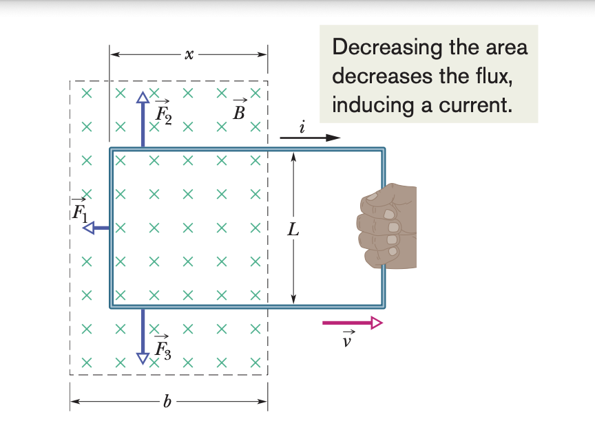

$\epsilon= N\frac{d\Phi_B}{dt}=BLv$

$F=F_1=iLB=B^2L^2v/R$

$P_1=Fv=B^2L^2v^2/R$

$P_{thermal}=i^2R=(\frac{BLv}{R})^2R=B^2L^2v^2/R$

### A Reformulation of Faraday’s Law

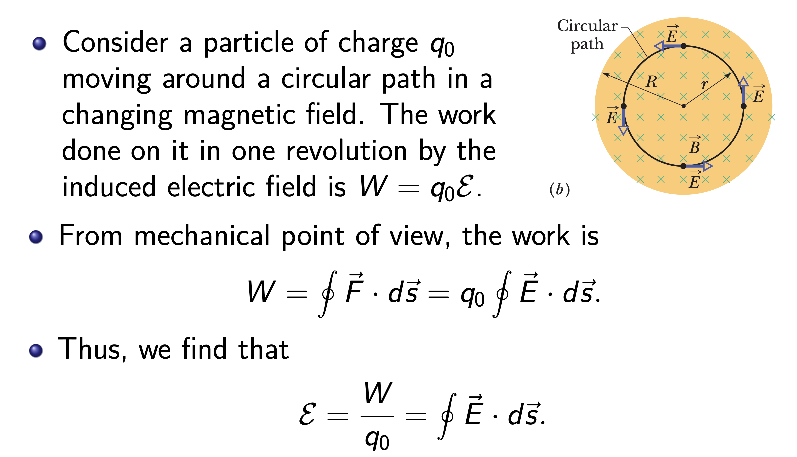

We find that an induced emf can be defined without the need of a current or particle: An induced emf is the sum—via integration—of quantities $\vec{E} · d\vec{s}$ around a closed path, where $\vec{E}$ is the electric field induced by a changing magnetic flux and $d\vec{s}$ is a differential length vector along the path.

* Rewrite Faraday's Law as $\oint \vec{E}\cdot d\vec{s}=-N\frac{d\Phi_B}{dt}=-\frac{d}{dt}\int\vec{B}\cdot d\vec{A}$

* We can convert it to differential form by applying the Stokes’ theorem (or the fundamental theorem for curls)

  $\oint\vec{E}\cdot d\vec{s}=\int_S(\triangledown \times \vec{E})\cdot d\vec{A}$

* Thus, we get : $\triangledown \times\vec{E}=-\frac{\partial \vec{B}}{\partial t}$

* Electric potential has no meaning for electric fields that are produced by induction

## Inductors and Inductance

### Revisiting Solenoid

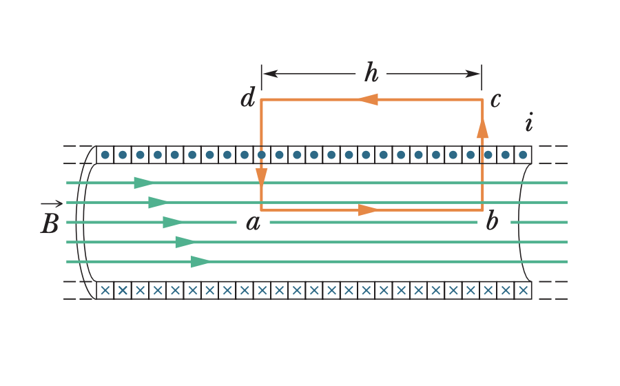

$B=\mu_0in$

$\Phi_B=BA=\mu_0inA$

$Inductance \ L \ =N\Phi_B/i=\mu_0n^2lA$

* If the length $l$ of a solenoid is very much longer than its radius, then, to a good approximation, its inductance is $L = μ_0n^2lA = N^2(μ_0A/l)$(By $nl=N$)

### RL Circuits

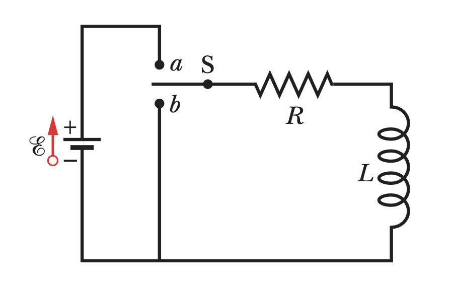

* L is like a voltage source

* $E_L = −\frac{d(NΦ_B)}{dt} = −L\frac{di }{dt}$

  $\begin{align*}&\epsilon= iR-(-L\frac{di}{dt})\\ &\dot{i}+\frac{R}{L}i-\frac{\epsilon}{L}=0\end{align*}$

  $i=\frac{\epsilon}{R}(1-e^{-t/\tau_L}) \ \ \ (\tau_L=\frac{L}{R})$

### Energy 

#### Energy Stored in a Magnetic Field

$\epsilon i = Li\frac{di}{dt} + i^2R.$

$\Rightarrow U_B=\frac{1}{2}Li^2$

#### Energy Density of a Magnetic Field

* The energy stored per unit volume of the field is

  $\mu_B=\frac{U_B}{Ah}=\frac{Li^2}{2Ah}=\frac{L}{h}\frac{i^2}{2A}=\frac{i^2n^2\mu_0}{2}=\frac{B^2}{2\mu_0}$

  resembles that in an electric file $\mu_E=\frac{1}{2}\epsilon_0E^2$

### Mutual Inductance of Two Parallel Coils

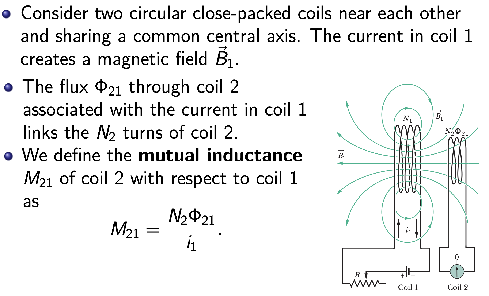

$M_{21}=\frac{N_2\Phi_{21}}{i_1}\\M_{12}=\frac{N_1\Phi_{12}}{i_2}$

$\epsilon_{21}=-M_{21}\frac{di_1}{dt}\\\epsilon_{12}=-M_{12}\frac{di_2}{dt}$

$\epsilon_1=\epsilon_{1}+\epsilon_{12}=-L_{11}\frac{di_{1}}{dt}-M_{21}\frac{di_2}{dt}$

$\epsilon_2=\epsilon_{22}+\epsilon_{21}=-L_{2}\frac{di_{2}}{dt}-M_{12}\frac{di_1}{dt}$

$\Rightarrow-\begin{pmatrix}L_1&M_{12}\\M_{21}&L_2\end{pmatrix}\frac{d}{dt}\begin{pmatrix}i_1\\i_2\end{pmatrix}=\begin{pmatrix}\epsilon_1\\\epsilon_2\end{pmatrix}$

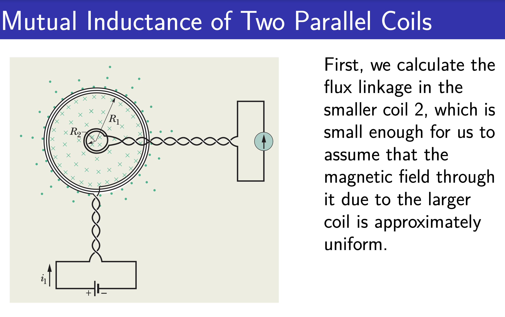

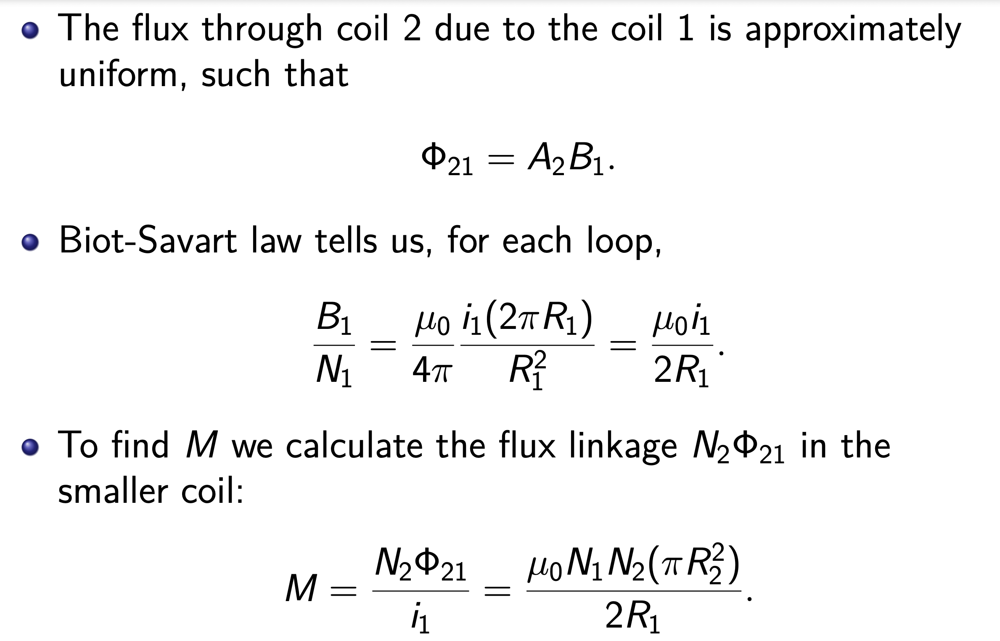

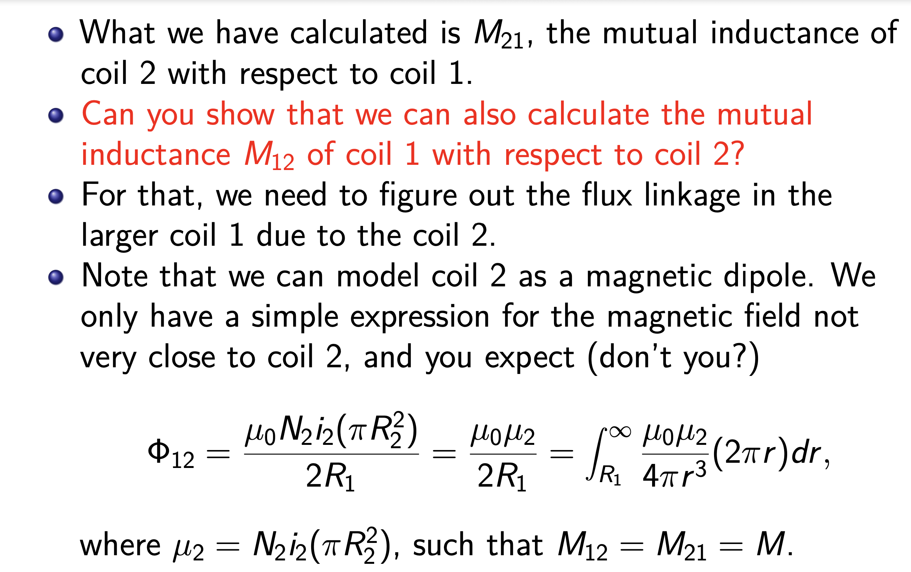

## Alternating-Current Circuits

### LC Oscillations

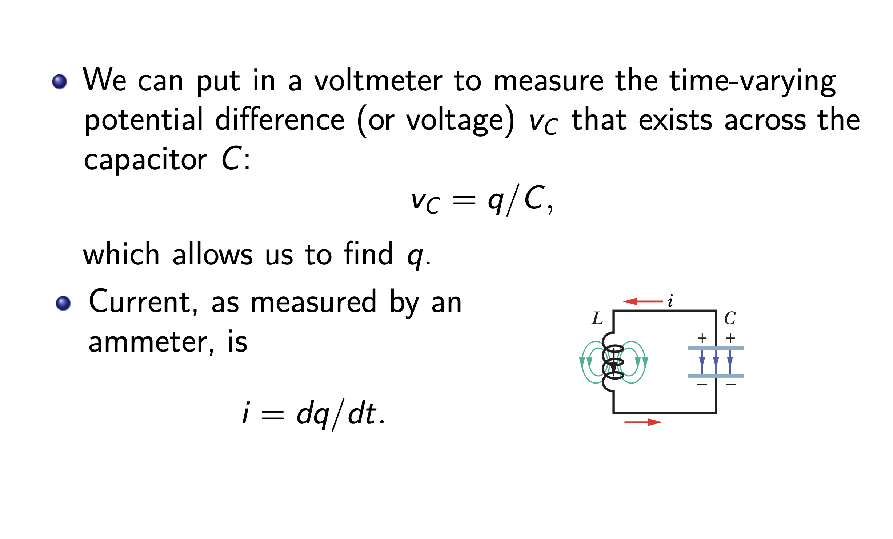

$L\frac{di}{dt}+\frac{q}{C}=0$

$\ddot{q}+\frac{1}{LC}q=0$

$\Rightarrow q =Acos(w_0t+\phi)=Qcos(\frac{1}{\sqrt{LC}}t+\phi)$

$\Rightarrow Qcos\phi=0 \\-w_0Qsin\phi=0$

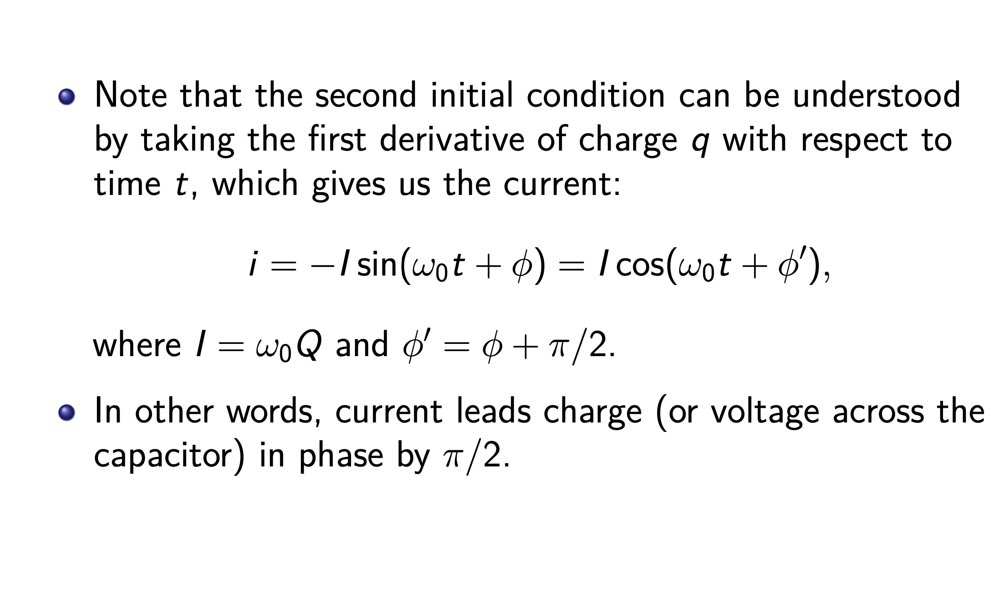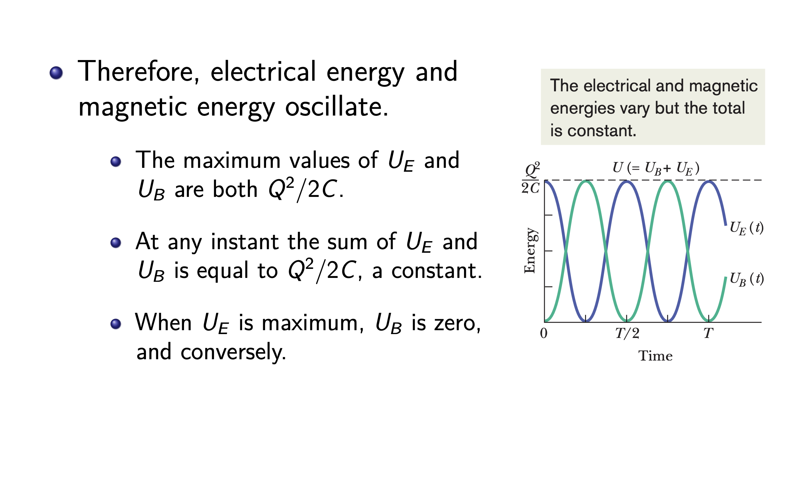

### The Complex Formalism

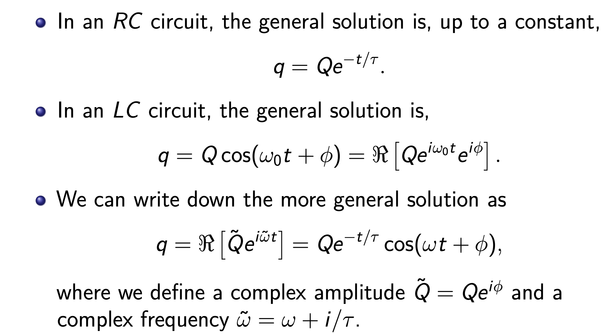

### Damped Oscillations in an RLC Circuit

* With Resistance R

$\ddot{q}+\frac{R}{L}\dot{q}+\frac{1}{LC}q=0$

$\Rightarrow q=Qe^{-\frac{t}{\tau}}cos(wt+\phi) \ where\ \tau=2L/R \ and  \ w=\sqrt{w_0^2-(1/\tau)^2} \ and \ w_0=\frac{1}{\sqrt{LC}}$ 

Note Use ODEs or the method of the below picture

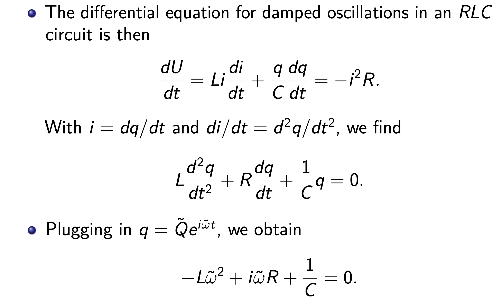

* When $1/τ < ω_0$, a real $ω$ can be found and the system still oscillates, but with decreasing amplitude as its energy is converted to heat. The circuit is said to be **underdamped**. Over time the system should come to rest at equilibrium. 
* When $1/τ > ω_0$, one can only find imaginary ω, which means the frictional force is so great that the system cannot oscillate. The circuit is said to be **overdamped**.

* In between, when $1/τ = ω_0$, the circuit is said to be **critically damped**. It is worth noting that the critical damping gives the fastest return of the system to its equilibrium position. In engineering design this is often a desirable property.

### AC Circuits and Forced Oscillations

* The oscillations in an RLC circuit will not damp out if an external emf device supplies enough energy to make up for the energy dissipated as thermal energy in the resistance R.
* The energy is supplied via oscillating emfs and currents — the current is said to be an **alternating current**, or **ac** for short. These oscillating emfs and currents vary sinusoidally with time, reversing direction 100 times per second and thus having frequency f = 50 Hz.
* When the external alternating emf is connected, the oscillations of charge, potential difference, and current are said to be **driven oscillations** or **forced oscillations**. These oscillations always occur at the **driving angular frequency**.

### Three Simple Circuits

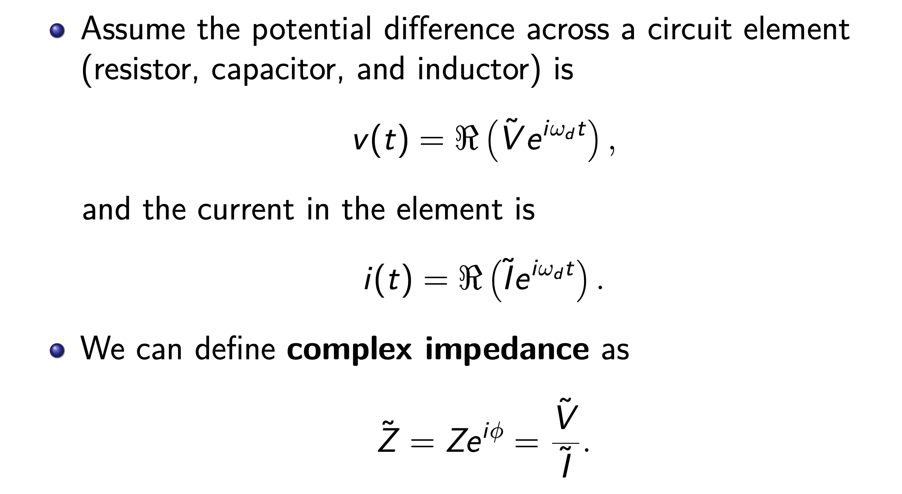

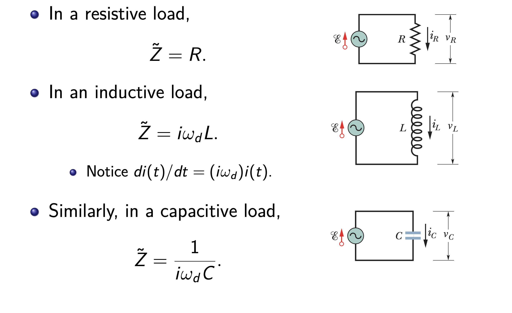

* For L :

   $i(t)=\tilde{i}e^{iwt}$

   $V(t)=L\frac{di}{dt}=L(iw)e^{iwt}\tilde{i}$

   $\tilde{Z}=iwL$

* For C:

$Q(t)=\tilde{Q}e^{iwt}$

$\tilde{V}(t)=\tilde{Q}/C\cdot e^{iwt}$

$\tilde{i}=\frac{d\tilde{Q}}{dt}=iw\tilde{\tilde{Q}e^{iwt}}$

$\tilde{Z}=\frac{1}{iwC}=-\frac{i}{wC}$

### The Series RLC Circuit

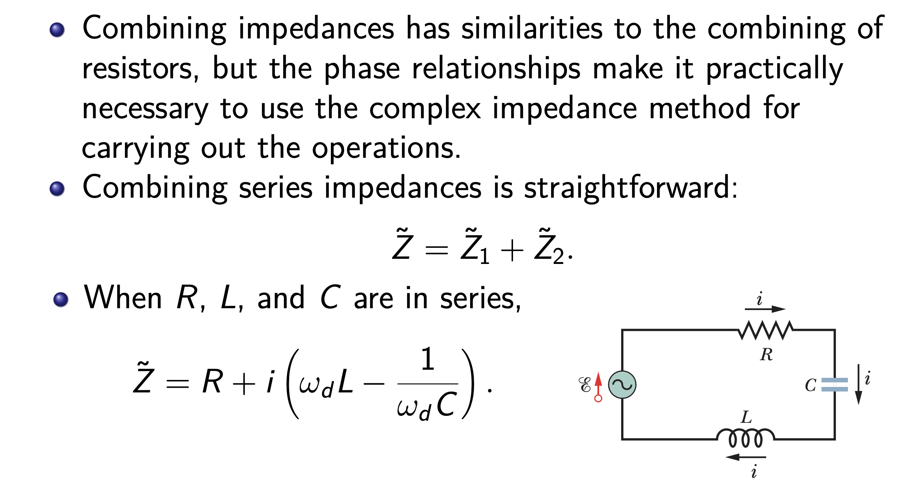

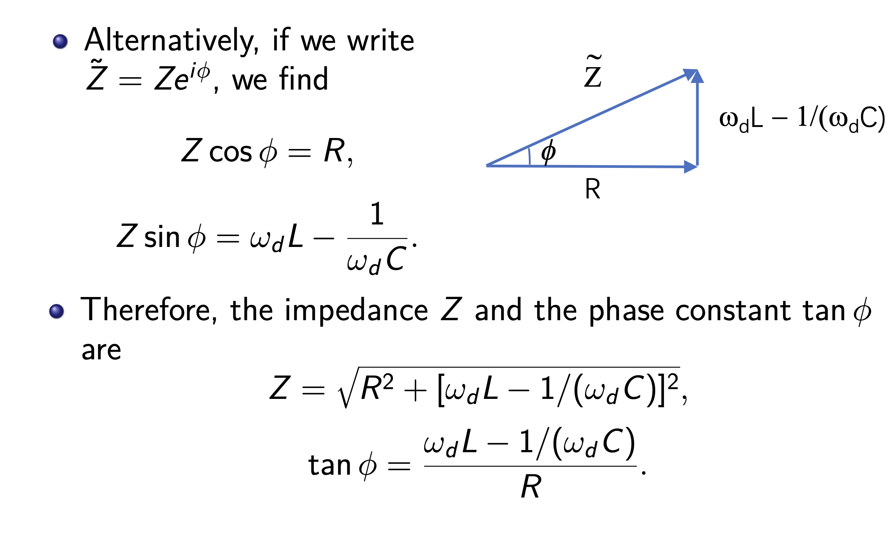

### Resonance

When $ω_d$ equals $ω_0$, the circuit is in **resonance**.

* The circuit is equally capacitive and inductive $(|Z_C | = |Z_L|)$. 
* The current amplitude $I = E_m/R$ is maximum.
* Current and emf are in phase (φ = 0).

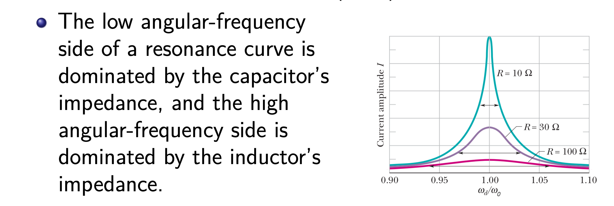

## Maxwell’s Equations and EM Waves

* Applying Divergence to Faraday's Law ,we get:$\triangledown\cdot(\triangledown \times \vec{E})=\triangledown \cdot(-\frac{\partial\vec{B}}{\partial t})=-\frac{\partial}{\partial t}(\triangledown\cdot\vec{B})=0 (Consistency)$

* However,when applying Divergence to Ampere's Law,we get$\triangledown\cdot(\triangledown \times \vec{B})=\triangledown\cdot(\mu_0\vec{J})=\mu_0(\triangledown\cdot\vec{J})$

  While $\triangledown \cdot \vec{J} = -\frac{\partial\rho}{\partial t}=-\frac{\partial{(\epsilon_0\triangledown\cdot E)}}{\partial t} =-\triangledown\cdot(\epsilon_0\frac{\partial\vec{E}}{\partial t}) \ Which \ is\ not\ necessarily\  ZERO$

* Maxwell pointed out that the extra divergence can be removed by fixing Ampere’s law to be:

  $\triangledown\times\vec{B}=\mu_0\vec{J}+\mu_0\vec{J_d}=\mu_0\vec{J}+\mu_0\epsilon_0\frac{\partial\vec{E}}{\partial t}$

### Apply

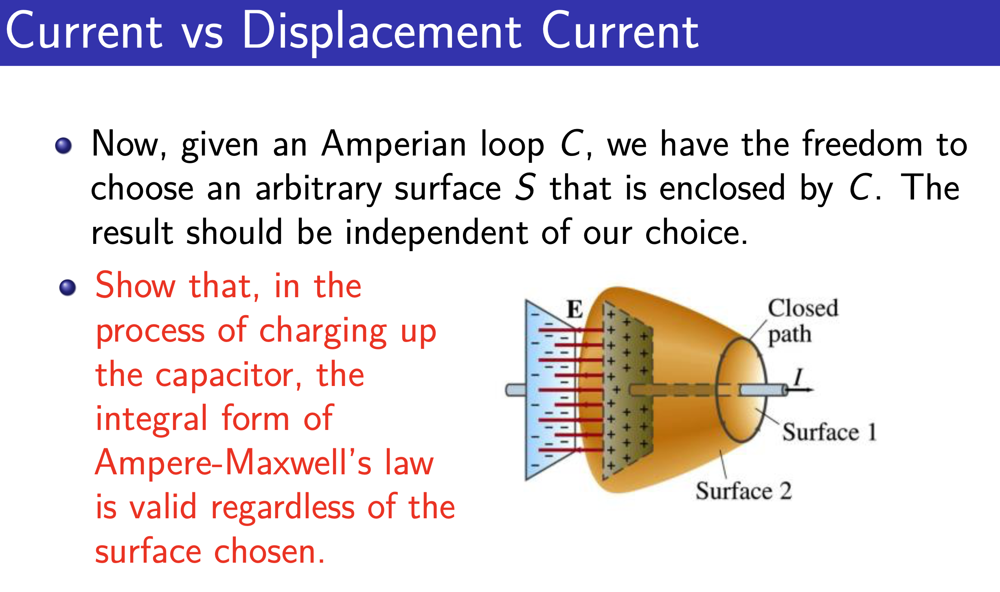

$E=\frac{\sigma}{\epsilon_0}=\frac{Q}{\epsilon_0A}\\ \frac{\partial{E}}{\partial t}=\frac{J_d}{\epsilon_0}=\frac{I}{\epsilon_0A}$

* Choose surface 1 to integral : $E=0\ I_{enc}=I$

* Choose surface 2 to integral:

  $ I_{enc}=0\\\mu_0\epsilon_0\frac{\partial{E}}{\partial t}=\mu_0I/A \ \iint \mu_0\epsilon_0\frac{\partial{E}}{\partial t}\cdot d\vec{A}=\mu_0I$

### Maxwell’s Equations

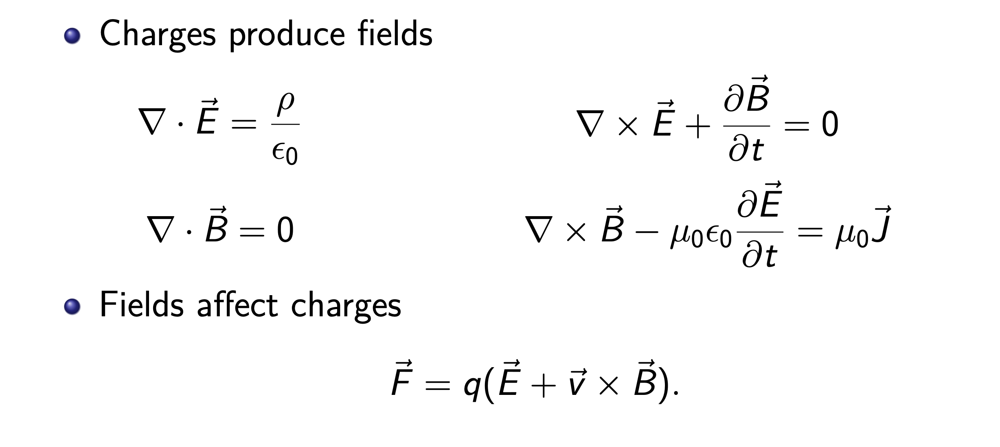

### Electromagnetic Waves

 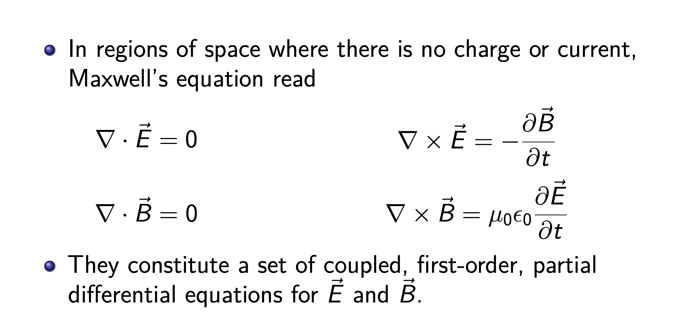

#### Derivation of the Wave Equation

1.Decouple 

$\triangledown\times(\triangledown\times\vec{E})=\triangledown\times(-\frac{\partial\vec{B}}{\partial t})=-\frac{\partial}{\partial t}(\triangledown\times\vec{B})=-\mu_0\epsilon_0\frac{\partial^2\vec{E}}{\partial t^2}$

$\triangledown\times(\triangledown\times\vec{B})=\triangledown\times(\mu_0\epsilon_0\frac{\partial\vec{E}}{\partial t})=\mu_0\epsilon_0\frac{\partial}{\partial t}(\triangledown\times\vec{E})=-\mu_0\epsilon_0\frac{\partial^2\vec{B}}{\partial t^2}$

Another way to solution :

$\vec{A}\times(\vec{B}\times\vec{C})=\vec{B}\cdot(\vec{A}\cdot \vec{C})-\vec{C}\cdot(\vec{A}\cdot \vec{B})$

$\triangledown\times(\triangledown\times\vec{C})=\triangledown\cdot(\triangledown\cdot \vec{C})-\triangledown^2\vec{C}$

Thus:

$\triangledown^2\vec{B}=\mu_0\epsilon_0\frac{\partial^2\vec{B}}{\partial t^2}\\ \triangledown^2\vec{E}=\mu_0\epsilon_0\frac{\partial^2\vec{E}}{\partial t^2}$

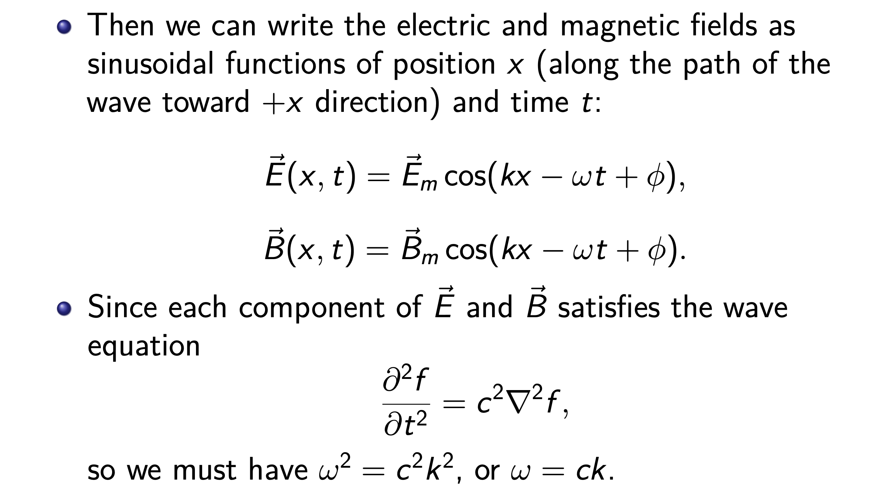

$\lambda=\frac{2\pi}{k}\\ v=\lambda f=\lambda/T \\w=\frac{2\pi}{T}$

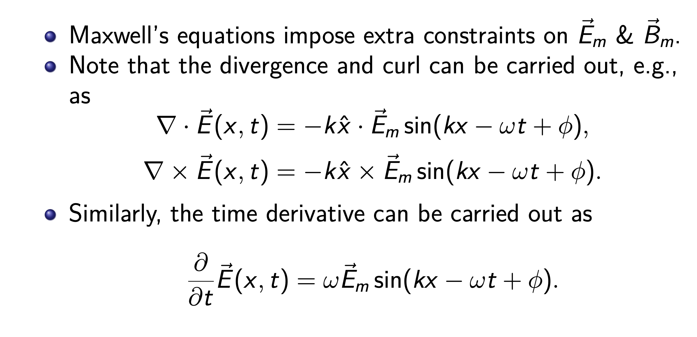

* For $\triangledown\cdot \vec{E}=0\\\triangledown\cdot \vec{B}=0$

  We have $E_m(x)=B_m(x)=0$

* For $\triangledown\times\vec{E}=-\frac{\partial{B}}{\partial t}$

  $-k\hat{x}\times\vec{E_m}=-w\vec{B_m}$

* Therefore $\vec{B}=\frac{1}{c}(\hat{x}(unit\ vector)\times\vec{E})$

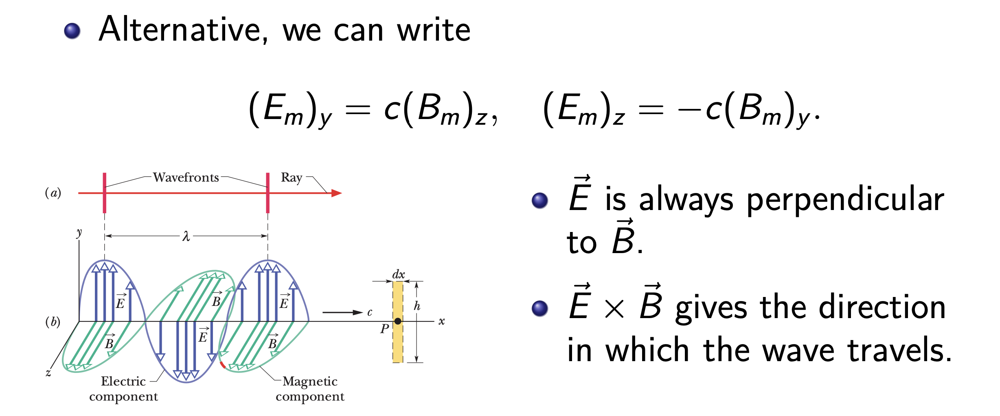

### Energy Transport

* For $\vec{B}=\frac{1}{c}(\hat{x}(unit\ vector)\times\vec{E})$ We have $\mu_E=\frac{\epsilon_0 E^2}{2}=\frac{B^2}{2\mu_0}=\mu_B$
* The rate of energy transport per unit area in a plane wave is the product of total energy density and the speed of the electromagnetic wave, i.e $S=(u_E +u_B)c.$
* $I = S_{avg}= \frac{\epsilon_0 E_m^2}{2}c=\frac{B_m^2}{2\mu_0}c.$

#### Variation of Intensity with Distance

When spherical wavefronts spread from an isotropic point source S with power Ps, the energy of the waves is conserved.

The intensity I at the sphere must decrease with r as $I=\frac{P_S}{4\pi r^2}$
