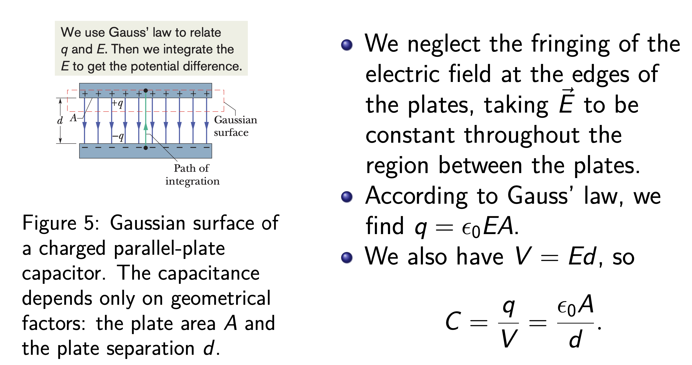
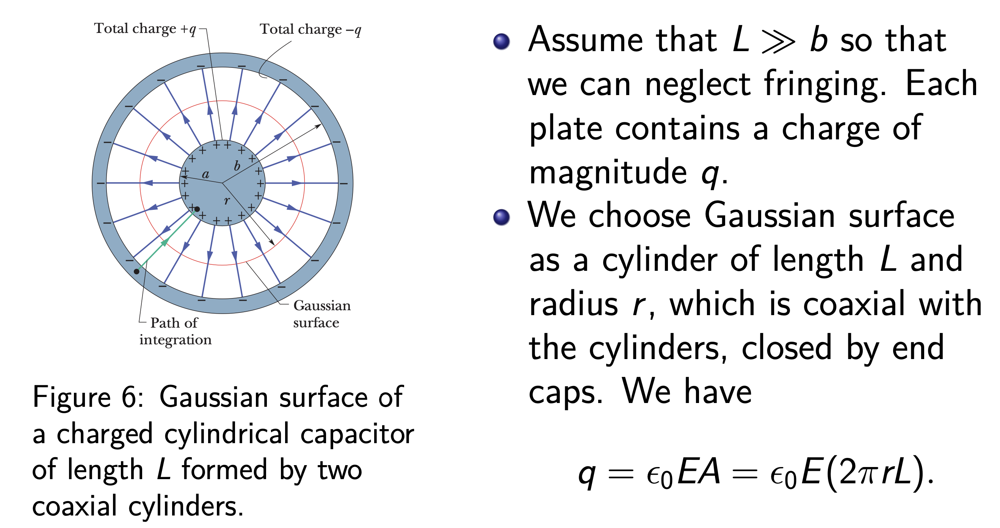
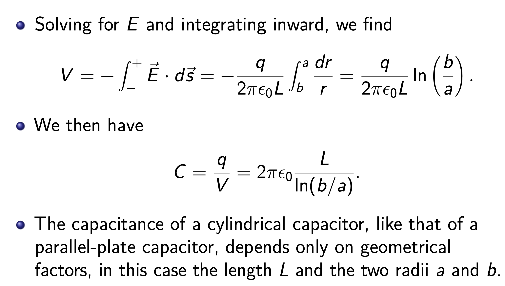
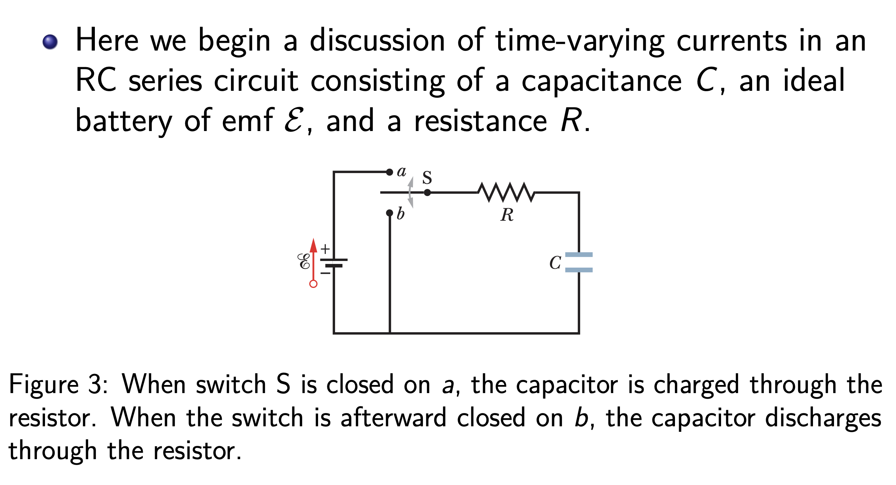
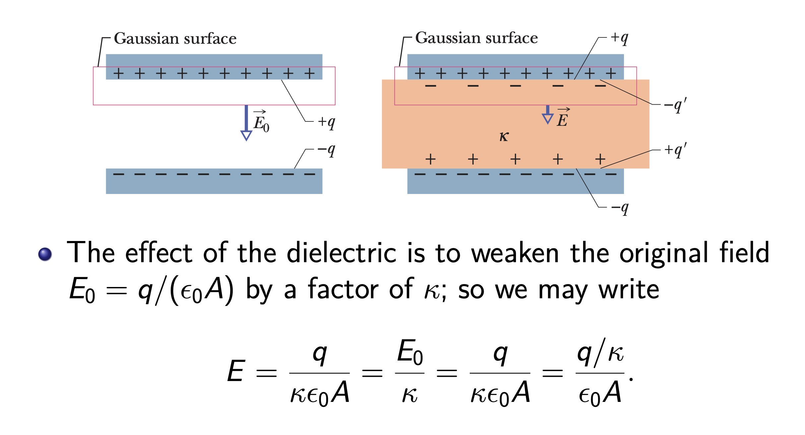
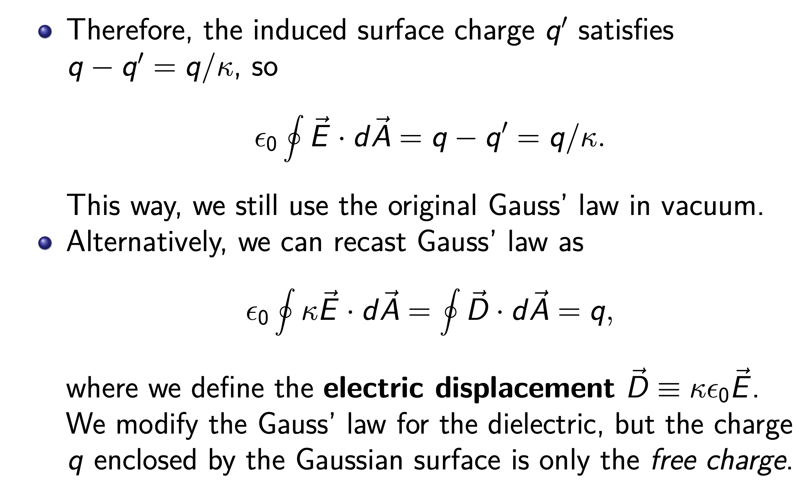

# Current

## Resistance and Capacitance

* $q=(nAL)e$
* $i=\frac{q}{\triangle t}=nAe\vec{v_d}$
* $\vec{J}=ne\vec{v_d}$

### Resistance and Resistivity

 The **resistivity** ρ and **conductivity** σ of a material are related by $ρ = 1/σ = E/J$, where $E$ is the magnitude of the applied electric field and $J$ is the magnitude of the current density.

* **Resistance** is a property of an object, while **resistivity** is a property of a material. 
* The $SI$ unit for resistance is the ohm ($Ω$). The SI unit for resistivity is the ohm-meter ($Ω$·$m$).

### Ohm’s Law

* An electron of mass m and charge (−e) experiences an acceleration in an electric field $\vec{E}$ :

  $\vec{a}=-\frac{e\vec{E}}{m}$

* After a typical collision, each electron will “lose its memory” of its previous drift velocity, starting fresh and moving off in a random direction.

* In the average time $τ$ (or **mean free time**) between collisions, the electron will, on average, acquire a drift velocity

  $\vec{v_d}=-\frac{e\vec{E}}{m}\tau \ \ \ Combining \ with \vec{J}=-ne\vec{v_d} \ We  \ get :$

  $-\frac{\vec{J}}{ne}=-\frac{e\vec{E}}{m}\tau \ \ \ which \ implies \vec{E}=\rho\vec{J} \ \ where\  \rho=\frac{m}{ne^2\tau}$ 

* For metals under normal circumstances, both n and τ can be considered to be a constant. Thus, metals obey Ohm’s law.

* Thus,$V/I=E\cdot d/J\cdot S = \rho d /S$

#### estimate the mean free time(Copper)

* The free electron density in $Cu$ is $n = 8.47 × 10^{28} m^{−3}$. 
* Cu has a resistivity $ρ = 1.56 μΩ·cm$.
* The mean free time can be estimated by $\rho=\frac{m}{ne^2\tau}$
* In the classical picture, the mean velocity of an electron at room temperature can be estimated by $(1/2)mv^2 = (3/2)k_BT.$

### Equation of Continuity

We have implicitly used the (local) conservation of charge here. Namely, if the total charge in some volume changes, the exactly same amount of charge must have passed in or out through the surface. Otherwise, charge accumulation occurs in the volume enclosed by the surface.

* Formally, we have
* $\frac{d}{dt}\int_V\rho(\vec{r},t)dV = \int_V \frac{\partial{\rho(\vec{r},t)}}{\partial{t}}dV=-\oint_S\vec{J}(\vec{r},t)d\vec{A}$

* To be able to move the derivative under the integral sign this way requires that $∂ρ/∂t$ be continuous.

* With the divergence theorem, we can rewrite it in the derivative form (note V is arbitrary)$\frac{\partial \rho}{\partial t}=-\triangledown\cdot\vec{J}$（By Gauss's Law）

Such an equation of continuity plays an important role in hydrodynamics, hear flow, and diffusion theory, besides electromagnetic theory. It is simply a mathematical expression of a conservation law. 

## Capacitor and Capacitance

$C=\frac{Q}{U}$

### Capacitance of a Parallel-Plate Capacitor

### Capacitance of a Cylindrical Capacitor

* Apparently, the capacitance is proportional to the length of the cylindrical capacitor, just like the resistance of a cylindrical conductor (R = ρL/A).

### Energy stored in a capacitor

$dW=V'dq'=(\frac{q'}{C})dq'$

$W=\int_0^q(q'/C)dq'=\frac{q^2}{2C}$

$U=\frac{q^2}{2C}=\frac{CV^2}{2}$

## DC Circuits

### RC circuits

#### Charging (switch to a )

$\frac{q}{C}\frac{dq}{dt}+i^2R=i\epsilon$

$\Rightarrow \dot{q}+\frac{q}{RC}=\frac{\epsilon}{R}$

$\Rightarrow q=C\epsilon(1-e^{-t/RC})$

* Note : Derivation see Appendix : ODEs

* The equilibrium (final) charge on the then fully charged capacitor is equal to $q_0 = CE$.

$\Rightarrow i = \frac{dq}{dt}=(\frac{\epsilon}{R}e^{-t/RC})$

$\Rightarrow V_c = \frac{q}{C}=\epsilon(1-e^{-t/RC})$

#### Discharging(switch to b from a)

$\dot{q}+\frac{q}{RC}=0$

$\Rightarrow q=q_0e^{-t/RC}$

$\Rightarrow i = (\frac{\epsilon}{R})e^{-t/RC}$

### Energy Density

parallel-plate capacitor:

$U=\frac{1}{2}CV^2=\frac{1}{2}\epsilon_0E^2(Ad)$

* The energy density u, i.e., the potential energy per unit volume between the plates, is thus uniform:$u=\frac{1}{2}\epsilon_0E^2$

### Capacitor with a Dielectric

## Appendix

### ODEs

* $\dot{y}+p(x)y=q(x) \Rightarrow y=e^{-\int pdx}(C+\int q\cdot e^{\int pdx}dx)$

