# Coulomb's Law and the Electric Field

### Coulomb‘s Law

$\vec{F}=k\frac{q_1q_2}{r^2}$

$k = 8.99 * 10^{-12} N*m^2/C^2=\frac{1}{4\pi\epsilon_0}\\$ 

$\epsilon_0=8.85*10^{-12}C^2/N*m^2$

### Diphole

* The product $\vec{q}d$ is known as the electric dipole moment $\vec{p}$ of the dipole.

  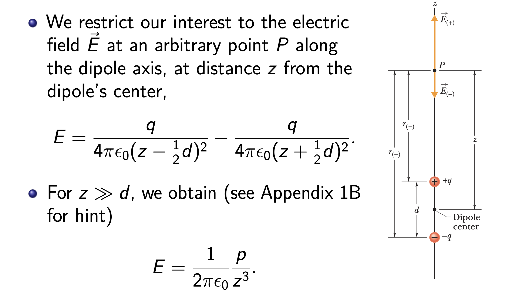

* Derivation

​	$\begin{align*}E&=\frac{q}{4\pi\epsilon_0(z-\frac{d}{2})^2}- \frac{q}{4\pi\epsilon_0(z+\frac{d}{2})^2}\\ &=\frac{q\vec{d}}{2\pi\epsilon_0}*\frac{z}{(z-\frac{d}{2})^2(z+\frac{d}{2})^2}\\ &=\frac{\vec{p}}{2\pi\epsilon_0z^3}*\frac{1}{(1-\frac{d}{2z})^2(1+\frac{d}{2z})^2}\\ &=\frac{1}{2\pi\epsilon_0}\frac{p}{z^3} \ \ when (z>>d)\end{align*}$

#### A diphole in a uniform electric filed

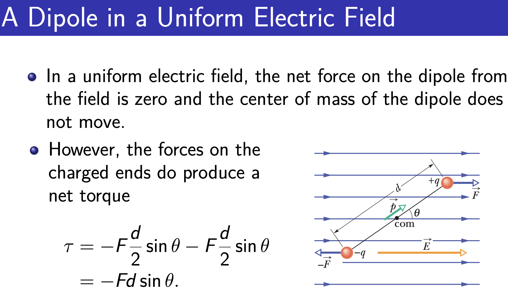

**Note**:$\tau=p\times E$

###  The Electric Field Due to a Ring of Charge

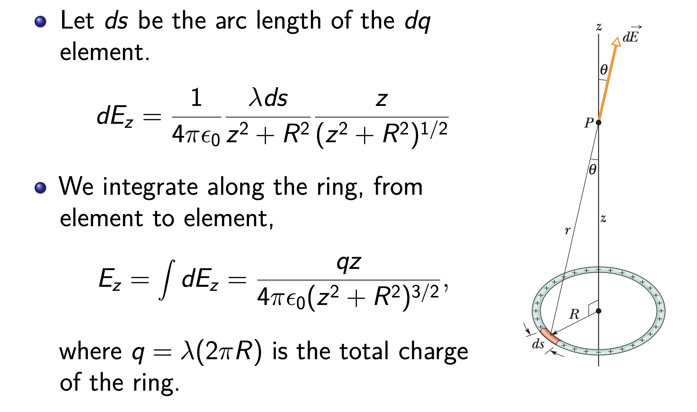

* When $z>>R$ $E=\frac{qz}{4\pi\epsilon_0z^3(1+(\frac{R}{z})^2)^{\frac{3}{2}}}=\frac{q}{4\pi\epsilon_0z^2}$

### The Electric Field Due to a Charged Disk

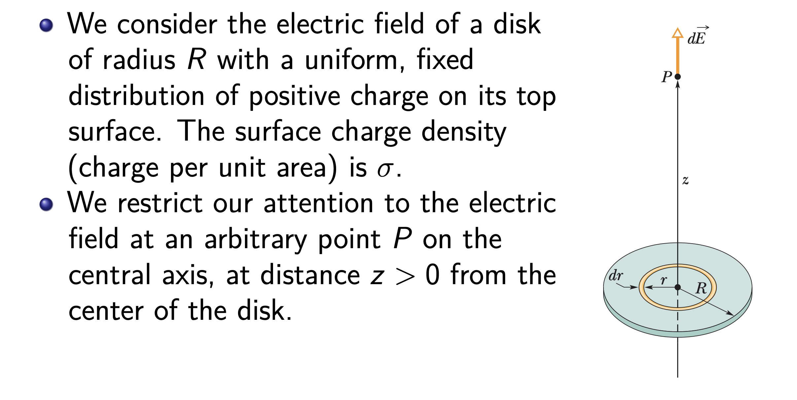

$\begin{align*}dE_z &= \int \frac{\sigma(2πrdr)}{4\pi\epsilon_0(z^2+r^2)}\frac{z}{\sqrt{z^2+r^2}}=\frac{\sigma z}{2\epsilon_0}\int_0^R\frac{rdr}{(z^2+r^2)^\frac{3}{2}}\\ &= \frac{\sigma}{2\epsilon_0}(1-\frac{z}{\sqrt{z^2+R^2}})\end{align*}$

## Gauss's Law

### Electric Flux

> $∆Φ = (E cosθ)∆A=\vec{E}\cdot{\vec{A}}$

> $Φ=\int\vec{E}\cdot{d\vec{A}}$

### Gauss's Law

> $\epsilon_0 \oint\vec{E}\cdot d\vec{A}=q_{encore}$

### Applications

#### 1.Spherical Symmetry

> $4\pi r^2\cdot E = \frac{q{(\frac{r}{R})^3}}{\epsilon_0}$

> $\Rightarrow \ \vec{E}=\frac{q}{4\pi\epsilon_0R^3}\cdot \vec{r}$

#### 2.Planar Symmetry

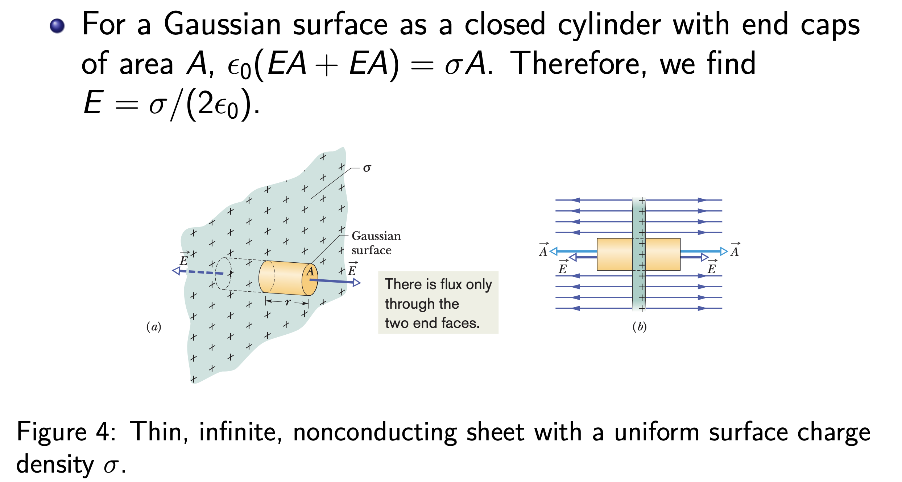

#### 3.Cylindrical Symmetry

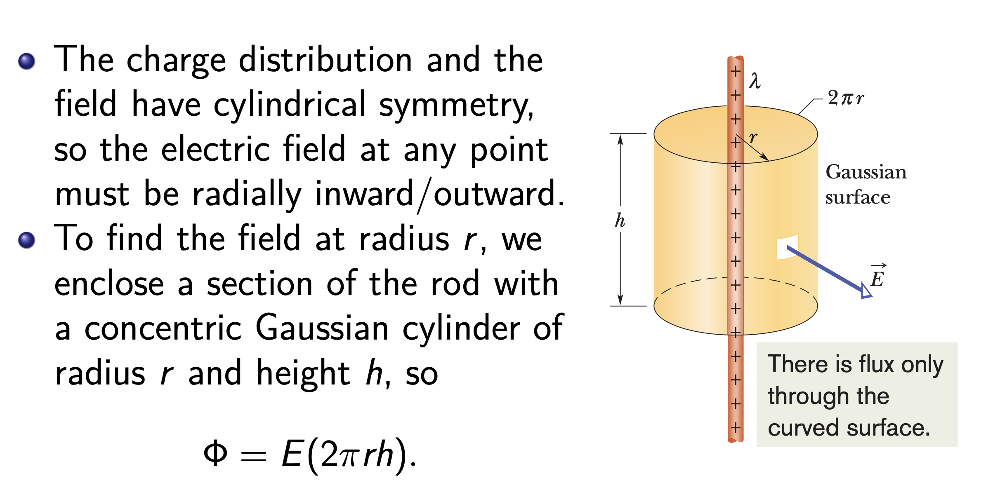

* $ε_0 Φ = λh$

* $E=\frac{\lambda}{2\pi r\epsilon_0}$

## The Electrostatic Potential

### Potential due to an electric diphole

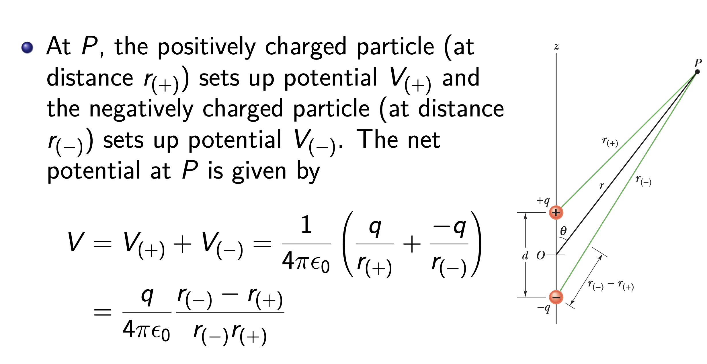

* For points that are relatively far from the the two lines to *P* as being parallel and their length dif- dipole $(r ≫ d)$, we can approximate the leg of a right triangle with hypotenuse *d* .Thus

  > $r_--r_+\approx dcos\theta$

  > $r_-\cdot r_+\approx r^2$

  > $V=\frac{\vec{p}\cdot\vec{r}}{4\pi\epsilon_0r^3}$

### Systems of Charged Particles 

* The lesson here is this: If you are given an assembly of charged particles, you can find the potential energy of the assembly by finding the potential of every possible pair of the particles and then summing the results.

### Continuous Charge Distribution: Rod

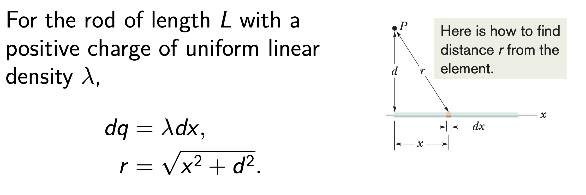

> $\begin{align*} V &= \int dV = \int _0^L \frac{\lambda dx}{4\pi\epsilon_0\sqrt{x^2+d^2}}\\ &=\int \frac{\lambda}{4\pi\epsilon_0}\int_0^L\frac{dx}{\sqrt{x^2+d^2}}\\ &=\frac{\lambda}{4\pi\epsilon_0}ln\frac{L+\sqrt{L^2+d^2}}{d} \end{align*}$

### Continuous Charge Distribution: Disk

> $\begin{align*}V &= \int_0^R \frac{\sigma(2πrdr)}{4\pi\epsilon_0\sqrt{z^2+r^2}}\\ &= \frac{σ}{2\epsilon_0}(\sqrt{z^2+R^2}−z)\end{align*}$

$\Rightarrow Ez=-\frac{dV}{dz}$

## The Triangle of Electrostatics

### PreKnowledge

#### gradient

> $∇V=\frac{\partial{V}}{\partial{x}}\hat{x}+\frac{\partial{V}}{\partial{y}}\hat{y}+\frac{\partial{V}}{\partial{z}}\hat{z}$

#### curl

> $∇ \times V = \begin{bmatrix}\hat{x}&\hat{y}&\hat{z}\\\frac{\partial{}}{\partial{x}}&\frac{\partial{}}{\partial{y}}&\frac{\partial{}}{\partial{z}}\\ V_x&V_y&V_z\end{bmatrix}$

* The curl of a gradient is always $ZERO$

#### divergence

> $∇ \cdot V$

> $\frac{\partial E_x}{\partial x}+\frac{\partial E_y}{\partial y}+\frac{\partial E_z}{\partial z}=\triangledown \cdot \vec{E}$

### $E \Leftrightarrow \ \rho$

* $\oint\vec{E}\cdot d\vec{l}=\int\int(\triangledown\times \vec{E})dS = 0$  $By \ Stokes$  -- independent of $PATHS$

* Choose a Gaussian surface to enclose a small cube centered at $\vec{r}$ with side $\triangledown x\triangledown y\triangledown z$ such that $\triangle V = \triangle x \triangle y \triangle z$
  * In the small $\triangledown V$ ,We have :
    * $\frac{\rho(\vec{r})}{\epsilon_0}=lim_{\triangle V \rightarrow0}\frac{q_{enc}}{\triangle V\epsilon_0}=lim_{\triangle V \rightarrow0}\frac{1}{\triangle V}\oint \vec{E}\cdot d\vec{S}$
    * $\oint \vec{E_x}\cdot d\vec{S}=\vec{E}(x + \frac{∆x}{2} ,y,z)\hat{x}∆y∆z+\vec{E}(x - \frac{∆x}{2} ,y,z)(-\hat{x})∆y∆z = \frac{\partial E_x}{\partial x}\triangledown V$
    * $\frac{\rho(\vec{r})}{\epsilon_0}=\frac{\partial E_x}{\partial x}+\frac{\partial E_y}{\partial y}+\frac{\partial E_z}{\partial z}=\triangledown \cdot \vec{E}$
* According to Gauss’ law, the only places at which the divergence of the electric field is not zero are those locations at which charge is present. So the divergence is a measure of the tendency of the field to flow away from a (charged) point.
* $\oiint\vec{E}\cdot d\vec{A} = \iiint(\triangledown \cdot \vec{E})dV$  $Gauss's\ Law$

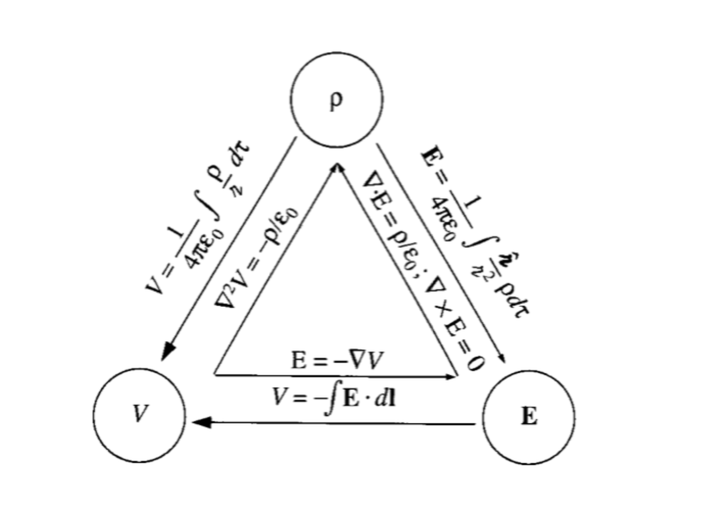

### Example

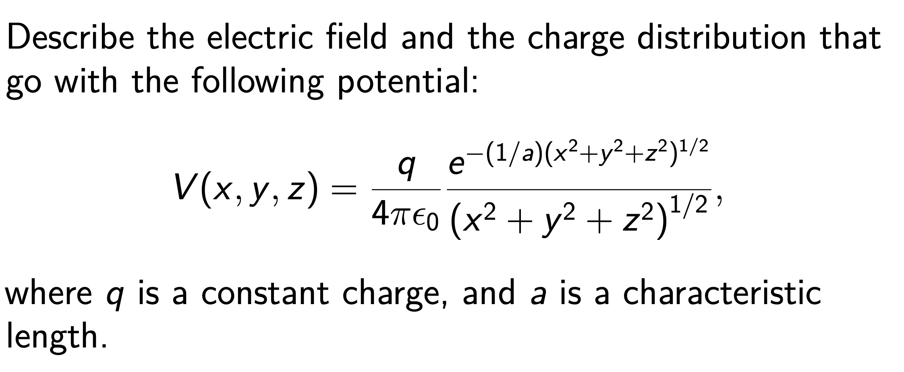

## The Electrical Properties of Conductors

### A Charged Isolated Conductor

* Consider an isolated conductor with excess charge. In electrostatic equilibrium, the electric field $\vec{E}$ inside the isolated conductor must be zero. Otherwise, the field would exert forces on the conduction electrons, and thus generate perpetual current in an isolated conductor.
* Gauss’ law then tells us that the net charge inside the Gaussian surface must also be zero; the excess charge must lie on the actual surface of the conductor.

For the same conductor with a cavity, is there excess charge on the cavity wall?

* We draw a Gaussian surface surrounding the cavity, close to its surface but inside the conducting body.
* Because $\vec{E} = 0$ inside the conductor,there can be no flux through  this new Gaussian surface
* No charge on the cavity wall
* The cavity can be enlarged until it consumes the entire conductor, leaving only the charges. The electric field would not change at all; so the electric field is set up by the charges and not by the conductor.

### Electric Field Outside Spherical Conductors

* Shell Therom https://en.m.wikipedia.org/wiki/Shell_theorem

  If we enclose the conductor in a concentric Gaussian sphere, Gauss’ law tells us that the electric field outside the surface of the conductor looks as if all the excess charge on the shell were concentrated at its center.

### Electric Field Outside Isolated Conductors

*  the electric field just outside the surface of a conductor can be determined using Gauss’ law.
* The electric field $\vec{E}$ at and just outside the conductor’s surface must also be perpendicular to that surface.

#### Flat surface

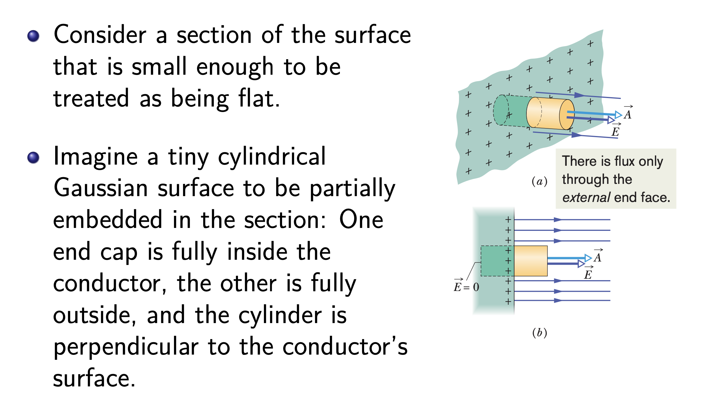

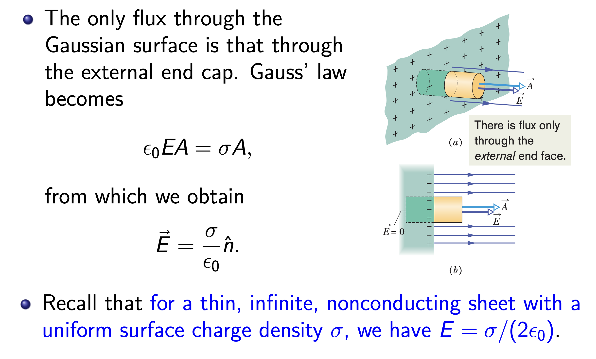

####  Parallel Plates

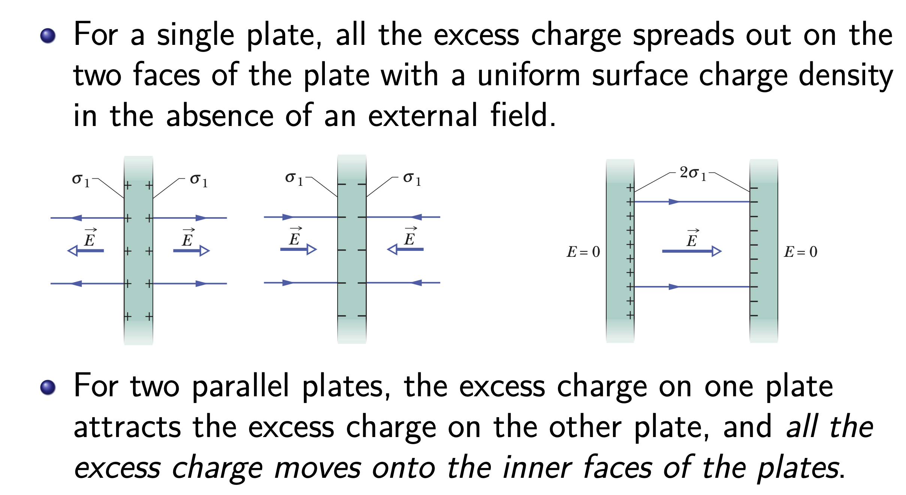

### Charge Inside a Spherical Metal Shell

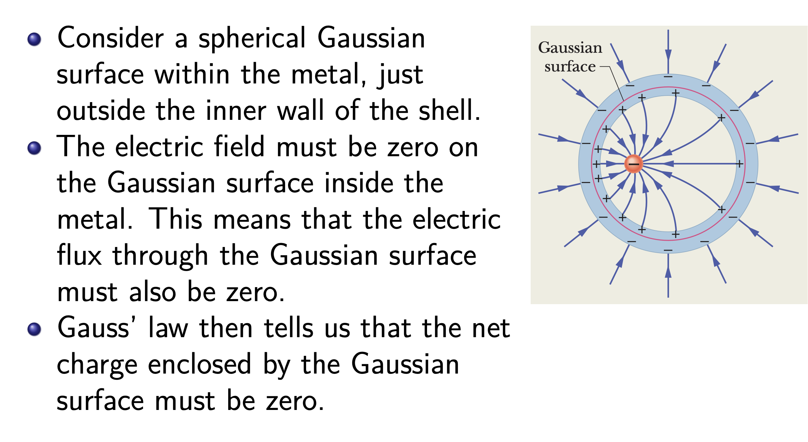

* Therefore, a total charge Q must lie on the inner wall of the shell in order that the net enclosed charge be zero.
* Because the shell is electrically neutral,a total charge -Q leave the inner wall and move to the outer wall.
  * They must spread out uniformly.(This would be true no matter where inside the shell the particle happened to be located)

### Quantify Charge Distribution(The Method of Images)

#### A.Simple Analysis

There is a charge +q outside a spherical metal shell at a distance$r+R$ from its center,how to decide the image?

* Note:at the center C,all charges on the spherical shell exerts $ZERO$ potentials on the point so $V_c=\frac{kq}{(R+r)^2}$

#### B. A single grounded pallete with a charge q at a distance d

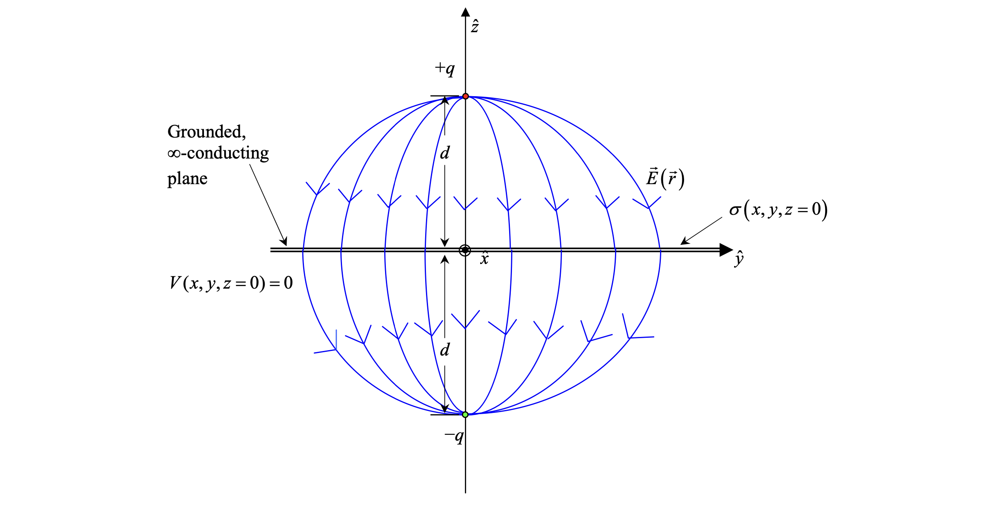

* In this way $V(x,y,z)=\frac{\frac{q}{ 4\pi\epsilon_0}}{\sqrt{x^2+y^2+(z-d)^2}}- \frac{\frac{q}{ 4\pi\epsilon_0}}{\sqrt{x^2+y^2+(z+d)^2}}$

* We assert this is the solution for the upper half region.

  * We can check that$V(x,y,z=0)=0$,and$V →0$for$x^2 +y^2 +z^2 ≫d2.$
  * At z = 0, $\vec{E}$ = −∇V is perpendicular to the xy plane, just as it would need to be with the grounded plane.
  * The only charge in the region z > 0 is q at (0,0,d).

* According to Gauss’ law, the surface charge density σ induced on the conductor is:

  > $E=-\epsilon_0\frac{\partial V}{\partial z}|_{z=0}=\frac{-qd}{2\pi\epsilon_0(x^2+y^2+d^2)^\frac{3}{2}}\hat{z}$

  > $\sigma=\epsilon_0\cdot E =\frac{-qd}{2\pi(x^2+y^2+d^2)^\frac{3}{2}}$

* Bringing q from infinity needs ? W

  > Derive as little circles

  >$V=\int_0^\infty\frac{qd\cdot 2\pi r dr}{2\pi(r^2+d^2)^{3/2}}\cdot\frac{q}{4\pi\epsilon_0(r^2+d^2)^{1/2}}=\frac{q^2d}{8\pi\epsilon_0}\int_0^{\infty}\frac{d(r^2)}{r^2+d^2}=-\frac{q^2}{8\pi\epsilon_od}$

  > which is half of the energy for bringing two point charges to a distance 2d with no conductor. 

#### positive charge +Q  and a conducting sphere 

 Solve the electro-static potential function $V(x,y,z)$ and the electrostatic field $E(x,y,z)$ in space, with a positive charge $+Q$ located at $(−D, 0, 0)$and a conducting sphere of radius R (not grounded) at origin $(R<D)$.

Pre - knowledge : 

* the grounded case with a charge outside(pictures below)

  > Image : $r'=\frac{R^2}{D}$ $q'=-qR/D$

  > Derivation :
  >
  > $\begin{align*}V(\theta)&=\frac{q'}{4\pi\epsilon_0}\cdot\frac{1}{\sqrt{R^2+r'^2-2Rr'cos\theta}}+\frac{Q}{4\pi\epsilon_0}\cdot\frac{1}{\sqrt{R^2+D^2-2RDcos\theta}}=0\end{align*}$
  >
  > $\Rightarrow \frac{1}{4\pi\epsilon_0}[\frac{\frac{q'}{\sqrt{Rr'}}}{\sqrt{R/r'+r'/R-2cos\theta}}+\frac{\frac{Q}{\sqrt{RD}}}{\sqrt{R/D+D/R-2cos\theta}}]=0$
  >
  > $\begin{align*}\Rightarrow &\frac{q'}{\sqrt{Rr'}}+\frac{Q}{\sqrt{RD}}=0\\ &\frac{R}{r'}+\frac{r'}{R}=\frac{R}{D}+\frac{D}{R}\end{align*}$
  >
  > $\Rightarrow R/r'=D/R \Rightarrow r'=R^2/D \Rightarrow q'=-\frac{qR}{D}$

* the grounded case with a charge inside(Actually it's bascially the same thing)

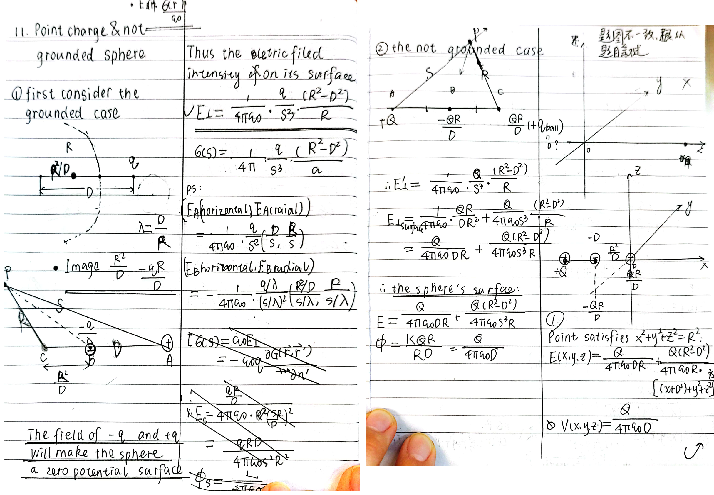

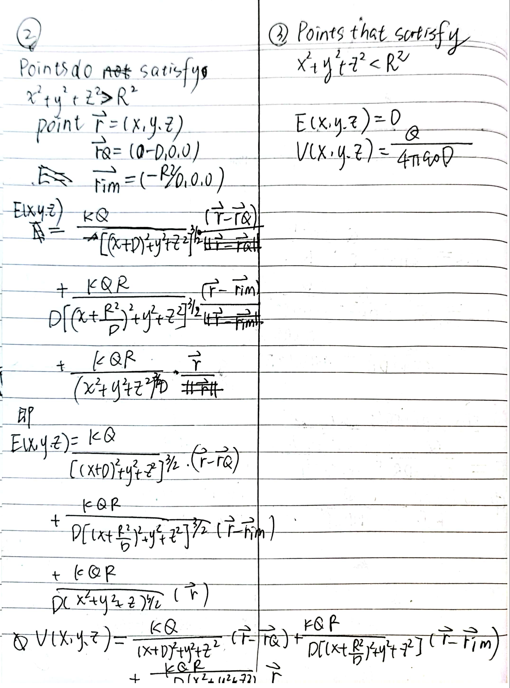
* Also See https://galileoandeinstein.phys.virginia.edu/Elec_Mag/2022_Lectures/EM_08_Images.html
## Appendix ：

#### **Cross product**

* $\vec{A} ×(\vec{B} +\vec{C})=\vec{A} ×\vec{B} +\vec{A} ×\vec{C}$

#### 立体角

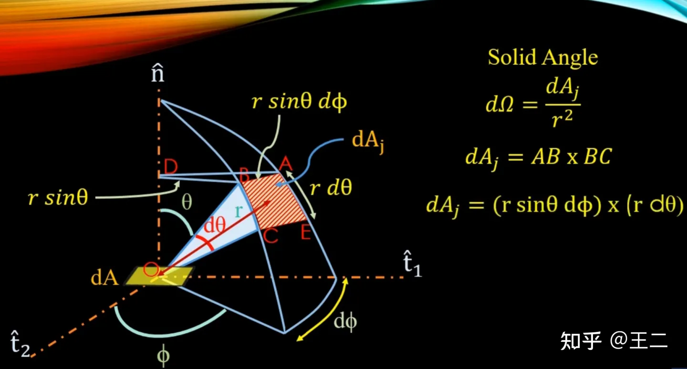

$dA=r^2sin\theta d\theta d\Phi$

$Solid \ Angle\  d\Omega = \frac{dA}{r^2}=sin\theta d\theta d\Phi$

$dV=r^2sin\theta d\theta d\Phi dr$

