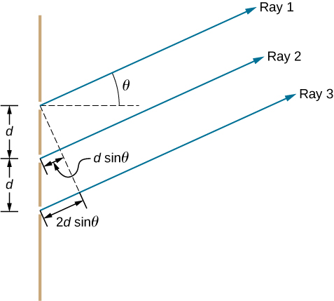

# Diffraction & Interference

###  plane wave 

A plane wave is a type of wave whose wavefronts are flat, or nearly flat. This means that the wave crests and troughs are aligned along parallel lines. Plane waves are an important concept in physics and are often used to describe various types of waves, including electromagnetic waves and sound waves.

Key characteristics of a plane wave include:

1. **Constant Phase Front:** In a plane wave, all points on a wavefront have the same phase. The phase of a wave is a measure of the position of a point in its cycle relative to a reference point.

2. **Parallel Propagation:** The wavefronts of a plane wave propagate in parallel lines. This is in contrast to spherical waves, where the wavefronts are spheres centered around the source.

3. **Mathematical Representation:** Mathematically, a one-dimensional plane wave can be represented as a function of the form:

   $Acos⁡(kx−ωt+ϕ)$

   where:

   - *A* is the amplitude of the wave,
   - *k* is the wave number (related to the wavelength),
   - *x* is the spatial coordinate,
   - *ω* is the angular frequency,
   - *t* is time, and
   - *ϕ* is the phase angle.

4. **Infinite Extent:** In theoretical discussions, plane waves are often assumed to have infinite extent, meaning they continue indefinitely in space.

Plane waves are useful in physics because they simplify the mathematical description of wave phenomena, making it easier to analyze and solve problems. They are often used as a starting point for understanding more complex wave behavior. In the context of electromagnetic waves, for example, plane waves are fundamental to the study of optics and electromagnetic field theory.

### Single-Slit Diffraction

#### Electric Field and Intensity

To find an expression for the intensity at an arbitrary point P on the viewing screen, corresponding to a particular small angle θ, we need to divide the slit into N zones of equal widths $∆x = a/N$ small enough that we can assume each zone acts as a source of Huygens wavelets.

We then add the phasors for the wavelets, which form a geometric series(notice.   $r_{i+1}−r_i =∆xsinθ$):

$\widetilde{E}_\theta =\frac{E_0}{N}e^{-iwt}e^{ikr+1}\times [1+e^{ik(r_2-r_1)}+e^{ik(r_3-r_1)}+…+e^{ik(r_N-r_1)}]$

**note** $\Phi$=$\frac{asin\theta}{\lambda}\times2\pi$

**Summary**

* When $\alpha=0 (\theta=0)$,the intensity reaches the maximum
* When $\alpha =n\pi(n\ne0)$,which is   $asin\theta=n\lambda$    the intensity is ZERO
* When a is approximately large $\theta$ is rather small ,meaning that there is no diffraction

#### From Sum to Integral

$\begin{align*}\widetilde{E}_\theta &=\frac{E_0}{N}e^{-iwt}e^{ikr+1}\times [1+e^{ik(r_2-r_1)}+e^{ik(r_3-r_1)}+…+e^{ik(r_N-r_1)}]\\&=\frac{E_0 \triangle x}{a}e^{-iwt}[e^{ikr_1}+e^{ikr_2}+…+e^{ikr_N}]\end{align*}$

$\Rightarrow_{N\to+\infty} \widetilde{E}_\theta = \frac{E_0}{a} e^{-iwt}\int_0^ae^{ik（sin\theta x+r_1）}dx$ ~ $\int_{-a/2}^{a/2}e^{ik_xx}dx$ $(k_x=ksin\theta)$

##### Fourier Transform

   Thus $\widetilde{E}_{sq}(k_x)= E_0a\frac{2sin(k_xa/2)}{k_x}=E_0a\frac{sin\alpha}{\alpha}(\alpha=k_xa/2=\frac{sin\theta a}{2})$

The key message is that the field distribution in the Fraunhofer diffraction pattern is the Fourier transform of the field distribution across the aperture.

### Diffraction by a Circular Aperture

We are essentially collecting only a fraction of the incident wavefront and therefore cannot hope to form a perfect image.
 The image is related to the Fourier transform of a disk and is known as the **Airy pattern**.

The analysis of such patterns shows that the first minimum for the diffraction pattern of a circular aperture of diameter a is located by $sin\theta = 1.22\frac{\lambda}{a}$    in contrast to $sin θ = λ/a$ in the slit case.

#### Resolvability

Two objects cannot be distinguished from a single point object, if their diffraction patterns (mainly their central maxima) overlap.
 **Rayleigh’s criterion** for resolvability states that the two point objects are barely resolved if their angular separation is such that the central maximum of the diffraction pattern of one source is centered on the first minimum of the diffraction pattern of the other, i.e.$θ_R = sin^{−1} \frac{1.22λ}{a} ≈ 1.22\frac{\lambda}{a}$

* Quesiton？ **QUIZ**

## Grating and Spectra

### Diffraction by a Double Slit

Formally, with diffraction effects taken into account, the intensity of a double-slit interference pattern (shown later with the Fourier method) is

$I(\theta)=I_{max}(\frac{sin\alpha}{\alpha})^2cos^2\beta$  where $\beta = \frac{\delta_2}{2}=\frac{\pi}{\lambda}dsin\theta$  $\alpha = \frac{\pi}{\lambda}asin\theta$

* The first minimum occurs where the phase difference between the two slits (N = 2) is $δ_2 =(2π/λ)dsinθ=π.$
* The first minimum of the envelope occurs where the phase difference between one edge and the center of a single slit is $α = (2π/λ)(a/2) sin θ = π.$
* One can, therefore, **determine (d/a) by counting fringes**.
* In both cases, the larger the length (d or a) is, the smaller the $θ$  (or $k_x =ksinθ$  ) is.

#### Derivation

The interference pattern can be understood by a **convolution theorem** for the Fourier transformation: **The transform（Fourier） of the convolution of two functions $(f*g)$ is the product of their transforms.**

$Proof$

$(f*g)(x)=\int dx\int dx'f(x')g(x-x')e^{ikx}\\=\int f(x')e^{ikx'}d x'\int dx\ g(x-x')e^{ik(x-x')}$

Thus

* The single-slit aperture function :$F[E_{sq}(x)]=\widetilde{E}_{sq}(k_x)=\int_{-a/2}^{a/2}E_0e^{ikx}dx= E_0a\frac{2sin(k_xa/2)}{k_x}=E_0a\frac{sin\alpha}{\alpha}(\alpha=k_xa/2=\frac{sin\theta a}{2})$

* Young’s double-slit interference result：

Young's double-slit interference result is related to the interference pattern formed by two narrow slits. The function *h*(*x*) describes the distribution of intensity along the screen where the interference pattern is observed. In this case, *h*(*x*) is represented as a sum of two delta functions:

​	$h(x) = δ(x + d/2) + δ(x − d/2)$

Here, *d* is the separation between the two slits, and *δ*(*x*) is the Dirac delta function. The Dirac delta function is a mathematical concept often used in physics to model idealized distributions. It is not a traditional function but rather a distribution that satisfies certain properties. In this context, *δ*(*x*) can be thought of as an infinitely tall and narrow spike located at *x*=0.

​	$F[h(x)]=\int_{-\infty}^{+\infty} h(x)e^{ik_xx}dx= e^{-ik_xd/2}+e^{ik_xd/2}=2cos(k_xd/2)$

#### Interference vs Diffraction

If we let $a→0$, then $α→0$ and$\frac{sin\alpha}{\alpha}→1$. Our result then reduces, as it must, to an equation describing the interference pattern for a pair of vanishingly narrow slits with slit separation d. 

Similarly, putting $d → 0$ is equivalent physically to causing the two slits to merge into a single slit of width a. Then we have $β→0$  and $cos2β→1$. Our result reduces,as it must,to an equation describing the diffraction pattern for a single slit of width a.

If the combining waves originate from a small number of elementary coherent sources — as in a double-slit experiment with a ≪ λ — we call the process interference.

If the combining waves originate in a single wavefront — as in a single-slit experiment — we call the process diffraction.

Note that both are superposition effects and usually both are present simultaneously.

### Diffraction Gratings

In double-slit interference with a ≪ λ  $I(θ) = I_{max}cos^2 [\frac{πd}{\lambda} sinθ]$

The bright fringes due to different wavelengths overlap too much to be distinguished.

A useful tool in the study of light and of objects that emit and absorb light is the **diffraction grating**, which has a much greater number N of slits, often called **rulings**, perhaps as many as several thousand per millimeter.

#### Multiple Slits with Monochromatic Light

* When N=3

Figure below shows the simplest case of multiple-slit interference, with three slits, or 𝑁=3. The spacing between slits is *d*, and the path length difference between adjacent slits is 𝑑sin𝜃, same as the case for the double slit. What is new is that the path length difference for the first and the third slits is 2𝑑sin𝜃. The condition for constructive interference is the same as for the double slit, that is $dsin\theta=m\lambda$

When this condition is met, 2𝑑sin𝜃 is automatically a multiple of 𝜆, so all three rays combine constructively, and the bright fringes that occur here are called **principal maxima**. But what happens when the path length difference between adjacent slits is only 𝜆/2? We can think of the first and second rays as interfering destructively, but the third ray remains unaltered. Instead of obtaining a dark fringe, or a minimum, as we did for the double slit, we see a **secondary maximum** with intensity lower than the principal maxima.

* In general

In general, for *N* slits, these secondary maxima occur whenever an unpaired ray is present that does not go away due to destructive interference. This occurs at (𝑁−2) evenly spaced positions between the principal maxima. 

The amplitude of the electromagnetic wave is correspondingly diminished to 1/𝑁 of the wave at the principal maxima, and the light intensity, **being proportional to the square of the wave amplitude**, is diminished to $\frac{1}{N^2}$ of the intensity compared to the principal maxima. 

As figure below shows, a dark fringe is located between every maximum (principal or secondary). As *N* grows larger and the number of bright and dark fringes increase, the widths of the maxima become narrower due to the closely located neighboring dark fringes. Because the total amount of light energy remains unaltered, narrower maxima require that each maximum reaches a correspondingly higher intensity.

$Phase\ difference$ 

$\delta_N=\frac{2\pi}{\lambda}dsin\theta$

Consider the example below when **N equals 4**

* With monochromatic (red) light incident on a diffraction grating (with a large number N), you would see on a viewing screen very narrow(and so are called lines) ,separated by relatively wide dark regions

#### Width of the Lines

A grating’s ability to resolve (separate) lines of different wavelengths depends on the linewidth.
 The **half-width** of the central line $∆θ_{hw}$ is determined by the first minimum in intensity, at which the N rays from the N slits of the grating cancel one another.

The first minimum occurs where the phase difference between the adjacent slits is (from the path length difference between the top and bottom rays) 

$\delta_N=\frac{2\pi}{\lambda}dsin\triangle\theta_{hw}=\frac{2\pi}{N}$

Or $\triangle\theta_{hw}\approx sin\triangle\theta_{hw}=\frac{\lambda}{Nd}$

#### Atomic Grating

A crystalline solid, which consists of a regular array of atoms, resembles a diffraction grating with separation d on the atomic scale (∼ $10^{−10}$ m).

 Waves can be diffracted as if they were reflected by a family of parallel planes, with angles measured relative to the planes (not to a normal as in optics).

**NOTE** : The distance difference is now approximately $2dsin\theta$

Suppose we would like to use the visible light $(λ ≃ 5.5 × 10^{−7} m)$ to study the diffraction. The first-order maximum (m = 1) would occur at $sin θ = \frac{mλ}{2d} = 2750 ≫ 1.$

This means that we would not observe the first-order maxima.
 Therefore, we need waves with much shorter wavelength $(λ ≈ d)$, that is, X rays.

### X-Ray Diffraction

Wilhelm Roentgen discovered X rays in 1895. He realized that these rays could be used to pass through, e.g., his wife’s hand and to create an image of internal bones.

The invention of X rays helped revolutionize modern medicine, evolving into what we use today, called the digital X-ray.

The maxima turns out to be in directions as if the x rays were reflected by a family of crystal planes that extend through the atoms within the crystal and that contain regular arrays of the atoms.

**Bragg’s law** states that the intensity maxima for X-ray diffraction is $2d sinθ = mλ$  where $m = 1,2,3,...$ is the order number of an intensity maximum.
 A monochromatic X-ray beam can be used to determine the geometrical structure of a crystal.

#### Crystallography: Miller Indices

**Miller Indices** are a symbolic vector representation for the orientation of an atomic plane in a crystal lattice and are defined as **the reciprocals of the fractional intercepts which the plane makes with the crystallographic axes**.

The method by which indices are determined is best shown by example. Recall, that there are three axes in crystallographic systems (except sometimes in the hexagonal system adopts a convention where there are four axes). Miller indices are represented by a set of 3 integer numbers.

* Diffraction patterns are analyzed by a curve fitting procedure, with least-squares minimization between observed data and calculated pattern.

**(2,0,0) half of (1,0,0)** Thus,$\theta$ is different

#### Applications

*  The Discovery of the DNA Structure

X-ray diffraction from fibrous DNA (by Rosalind Franklin and her student R. G. Gosling) tipped off Watson and Crick to double helix.
Watson and Crick also knew from the work of **Erwin Chargaff** that adenine and thymine bases and guanine and cytosine bases were always present in approximately equal amounts. 

