

## Interference

### The Superposition of Waves

#### Wave Equation

Recall that each field component of an electromagnetic wave$ (Ex, Ey, Ez, Bx, By, and\ Bz) $satisfies the scalar 3D differential wave equation

$\frac{1}{v^2}\frac{\partial^2{\phi}}{\partial t^2}=\frac{\partial^2{\phi}}{\partial x^2}+\frac{\partial^2{\phi}}{\partial y^2}+\frac{\partial^2{\phi}}{\partial z^2}$

This equation is linear $\vec{\phi}(r,t)$ and its derivatives appear only to the first power.

 Consequently, if $\vec{\phi}(r,t)$ are solutions, any linear combination of them $\vec{\phi}(r,t)=\sum_{i=1}^nC_i\vec{\phi}_i(r,t)$ will be a solution as well.

* Examples 

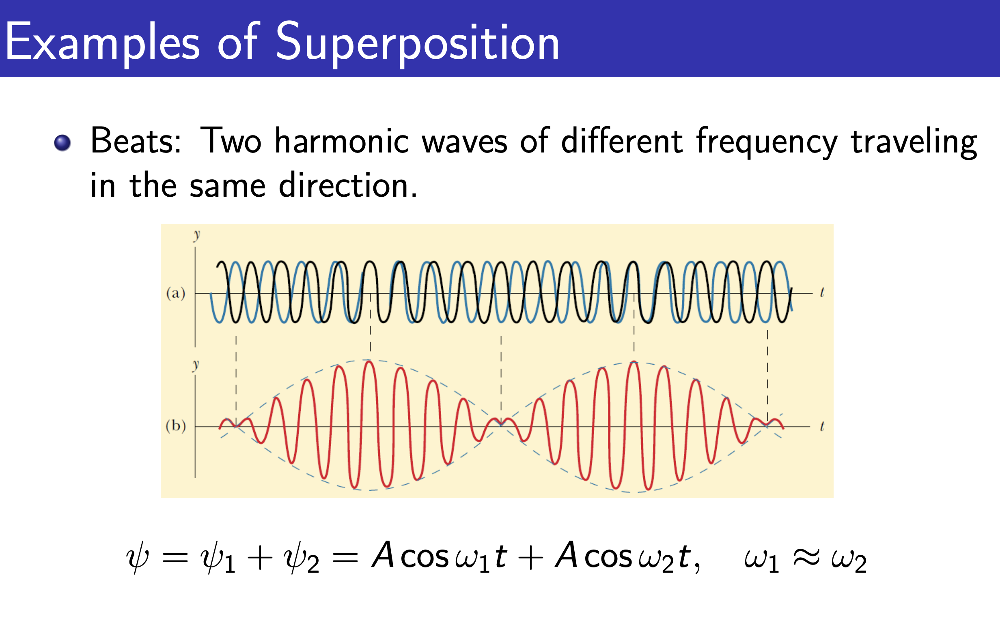

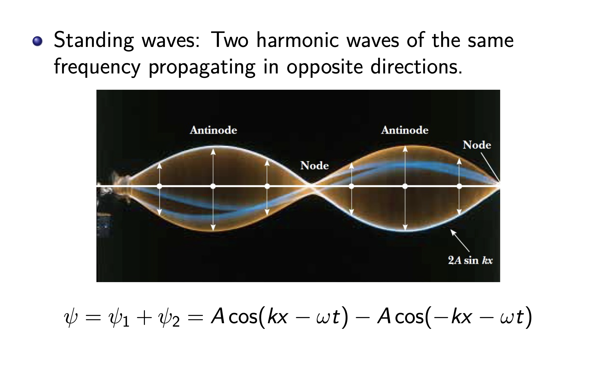

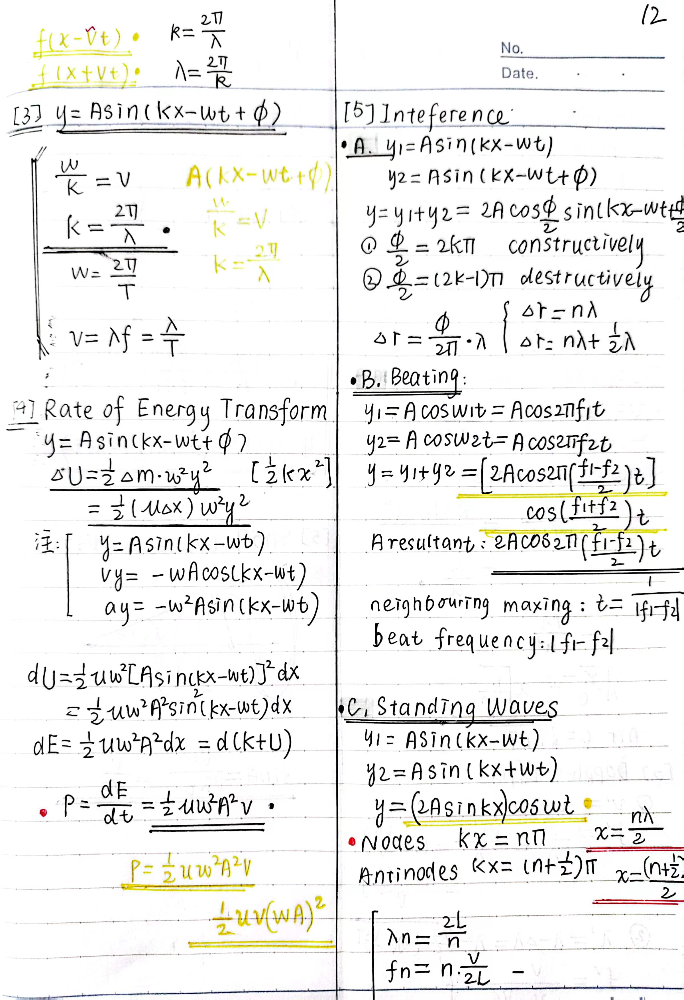

#### Trigonometry Formulas

$cos(α + β) = cos α cos β − sin α sin β$

$cos(α − β) = cos α cos β + sin α sin β$

$cos α + cos β = 2 cos \frac{(α + β)}{2} cos\frac{(α - β)}{2}$

$cos α − cos β = -2 sin \frac{(α + β)}{2} sin\frac{(α - β)}{2}$

#### The Algebraic Method of Adding Waves

$E_1 = E_{01}cos(α_1 − ωt)$

$E_2 = E_{02}cos(α_2 − ωt)$

$α_i = kx_i + φ_i$  with $x_i$ being the distance from the source $s_i$ of the waveto the point of observation.

 The linear combination of the waves is $E ≡ E_0 cos(α − ωt) = E_1 + E_2$

We get :

$E_0cosα=E_{01}cosα_1 +E_{02}cosα_2$

$E_0sinα=E_{01}sinα_1 +E_{02}sinα_2$

$\Rightarrow \vec{E_0}=\vec{E_{01}}+\vec{E_{02}}$

$E_0^2=E_{01}^2+E_{02}^2+2E_{01}E_{02}cos(\alpha_2-\alpha_1)$

The resultant intensity is not simply the sum of the component intensity

 there is an additional contribution $2E_{01}E_{02}cos(α_2 − α_1)$, known as the **interference term**.

The phase difference may arise from a difference in path length traversed by the two waves, as well as a difference in the initial phase angle $δ =\alpha_2-\alpha_1= \frac{2π}{\lambda}(x_2 −x_1)+(φ_2 −φ_1).$

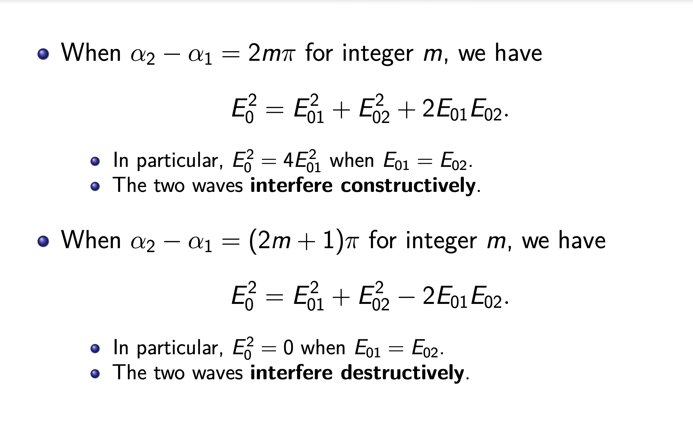

#### The Complex Method

It is often mathematically convenient to make use of the complex representation when dealing with the superposition of harmonic waves.

We now redo the calculation of adding two waves. 

The wave function $E_1 =E_{01}cos(α_1 −ωt)=E_{01}cos(kx_1 −ωt+φ_1)$ can be written as $\tilde{E}_1 = E_{01}e^{i(α_1−ωt)} = E_{01}e^{iα_1}e^{−iωt}$  if we are interested only in the real part.

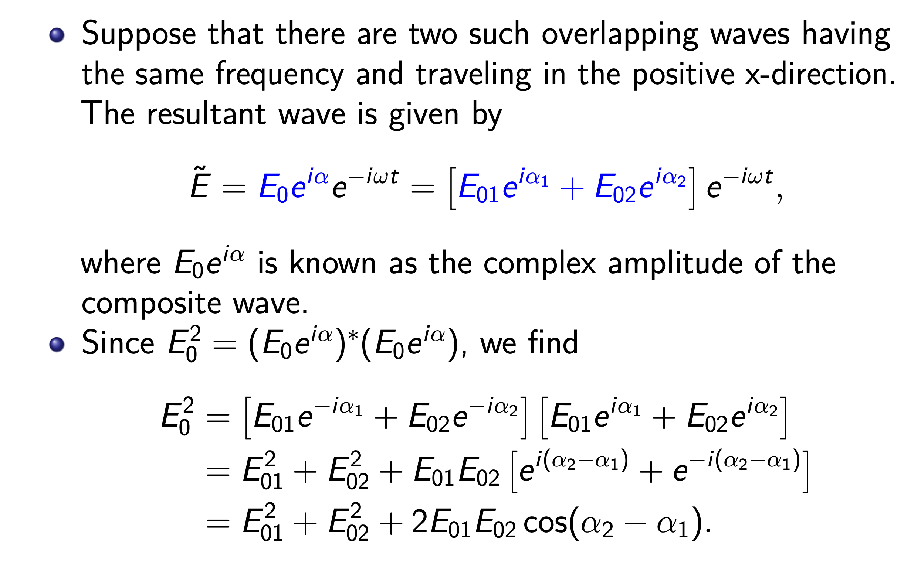

* erratum $E_0^2=(E_0e^{i\alpha})(E_0e^{-i\alpha})$

#### Phasor Addition

Now we discuss a graphical technique that uses vector additions instead of trigonometric additions.

We can map a wave, which has an amplitude and a phase, to a vector, known as a **phasor**, in a two-dimensional plane, such that

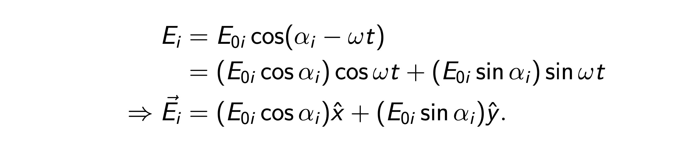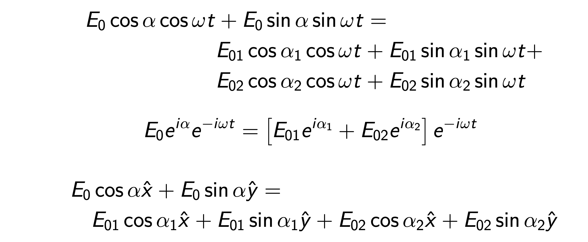

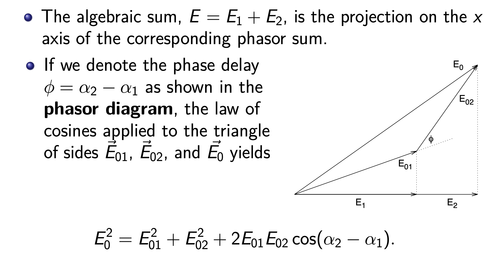

#### Summary

* The three methods all deal with addition in a two-dimensional space.
  * The phasor addition adds vectors (with x component and y component) in a two-dimensional real space.
  * The complex method is an addition of complex numbers (with real part and imaginary part) in a complex plane. 
  * The algebraic or trigonometric method is most complex. In fact, it is an addition of functions (linear combination of $cos ωt$ and $sin ωt$) in a two-dimensional Hilbert space, spanned by cos ωt and sin ωt.

#### Natural Light

* Now, one may think that light from two fine incandescent wires would interfere.
* This does not occur, because the light is emitted by vast numbers of atoms in the wires, acting randomly and independently for extremely short times — of the order of nanoseconds. The light is said to be **incoherent**.
* As a result, at any given point on the viewing screen, the interference between the waves from the two sources varies rapidly and randomly between fully constructive and fully destructive. The screen is seen as being uniformly illuminated (over the time scale of our observation).

### Conditions for Interference

* To observe the interference of the two waves describedabove, we need the following conditions.
  * Two beams must have (nearly) the same frequency ω. Otherwise, the phase difference is time-dependent. During the detection interval, the interference pattern will be averaged away.
  * The clearest pattern (with maximum contrast) exists when interfering waves have (nearly) equal amplitude. Why?
  * Initial phase difference can exist between sources, as long as it remains constant; the two sources are said to be **coherent**.

* Until the advant of laser, no two individual sources can maintain a constant relative phase long enough for an observable interference pattern.

#### Huygens’ Principle

Each point on a wavefront may be regarded as a source of waves expanding from that point.

If waves strike a barrier with a small opening, the waves may be seen to expand from the opening. Notice the wavelength is larger than the opening in this case.

#### Young’s Interference Experiment

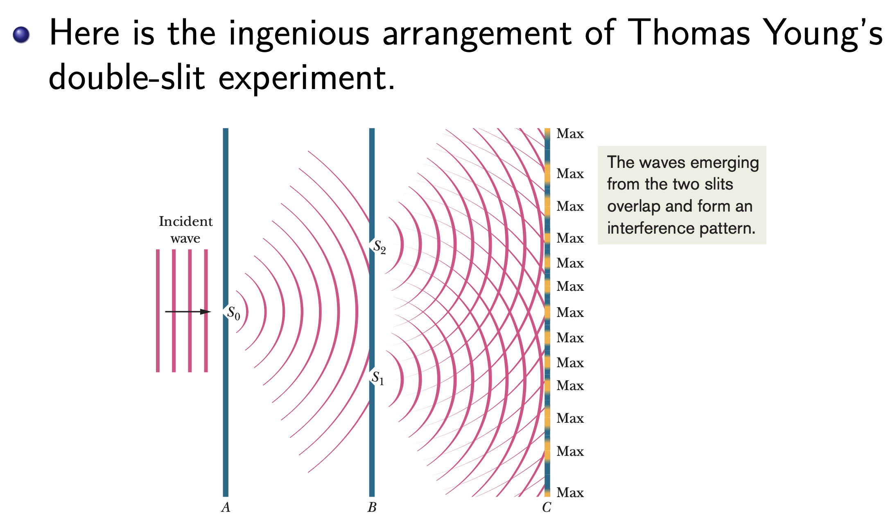

* The slit $S_0$ in screen A creates a spatially coherent beam that could identically illuminate slits $S_1$ and $S_2$ in screen B. 
  * **NOTE**：Spatial incoherence arises from the fact that a realistic source (like a lightbulb) contains widely spaced point sources that changes phase rapidly and randomly (due to the granular nature of the emission process).
* Nowadays screen A is no longer needed, and plane waves from a laser can provide the spatial coherence the experiment needs.
* Light waves produce fringes in a Young’s double-slit interference experiment, but what exactly determines the locations of the fringes?

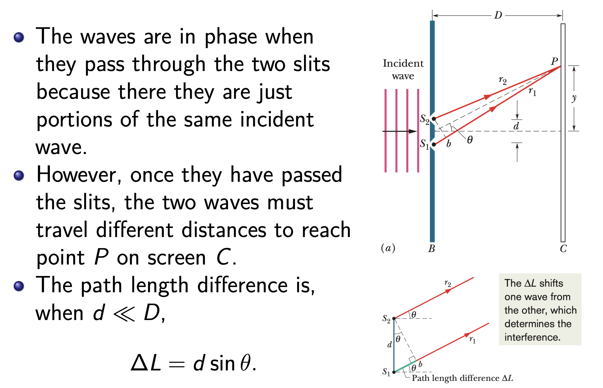

In other words, the light leaving the slits is in phase. 

However, the electric field components of these waves at point P are not in phase and vary with time as

$E_1 =E_0cos(kr_1 −ωt)=E_0cos(kL+β−ωt)$

$E_2 =E_0cos(kr_2 −ωt)=E_0cos(kL−β−ωt)$

Where the phase difference $[L = (r_1 + r_2)/2 = \sqrt{D^2+y^2}]$  $[δ_2 = 2β = k∆L = \frac{2πd}{\lambda} sinθ.]$

* The total intensity is thus given by $I ∝ 2E_{0}^2[1 + cos(2β)] \ or\ I = I_{max }cos^2β.$

Therefore, a bright fringe appears when $∆L = d sin θ = mλ$ where m is an integer.

On the other hand, a dark fringe appears when $∆L=dsinθ= (m+\frac{1}{2}) λ$ where m is an integer.

We can then find the angle θ to any fringe and thus use the values of m to label the fringes.

* For $\triangle \theta$ $d(sin\theta_1-sin\theta_2)=\frac{\lambda}{2} \Rightarrow dcos(\frac{\theta_1+\theta_2}{2})\triangle \theta=\frac{\lambda}{2}.  \Rightarrow  \triangle \theta = \frac{\lambda}{2dcos\theta}$  

#### Interference from Thin Films

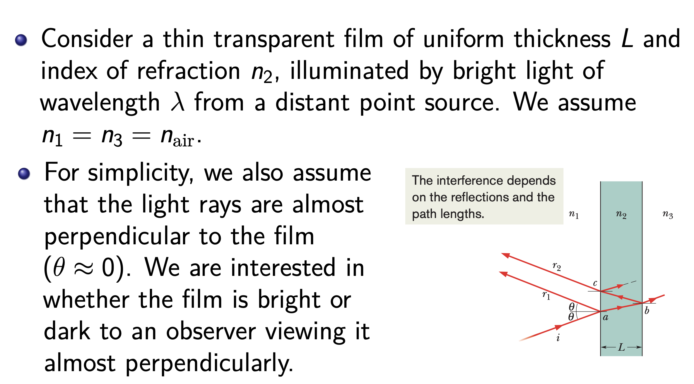

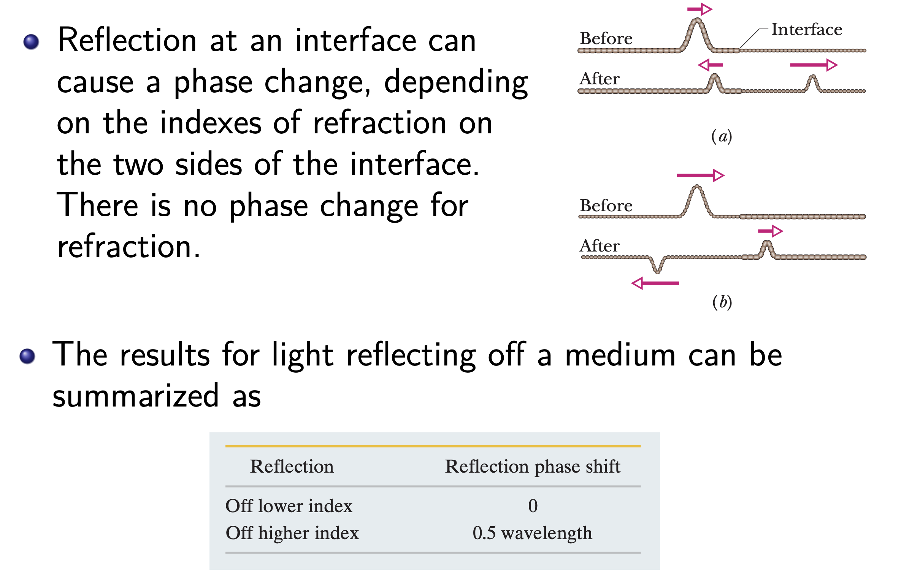

So, reflecting off higher index, ray $r_1$ has an additionalreflection phase shift 0.5 wavelength. There is no such shift for $r_2$

In addition, the light waves of rays $r_1$ and $r_2$ has a path difference $2L$, which occurs in index $n_2$.Notice that the wavelength in the medium is $λ_2=\frac{v_2}{f}=\frac{c}{n_2}\frac{1}{f}=\frac{\lambda}{n_2}$

Therefore, rays are in phase if $2L=(m+\frac{1}{2})\frac{\lambda}{n_2}$ , for integer m.

They produce an interference maximum and the nearby region on the film is bright to observers.

Similarly, if they are exactly out of phase $2L=m\frac{\lambda}{n_2}$ they produce an interference minimum and the nearby region is dark, even though it is illuminated. 

#### Negligible Film Thickness

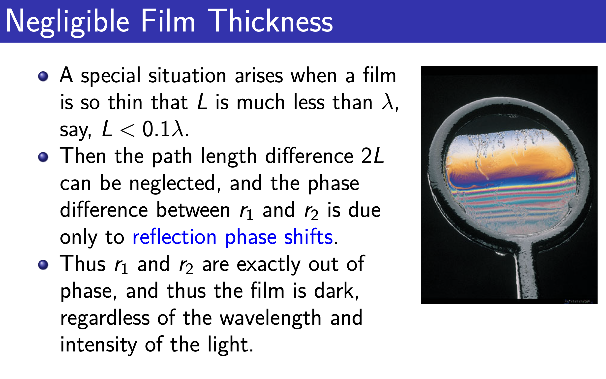

* See at the top **BLACK AREA** which is because that the film is just so thin 

#### Newton’s Rings

Newton’s rings are interference patterns formed by light incident on the thin film of air between a convex lens and a flat (or between two suitable lenses).

