

# Light

## Light as Electromagnetic Waves

### Plane Wave

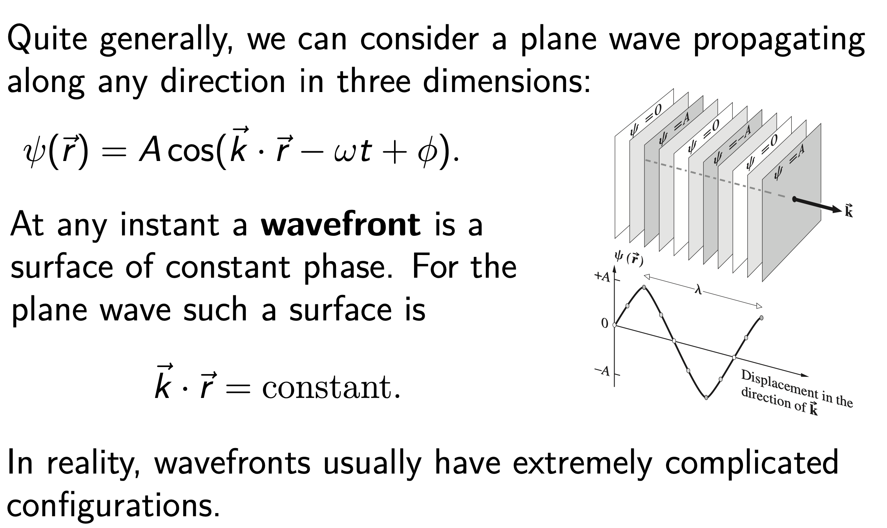

### Transmission of Light in Matter

* In dielectric materials, the electric field is altered by a factor $ε_r$ , the **relative permittivity** (also called the dielectric constant $κ$).

* In magnetic materials (therefore, not in glass or plastic), the magnetic field is altered by a factor $μ_r$ , the **relative permeability**.

Therefore, a light wave propagating through any substantive medium travels at a speed $v=\frac{c}{n}=\frac{1}{\sqrt{\epsilon_r\mu_r}}\frac{1}{\sqrt{\epsilon_o\mu_o}}$  where the **index of refraction** $n=\sqrt{\epsilon_r\mu_r}$

* The dispersion relation becomes $w=vk=ck/n$ hence$k=nk_0\ where\ k_0 \ is\ the\ wave\ number\ in\ vaccum$

### Reflection and Refraction

* **Law of reflection**: A reflected ray lies in the plane of incidence and has an angle of reflection equal to the angle of incidence (both relative to the normal)
* **Law of refraction**: A refracted ray lies in the plane of incidence and has an angle of refraction $θ_2$ that is related to the angle of incidence $θ_1$ by $n_2sin\theta_2=n_1sin\theta_1$  (**Snell’s law**.)

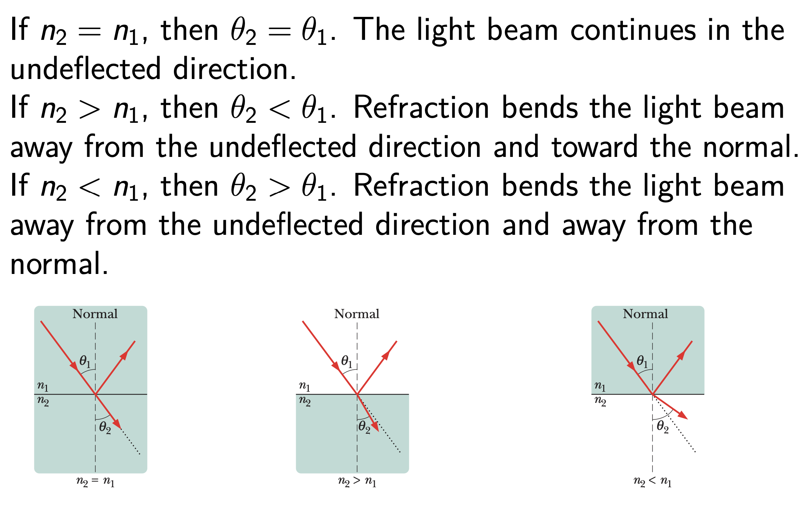

#### Total Internal Reflection

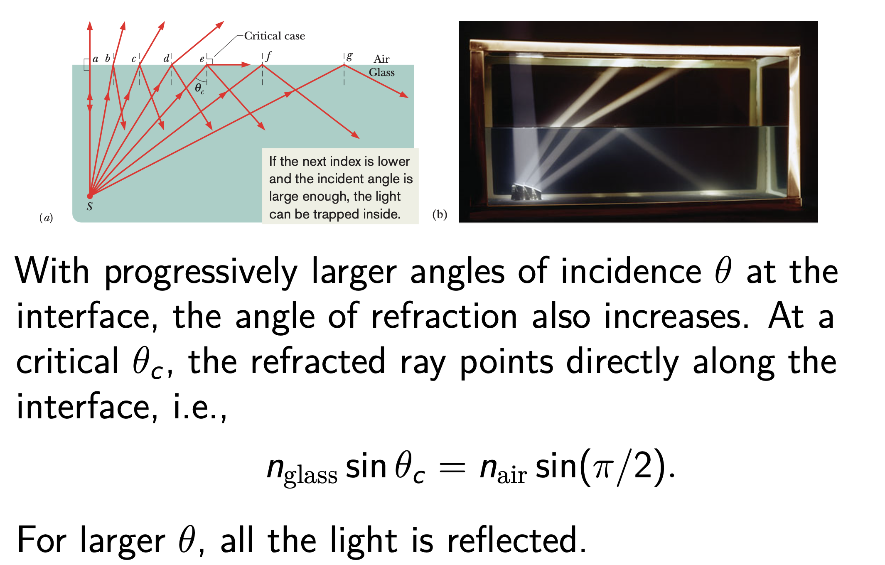

#### Fermat’s Principle

* The actual path between two points taken by a beam of light is the one that is traversed in the least time.
* For a homogeneous medium the principle reduces to the law of the rectilinearity of a ray of light (in accordance with the axiom of geometry that a straight line is the shortest distance between two points).

$Derivation$

* Reflection(simple ignore)
* Refraction

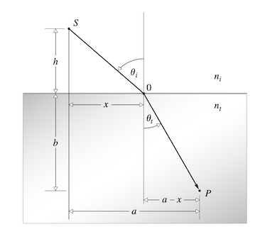

$t(x)=\frac{\bar{SO}}{v_i}+\frac{\bar{OP}}{v_t}=\frac{\sqrt{x^2+h^2}}{\frac{c}{n_i}}+\frac{\sqrt{(a-x)^2+b^2}}{\frac{c}{n_t}}$

* To minimize $t(x)$ with respect to variations in x, we set $dt/dx = 0$

$\frac{dt}{dx}=\frac{n_i}{c}\frac{x}{\bar{SO}}-\frac{n_t}{c}\frac{a-x}{\bar{OP}}=0$

Thus $n_isin\theta_i=n_tsin\theta_t$

### Huygens’ Principle

**Huygens’ principle** is: All points on a wavefront serve as point sources of spherical secondary wavelets. After a time $t$, the new position of the wavefront will be that of a surface tangent to these secondary wavelets.

* Reflection

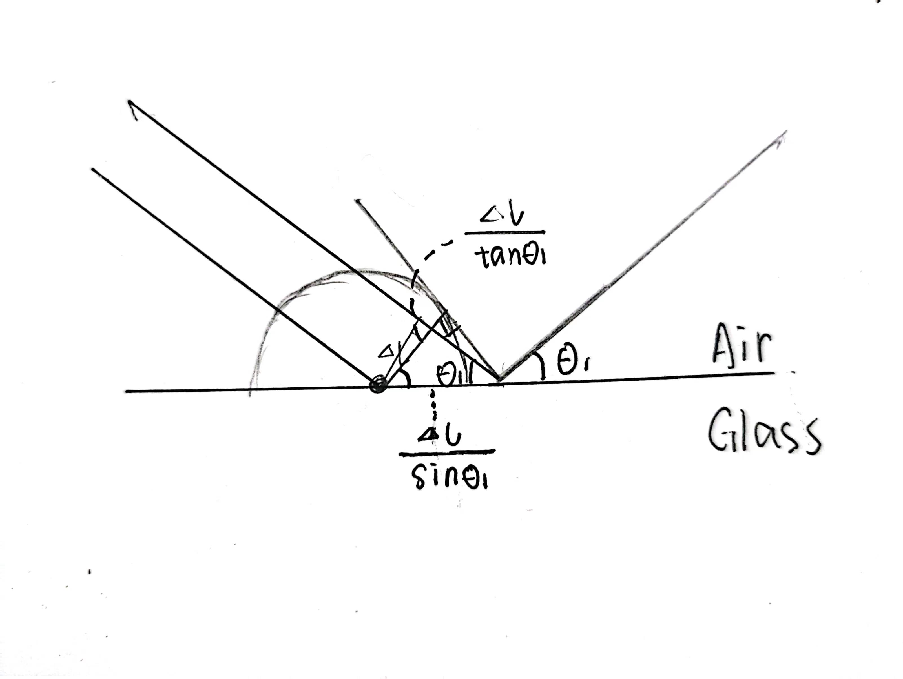

Thus , We get **Law of reflection**.

* Refraction

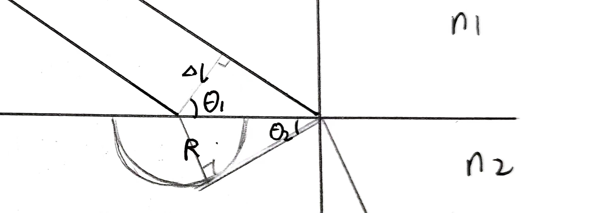

$\triangle t = \frac{\triangle l\ tan\theta_1}{v_1}$

$R=v_2 \cdot \triangle t$

$v_i=\frac{c}{n_i}$

$\Rightarrow R=\frac{n_1}{n_2}\triangle l \cdot tan\theta_1$

$sin\theta_2=\frac{R}{\frac{\triangle l}{cons\theta_1}}$

$\Rightarrow n_1sin\theta_1=n_2sin\theta_2$

Thus We get **Law of refraction**. 

### The Electromagnetic Approach

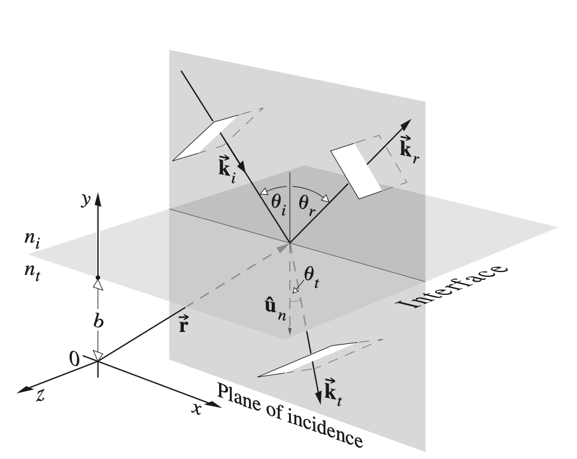

$\vec{E}_i = \vec{E}_{0i}cos(\vec{k}_i \cdot\vec{r}−ω_it)$

$\vec{E}_r = \vec{E}_{0r}cos(\vec{k}_r \cdot\vec{r}−ω_rt+\phi_r)$

$\vec{E}_t = \vec{E}_{0t}cos(\vec{k}_t \cdot\vec{r}−ω_tt+\phi_t)$

* Above the surface : $\vec{E}=\vec{E_i}+\vec{E_r}$
* Below the surface $\vec{E}=\vec{E_t}$
* For simplicity, we consider the case that $\vec{E_{0i}}$$\vec{E_{0r}}\ \vec{E_{0t}}$  are constant in time 

$Boundary\ conditions$

* Draw a narrow closed path C that runs parallel to the interface inside bot media. According to the Faraday's Induction Law,we have $\oint\vec{E}\cdot d\vec{s}=-\frac{d\Phi_B}{dt}$

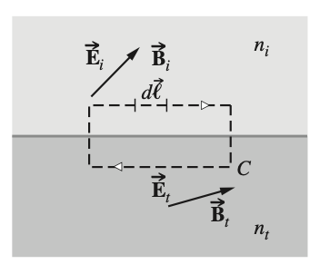

* The loop can be made so narrow such that there is no flux through C.
* Define $\hat{u}_n$to be the unit vector normal to the interface
* The boundary condition leads to :**$(\vec{E}_i+\vec{E}_r-\vec{E}_t)$perpendicular to $\vec{l}$  thus parallel to  $\vec{u_n}$ **

$\hat{u}_n \times (\vec{E}_i+\vec{E}_r)-\hat{u}_n \times \vec{E}_t=0$  which is satisfied for all values of time and at any point on the interface.

Thus, we have :

 $\begin{align*}&\hat{u}_n \times \vec{E}_{0i}cos(\vec{k}_i \cdot\vec{r}−ω_it)+\hat{u}_n \times \vec{E}_{0r}cos(\vec{k}_r \cdot\vec{r}−ω_rt+\phi_r)\\ &= \hat{u}_n \times  \vec{E}_{0t}cos(\vec{k}_t \cdot\vec{r}−ω_tt+\phi_t) \end{align*}$

* This can only be satisfied if $ω_i = ω_r = ω_t$, which means the charged particles within the media are undergoing forced oscillations at the frequency of the incident wave.
*    Furthermore, for any  $\vec{r}$ terminating on the interface

$(\vec{k_i}\cdot \vec{r})|_{y=b}=(\vec{k_r}\cdot \vec{r}+\phi_r)|_{y=b}=(\vec{k_t}\cdot \vec{r}+\phi_t)|_{y=b}$

Thus,We have $(\vec{k_i}-\vec{k_r})|_{y=b}=\phi_r$ or $(\vec{k}_i-\vec{k_r})\cdot(\vec{r_1}-\vec{r_2})=0$ for any pair of $\vec{r_1}$ and $\vec{r_2}$ terminating on the interface.

For $\hat{u_n}\cdot (\vec{r_1}-\vec{r_2})=0 $,we know $(\vec{k_i}-\vec{k_r})$ is parallel to $\hat{u_n}$ or $k_isin\theta_i=k_rsin\theta_r$「**REFLECTION LAW**」

Since the incident and reflected waves are in the same medium, $k_i = k_r$ , so, finally, $θ_i = θ_r$ (the law of reflection).

* Similarly $(\vec{k_i}-\vec{k_t})$ is also parallel to $\hat{u_n}$  we have:

$\vec{k_i}\times\hat{u_n}=\vec{k_t}\times\hat{u_n}$

Or.  $n_i(\hat{k_i}\times\hat{u_n})=n_t(\hat{k_t}\times\hat{u_n})$「**REFRACTION LAW**」

* Note that the law of reflection and the law of refraction only rely on the phase relationship that exists among the phases of $\vec{E}_{0i}$, $\vec{E}_{0r}$ and $\vec{E}_{0t}$  at the boundary.

* There is still an interdependence shared by the amplitudes $\vec{E}_{0i}$, $\vec{E}_{0r}$ and $\vec{E}_{0t}$. The additional constraint can be used to calculate the amplitude of the reflected wave and the transmitted wave (the Fresnel equations). This will lead to the phenomenon of polarization by reflection (to be discussed in the lecture on polarization).

## Geometrical Optics
### Spherical Mirrors
* Store surveillance mirrors are usually convex to take advantage of the increase in the field of view — more of the store can then be seen with a single mirror.
* Makeup mirrors and shaving mirrors are concave — they produce a larger image of a face.
* For mirrors of both types, the focal length f is related to the radius of curvature r of the mirror by $f=r/2$ where r is positive for a concave mirror and negative for a convex mirror.

#### Focal Points of Spherical Mirrors

$Proof$

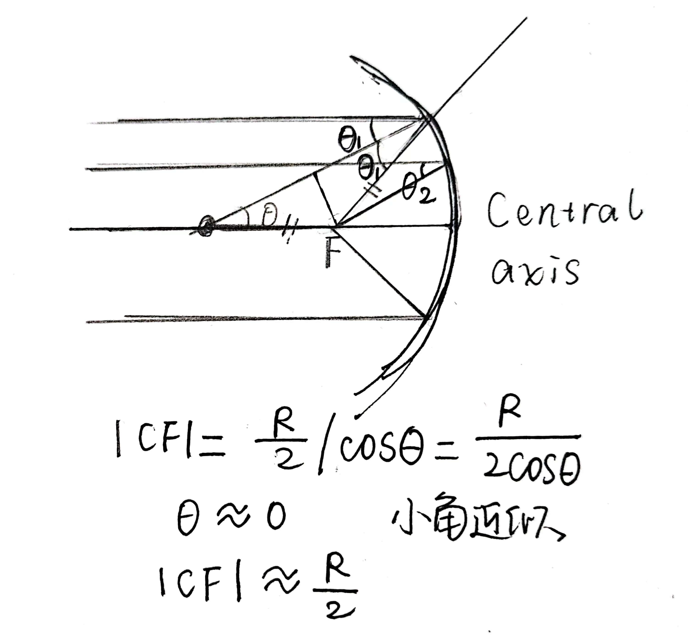

#### Images from Spherical Mirrors

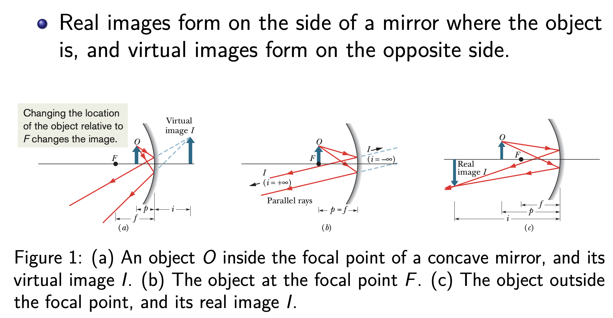

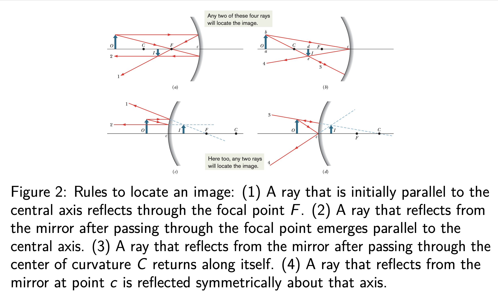

$\frac{1}{p}+\frac{1}{i}=\frac{1}{f}$

$Proof$

* We assume small angles (but for clarity the rays are drawn with exaggerated angles). 

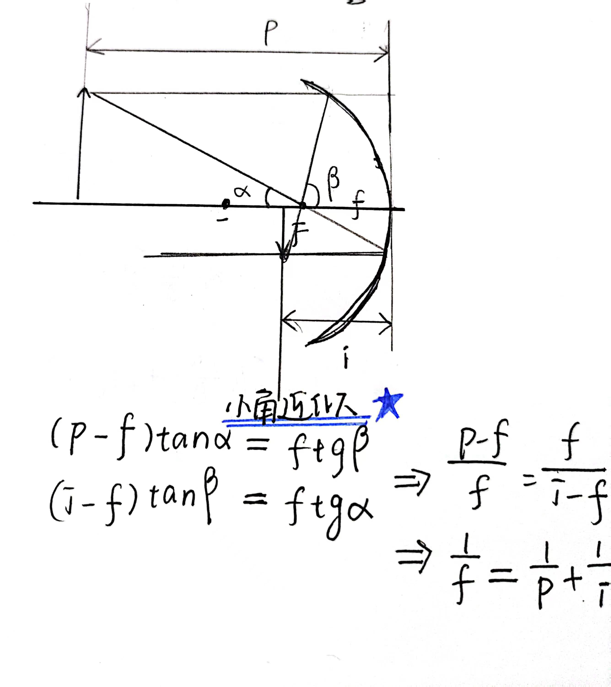

* Clearly, When $p>f$  $i$ is positive, indictaing a real image.

  When $p<f$  $i$ is negative,indicating an imaginary image.

* $-\frac{i}{p}$ -- scaling factor

   When $i$ > 0 : an upsidedown real image

  When  $i$ <0 : an erect imaginary image

$Proof$

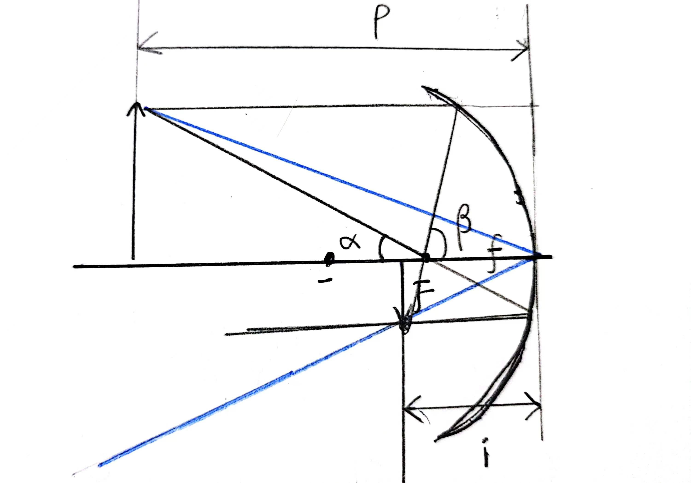

 

### Spherical Refraction

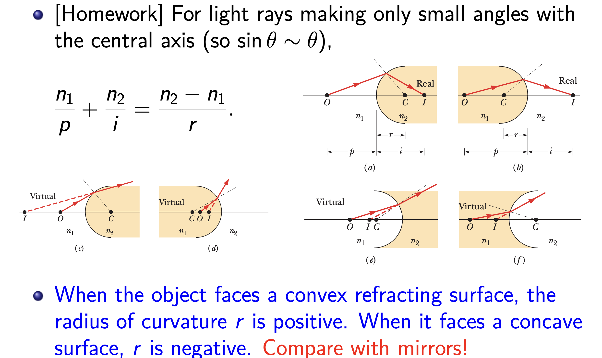  

$Proof$

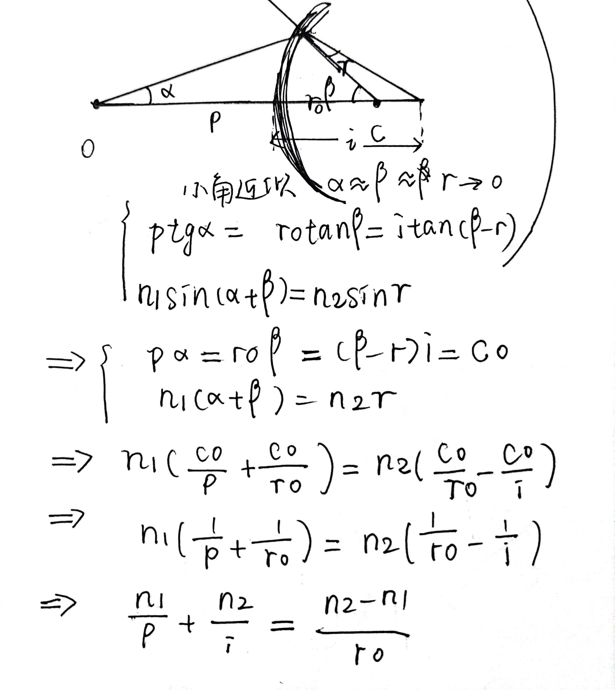

* Quite the same when convex(only $i$ & $r_0$ Are negative)

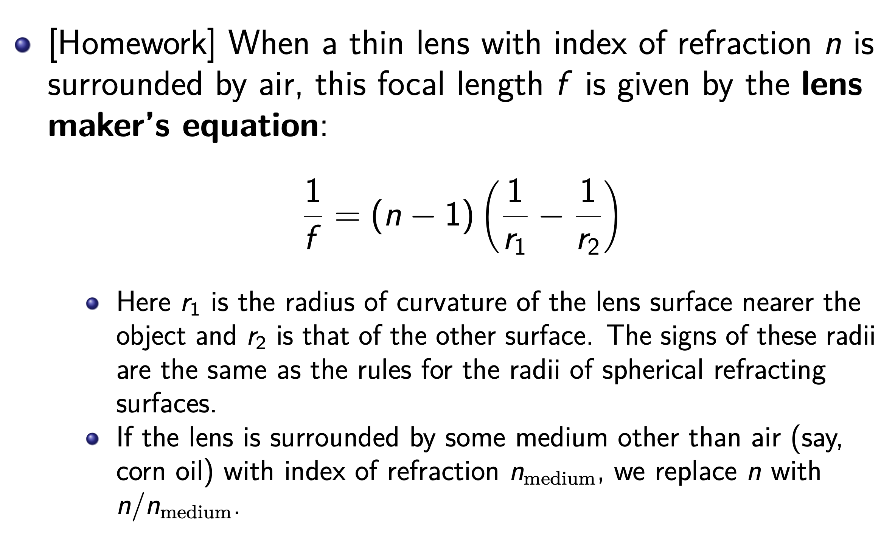

> Thus $f$ for convex lens is positive , for concave lens is negative

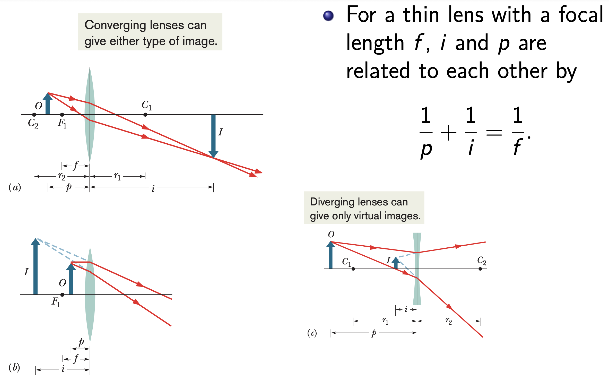

$Proof$

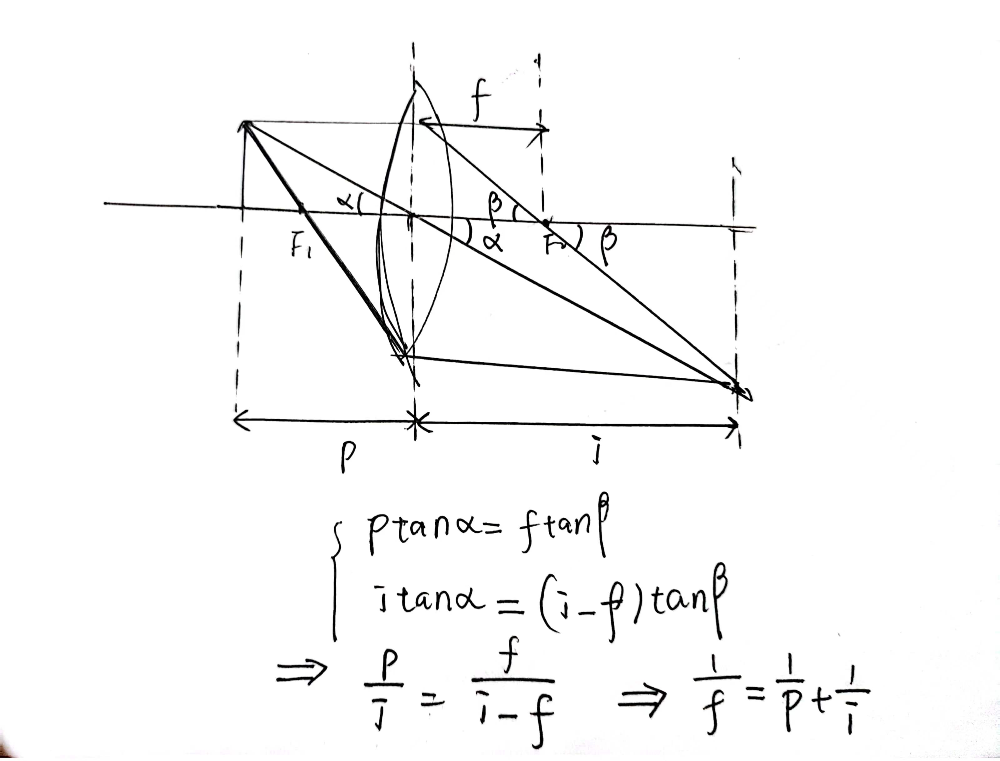

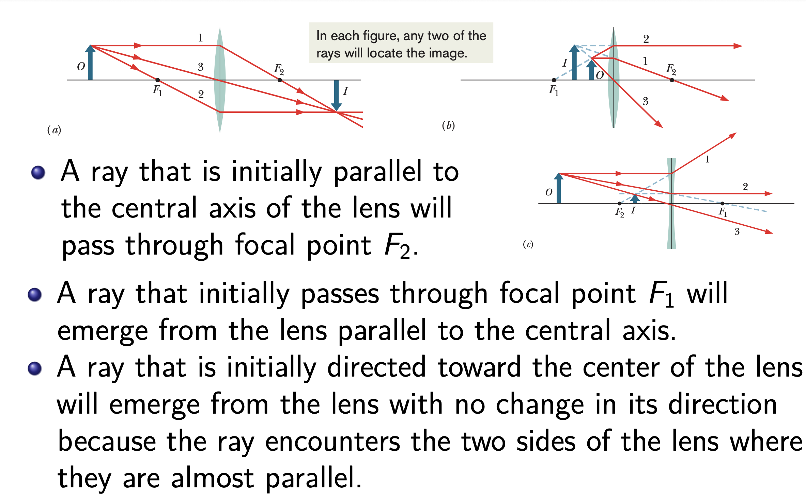 

It can also be applied for any number of lenses. 

The overall (or net) lateral magnification M of a system of lenses (or lenses and a mirror) is the product of the individual lateral magnifications as given by $m = −i/p$.

#### Application

The normal human eye can focus a sharp image of an object on the retina if the object is located beyond the **near point** (∼ 25 cm from the eye).

To see better, we want to generate an magnified image of an object at the near point, instead of putting the object there.

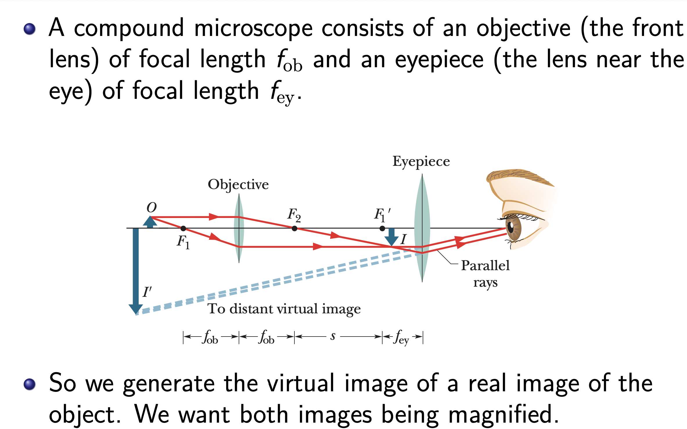

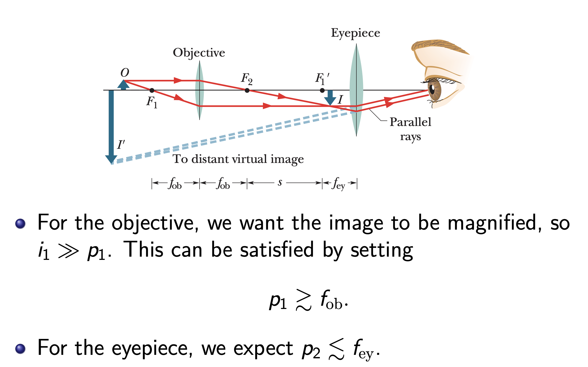

* Explain eg $p2$ : $\frac{1}{p_2}+\frac{1}{i_2}=\frac{1}{f}$ but $i_2<0$,Thus if we want $|i_2|$to be large ,$p_2$ has to be relatively large, but also $p_2$has to be smaller than $f_{ey}$ , thus $p2 <\approx f_{ey}$.

* This leaves the distance between the two lenses $f_{ob} + s + f_{ey}$ the only parameter to tune. The longer the distance, the larger the magnification

  $M = m_1m_2 \approx -\frac{f_{ob}+s}{f_{ob}}\frac{25}{f_{ey}}$ 

* We can make $s ≫ fob$, so $M ≈ −(s/f_{ob})(25 cm/f_{ey})$  (s still limited by the practical sizes of microscope)

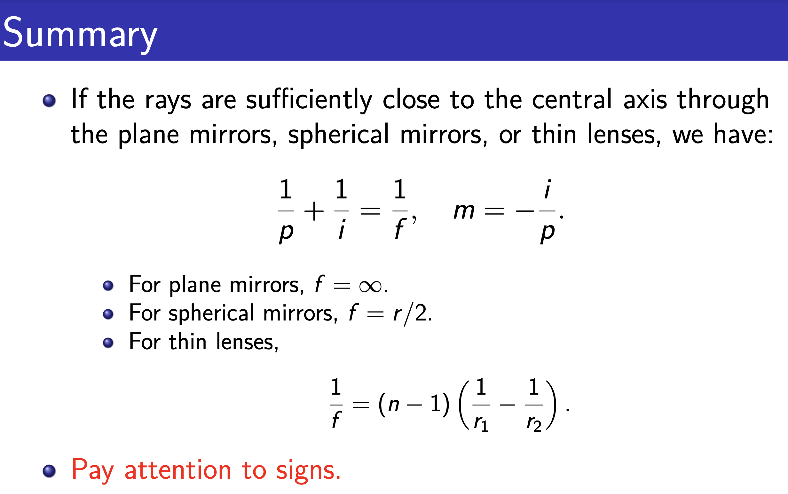

