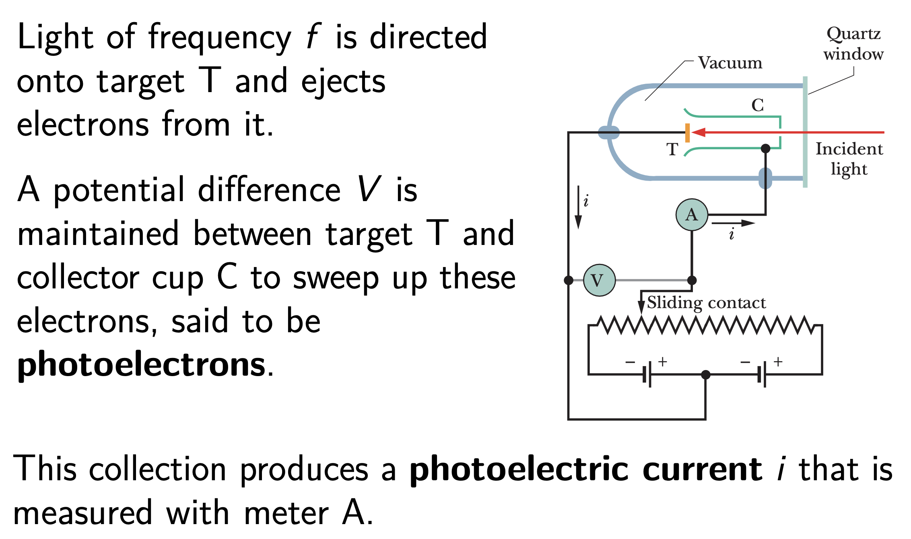
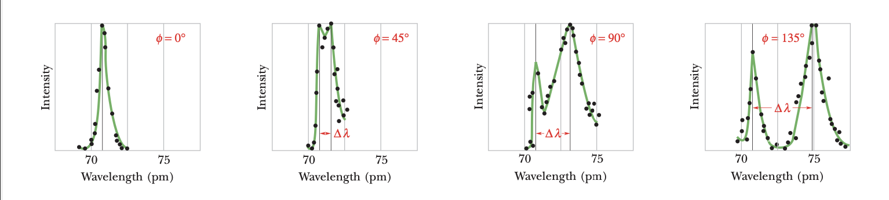
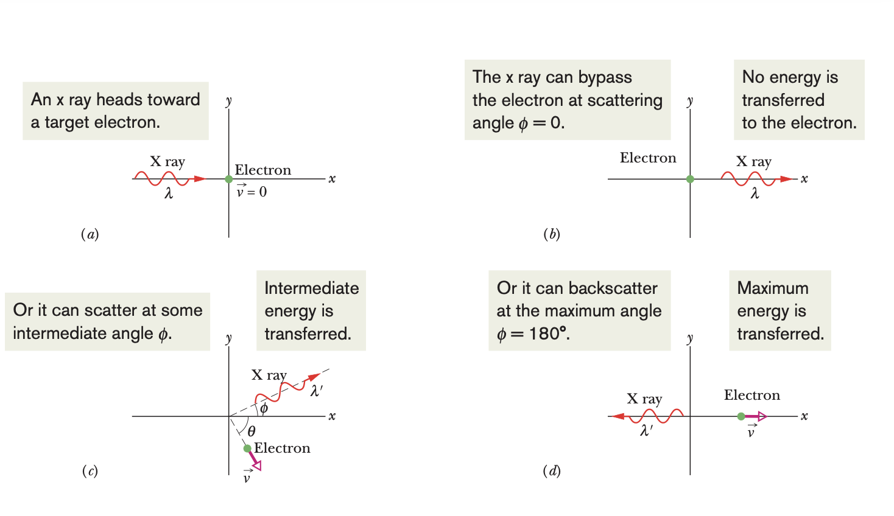
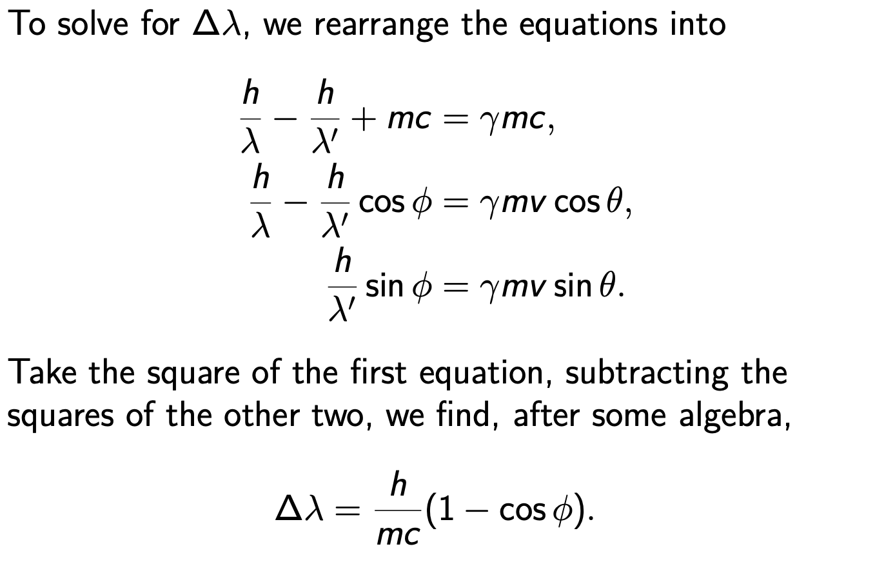
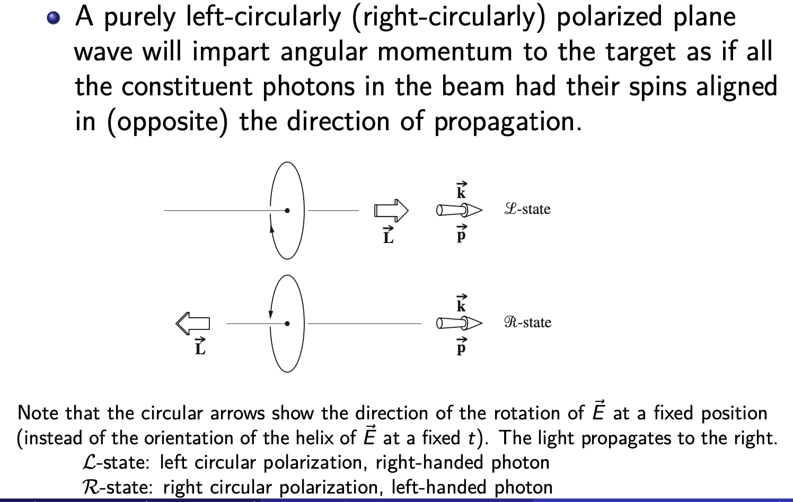
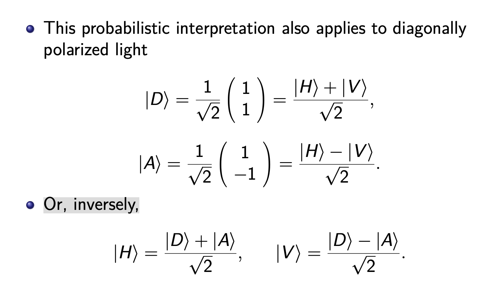
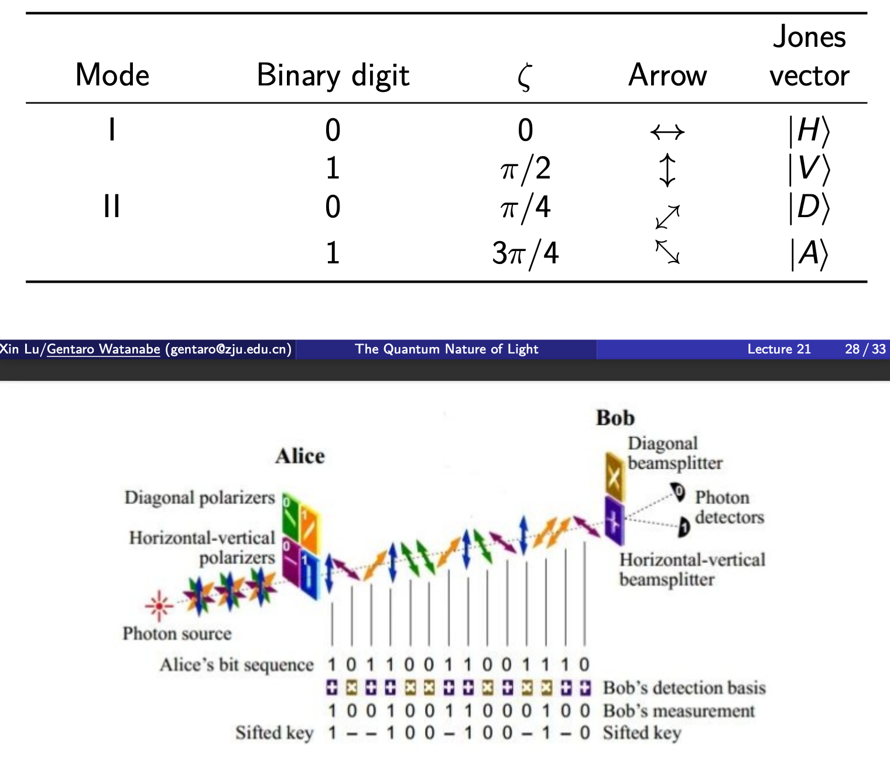

# The Quantum Nature of Light

## The Photoelectric Effect

Experiments show that if you direct a beam of light of short enough wavelength onto a clean metal surface, the light will eject the electrons from the surface.

We adjust the potential difference V by moving the sliding contact so that the potential of collector C is slightly negative with respect to target T. 

At the stopping potential $V = V_{stop}$, the reading of meter A has just dropped to zero, the most energetic ejected electrons are turned back **just before reaching the collector**.

### Puzzle 1 for Classical Physics

Measurements show that for light of a given frequency, $K_{max}$ does **not** depend on the **intensity** of the light source.

**However**,in the classical theory, however, if we increase the amplitude of the wave and its oscillating electric field, the electron should get a more energetic “kick”.

??? "Why Strange?"
    1. The incident light is a sinusoidally oscillating electromagnetic wave. 
        
        An electron in the target should oscillate sinusoidally due to the oscillating electric force on it from the wave’s electric field.
        
        If the amplitude of the electron’s oscillation is great enough, the electron should break free of the target’s surface – that is, be ejected from the target.

### Puzzle 2 for Classical Physics

Experiments show that the photoelectric effect does not occur if the **frequency** is below a certain cutoff value $f_0$ ,no matter how intense the incident light is.

### Sum

In the classical theory, light is viewed as an **electromagnetic wave**.

One expects that no matter how low the frequency, electrons can always be ejected by light if they are supplied with enough energy — that is, if one uses a light source that is bright enough.

In experiments, however, electrons can escape only if the light **frequency** exceeds a certain value, and the escaping electron’s kinetic energy is greater for a greater light frequency.

**Einstein** proposed that electromagnetic radiation (or simply light) is quantized and exists in elementary amounts (quanta) that we now call **photons**.
 According to his proposal, the quantum of a light wave of frequency f has the energy $E = hf = \bar{h}ω$, where $h = 2π\bar{h} = 6.63 × 10^{−34} J·s$ is the **Planck constant**, and ω is the angular frequency.
 The total energy of a light wave of frequency f must be an integer multiple of $hf$ , with the smallest amount being $hf$ ,the energy of **a single photon**.

Einstein further proposed that when light is **absorbed or emitted** by an object (matter), the absorption or emission event occurs **in the atoms of the object**.

In the absorption event, the energy $hf$ of one photon is transferred from the light to the atom; **the photon vanishes and the atom is said to absorb it.**

For an object consisting of many atoms, there can be many photon absorptions (such as with sunglasses) or photon emissions (such as with lamps). 

In classical physics, such events involve so much light that we had **no need** of quantum physics.

## Photon, the Quantum of Light

**Back to the Photoelectric Effect**，the electrons within the target are held by electric forces. To just escape from the target, an electron must pick up a certain minimum energy $W$ , where $W$ is a property of the target material called its **work function**.

The energy that can be transferred from the incident light to an electron in the target is that of a single photon $hf$ . According the conservation of energy, the kinetic energy K acquired by the electron satisfies. $hf = K + W$ .

In the most favorable circumstance, the electron can escape through the surface without losing any of this kinetic energy in the process. (i.e. $K_{max} = hf − W$ ).

 Increasing the light intensity increases the number of photons in the light, not the photon energy, so the energy transferred to the kinetic energy of an electron is also unchanged. This solves puzzle #1.

If the energy hf transferred to an electron by a photon exceeds the work function of the material (if $hf > W$ ), the electron can escape the target. If the energy transferred does not exceed the work function (that is, if $hf < W$ ), the electron cannot escape. This solves puzzle #2.

## Photon Momentum and Compton Scattering

A photon, or a light quantum, is a particle with energy $E = hf$ . It has a velocity of the speed of light c, but no mass (m = 0).
In 1916, Einstein extended his concept of photons by proposing that **a quantum** of light has **linear momentum**. 

According to the theory of relativity, $E^2 − c^2p^2 = m^2c^4 = 0$  the magnitude of the photon momentum is. $p = \frac{hf}{c} = \frac{h}{\lambda} = \bar{h}k$

### Compton Scattering

When a photon interacts with matter, energy and momentum are transferred, as if there were a collision between the photon and matter in the classical sense.

To demonstrate, Arthur Compton measured the wavelengths and intensities of a beam of X rays that were scattered  in various directions from a carbon target.

Compton found that although there is only a single wavelength $(λ = 71.1 pm)$ in the incident X-ray beam, the scattered X rays contain a range of wavelengths with **two prominent intensity peaks**.

* One peak is centered about the incident wavelength $λ$.
* The other is centered about a wavelength $λ^′$ that is longer than $λ$ by an amount $∆λ$, the **Compton shift**.
*  The value of the Compton shift varies with the angle at which the scattered X rays are detected and is **greater for a greater angle**

In classical physics, an **electron in the carbon target** undergoes **forced oscillations** in the sinusoidally oscillating electromagnetic wave. Hence, the electron should send out scattered waves at the same frequency. 

With **quantum physics** and relativity, the energy and momentum conservation becomes **「Important」**

$\begin{align*} \frac{hc}{\lambda}+mc^2&=\frac{hc}{\lambda^{'}}+\gamma mc^2 \ (energy) \\ \frac{h}{\lambda}&=\frac{h}{\lambda'}cos\phi+\gamma mvcos\theta\ (momentun\ in\ x) \\ 0&=\frac{h}{\lambda'}sin\phi-\gamma mvcos\theta\ (momentun\ in\ y)\end{align*}$

where $\gamma =\sqrt{\frac{1}{1-\frac{v^2}{c^2}}}$

The quantity $h/mc$ is a constant called the **Compton wavelength**. Its value depends on the **mass m of the particle** from which the X rays scatter.

* The Compton wavelength of a particle corresponds to the wavelength of a photon whose energy is the same as the rest mass energy of the particle.

Strictly speaking, the particle can be a loosely boundelectron, or a carbon atom (with tightly bound electrons). 

* For an electron, the Compton wavelength is $\frac{h}{mc}= \frac{hc}{mc^2} =\frac{12400eV·Å}{511000eV}=2.426pm$

* For a carbon atom, the Compton wavelength is $12 × m_u /m_e ≈ 12 × 1836 ≈ 22, 000$ times smaller and, hence, can be **neglected**. Therefore, there is a peak at the incident wavelength at any angle.

### Appendix ex

* We can derive that ：$tan\theta=\frac{sin\phi}{\frac{\lambda}{\lambda^{'}}-cos\phi}$ where $\theta$ is the scattering angle of the say, electrons.

## Angular Momentum of Photons and Polarization

According to the quantum-mechanical description, a photon also has an intrinsic **spin angular momentum**, which is either $−\bar{h}$ or $+\bar{h}$, where the signs indicate right- or left-handedness, respectively.

Whenever a charged particle emits or absorbs electromagnetic radiation, along with changes in its energy and linear momentum, it will undergo a change of $±\bar{h}$  in its **angular momentum**.

 The energy transferred to a target by an incident monochromatic electromagnetic wave can be envisaged as being transported in the form of a stream of identical photons.

A beam of linearly polarized light will interact with matter as if it were composed, at that instant, of **equal numbers** of right- and left-handed photons.
 There is a subtle point. Strictly speaking, we cannot say that the beam is actually made up of precisely equal amounts of well-defined right- and left-handed photons; **the photons are all identical**.

Rather, each individual photon exists in either spin state with equal likelihood.

$|H⟩ =\frac{|R⟩+|L⟩}{\sqrt{2}} = \frac{1}{\sqrt{2}}[\frac{1}{\sqrt{2}}\begin{pmatrix}1\\-i\end{pmatrix} +\frac{1}{\sqrt{2}}\begin{pmatrix}1\\i\end{pmatrix}]$

## Appendix 21A: Quantum Key Distribution

**Goal**: To send encrypted messages that cannot be understood by anyone but the designated recipient. 

Message is a whole number $m$ (e.g., represented by the dots and dashes of Morse code as ones and zeros.)

An encryption is a function $f : m → f (m)$, agreed on between Alice (sender) and Bob (recipient) but unknown to Eve (a possible eavesdropper).

Problem: If the same encryption is used many times, Eve can usually deduce the nature of the encryption and read the messages (by, e.g., frequency analysis).

**Classical solution**: Let the encryption depend on a frequently **changed key**, which can be regarded as another whole number $k$. The encrypted message is now $f (m, k)$. 
**New problem**: Alice and Bob must frequently exchange messages to establish new keys, and these new messages too may be intercepted by Eve.
**Quantum solution**: It is not possible to measure any quantity without changing an unknown state vector to one in which that quantity has some definite value.

### The BB84 Protocol (Bennet & Brassard, 1984)

A protocol to establish a secured communication channel. More concretely, a scheme to enables us to detect the presence of an eavesdropper using polarized photons.

* Alice sends the key to Bob as a sequence of linearly polarized photons with polarization vectors of the form $\vec{e} = (cos ζ , sin ζ )$, where $ζ$ are various angles.
* Alice represents ones and zeros by values of ζ in either one of the two modes.
* Finally, Alice and Bob communicate over a classical, possibly public channel to compare their choices of basis for each bit. The bits for which Alice and Bob have used different bases are discarded.

**What Can Eve Do?**

What Eve really wants is that Alice and Bob should establish a key that Eve knows, so that she can secretly read the messages sent from Alice to Bob.

So Eve can intercept the photons sent by Alice, measure their polarizations, and then send substitute photons with these polarizations on to Bob.

But Eve, like Bob, does not know the mode that Alice is using in choosing each photon polarization. So there is only a 50% chance that the substitute photon sent by Eve to Bob will have the same polarization that it had when it was sent by Alice.

**Can Alice and Bob Detect Eve?**

When Alice and Bob compare notes, they identity the photons that had been sent when Alice and Bob had by chance being used the same modes.

Eve too may learn this information, but by then it is too late. **There is only a 50% chance that Eve had used the same mode that Alice (and Bob) had used.**「测不准」

If Eve had used a different mode, there is still a 50% chance that Bob would have observed the same polarization that had been sent by Alice.

Overall, Alice and Bob had 25% of the binary digits in the key that do not match; thus, they can detect Eve’s intervention by comparing a part of the key.

> 1. **25%的不匹配概率：** 当Eve使用了不同的模式进行测量时，有50%的概率Bob会观察到与Alice发送时相同的偏振。因此，总体上，Alice和Bob的密钥中有25%的二进制位不匹配，因为在一半的情况下Eve可能截获了相同的模式，但另一半的情况下Bob观察到的偏振与Alice发送的不同。

* Why do we call this scheme **quantum** key distribution? 

  After all, polarization is a classical concept. Which part of the BB84 depends crucially on the quantum concept and can be defeated in the classical world?

**Quantum no-cloning theorem**: It is impossible to create an identical copy of an arbitrary unknown quantum state. Where is it needed?

* Take-home message: Eve will have success in preventing the construction of a key, but not in secretly learning a key that will be used by Alice and Bob. 
* 测量的不确定性使得Eve无法获取完整的密钥信息，而且任何她的干扰都会被Alice和Bob察觉到。

## 

