## The Magnetic Field

* $\vec{F}=q\vec{v}\times \vec{B}$
* Right-hand rule 

### Circulating Charges

If the velocity of a charged particle has a component parallel to the uniform magnetic field, such that : 

$v_{||}=vcos\phi$

$v_{⊥}=vsin\phi$

* The perpendicular component $v_{⊥}$ determines the radius of the helix $r=\frac{mv_{⊥}}{|q|B}$
* The parallel component $v_{||}$determines the pitch p of the helix ,that is,the distance between adjacent turns.

### The Hall Effect 

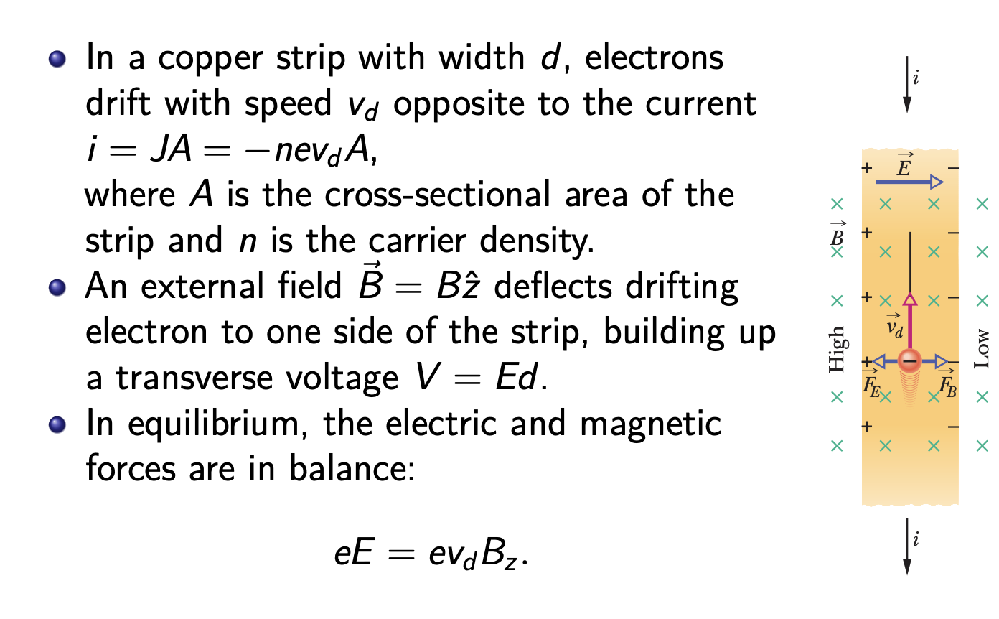

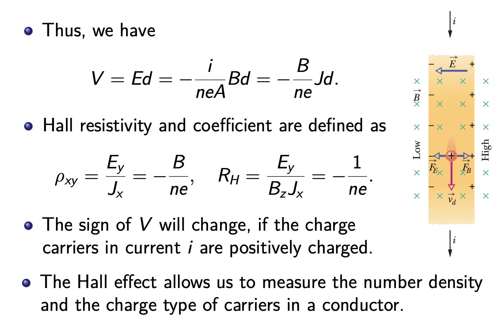

### Current-Carrying Wire

 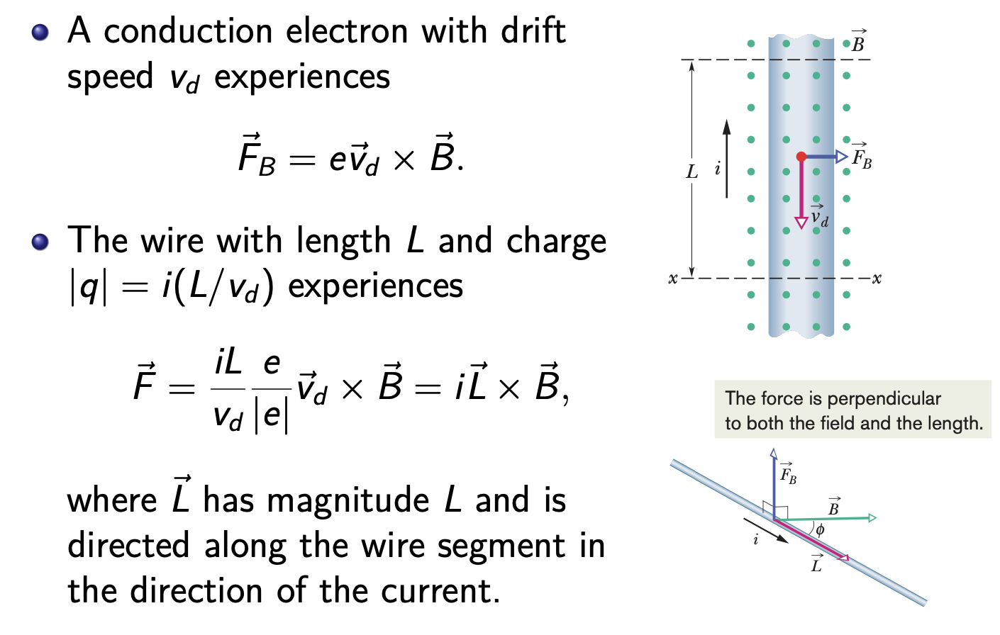

* If a wire is not straight or the field is not uniform, we can imagine the wire broken up into small straight segments and, in the differential limit, we can write $d\vec{F}=id\vec{L}\times\vec{B}$

### Torque on a Current Loop

 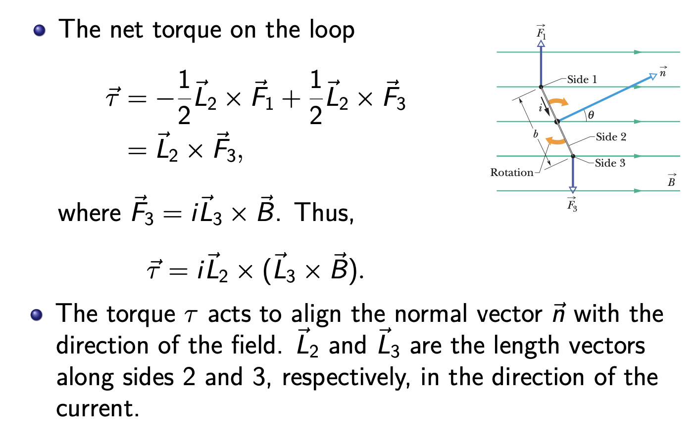

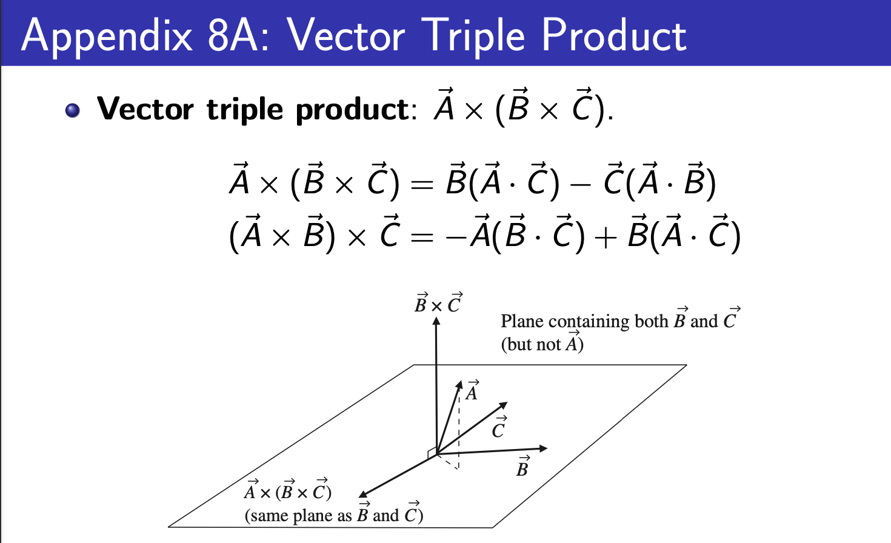

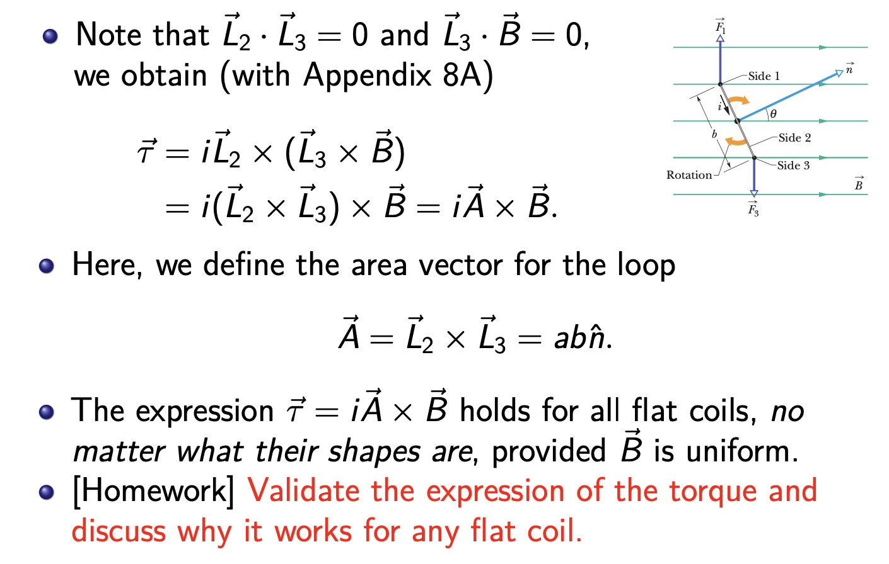

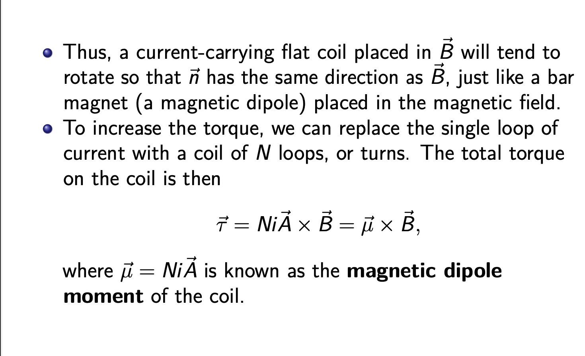

## Magnetic Field of a Current

### Biot-Savart-law

$d\vec{B}= \frac{\mu_0}{4\pi}\frac{id\vec{s}\times\vec{r}}{r^3}$

Where the constant $\mu_0=4\pi \cdot 10^{-7(T\cdot m/A)}$is called the **permeability constant**

### Example

#### A Long Straight Wire

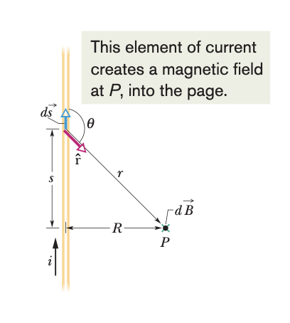

* Derivation

$\begin{align*}d\vec{B}&=\frac{\mu_0}{4\pi}\frac{id\vec{s}\times\vec{r}}{r^3}\\ &=\frac{\mu_0}{4\pi}\frac{id\vec{s}\times\vec{R}}{r^3} \\B&=\frac{\mu_0i}{4\pi R}\int_{-\infty}^{+\infty}\frac{R^2dS}{r^3} (sin\theta=R/r \ cos\theta=-s/r \ dr/ds=s/r)\\ &=\frac{\mu_0i}{4\pi R}\int_{0}^{\pi}sin\theta d\theta \ (cos\theta d\theta = d(sin\theta)=-\frac{R^2dr}{r^2ds}ds=-\frac{R^2s}{r^2r}ds=cos\theta \frac{Rds}{r^2})\\ &= \frac{\mu_0 i}{2\pi R}\end{align*}$

#### Force Between Two Parallel Wires 

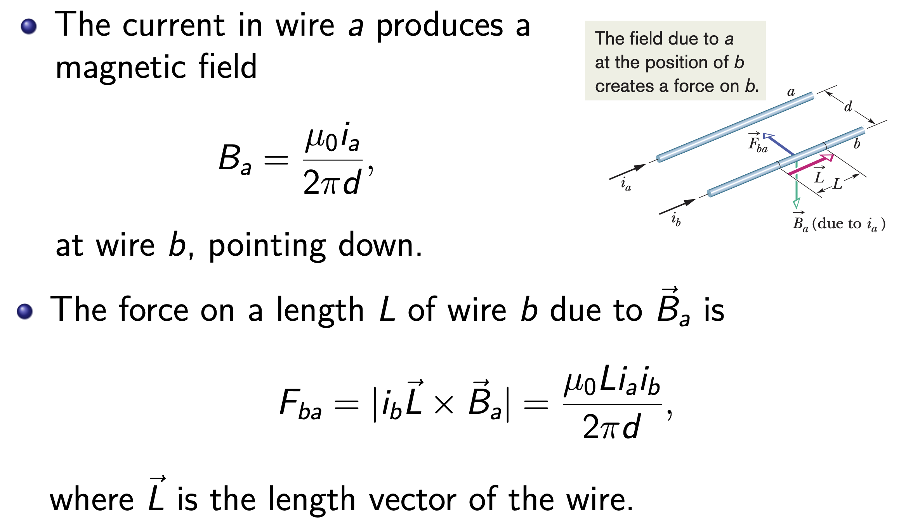

### Magnetic Field Circulation

$Circulation =\oint \vec{B}\cdot d\vec{s} = \mu_0 i_{enc}$  (**Amperian Loop**)

* For a concentric Amperian loop inside the wire $i_{enc}=i\frac{\pi r^2}{\pi R^2}$  Thus, $B=\frac{\mu_0ir}{2\pi R^2}$

#### A Sheet of Moving Charge

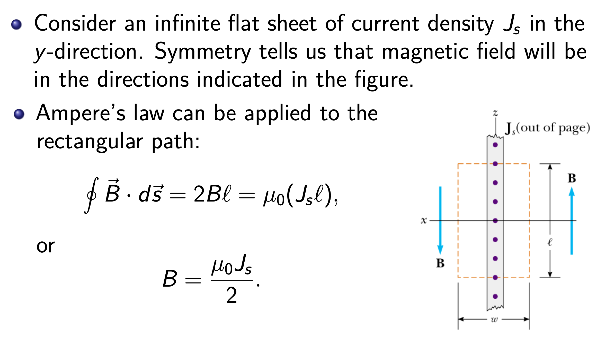

#### Magnetic Field of a Solenoid

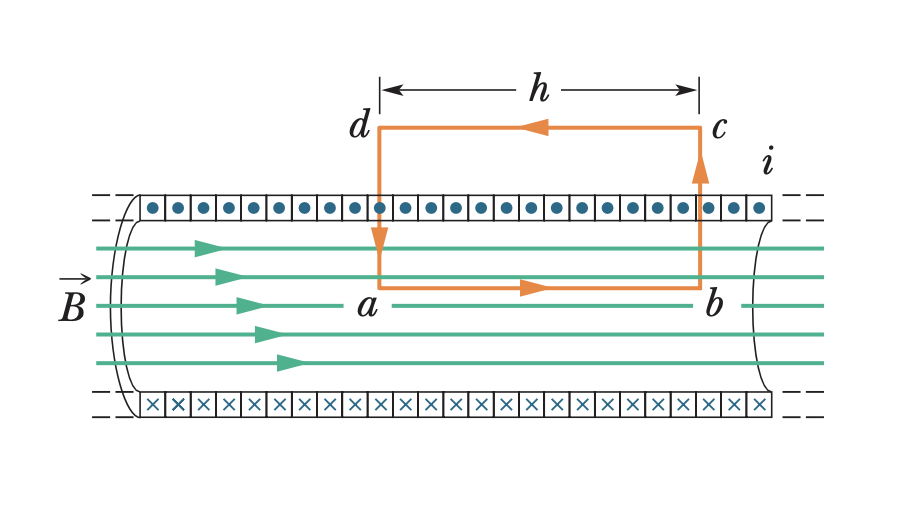

In the limiting case of an ideal solenoid, which is infinitely long and consists of tightly packed (close-packed) turns of square wire, the field inside the coil is uniform and parallel to the solenoid axis. The magnetic field outside the solenoid is zero.

The direction of the magnetic field along the solenoid axis is given by a curled-straight right-hand rule: Grasp the solenoid with your right hand so that your fingers follow the direction of the current in the windings; your extended right thumb then points in the direction of the axial magnetic field.

* From Ampere's Law : $Bh=\mu_0inh \Rightarrow B=\mu_0in$

A solenoid thus provides a practical way to set up a known

uniform magnetic field for experimentation, just as a parallel-plate capacitor provides a practical way to set up a known uniform electric field.

#### Magnetic Field of a Toroid

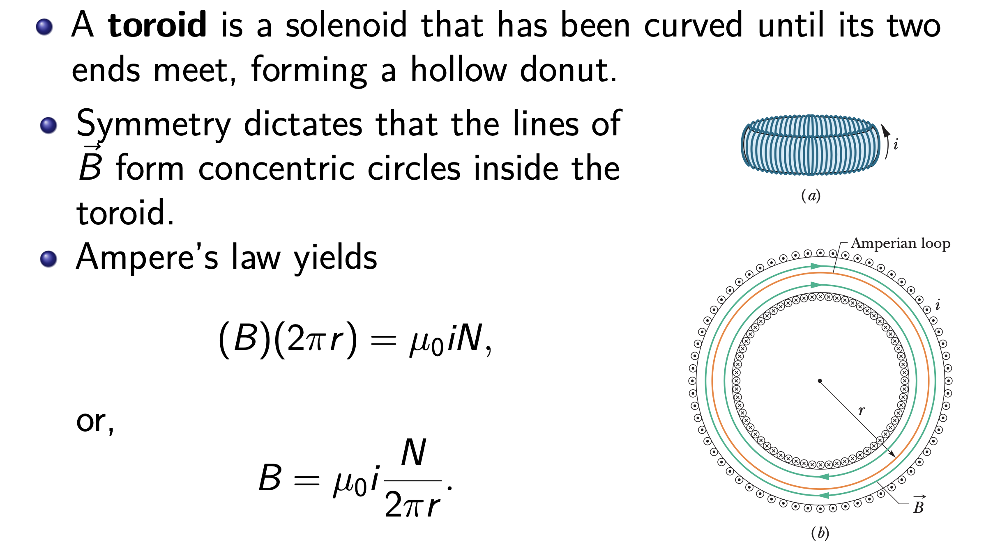

In contrast to the situation for a solenoid, B is not constant over the cross section of a toroid.

One can show, with Ampere’s law, that B = 0 for points outside an ideal toroid (as if the toroid were made from an ideal solenoid).

### The Curl of $\vec{B}$

* By Stokes's theorem : $\oint\vec{B}\cdot d\vec{s} = \iint(\triangledown \times \vec{B})\cdot d\vec{A}=\mu_0i_{enc}=\mu_0\iint_S\vec{J}\cdot d\vec{A}$
* Thus $\triangledown \times \vec{B}(\vec{r}) = \mu_0\vec{J}(\vec{r})$

###  The Divergence of $\vec{B}$

For volume currents, the Biot-Savart law becomes

$\vec{B}(x,y,z)=\frac{\mu_0}{4\pi}\iiint\frac{\vec{J}(x',y',z')\times \vec{r}}{r^3}dx'dy'dz'$

* The length element $id\vec{s}$ is replace by the volume element $JdV'= \vec{J}(x',y',z')dx'dy'dz'$ and $r =(x − x' ) \hat{x} + ( y − y' )\hat{y} + ( z − z') \hat{z}$ 

* Applying the divergence, we obtain:

  $\triangledown \cdot \vec{B}=\frac{\mu_0}{4\pi}\int \triangledown (\frac{\vec{J}\times \vec{r}}{r^3})dV'=-\frac{\mu_0}{4\pi}\int \vec{J} (\triangledown \times \frac{\vec{r}}{r^3})dV'$

  * Note that $\frac{\vec{r}}{r^3}= −\triangledown(1/\vec{r} )$ is nothing but the electric field of a point charge (q = 4πε0)
  * It does not twists around; it only spreads out. Its curl is zero (as known in electrostatics).

* Thus $\triangledown \cdot \vec{B} = 0$

* Constructing a closed Gaussian surface,we have:

  $\oint\vec{B}\cdot d\vec{A}=\int(\triangledown\cdot\vec{B})dV=0$

* The law asserts that the net magnetic flux $\Phi _B$ through any closed Gaussian surface is zero. 

* This is a formal way of saying that magnetic monopoles do not exist. The simplest magnetic structure that can exist is a magnetic dipole.

## Magnetic Properties of Materials

### The Magnetic Dipole

$\vec{\mu}=Ni\vec{A}$

$\tau = \vec{\mu} \times \vec{B}=-\mu Bsin\theta=-\frac{\partial}{\partial \theta}(-\mu Bcos\theta)$

$U_B=-\vec{\mu}\cdot\vec{B} = -\mu Bcos\theta$

 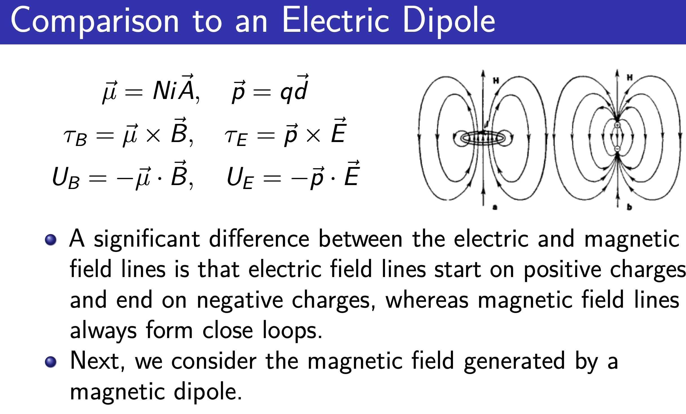

### Magnetic Field of a Circular Arc of Wire

#### At the center

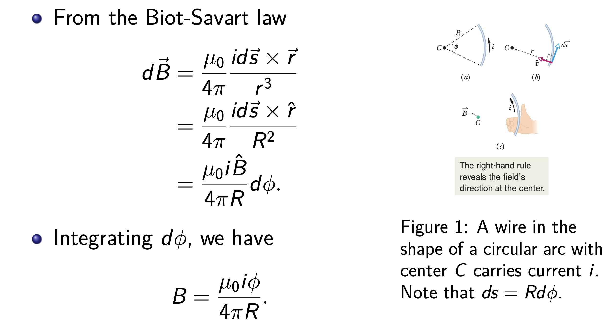

* Thus , at the center of a single-loop coil, we have $B=\frac{\mu_0i}{2R}=\frac{\mu_0\mu}{2\pi R^3}$

#### at axial points far from the loop$(z ≫ R)$

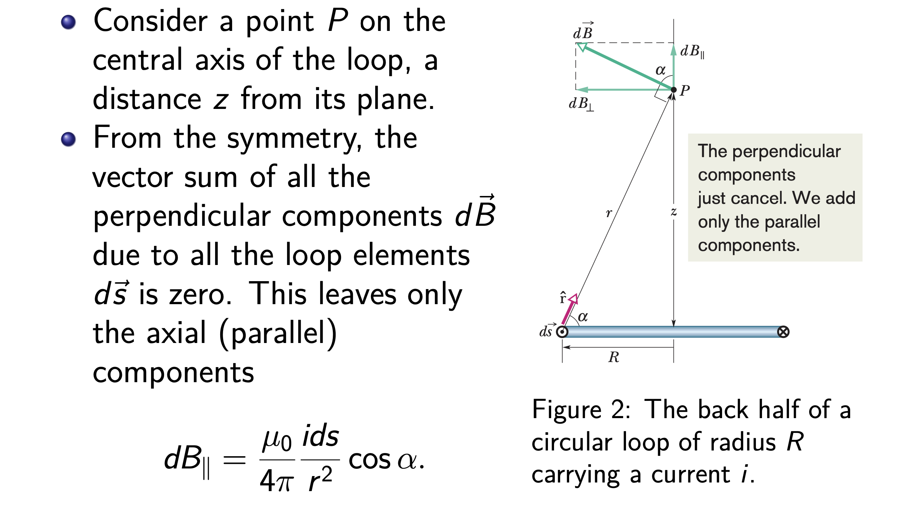

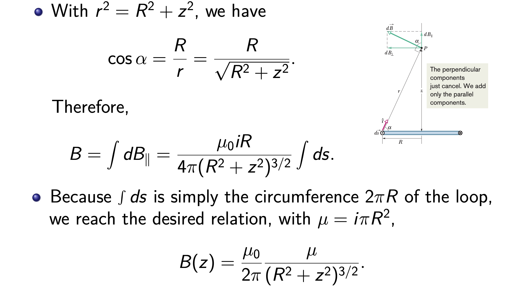

Which means $B(z)=\frac{\mu_0}{2\pi}\frac{\mu}{r^3}$ Just like the  electric dipole

### Magnetic Materials

#### Paramagnetism

Paramagnetism occurs in materials whose atoms have permanent magnetic dipole moments $\vec{\mu}$

* **Curie’s law** : $M=C\frac{B_{ext}}{T}$
* The law is actually an approximation that is valid only when the ratio $B_{ext}/T$ is not too large.
* With sufficient strong $\vec{B}_{ext}$ all dipoles in a sample of N atoms and a volume V line up with $\vec{B}$ hence M saturates at $M_{max}=N\mu/V$

Explain:

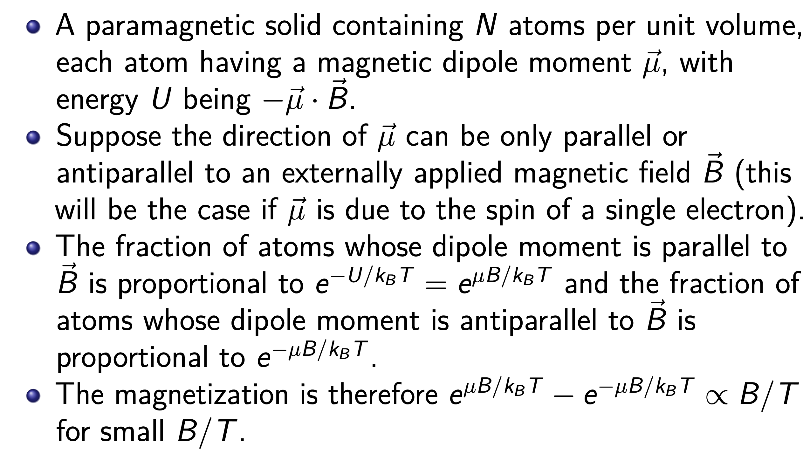

#### Diamagnetism

Diamagnetism occurs in all materials, but the weak effect is only observable in materials having atomic dipole moments of zero.

Such a material can be modeled by equal numbers of electrons orbiting counterclockwise or clockwise. An external magnetic field will either accelerate or decelerate these electrons, leading to a net magnetic dipole moment

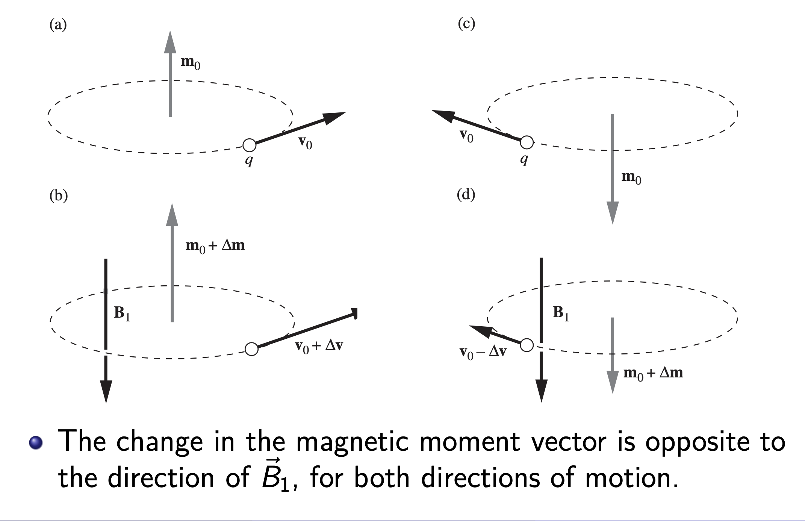

#### Ferromagnetism

A ferromagnet has strong, permanent magnetism. What distinguishes ferromagnets from paramagnets is that there is a strong interaction between neighboring atoms.

The interaction keeps the dipole moments of atoms aligned even when the magnetic field is removed.

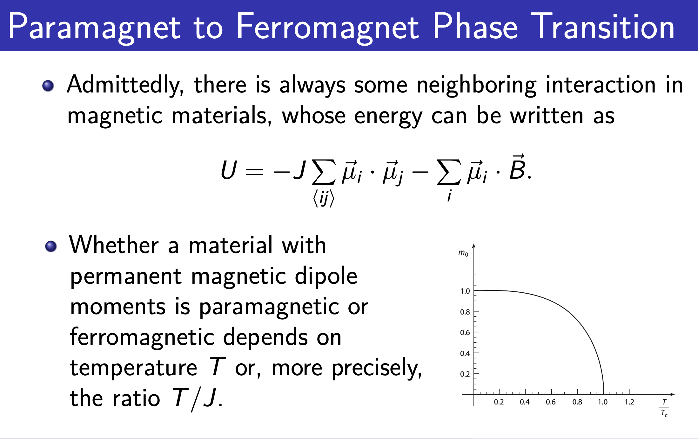

