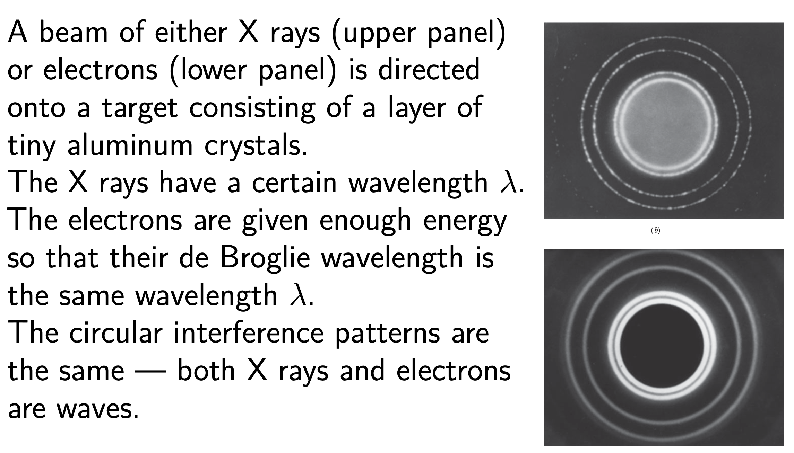
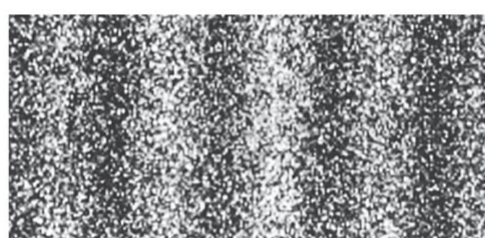
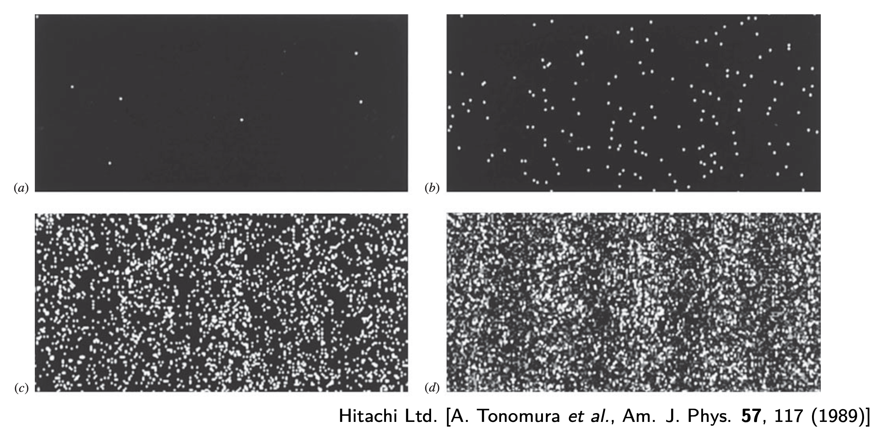
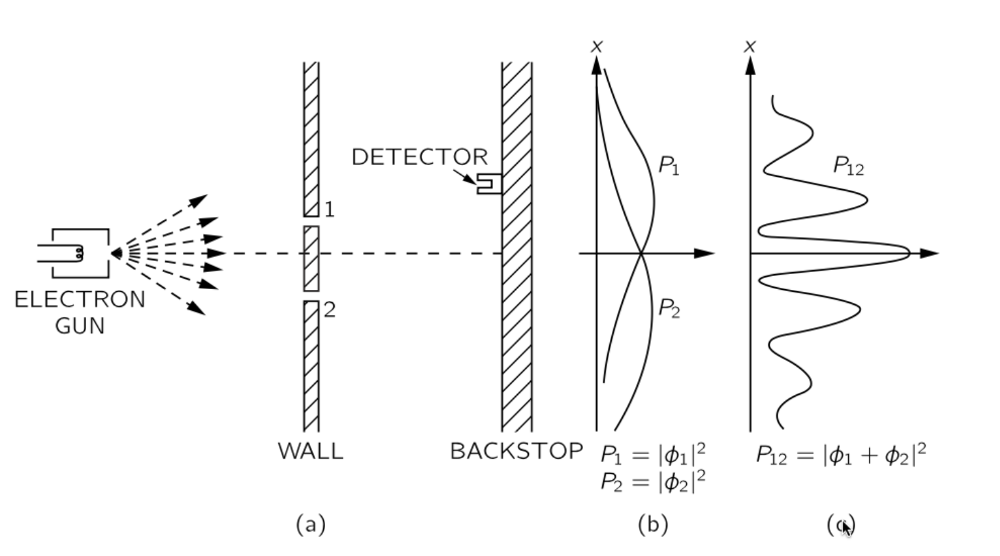
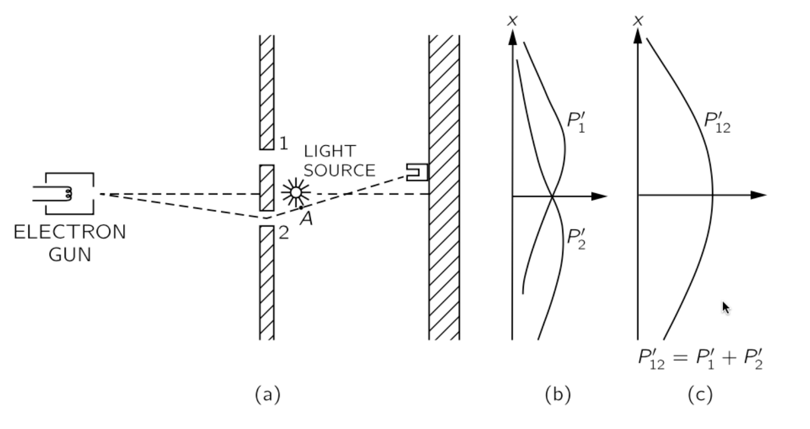
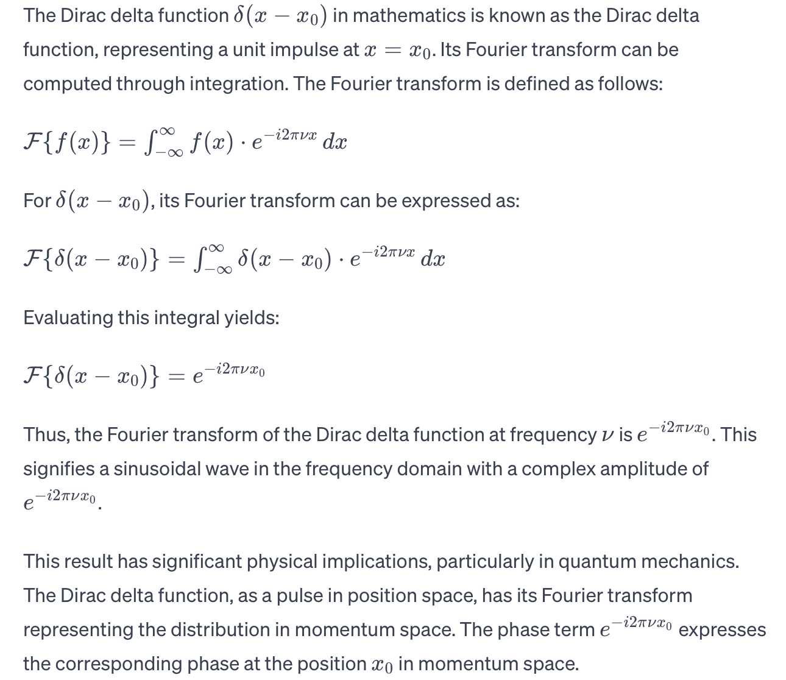

## Matter Waves

### Two Versions of Interference

#### standard version of the double-slit experiment

In the standard version of the double-slit experiment(Thomas Young, 1801), light shines on screen B, which contains two narrow parallel slits.

The light waves emerging from the two slits spread out by diffraction and overlap on screen C where, by interference, they form a pattern of alternating intensity maxima and minima. 

* Let us place a tiny photon detector D at one point in the plane of screen C.
*  Let the detector be a photoelectric device that clicks when it absorbs a photon.
*  We would find that the detector produces a series of clicks, randomly spaced in time, each click **signaling the transfer of energy from the light wave to the screen** via a photon absorption.
* If we moved the detector very slowly up or down as indicated by the black arrow, we would find that the click rate increases and decreases, **passing through alternate maxima and minima that correspond exactly to the maxima and minima of the interference fringes**.

The point of this thought experiment is as follows.

* We cannot predict when a photon will be detected at any particular point on screen C
* photons are detected at individual points at random times.
* We can, however, predict that the relative probability that a single photon will be detected at a particular point in a specified time interval **is proportional to the light intensity** at that point.

We know that the intensity $I$ of a light wave at any point is proportional to the square of $E_m$. Thus, the probability(per unit time interval) that a photon will be detected in any small volume centered on a given point in a light wave is proportional to the **square of the amplitude of the wave’s electric field vector** at that point.

#### single-photon version

The light source is so extremely feeble that it emits only **one photon** at a time, at random intervals. Astonishingly, interference fringes still **build up** on screen C if the experiment runs long enough

* If the photons move through the apparatus one at a time, through which of the two slits in screen B does a given photon pass?
* How does a given photon even “know” that there is another slit present so that interference is a possibility?
*  Can a single photon somehow pass through both slits and interfere with itself?

Because an interference pattern eventually builds up on the screen, we can only **speculate** that each photon travels from source to screen as a wave that fills up the space between source and screen.

We can predict the probability that an energy transfer will occur at **any given point** on the screen.

* Transfers will tend to occur (and thus photons will tend to be absorbed) in the regions of the bright fringes in the interference pattern that builds up on the screen.
* Transfers will tend not to occur (and thus photons will tend not to be absorbed) in the regions of the dark fringes in the pattern.

Thus, we can say that the wave traveling from the source is a **probability wave**, which produces a pattern of “probability fringes” on the screen.

### Light as a Probability wave

We see that the double-slit experiments tell us that

* light is generated in the source as photons
* absorbed in the detector as photons
*  travels between source and detector as a **probability wave**.

The **probability density** of detecting a photon at some point $P$ in space depends on the irradiance $I ∝ E_0^2$ at that point. Thus, the net $E_0$ at $P$ can be interpreted as the **probability amplitude**. (Probability amplitude is a quantity whose square gives the probability density.)

**To go further, one will need quantum electrodynamics (QED), the quantum theory of the interaction of light and matter.**

### Extendtions to not only light

#### De Broglie Hypothesis

A beam of light is a wave, but it transfers energy and momentum to matter **only at points**, via **photons**. Electron is a particle with energy and momentum. Why can’t we think of a beam of moving electron — or any other particle — **as a matter wave**?

In 1924, Louis de Broglie proposed that one could assign a wavelength $λ$ to a particle with momentum of magnitude $p$. Like that of photons, we define. $λ = h/p$, which is known as the **de Broglie wavelength** of the moving particle.

#### Electron Diffraction

Electron diffraction and neutron diffraction are used to study the atomic structures of solids and liquids, and electron diffraction is often used to study the atomic.

#### The Interference of Electrons

In a more recent experiment, an interference pattern was built up when electrons were sent, one by one, through a double-slit apparatus. When an electron hit the viewing screen, it caused a flash of light whose position was recorded.

* Similar interference has been demonstrated with protons, neutrons, and various atoms. It was further demonstrated with iodine molecules $I_2$ in 1994 and with fullerenes (or buckyballs) $C_{60}$ and $C_{70}$ in 1999.

Do particles interfere with each other?

 Perhaps they collide . . . .

* Repeat at low intensity that at any given time there is only one particle in the inteference region.

 ### Matter Wave

**In Newtonian physics**: a particle is only aware of the slit through which it goes, it has no idea how many other slits are open or closed or even exist. Therefore, when both slits are open, $P_{12} = P_1 + P_2$.

* Clearly, there is no fringes(Newtonian physics)

**Consider matter waves:**The electrons arrive in lumps, like particles, and the probability of arrival of these lumps is distributed like the distribution of intensity of a wave.

**Introduce:**

* Add Amplitude $A$

* Introduce the **probability amplitude** $ψ$ which is a complex number. 

  The probability of an event in an ideal experiment is then given by $|ψ|^2 = ψ^∗\timesψ$.

When an event can occur in several alternative ways, the probability amplitude for the event is the sum of the probability amplitudes for each way considered separately

*  $ψ = ψ_1 + ψ_2 + · · ·$.

* The probability for the event is, then,$P=|ψ|^2 =|ψ1|^2+|ψ2|^2+2R(ψ1^∗ψ2)+···.$（**note**:模）

* The interference term $2R(ψ_1^∗ψ_2)$ is responsible for the rapid oscillations of $P$ observed in the experiment.

#### The Which-Way Experiment

**If an experiment is performed which is capable of determining whether one or another alternative is actually taken, the interference is lost.**

The experiment tells us that the probability of the event in the which-way experiment is the sum of the probabilities for each alternative, $P = |ψ|^2 = |ψ_1|^2 + |ψ_2|^2$,just as what happens in the classical case.

**Thus an electron acts like it went through one particular slit if we see it doing that, and acts like it did not have a specific path (through a specific slit) when it is not seen. **

* Why seeing makes a difference?

To see an electron with a resolution comparable to slit separation $d$, (so we know which slit it took) requires light with $λ < d$, this is just standard wave theory. 

But, the light is made of photons each with momentum $p>\frac{h}{d}$. So, measuring the position of the electron has made us disturb its momentum. 

The amount of momentum transferred to the electron in the act of observation is **indefinite**.

This is a manifestation of **Heisenberg’s uncertainty principle**, which says you cannot measure the momentum and coordinate of a particle **simultaneously** to arbitrary accuracy.

#### Heisenberg’s Uncertainty Principle

**Heisenberg’s uncertainty principle** is **not** an effect caused by the measurement but a consequence of intrinsic wave nature of matter.

The probabilistic nature of quantum physics places an important limitation on detecting a particle’s position and momentum. That is, it is not possible to measure the position $\vec{r}$ and the momentum $\vec{p}$ of a particle **simultaneously** with unlimited precision. 

The uncertainties in the components of these quantities are given by (Werner Heisenberg, 1927)

$∆x·∆p_x ≥\bar{h}$ 

$∆y·∆p_y ≥\bar{h}$

$∆z·∆p_z ≥\bar{h}$

They are due to the fact that electrons and other particles are matter waves and that repeated measurements of their positions and momenta involve **probabilities, not certainties.**

In the statistics of such measurements, we can view, say, $∆x$ and $∆p_x$ as the spread (actually, the standard deviations) in the measurements.
Couldn’t we very precisely measure $p_x$ and then next very precisely measure x wherever the electron happens to show up? 

Doesn’t that mean that we have measured both $p_x$ and $x$ simultaneously and very precisely?

* No, the flaw is that although the first measurement can give us a precise value for $p_x$ , the second measurement necessarily alters that value. **Puzzled?**

* Consider an electron with a certain value of $k$, which, by the de Broglie relationship, means a certain momentum $p_x = \bar{h}k$. Thus, $∆p_x = 0$. By Heisenberg’s uncertainty principle, that means that $∆x → ∞$.

* What form does the electron wave function have? The naive guess could be $sinkx$, or $coskx$.

   But they have spatial variance that is inconsistent with our intuition.

To represent the electron by a wave, we need a function, which is called **wave function**, with a wavelength
 $λ = 2π/k$, but **its square** should not show any variation in x「Note: Definite Momentum」i.e. $ψ(x,t) = e^{i(kx−ωt)}$. 

> To calculate the square of the wave function $∣ψ∣^2$, we obtain $∣ψ∣^2=e^{i(kx−ωt)}⋅e^{−i(kx−ωt)}$.
>
> we then have $∣ψ∣^2=1$. 
>
> This implies that at a given time t, the square of the wave function is a **constant** in the x direction, with no variation concerning x.

Now, where is the electron? Why complex?

* If we measure $p_x$ now, we obtain $p_x = \bar{h}k$ without uncertainty

  but the particle exists anywhere with the same probability, so $∆x = ∞$.     ?Question

  Heisenberg’s uncertainty principle is not violated.

* If we measure x then, we will find the electron somewhere at $x_0$. Once we find it, it cannot be elsewhere. So the wave function suddenly collapses to $ψ(x) = δ(x − x0)$. 

  Now, is the momentum still $p_x = \bar{h}k$?

  The Fourier transform of the δ-function tells us $ψ ̄(p) = F(ψ(x)) = constant$.

  In this case, $∆x = 0$ but $∆p = ∞$. Again, Heisenberg’s uncertainty principle is not violated.

  

##### Fourier Transform

https://www.youtube.com/watch?v=spUNpyF58BY&list=RDCMUCYO_jab_esuFRV4b17AJtAw&index=3

https://youtube.com/watch?v=MBnnXbOM5S4