## Motivation

A classical **wave** $ψ(x, y, z, t)$ satisfies the wave equation $\frac{1}{v^2}\frac{\partial^2ψ}{\partial^2t}=\triangledown^2ψ$  $v \ is\ speed$

In the quantum theory, a microscopic **particle** is described by a probability amplitude $ψ(x, y, z, t)$, and the probability of finding it is proportional to $P(x, y, z, t) = |ψ(x, y, z, t)|^2$.

* What is, then, the wave equation that governs the motion of the quantum particle?

## Schroedinger’s Equation

### Classical Particle

Find the equation that governs the quantum behavior of a free particle of mass $m$ represented by a wave $ψ(x,t) = e^{i(kx−ωt)}$.

$E=\frac{p^2}{2m}$

According to the de Broglie’s hypothesis

$p=\frac{h}{\lambda}=\bar{h}k=−i\bar{h}\frac{1}{ψ(x,t)} \frac{∂ψ(x,t)}{\partial x}$

 d$p^2=\bar{h}^2k^2=-\bar{h}^2\frac{1}{ψ(x,t)} \frac{∂^2ψ(x,t)}{\partial^2 x}$

$E=hv=\bar{h}w=\frac{1}{ψ(x,t)} \frac{∂ψ(x,t)}{\partial t}$

using wave function, the energy-momentum relation is

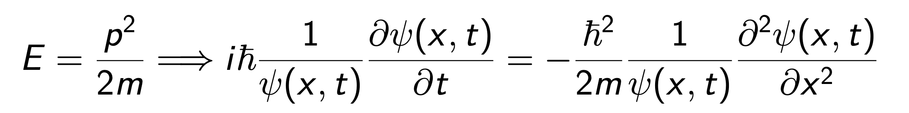

In the presence of potential, e.g. a harmonic potential   $U(x) = ax^2/2$ , the classical relation is modified to $E=\frac{p^2}{2m} +U(x)$  where $E$ is a constant of motion, but $p$ is not. In other words, a plane wave is not a solution any more.

> In this expression, p is the momentum of the particle, m is the mass of the particle, $U(x)$ is the potential energy associated with the position x, and E is the total energy of the system, which remains constant.
>
> In the conventional case where there is no potential energy in the system, momentum p would be a conserved quantity, implying the total momentum of the system remains constant. However, in the presence of potential energy, the interaction between kinetic and potential energy leads to a non-conservation of momentum. In such cases, simple waveforms like **plane waves** are no longer solutions, as the interaction between kinetic and potential energy requires a more complex description.

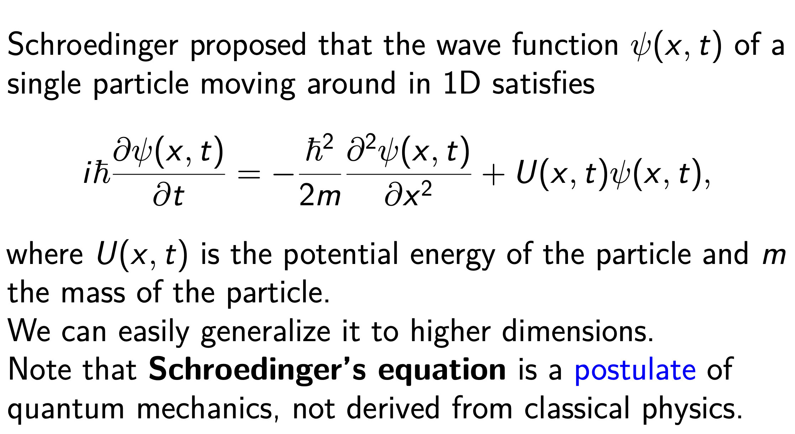

**Schroedinger's equation is both homogenous and linear!!!**

>**Linear Partial Differential Equation (PDE):**
>
>A partial differential equation is termed linear if it is linear in terms of the unknown function and its partial derivatives. It can be expressed in the form:
>
>$L(u)=a_n(x,y)u_{xx}+a_{n−1}(x,y)u_x+…+a_1(x,y)u_y+a_0(x,y)u+F(x,y)=0$
>
>Here, $u$ is the unknown function, $u_x, u_y, u_{xx}$, and so on represent the corresponding partial derivatives
>
> Crucially, all coefficients $a_n(x,y), a_{n−1}(x,y), ……, a_0(x,y)$as well as $F(x,y)$, do not depend on the values of the unknown function $u$ or its derivatives.
>
>**Homogeneous Partial Differential Equation (PDE):**
>
>A partial differential equation is considered homogeneous if **all terms** in the equation are homogeneous polynomials of the **unknown function and its partial derivatives**. 
>
>NOTE：homogeneous without **”constant term”**

#### time-independent Schroedinger’s equation

In most cases we discuss, the potential energy $U = U(x)$ is independent of time. 

We can solve the stationary solution of the Schroedinger equation by an ansatz: $ψ(x, t) = \Phi(x)e^{\frac{-iEt}{\bar{h}}}$.

Substituting the above ansatz of $ψ(x,t)$, we obtain the following equation for $φ(x)$  $\frac{\partial^2\phi(x)}{\partial^2x}+\frac{2m}{\bar{h}^2}[E-U(x)]\phi(x)=0$

By solving this equation, we can obtain the stationary solution φ$(x)$ under the time-independent external potential $U(x)$.

In free space, $U(x) = 0$. 

* The general solution is φ$(x)=Ae^{ikx} +Be^{−ikx}$ where A and B are constants and k = $\sqrt{2mE} /\bar{h}$.

> The general form of a second-order homogeneous linear ordinary differential equation (ODE) with constant coefficients is given by:
>
> $a\frac{d^y}{dx^2}+b\frac{dy}{dx}+cy=0$
>
> The general solution for such equations can be found by assuming the solution has the form $y=e^{rx}$ where r is a constant to be determined. Substituting this form into the equation yields the characteristic equation:$ar^2+br+c=0$
>
> Solving this quadratic equation for r*r* determines the values for r, which in turn determine the form of the general solution. There are typically three cases:
>
> 1. **Two distinct real roots r1 and r2**
>
>    The general solution is: $y=C_1e^{r_1x}+C_2e^{r_2x}$
>
> 2. **One real root r repeated twice:**
>
>    The general solution is: $y=(C_1+C_2x)e^{rx}$
>
> 3. **Two complex conjugate roots r=α±βi:**
>
>    The general solution is: $y=e^{αx}(C_1cos⁡(βx)+C_2sin⁡(βx))$

#### The complete time-dependent wave function

$ψ(x,t)=Ae^{i(kx−ωt)} +Be^{−i(kx+ωt)}$  where $w=\frac{E}{\bar{h}}$     

* The two terms correspond to right- and left-moving waves, respectively.

Consider the right-moving wave $ψ(x,t) = Ae^{i(kx−ωt)}$, the **probability density is uniform**:$|ψ(x, t)|^2 = ψ^∗(x, t)ψ(x, t) = |A|^2$.
 That means that if we make a measurement to locate the particle, the location could turn out to be at **any x value**.

## Wave Packets

What is the speed of a free quantum mechanical particle?

$ψ(x,t)=Ae^{i(kx−\frac{\bar{h}k^2}{2m}t)} +Be^{−i(kx+\frac{\bar{h}k^2}{2m}t)}$  where $w=\frac{E}{\bar{h}}$     and  $\sqrt{2mE} /\bar{h}$

$\Rightarrow v_{ph}=\frac{\bar{h}k}{2m}=\sqrt{\frac{E}{2m}}$

On the other hand, the classical speed of a free particle with energy E is given by $v_{cl} = \sqrt{\frac{2E}{m}}= 2v_{ph}$.

**Problem #1: **

The quantum mechanical wave function travels at half the speed of the particle it is supposed to represent!

**Problem #2: **

How to normalize the wave function of the free particle, say, represented by $Ae^{ikx}$ ?

$\int_{-\infty}^{+\infty}|ψ(x)|^2dx=|A|^2\int_{-\infty}^{+\infty}1dx=|A|^2\infty$

This wave function is not normalizable!

In fact, the stationary (separable) solutions do not represent physically realizable states for a free particle; there is no such thing as **a free particle with a definite energy**.

#### the realistic solution to the Schroedinger equation for a free particle

In quantum theory, a localized particle is modeled by a linear superposition of these stationary free-particle (or plane-wave) states.

In general, we can construct a linear combination (integral over continuous $k$)

$Ψ(x,t)=\frac{1}{\sqrt{2\pi}}\int_{-\infty}^{+\infty}$φ$(k)e^{i(kx−\frac{\bar{h}k^2}{2m}t)}dk$

This wave function can be normalized for appropriate φ$(k)$, typically Gaussian. We call it a **wave packet**, which carries a range of k and, hence, a range of energies and speeds. In a general quantum problem, we are given $Ψ(x, 0)$ and needed to find $Ψ(x, t)$.

The particle can be better localized (∆x can be decreased) if more plane-wave states of different wavelengths or momenta **are added** together in the right way **(∆p is increased)**.

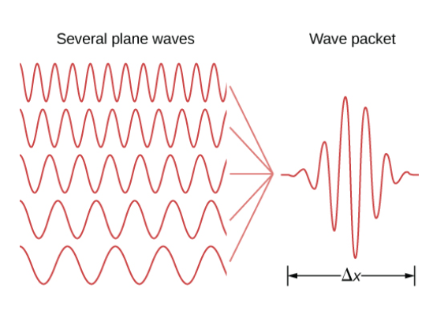

According to Heisenberg, these uncertainties obey $∆x∆p ≥ \bar{h}/2$.

It turns out that the **group velocity** of the wave packet, not the **phase velocity** of the stationary states, matches the classical particle velocity.

## Some Exercises

### Reflection from a Potential Step

Consider a beam of nonrelativistic electrons, each of total energy E, along an x axis through a narrow tube. They experience a negative electric potential step of height $V_b <0$ at $x=0$.(Note that the charge q of the electron is negative)

#### $E > qV_b$.

 Classically, electrons should all pass through the boundary. Their total energy should be conserved, so their kinetic energy, hence speed, decreases when their potential energy increases.

* What happens quantum mechanically?

  **(at a given time?)**

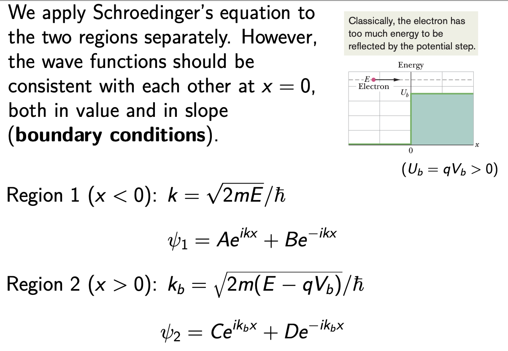

* We can first set $D = 0$, because there is no electron source off to the right, and there can be no electrons moving to the left in region 2.

* We now consider boundary conditions at $x = 0$:

  $A + B = C$ (matching of values) 

  $Ak − Bk = Ck_b$ (matching of slopes) 「first derivation」

We should be able to solve $B/A$ and $C/A$, but not $A$, $B$, and $C$. 

Note that the absolute values are not important for our purpose (it can be related to the beam intensities, though).

* Indeed, to find the probability that electrons reflect from the step, we need to relate the probability density of the reflected wave $Be^{−ikx}$ to that of the incident wave $Ae^{ikx}$. We thus define a reflection coefficient R:

  $R_{reflected}=\frac{|A|^2}{|B|^2}=|\frac{k-k_b}{k+k_b}|^2$

  $T_{transmition}=1-R=\frac{4kR(k_b)}{|k+k_b|^2}$

  Quantum mechanically, electrons are reflected from the boundary, but only **with a probability**.

  > What inspires us to define T in this way?
  >
  > Well, one can consider an alternative quantity $\frac{|C|^2}{|A|^2}=\frac{4k^2}{|k+k_b|^2}=\frac{k}{R(k_b)}T=\frac{k}{k_b}T for\ real\ k_b$(which means$E > qV_b$. )
  >
  > Why coefficient?

* Recall current density J = nqv. Not surprisingly, one finds

  $T = \frac{|C|^2k_b}{|A|^2k} = \frac{|C|^2q(\bar{h}k_b/m)}{|A|^2q(\bar{h}k/m)} =\frac{n_1qv_1}{n_2qv_2}= \frac{J_{transmitted}}{J_{incident}}$.

  One can also write

  $R=\frac{J_{reflected}}{J_{incident}}$

  Therefore, $T = 1 − R$ is nothing but the conservation of current $J_{transmitted} = J_{incident} − J_{reflected}.$

#### $E < qV_b$.

* Just Reflection

### Tunneling through a Potential Barrier

Now consider a potential energy barrier, which is a region of thickness L where the electric potential is $V_b(<0)$ and the barrier height is $U_b=qV_b$

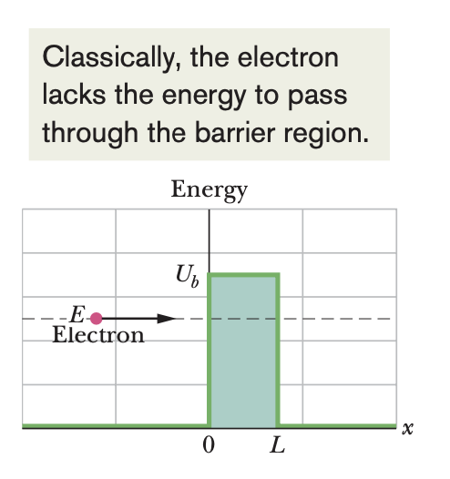

* Consider $E < qV_b$

  Separate the space into three regions and solve Schroedinger's equation in each region $(3\times2-1=5\ unknowns)$

  Apply boundary conditions at the two boundaries$(2\times2=4)$

  Calculate the tunneling coefficient.

#### General Results

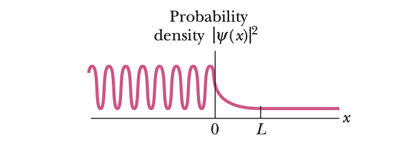

* The oscillating curve to the left of the barrier (for x < 0) is a combination of the incident matter wave and the  reflected matter wave (which has a smaller amplitude than the incident wave). 

  The oscillations occur because these two waves, traveling in opposite directions, interfere with each other, setting up a **standing wave pattern**.

* Within the barrier $(for\ 0 < x < L)$ the probability density decreases exponentially with x. However, if L is small, the probability density is not quite zero at x = L..

* To the right of the barrier (for x > L), the probability density plot describes a transmitted wave (through the barrier) with low but constant amplitude.

We can assign a transmission coeffient T to the incident matter wave and the barrier. The transmission coefficient T is approximately $T\approx e^{-2kL}$ where $k=\frac{\sqrt{2m(qV_b-E)}}{\bar{h}}$
**Try Derive (imaginary k' actually)**
$T$ is sensitive to L,m and $U_b-E$ 

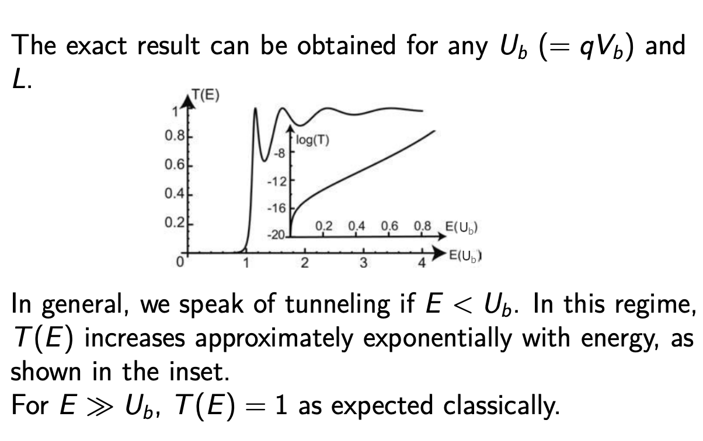

### Scanning Tunneling Microscope (STM)

The size of details that can be seen in an optical microscope is limited by the wavelength of the light the microscope uses (about 300 nm for ultraviolet light). We use electron matter waves (tunneling through potential  barriers) to create images on the atomic scale.

> The piezoelectric effect refers to the phenomenon where certain crystals exhibit charge separation when subjected to mechanical stress, resulting in the generation of voltage, or conversely, when an electric field is applied, causing the crystal to undergo mechanical deformation. This phenomenon is known as the piezoelectric effect, and the crystals that exhibit it are referred to as piezoelectric crystals.
>
> Specifically, the piezoelectric effect can be categorized into two main types:
>
> 1. **Direct Piezoelectric Effect:**
>    - When a piezoelectric crystal is subjected to external mechanical pressure, there is a redistribution of charges within the crystal, leading to charge separation on the crystal's surface and the generation of voltage. This effect finds widespread applications in devices such as piezoelectric sensors and transducers.
> 2. **Inverse Piezoelectric Effect:**
>    - The inverse piezoelectric effect occurs when a mechanical deformation is induced in a crystal by applying an electric field. In this case, the electric field can control the shape and size of the crystal, causing mechanical vibrations. This effect is utilized in applications like piezoelectric ceramics in drivers and Surface Acoustic Wave (SAW) devices.

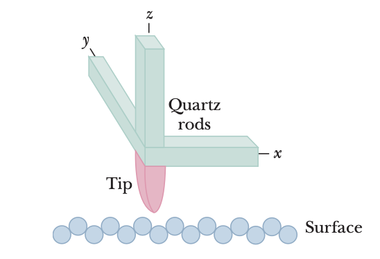

A fine metallic tip, mounted on quartz rods, is placed close to the surface to be examined. The space between the surface and the tip forms a potential energy barrier.

* Quartz shows the piezoelectricity.

* The position of the tip can be controlled by applying the electric field on the quartz. The horizontal location of the tip is controlled by the electric field in x- and y-directions. The vertical distance between the surface and the tip is controlled by the electric field in z-direction.

* Transmission coefficient $T$ ~ $e^{-2kL}$ is sensitive to the barrier width.

  $→$ Tunneling current is sensitive to the distance between the surface and the tip.

* The vertical position of the tip is adjusted to keep the tunneling current constant as the tip is scanned over the surface. Imaging of the atomic scale is possible.

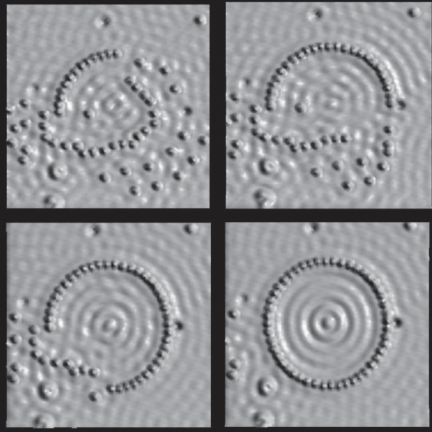

An STM not only can provide an image of a static surface, it can also be used to manipulate atoms and molecules on a surface.

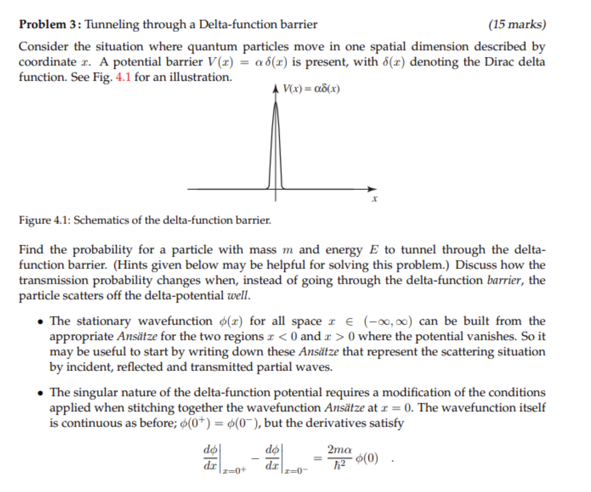

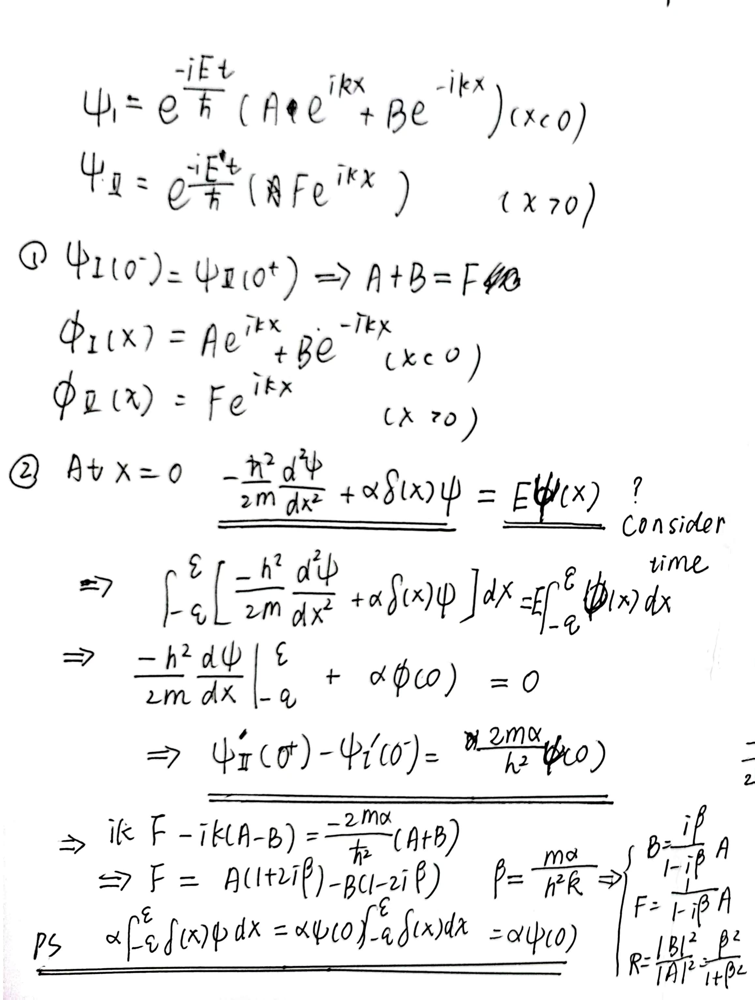

### S-Matrix
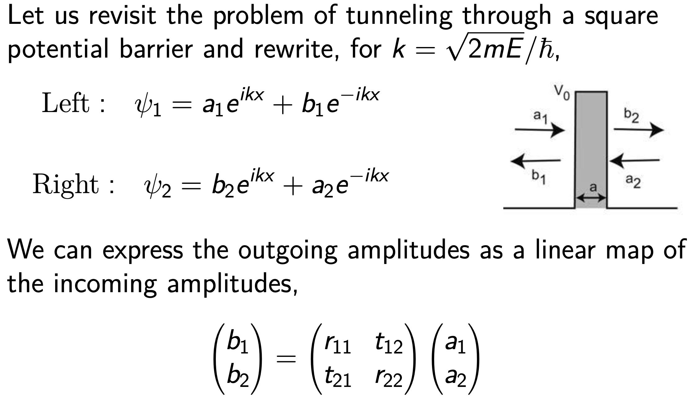
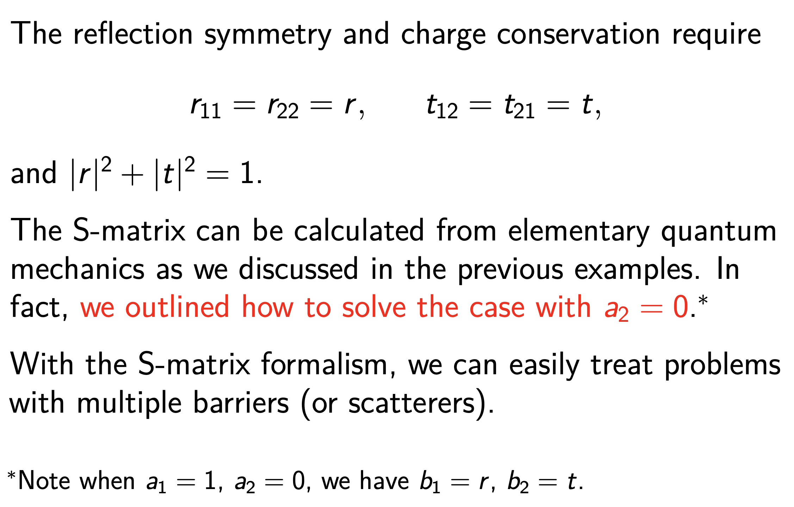

> The expression $|r|^2+|t|^2=1$ is a consequence of probability conservation in quantum mechanics. Let's break down the meaning of this expression in the context of quantum mechanics and scattering theory.
>
> In quantum mechanics, when a particle encounters a potential barrier or undergoes scattering, the probabilities of reflection$|r|^2$ and transmission$t|^2$must add up to unity. Here's why:
>
> 1. **Probability Conservation:** The total probability of finding the particle must be conserved. When a particle encounters a potential barrier, it can either be reflected back or transmitted through the barrier. The sum of the probabilities of these two outcomes must be equal to 1.
>
>    Mathematically, this is expressed as $|r|^2+|t|^2=1$
>
> 2. **Normalization Condition:** The probability amplitude is related to the wave function, and the square of the amplitude gives the probability density. For the wave function to represent a physically meaningful probability density, it must be normalized.
>
>    The normalization condition for probability amplitudes requires that the sum of the probabilities over all possible outcomes is equal to 1.
>
>    Mathematically, this normalization condition is expressed as $∫∣Ψ(x)∣^2 dx=1$, where $Ψ(x)$ is the wave function.

#### Example

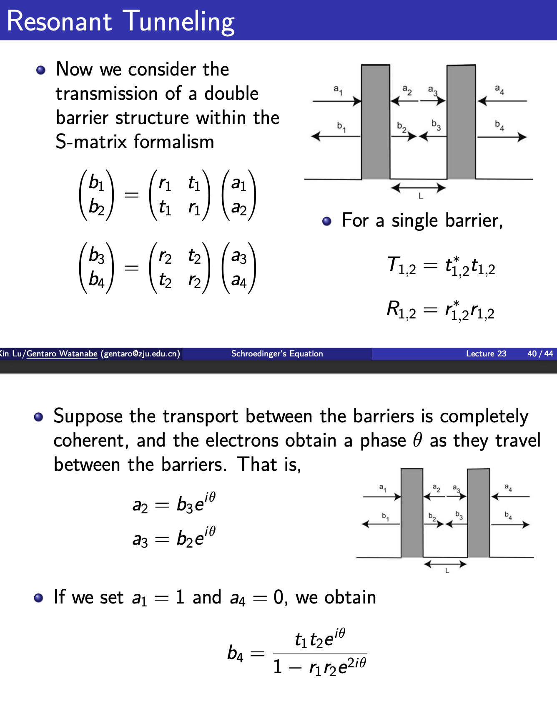

> $Explain\ for\ the\ below\ Pic$
>
> - $t_1$ and $t_2$: These are the transmission coefficients at the first and second barriers, respectively. They represent the fraction of the wave that gets transmitted through the barriers.
>
> - $r_1$ and $r_2$: These are the reflection coefficients at the first and second barriers, respectively. They represent the fraction of the wave that gets reflected at the barriers.
>
> - $e^{iθ}$: This term introduces a phase shift (θ) to the wave. 
>
>   The term is a complex exponential that represents a phase change in the wave. It's common in wave optics and quantum mechanics to introduce phase factors.
>
> Now, let's interpret the terms in the sum:
>
> 1. The first term $t_1e^{iθ}t_2$ represents the wave being transmitted through the first barrier ($t_1$), undergoing a phase change ($e^{i\theta}$), and then being transmitted through the second barrier $(t_2)$
>
> 2. The second term $t_1e^{i\theta}r_2e^{i\theta}r_1e^{i\theta}t_2$ represents a more complex scenario. 
>
>    The wave is transmitted through the first barrier ($t_1$), undergoes a phase change ($e^{i\theta}$), gets partially reflected $r_2$, undergoes another phase change$e^{i\theta}$, gets reflected again$(r_1)$, undergoes yet another phase change$(e^{i\theta})$, and finally gets transmitted through the second barrier $t_2$.

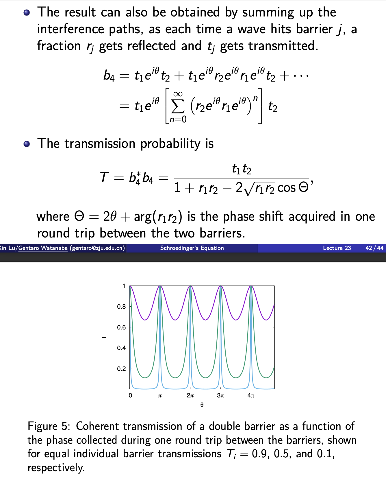

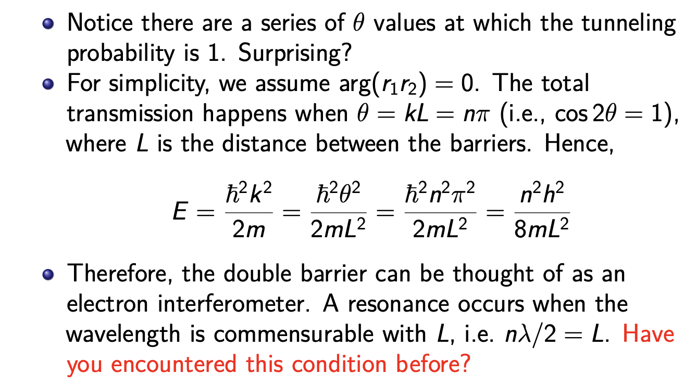

* Question? 

  > $b_4b_4^∗=\frac{t_{1}^2t_2^2}{1−2r_1r_2cos⁡(2θ)+r_1^2r_2^2}$

### Two Particle System

https://www.youtube.com/watch?v=M7VJa5eim5o

https://phys.libretexts.org/Bookshelves/Quantum_Mechanics/Introductory_Quantum_Mechanics_(Fitzpatrick)/05%3A_Multi-Particle_Systems/5.03%3A_Two-Particle_Systems

$i\bar{h}\frac{\partial}{\partial t}ψ(x_1,x_2,t)=[-\frac{\bar{h}^2}{2m_1}\frac{\partial^2}{\partial x_1^2}-\frac{\bar{h}^2}{2m_2}\frac{\partial^2}{\partial x_2^2}+V(x_1,x_2)]ψ(x_1,x_2,t)$

