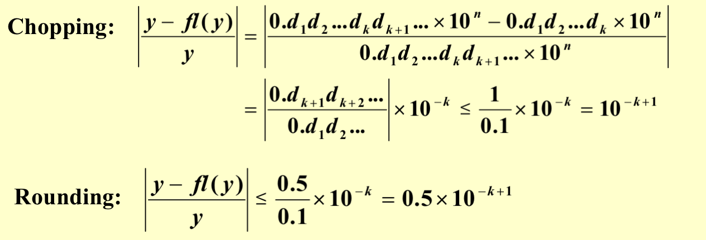
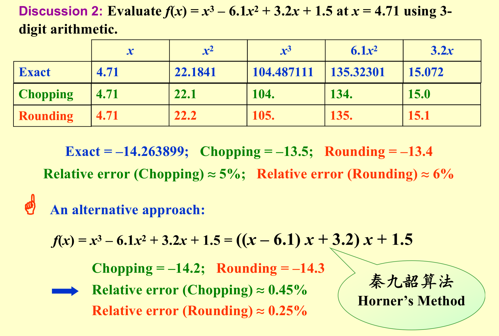
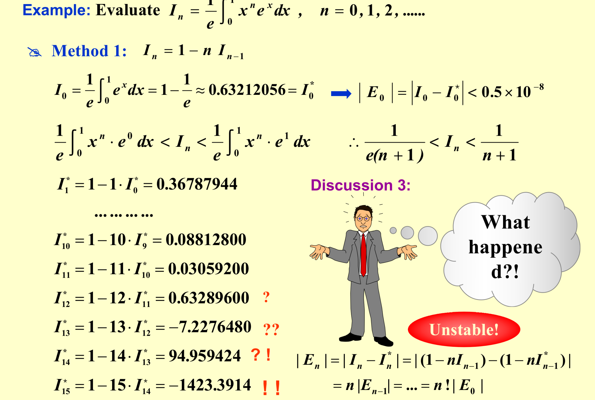
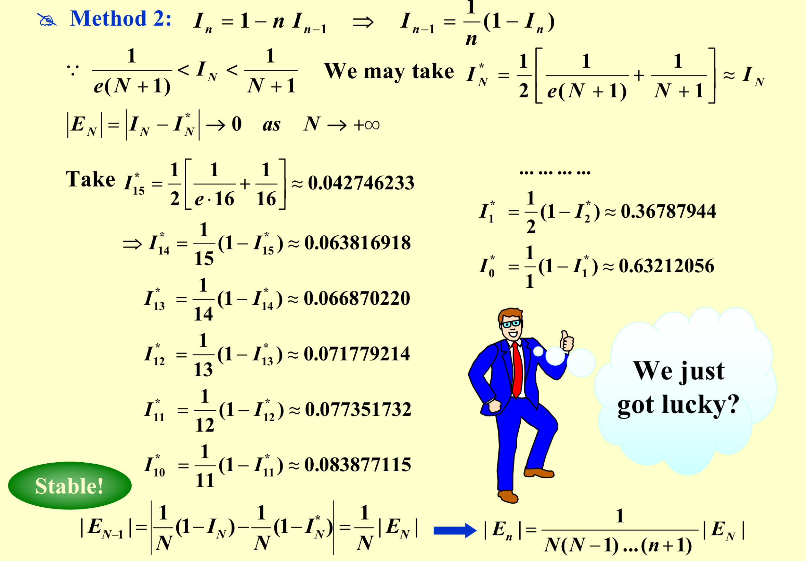

# Mathematical Preliminaries

## Roundoff Errors and Computer Arithmetic

* **Truncation Error**: the error involved in using a truncated, or finite, summation to approximate the sum of an infinite series.

* **Roundoff Error**: the error produced when performing real number calculations.  It occurs because the arithmetic performed in a machine involves numbers with only a finite number of digits.

If $p^*$ is an approximation to p, the absolute error is | $p$ – $p^*$ |, and the relative error is | $p$ – $p^*$ | / | p |, provided that p $\ne$ 0.

The number $p^*$ is said to approximate $p$ to t significant digits (or figures) if $t$ is the largest nonnegative integer for which $\frac{|p-p^*|}{|p|}<5\times10^{-t}$

> To achieve $To\ t\ significant\ digits$ Both Chopping & Rounding has to approximate at $k = t$

* How will roundoff error affect our results?

   Subtraction of nearly equal numbers will cause a cancellation of significant digits.

## Algorithms and Convergence

An algorithm that satisfies that small changes in the initial data produce correspondingly small changes in the final results is called stable; otherwise it is unstable.  

An algorithm is called conditionally stable if it is stable only for certain choices of initial data.

Suppose that $E_0 > 0$  denotes an initial error and $E_n$ represents the magnitude of an error after n subsequent operations.  If $E_n \approx CnE_0$, where C is a constant independent of n, then the growth of error is said to be linear.  If $E_n \approx C^n E_0$, for some C > 1, then the growth of error is called exponential.

