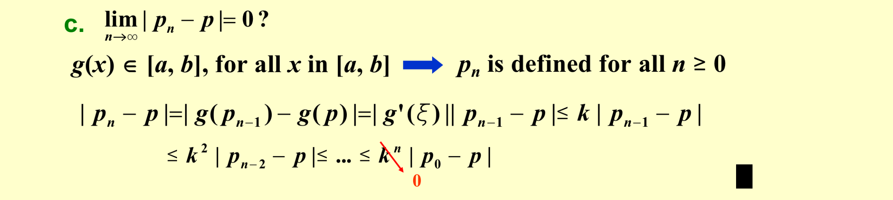
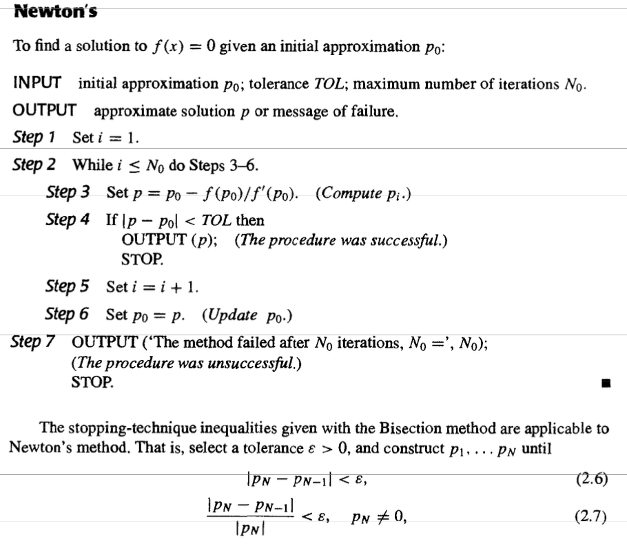
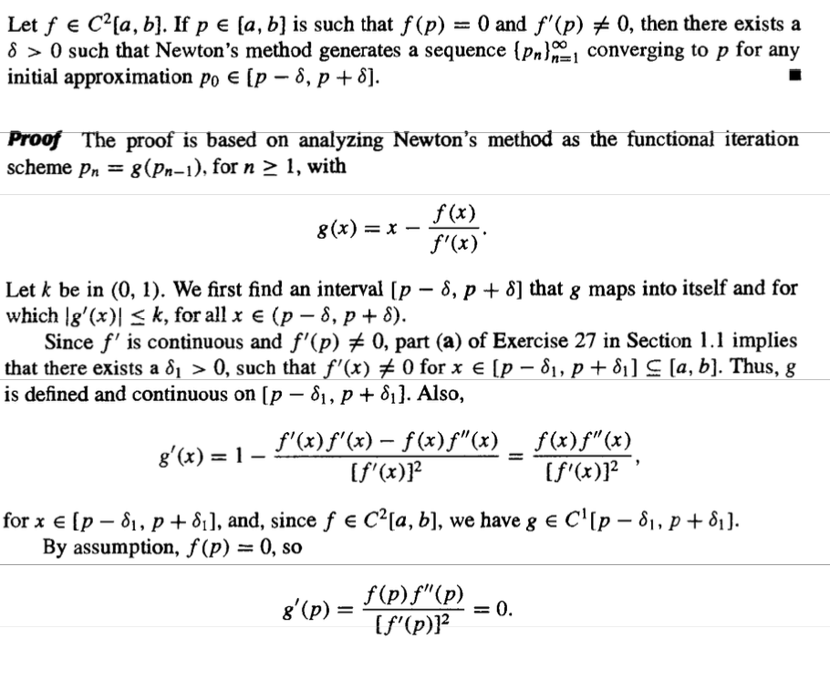
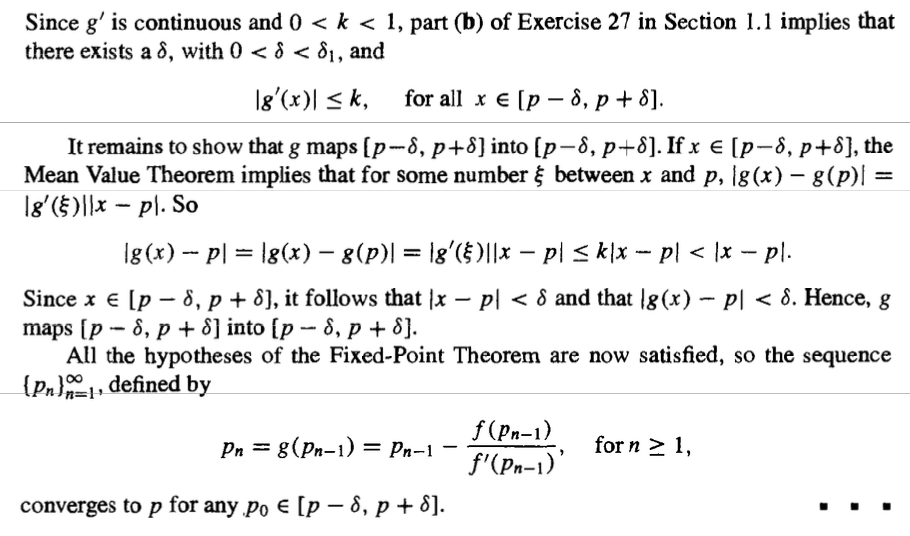
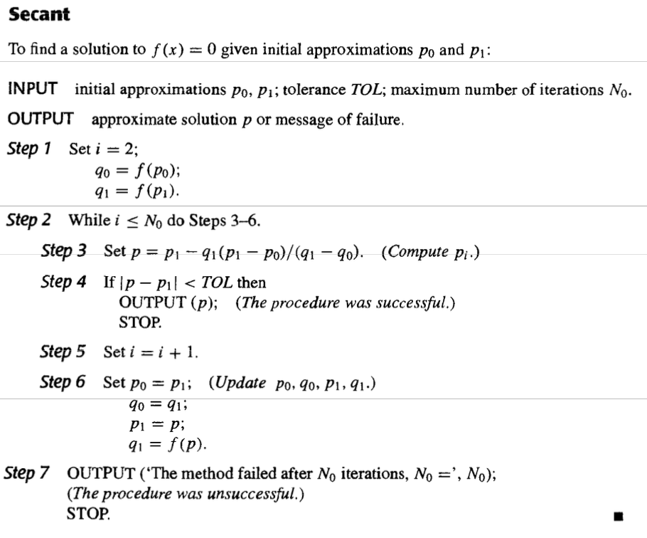
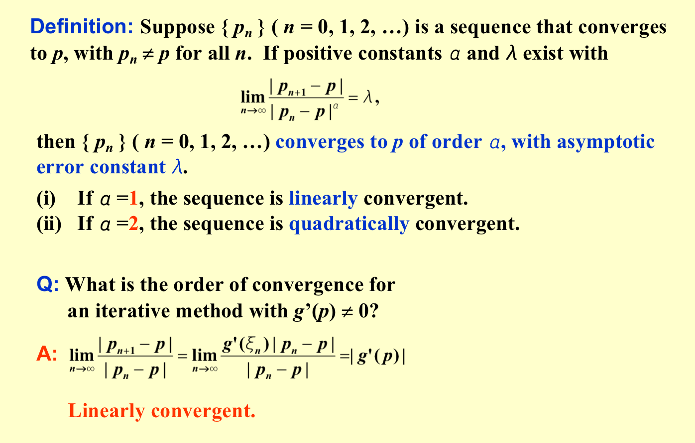
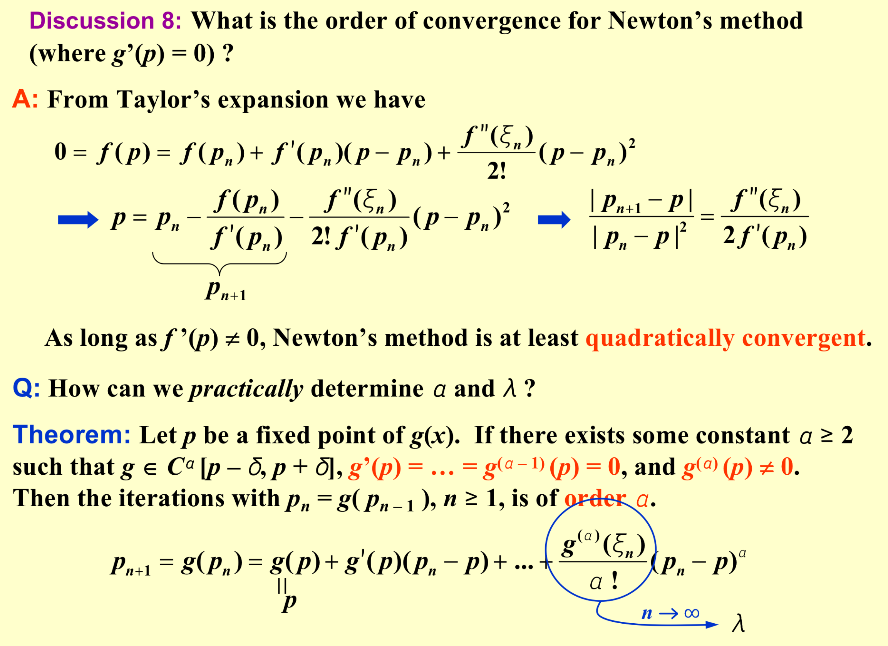
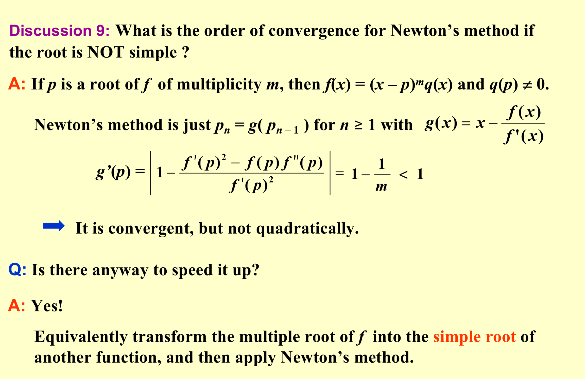
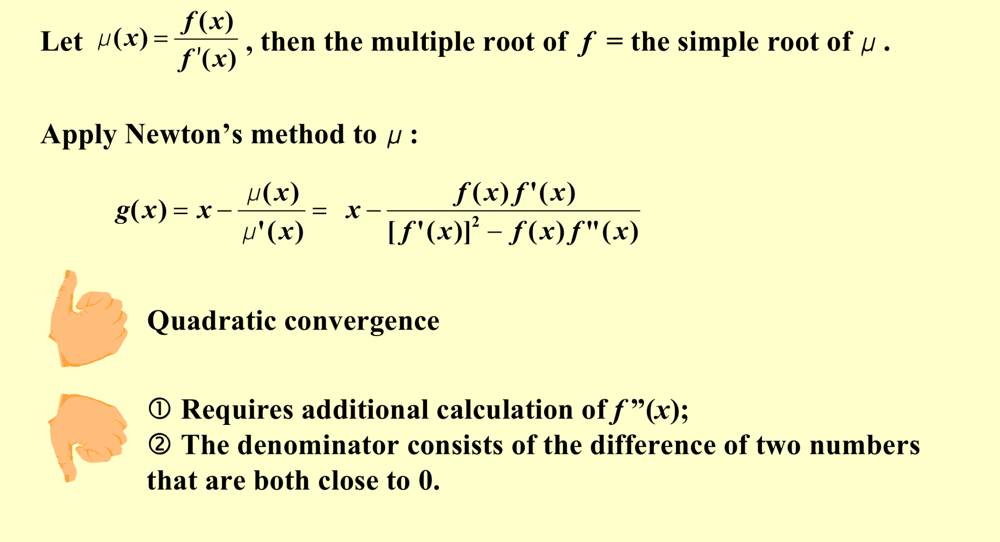
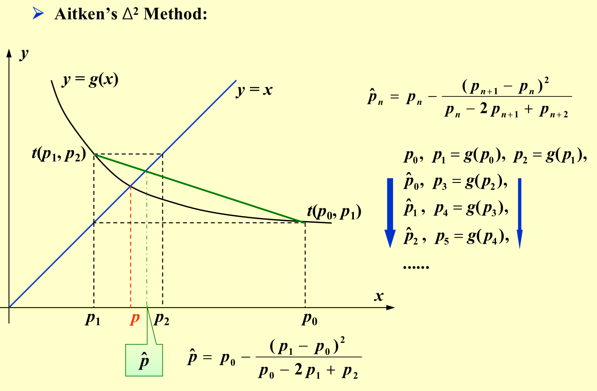

# Solutions of Equations in one variable

##  The Bisection Method

```C
Algorithm: Bisection
To find a solution to f (x) = 0 given the continuous function f on the interval [ a, b ], where f (a) and f (b) have opposite signs.
Input: endpoints a, b; tolerance TOL; maximum number of iterations Nmax.
Output: approximate solution p or message of failure.
  
Step 1  Set  i = 1;
             FA = f (a) ;
Step 2  While( i<=Nmax)  do  steps 3-6
	Step 3  Set  p = a + ( b – a ) / 2 ; /* compute pi */
               FP = f (p) ; 
	Step 4  If ( FP == 0 ) or ( b - a ) / 2 < TOL  then  Output (p); 
  	             STOP; /* successful */
	Step 5  Set  i ++;
	Step 6  If  sign(FA) · sign(FP) > 0 then set a = p ; FA = FP ;
                           Else set b = p ; /* update ai, bi */  
Step 7  Output (Method failed after Nmax iterations); /* unsuccessful */
        STOP.
```

Other Stopping Procedures

> $|p_N-p_{N-1}|<\epsilon$

> $\frac{|p_N-p_{N-1}|}{|p_N|}<\epsilon$

> $|f(p_N)|<\epsilon$

#### Therom

Suppose that $f\in C[a,b]$ and $f(a)f(b)<0$ The Bisection method generates a seqence $\{p_n\}_{n=1}^{\infty}$ approximating a zero p of f with $|p_n-p|\le\frac{b-a}{2^n}$ when $n \ge1$

## Fixed-Point Iteration

### Theorem: (Fixed-Point Theorem)

Let  $g \in C[a, b]$ be such that $g(x) \in [a, b]$, for all x in $[a, b]$.  

* $g$ has a fixed point in $[a,b]$

* Suppose, in addition, that $g’$ exists on $(a, b)$ and that a constant $0 < k < 1$ exists with$|g’(x)| \le k$  for all x in (a, b).  Then:

  (1) The fixed point is unique $Proof \ P57$  (By Contradiction)

  (2)For any number $p_0$ in [a, b], the sequence defined by $p_n = g( p_{n – 1} )$, $n \ge 1$, converges to the **unique** fixed point $p$ in $[a, b]$.  $Proof \ P61-62$ 

  

#### Corollary

If  $g$ satisfies the hypotheses of the Fixed-Point Theorem, then bounds for the error involved in using $p_n$ to approximate $p$ are given by (for all n $\ge$ 1) 

$|p_n-p|\le k^n max\{p_0-a,b-p_0\}$

$|p_n-p|\le\frac{1}{1-k}|p_{n+1}-p_n|$

$|p_n-p|\le \frac{k^n}{1-k}|p_1-p_0|$

$Proof\ P62$

```C
Algorithm: Fixed-Point Iteration
Find a solution to p = g(p) given an initial approximation p0.
Input: initial approximation p0; tolerance TOL; maximum number of iterations Nmax.
Output: approximate solution p or message of failure.
Step 1  Set  i = 1;
Step 2  While ( i <= Nmax)  do  steps 3-6
		Step 3  Set  p = g(p0);  /* compute pi */
		Step 4  If  | p - p0 | < TOL  then  Output (p);  /* successful */
			STOP;
		Step 5  Set  i ++;
		Step 6  Set  p0 = p ;   /* update p0 */
Step 7  Output (The method failed after Nmax iterations);  /* unsuccessful */
				STOP.
```

## Newton's Problem

Linearize a nonlinear function using Taylor’s expansion.



### Therom





### Secant Method



### Method of False Position

P73 Just Modify to always bracket the root.

## Error Analysis for Iterative Methods



#### Therom 2.7

Let $g \in C[a,b]$ be such that $g(x)\in [a,b]$ for all $x\in [a,b]$.Suppose, in addition,that is continuous on $(a,b)$ and a positive constant $k<1$ exists with $|g'(x)|\le k$ for all $x\in (a,b)$

* If $g'(p)\ne 0$ then for any number $p_0$ in $[a,b]$ ,the sequence $p_n=g(p_{n-1})$ converges **only linearly** to the unique fixed point $p\ in\ [a,b]$

  $p_{n+1}-p=g(p_n)-g(p)=g'(\epsilon_n)(p_n-p)$



#### Therom 

$f\in C[a,b]$ has a simple zero at $p$ in $(a,b)$ if and only if $f(p)=0$ but $f'(p)\ne 0$

$f\in C^m[a,b]$ has a  zero of multiplicity m  at $p$ in $(a,b)$ if and only if $0=f(p)=f'(p)=……=f^{m-1}(p)$ but $f^m(p)\ne 0$





## Accelarating Convergence



```C
Algorithm: Steffensen’s Acceleration
Find a solution to x = g(x) given an initial approximation p0.
Input: initial approximation p0; tolerance TOL; maximum number of iterations Nmax.
Output: approximate solution x or message of failure.
Step 1  Set  i = 1;
Step 2  While ( i <= Nmax)  do  steps 3-6
	Step 3  Set  p1 = g(p0) ; 
          p2 = g(p1) ; 
          p = p0 -( p1 - p0 )2 / ( p2 -2 p1 + p0 ) ;
	Step 4  If  | p - p0 | < TOL  then  Output (p);  /* successful */
					STOP;
	Step 5  Set  i ++;
	Step 6  Set  p0 = p ;   /* update p0 */
Step 7  Output (The method failed after Nmax iterations);  /* unsuccessful */
				STOP.
```


