# Interpolation and Polynomial Approximation

## Interpolation and the Lagrange Polynomial

### Therom 3.2

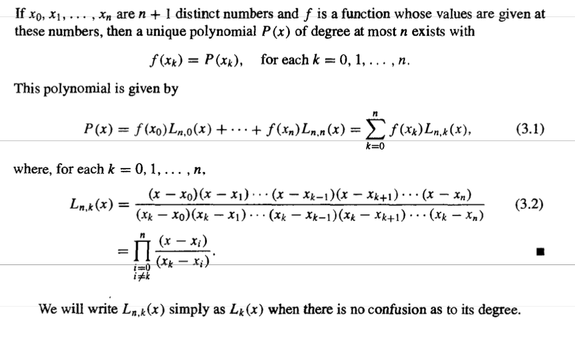

* Proof of Uniqueness

  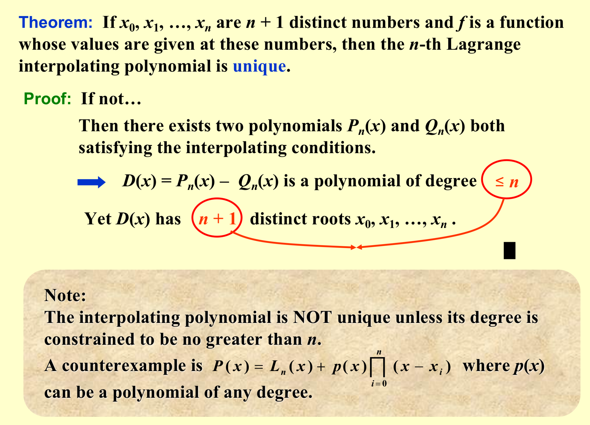

### Remainder

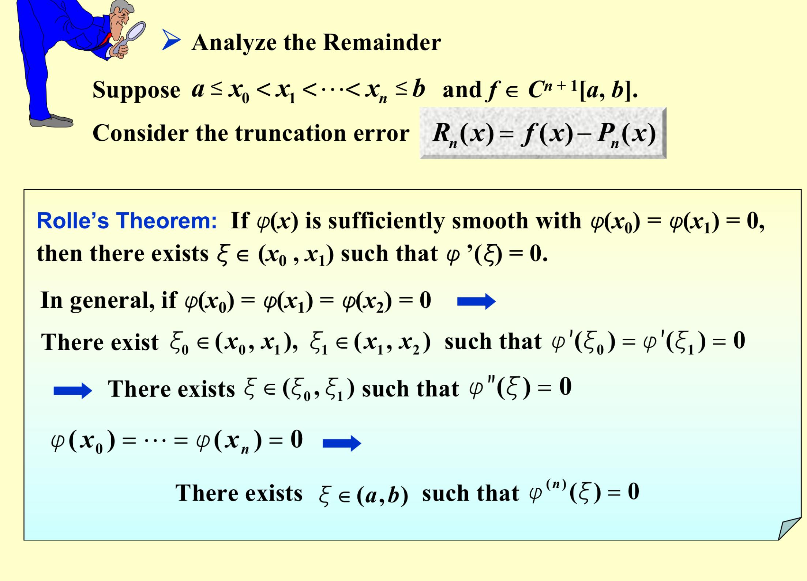

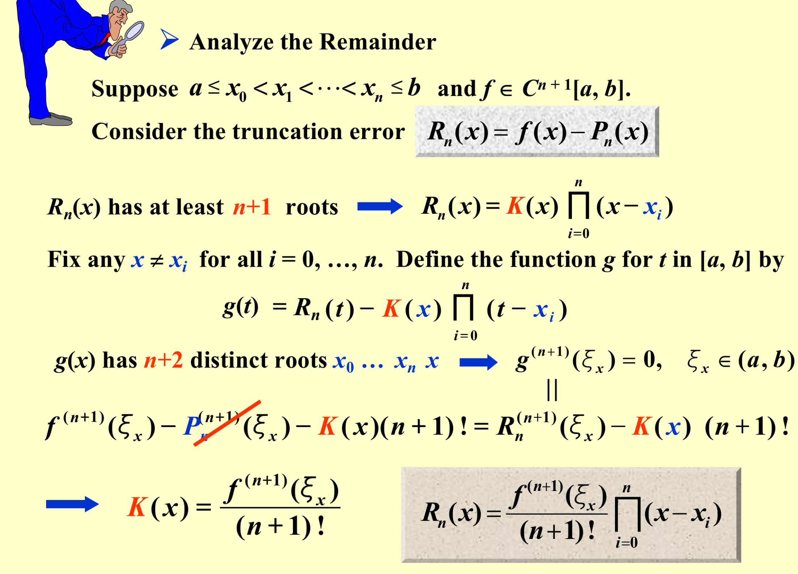

$Specific\ Proof\ P112$

### Def

Let $f$ be a function defined at $x_0, x_1 …… x_n $ and suppose that  $m_0, m_1 …… m_n $ are k distince integers . The Lagrange polynomial that agrees with $f(x)$ at k points $x_{m1},x_{m2}…… x_{m_k}$ is denoted by $P_{m_1,m_2……,m_n}(x)$

### Neville’s Method

#### Therom 3.5

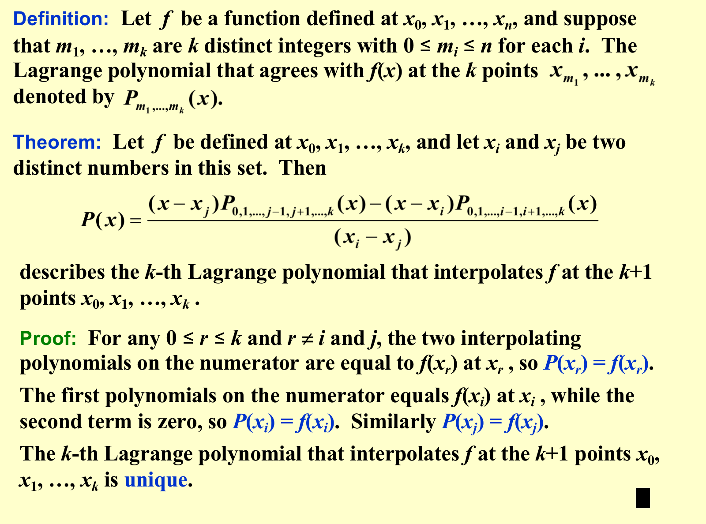

#### Peseudo code

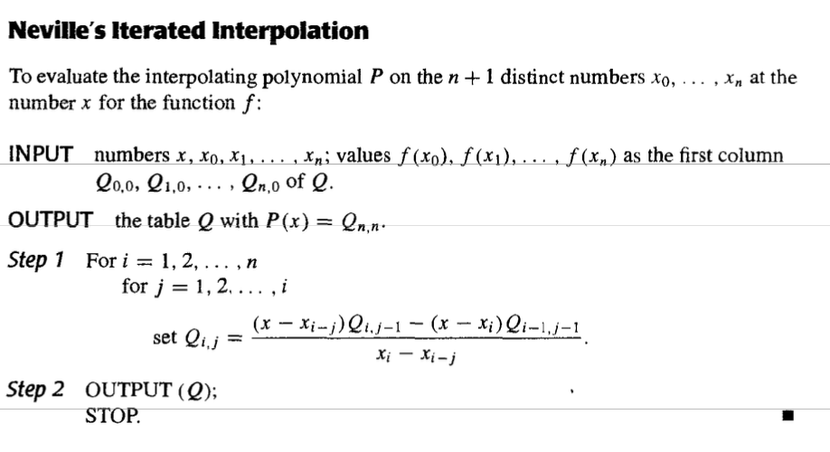

## Divided Difference

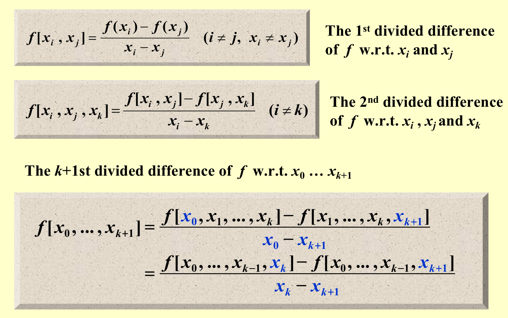

### Newton’s Interpolation

$P_n(x)=f[x_0]+\sum_{k=1}^nf[x_0,x_1,……x_k](x-x_0)……(x-x_{k-1})$

>* https://www.youtube.com/watch?v=S7QIU0i1qLE
>
>Newton's Forward Difference Interpolation and Newton's Backward Difference Interpolation are both methods for constructing polynomial interpolants, but they differ in terms of the direction in which they compute the differences.
>
>1. **Newton's Forward Difference Interpolation:**
>  - **Differences:** Forward interpolation starts with the given data point closest to the beginning (usually the lowest x-value) and moves forward.
>  - **Formula:** The forward difference formula is given by: $f[x_0]+f[x_0,x_1](x−x_0)+f[x_0,x_1,x_2](x−x_0)(x−x_1)+…$
>2. **Newton's Backward Difference Interpolation:**
>  - **Differences:** Backward interpolation starts with the given data point closest to the end (usually the highest x-value) and moves backward.
>  - **Formula:** The backward difference formula is given by: $f[x_n]+f[x_n,x_{n−1}](x−x_n)+f[x_n,x_{n−1},x_{n−2}](x−x_n)(x−x_{n−1})+…$
>
>In both cases, the differences $f[x_i,x_{i−1},…,x_0]$ are computed using the divided difference approach. The primary difference between the two methods lies in the direction in which these differences are calculated.
>
>**Key Points:**
>
>- Newton's Forward Difference Interpolation works from the initial data point towards the desired point.
>- Newton's Backward Difference Interpolation works from the final data point towards the desired point.
>- Both methods use divided differences to calculate the coefficients of the interpolation polynomial.
>- The choice between forward and backward interpolation may depend on the specific problem and the nature of the available data

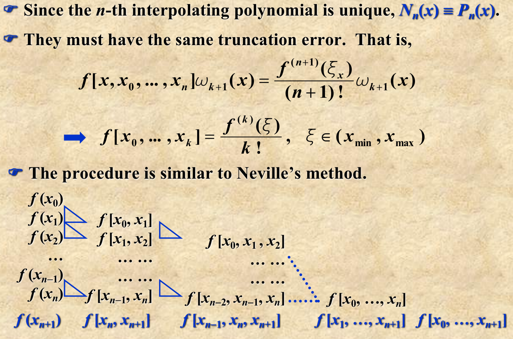

$Pseudocode\ P124-125$

* Refer to P126 - 128!

## Hermite's Method

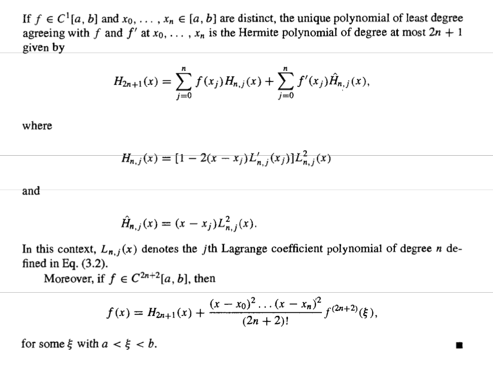

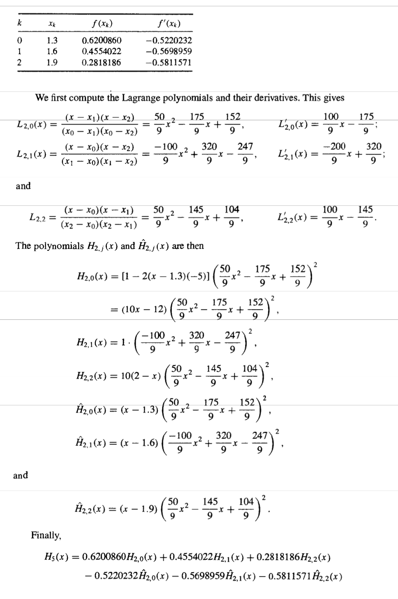

* Persuadocode

  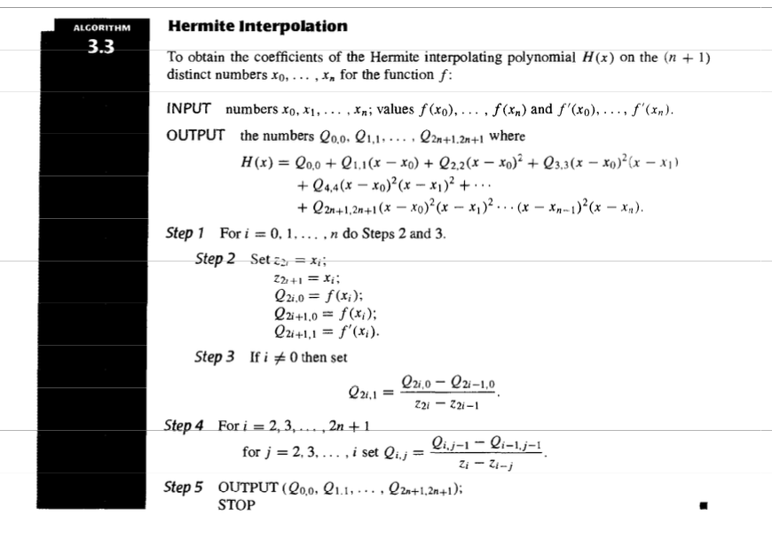

## Cubic Spline INterpolation

How can we make a smooth interpolation without asking too much from $f$ ?Headache …

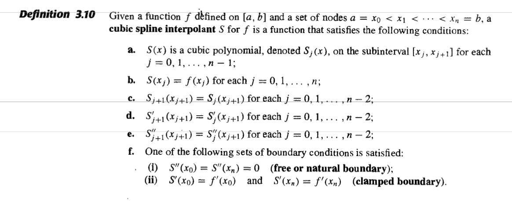

### Further

Suppose $S_j(x)=a_j+b_j(x-x_j)+c_j(x-x_j)^2+d_j(x-x_j)^3$

* $a_{j+1}=S_j(x_{j+1})S_j(x_{j+1})=a_j+b_j(x_{j+1}-x_j)+c_j(x_{j+1}-x_j)^2+d_j(x_{j+1-x_j})^3$

  For notation $h_j=x_{j+1}-x_j$  $a_{j+1}=a_j+b_jh_j+c_jh_j^2+d_jh_j^3$   $(1)$

* $S'_j(x_j)=b_j$ Applying condition （d）

  $b_{j+1}=b_j+2c_jh_j+3d_jh_j^2$  $(2)$

* $c_j=S''_j(x_j)/2$ and applying condition (e). 

  $c_{j+1}=c_j+3d_jh_j$  $(3)$

$\Rightarrow h_{j-1}c_{j-1}+2(h_{j-1}+h_j)c_j+h_jc_{j+1}=\frac{3}{h_j}(a_{j+1}-a_j)-\frac{3}{h_{j-1}}(a_{j+1}-a_j)$

#### Natural Cubic Spline

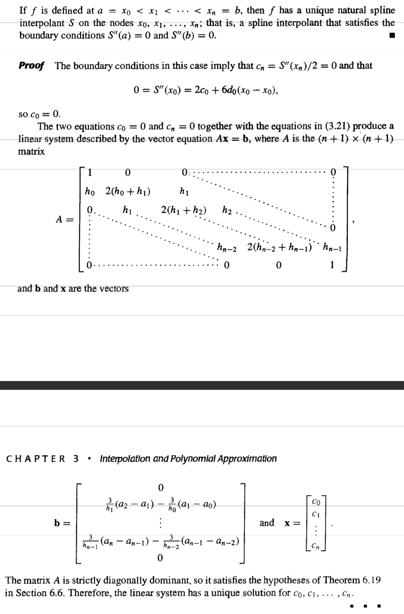

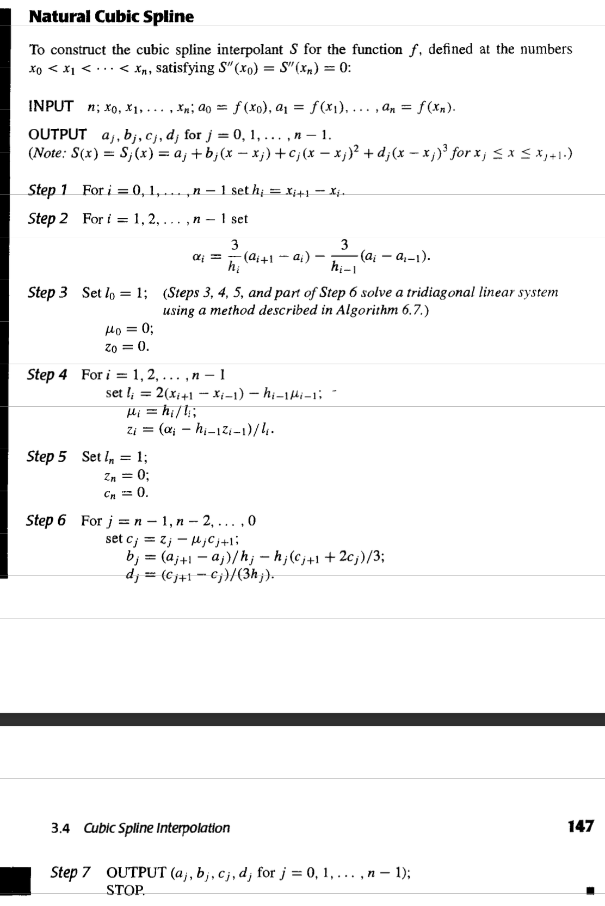

#### Clamped Boundary

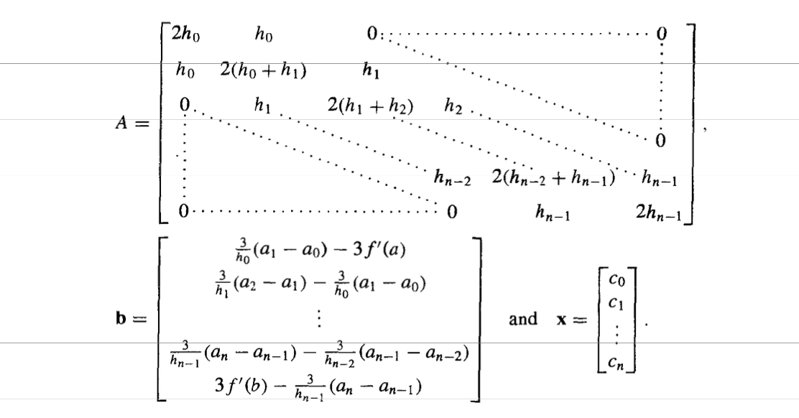

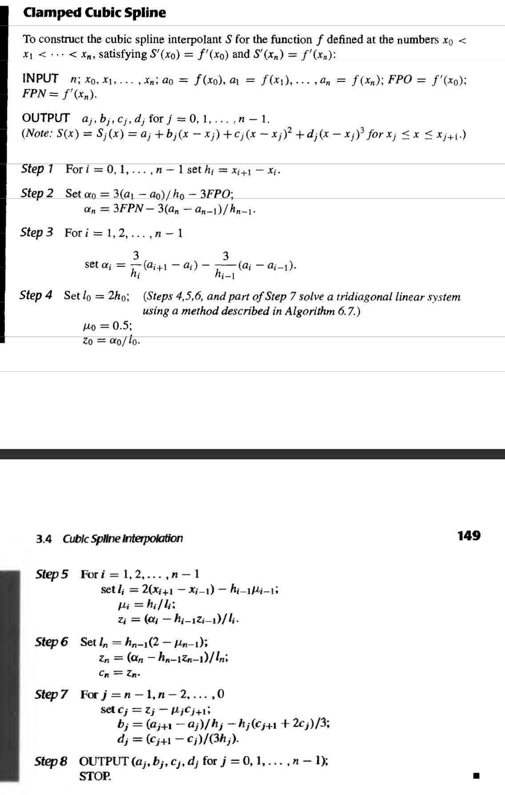

