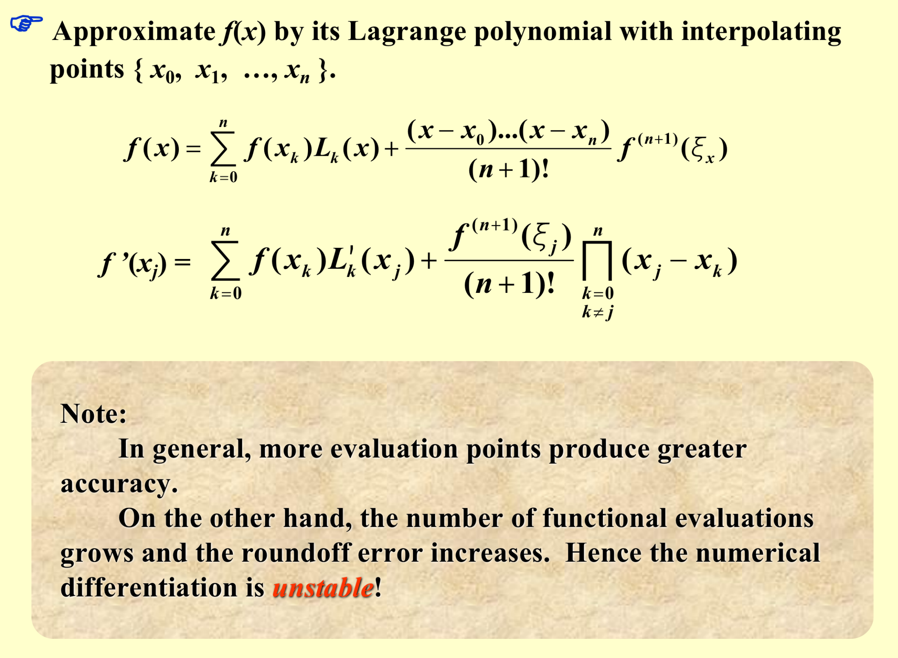
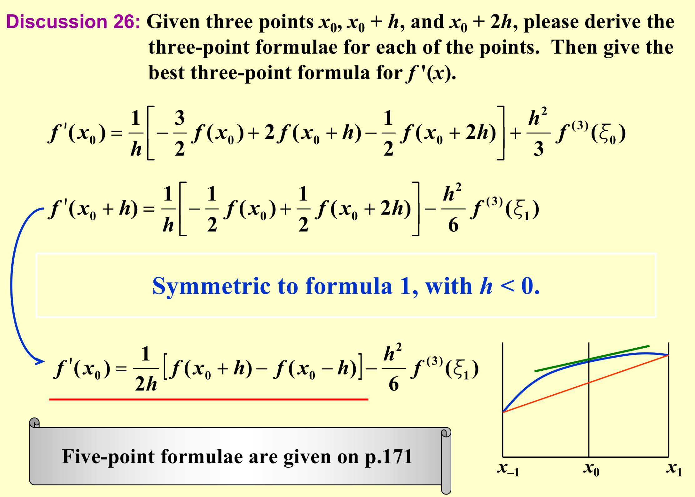
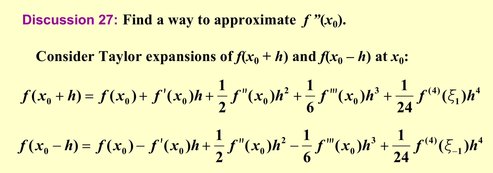
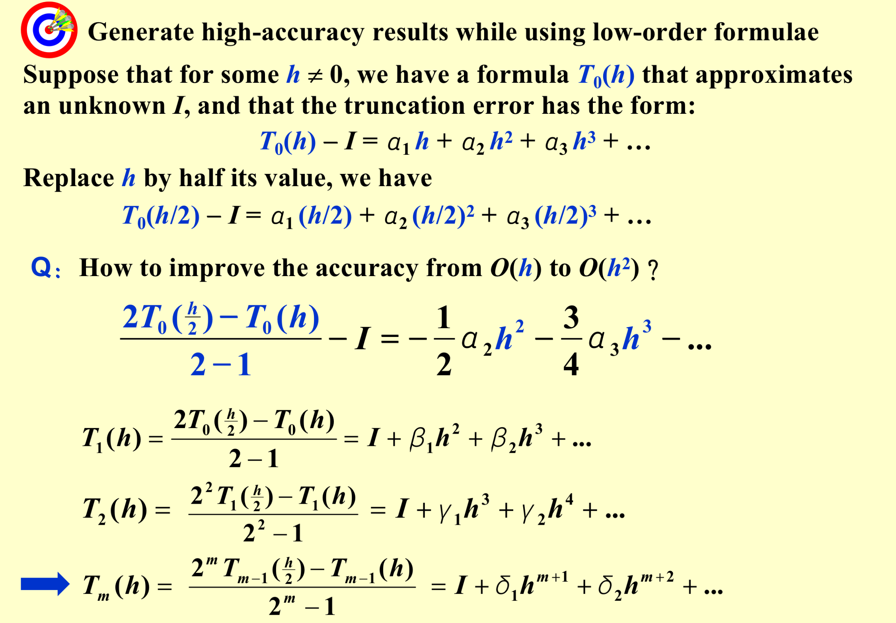
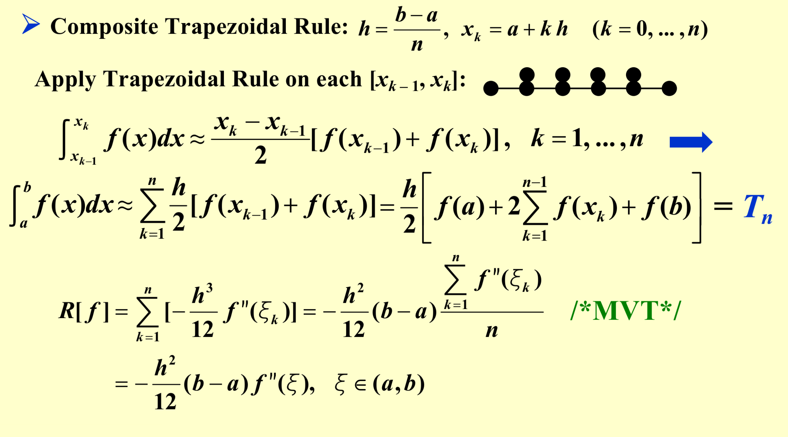
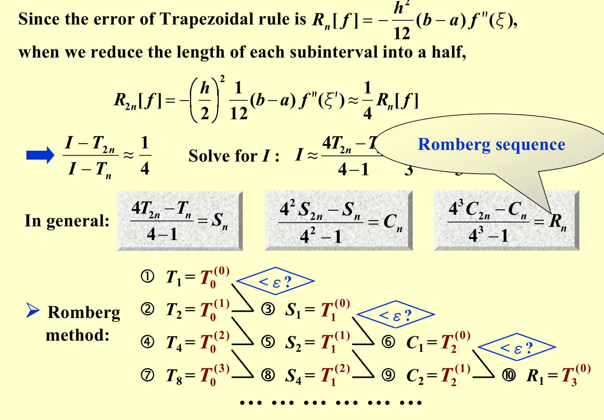
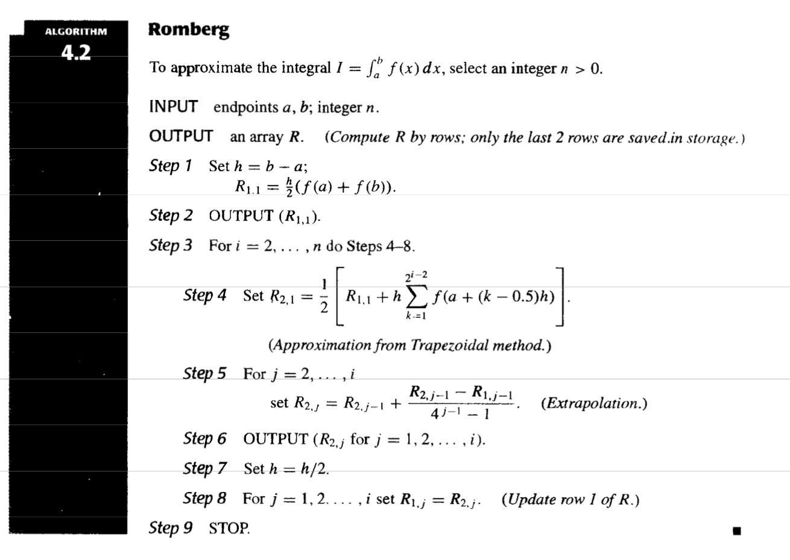
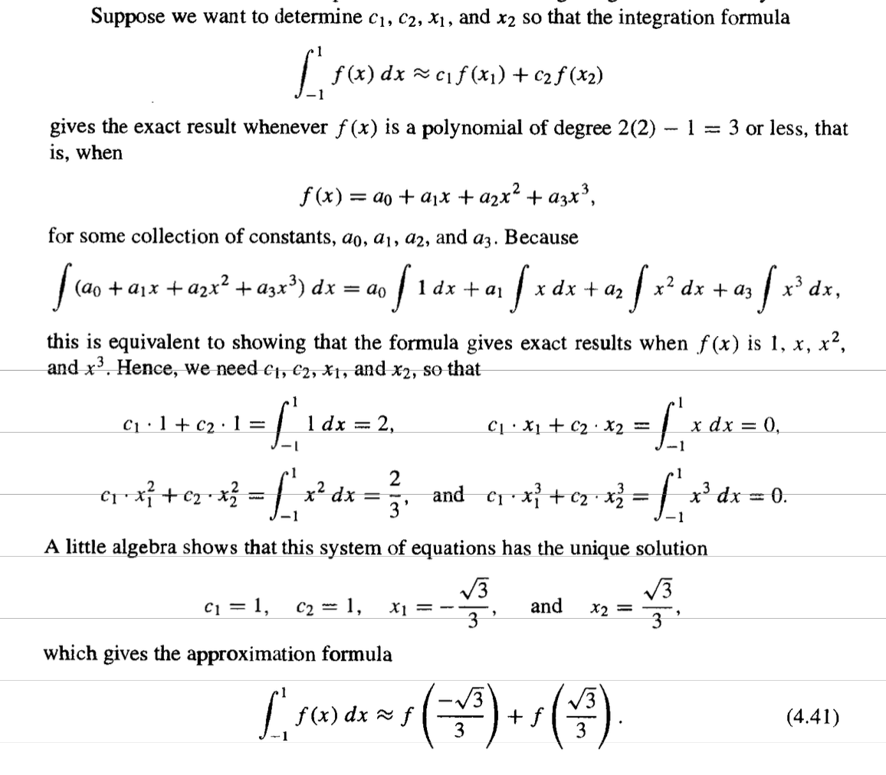
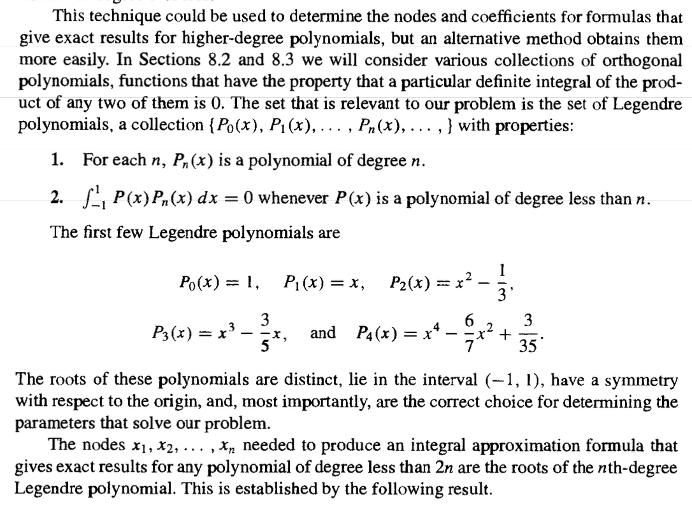
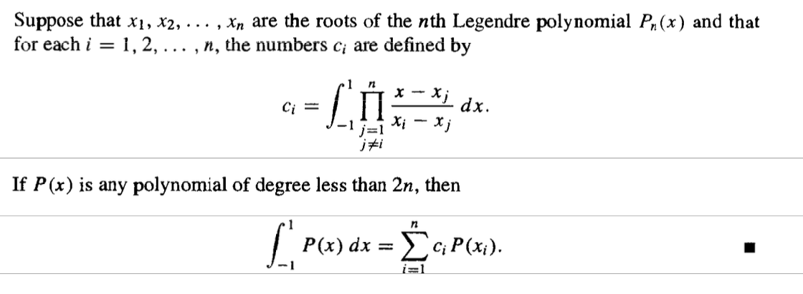

# Numerical Differentiation and Integration

> Refer to the Book .（This page **LACKS** many contents）

## Numerical Differentiation

## Richardson’s Extrapolation

## Elements of Numerical Integration

Approximate $I=\int_a^b f(x)dx$

* Integrate the Lagrange interpolating polynomial of  $f (x)$ instead.

## Composite Numerical Integration

### Composite Trapezoidal Rule

### Composite Simpson’s Rule

## Romberg Integration

## Adaptive Quadrature Methods

## Gaussian Quadrature

* Precision of degree 3(produces exact result for every polynomial of degree 3 or less)

