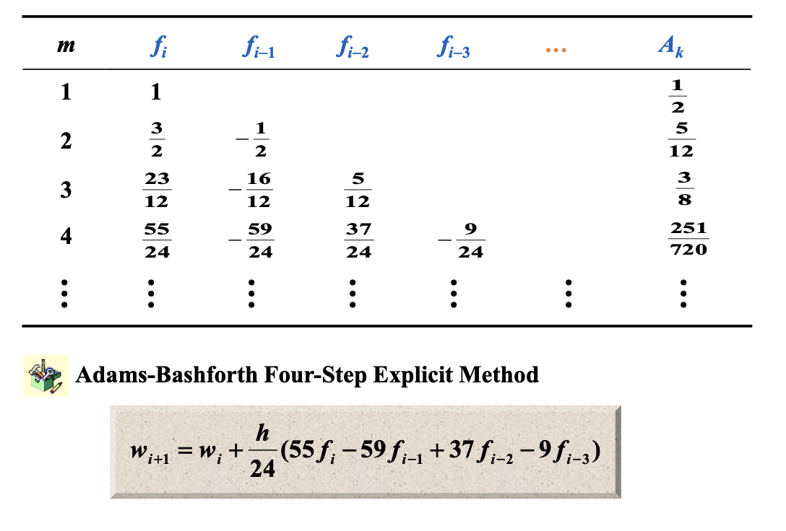

## Euler's method：

The Euler’s method is a first-order numerical procedure for solving ordinary differential equations (ODE) with a given initial value.

In Euler’s method, you can approximate the curve of the solution by the tangent in each interval (that is, by a sequence of short line segments), at steps of `h`.

*In general*, if you use small step size, the accuracy of approximation increases.

### modified Euler’s method:

Modified Euler's method, also known as the Improved Euler method or Heun's method, is a numerical technique used for approximating solutions to ordinary differential equations (ODEs). It is an extension of the basic Euler's method and provides better accuracy by incorporating a simple correction.

The standard Euler's method is a first-order numerical method that uses a linear approximation to update the solution from one time step to the next. However, it can have limited accuracy, especially for ODEs with rapidly changing behavior.

The Modified Euler's method improves upon this by using a two-step process:

1. **Prediction Step:**

   Use the current information to make a preliminary estimate of the solution at the next time step.

   **Predicted Value** $(P)$:$\tilde{y}_{i+1}=y_{i}+h⋅f(t_i,y_i)$

   Here, $y_i$  is the current approximation, h is the step size, and $f(t_i,y_i)$represents the derivative of y*y* with respect to $t$ at the current point.

2. **Correction Step:**

   Use the predicted value to compute a more accurate estimate by incorporating the derivative at the **predicted point**.

   Corrected Value $(C)$:$y_{i+1}=y_i+\frac{h}{2}[f(t_i,y_i)+f(t_{i+1},\tilde{y}_{i+1})]$

   In this step, $f(t_i,y_i)$represents the derivative at the initial point, and $f(t_{i+1},y_{i+1})$ represents the derivative at the predicted point.

Modified Euler's method has a local truncation error of $O(h^3)$, which is an improvement over the $O(h^2)$ local truncation error of the basic Euler method. This makes it more accurate for a wide range of ODEs, and it is still relatively simple to implement.

## Runge-Kutta Methods

Runge-Kutta methods are a family of iterative numerical techniques used for solving ordinary differential equations (ODEs) or systems of ODEs. These methods provide an approximation of the solution at discrete points in the domain by iteratively updating the solution from one point to the next.

**Single-Step Method:** 

In a single-step method, the solution at the next time step $(t_{i+1},w_{i+1})$  is determined based on the information available at the current time step  $(t_{i},w_{i})$. This implies that we calculate the next point of the solution through one iteration rather than computing the entire solution curve at once.

We can improve the result by finding a better slope.

**Generalize the modified Euler’s method**

## Multistep Methods

Use a linear combination of y and y at several mesh points to better approximate $y(t_{i+1})$

$w_{i+1}=a_{m-1}w_i+a_{m-2}w_{i-1}+……+h[b_mf_{i+1}+b_{m-1}f_i+……+b_0f_{i+1-m}]$

>Newton's Forward Difference Interpolation and Newton's Backward Difference Interpolation are both methods for constructing polynomial interpolants, but they differ in terms of the direction in which they compute the differences.
>
>1. **Newton's Forward Difference Interpolation:**
>   - **Differences:** Forward interpolation starts with the given data point closest to the beginning (usually the lowest x-value) and moves forward.
>   - **Formula:** The forward difference formula is given by: $f[x_0]+f[x_0,x_1](x−x_0)+f[x_0,x_1,x_2](x−x_0)(x−x_1)+…$
>2. **Newton's Backward Difference Interpolation:**
>   - **Differences:** Backward interpolation starts with the given data point closest to the end (usually the highest x-value) and moves backward.
>   - **Formula:** The backward difference formula is given by: $f[x_n]+f[x_n,x_{n−1}](x−x_n)+f[x_n,x_{n−1},x_{n−2}](x−x_n)(x−x_{n−1})+…$
>
>In both cases, the differences $f[x_i,x_{i−1},…,x_0]$ are computed using the divided difference approach. The primary difference between the two methods lies in the direction in which these differences are calculated.
>
>**Key Points:**
>
>- Newton's Forward Difference Interpolation works from the initial data point towards the desired point.
>- Newton's Backward Difference Interpolation works from the final data point towards the desired point.
>- Both methods use divided differences to calculate the coefficients of the interpolation polynomial.
>- The choice between forward and backward interpolation may depend on the specific problem and the nature of the available data.

### Adams-Bashforth explicit m-step technique

 **Derive from integration**

* Adams-Bashforth explicit m-step technique

**1.**Use the Newton backward-difference formula to interpolate f  on $(t_i,f_i),(t_{i-1},f_{i-1})……(t_{i+1-m},f_{i+1-m})$ and obtain $P_{m-1}(t)$ 

**2.**Or Let $t=t_i+sh\ s\in[0,1]$ we have

$\int_{t_{i}}^{t_{i+1}}f(t,y(t))dt=h\int_0^1P_{m-1}(t_i+sh)ds+h\int_0^1R_{m-1(t_i+sh)}ds$

$\Rightarrow w_{i+1}=w_i+h\int_0^1P_{m-1}(t_i+sh)ds$

**3.**  The local truncation error for a multistep method is $\tau_{i+1}(h)=y_{i+1}-(a_{m-1}y_i+……+a_0y_{i+1-m})/h-[b_mf_{i+1}+……+b_0f_{i+1-m}]$ for each $i=m-1,m……,n-1$

**Example**

**derive the Adams-Bashforth two-step explicit method.**

Note ： $h$ is step length $h=\triangle x/n$

**Use the** **Newton forward-difference formula to interpolate f**
