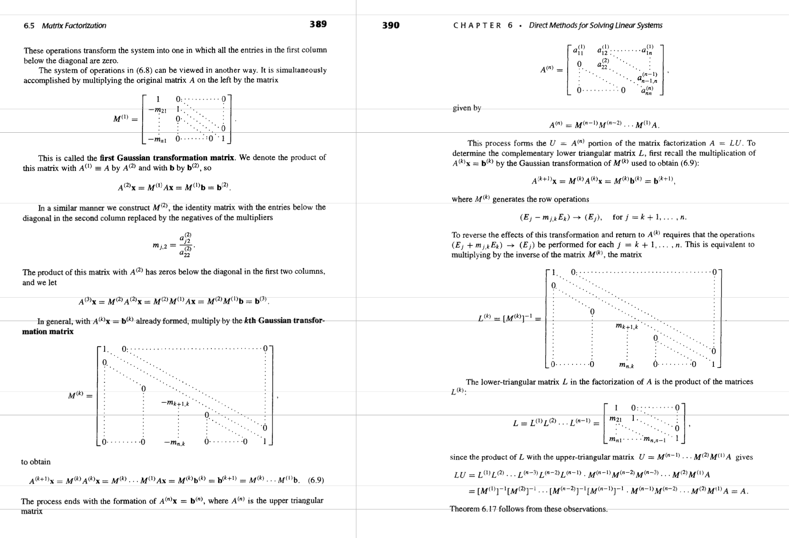
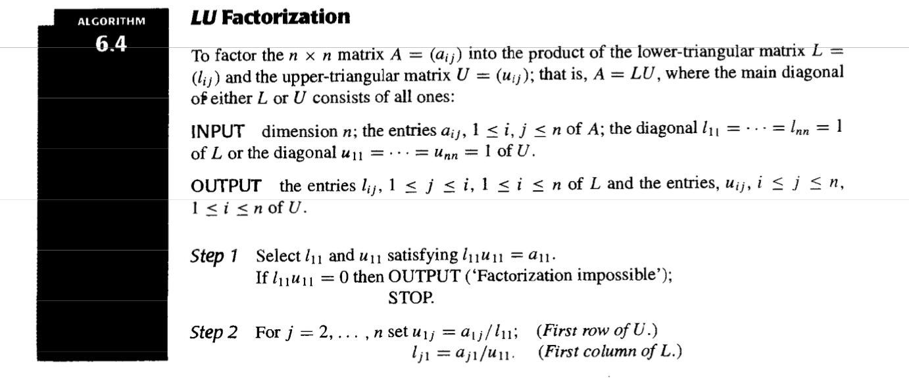
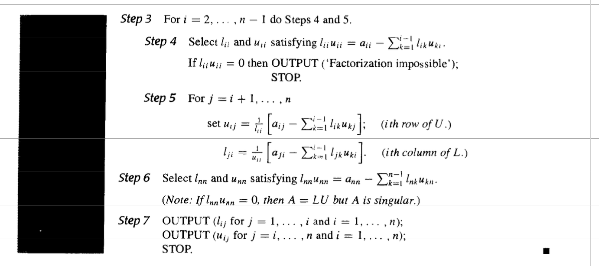
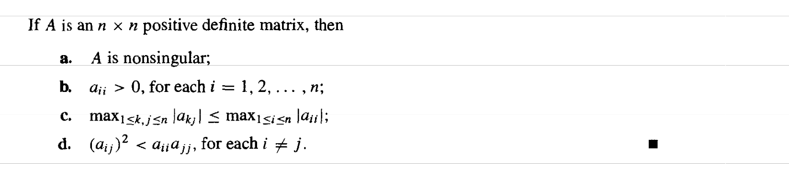
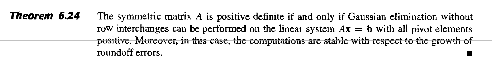
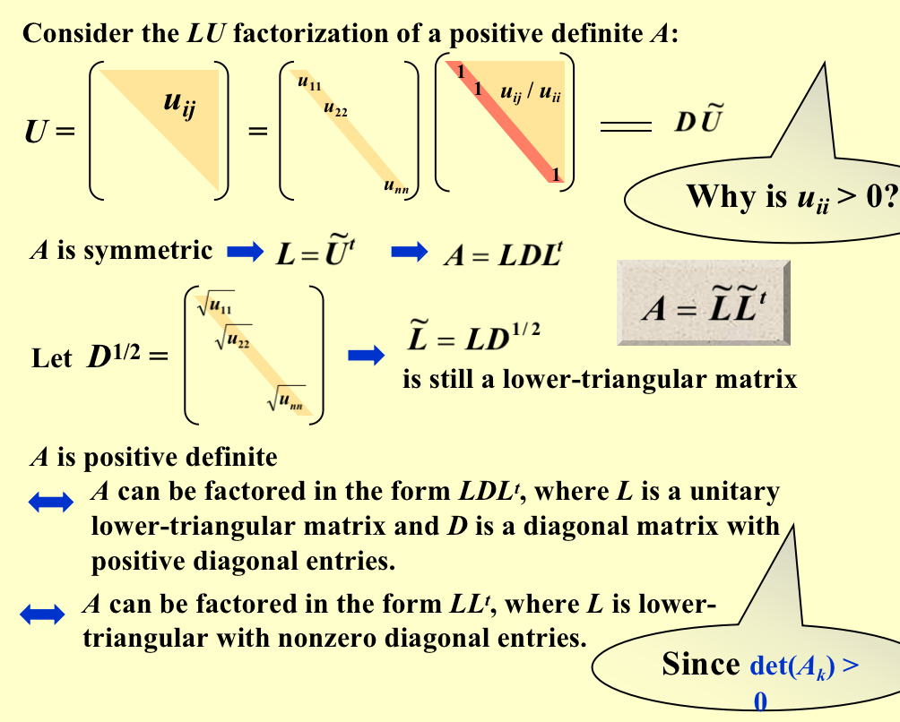
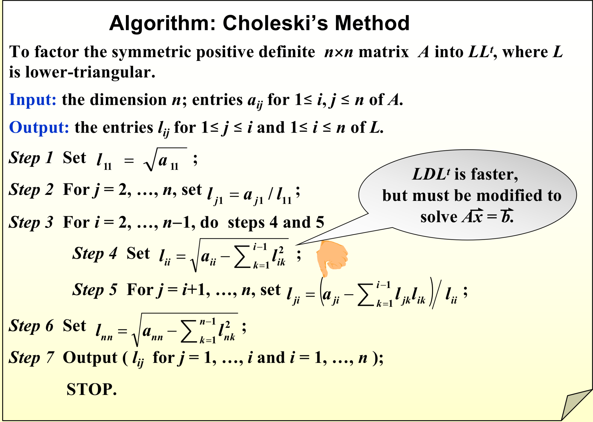
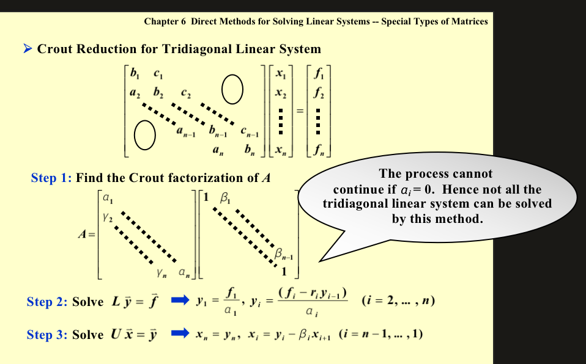

# Direct Methods for Solving Linear Systems

## Pivoting Strategies

* Small pivot element may cause trouble.
* Partial Pivoting (or maximal column pivoting)

> Place the element in the pivot position that is largest relative to the entries in its row.

* Step 1: define a scale factor $s_i$ for each **row** as $s_i=max_{1\le j\le n}|a_{ij}|$

* Step 2:Determine the smallest $p\ge k$ such that $\frac{|a_{pk}^{(k)}|}{s_p}=max_{k\le i\le n}\frac{|a_{ik}^{(k)}|}{s_i}$  (If already at the kth row)

## LU Factorization

* With forward substituion and then backward substitution easily solve the equation.

## Special Types of Matrices

* A strictly diagonally dominant matrix A is nonsingular.  Moreover, Gaussian elimination can be performed without row or column interchanges, and the computations will be stable with respect to the growth of roundoff errors.

* A matrix A is **positive definite** if it is **symmetric** and if $\vec{x^t}A\vec{x}$ > 0 for every n-dimensional vector$\vec{x}\ne 0$.

* Also $A^{-1}$ is positive definite as well and $a_{ii}>0$
* $max|a_{ij}|\le max|a_{kk}|;(a_{ij}^2)<a_{ii}a_{jj}$
* Each of A’s leading principal submatrices Ak has a positive determinant.

### LU factorization of a positive definite A

### Crount Reduction For Tridiagonal Linear System

