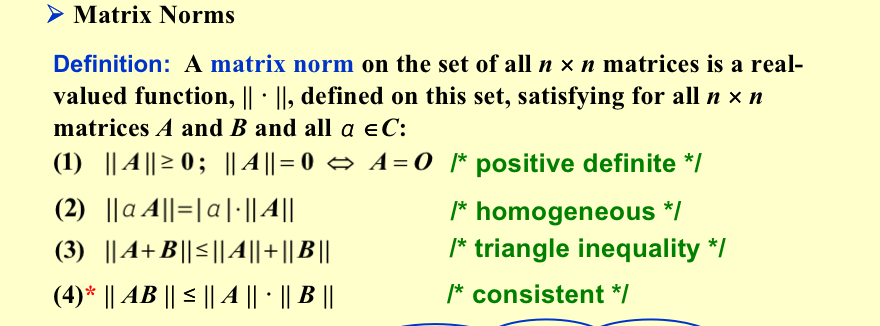
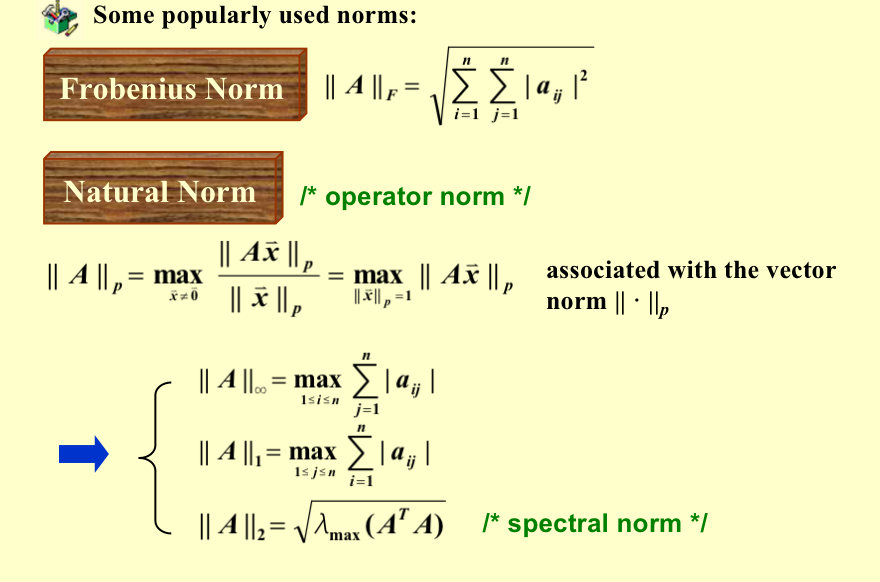
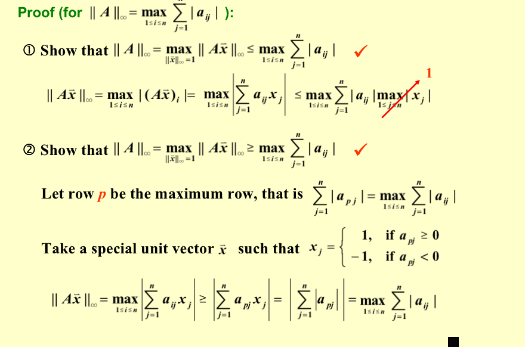

## Vector Norms

### Properties 

* $||\vec{x}||\ge 0$ ($||\vec{x}||=0 \Leftrightarrow \vec{x}=0$)
* $||\alpha \vec{x}||=|\alpha|·||\vec{x}||$
* $||\vec{x}+\vec{y}||\le ||\vec{x}||+||\vec{y}||$

> Matrix Norms 

## Eigenvalues and Eigenvectors

