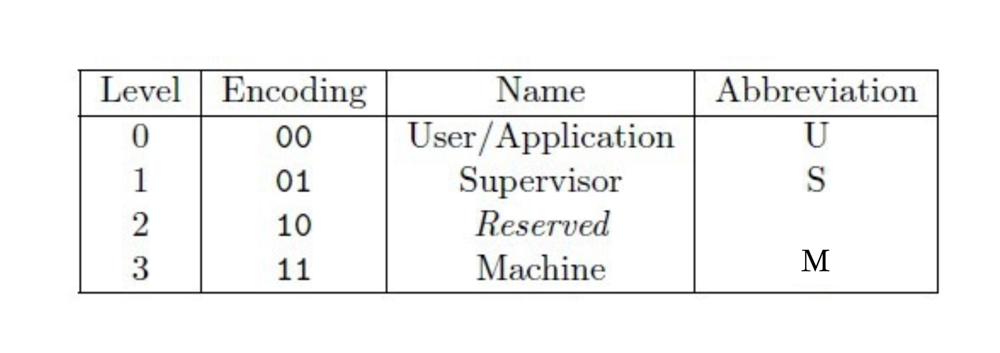
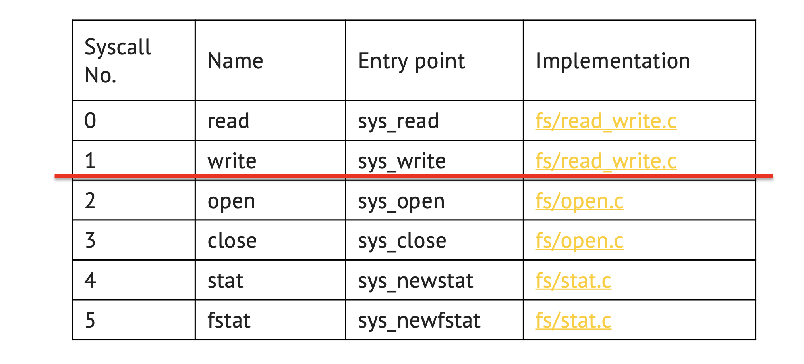
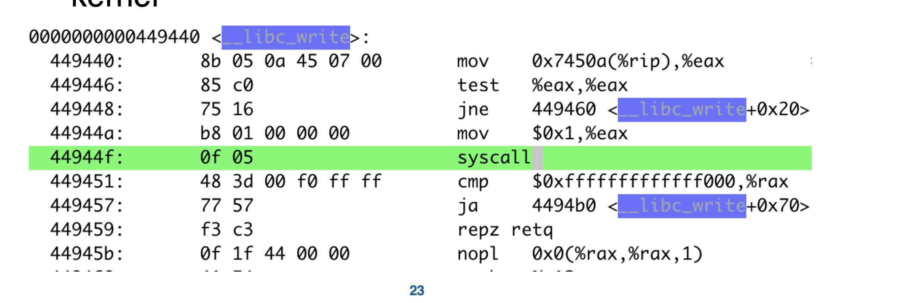
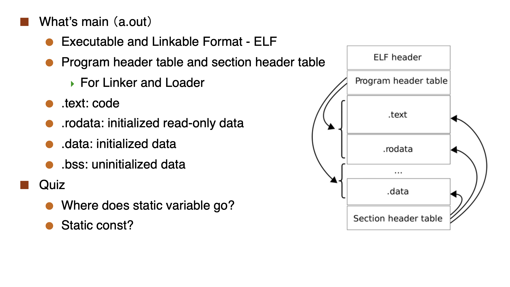
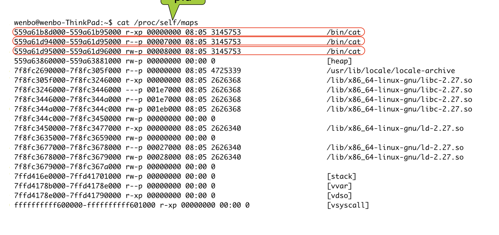
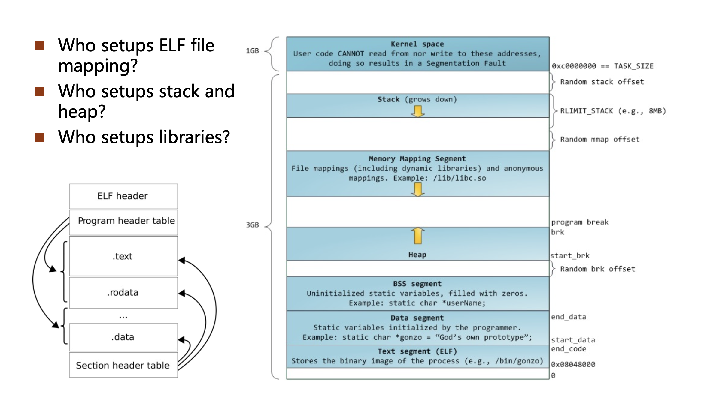
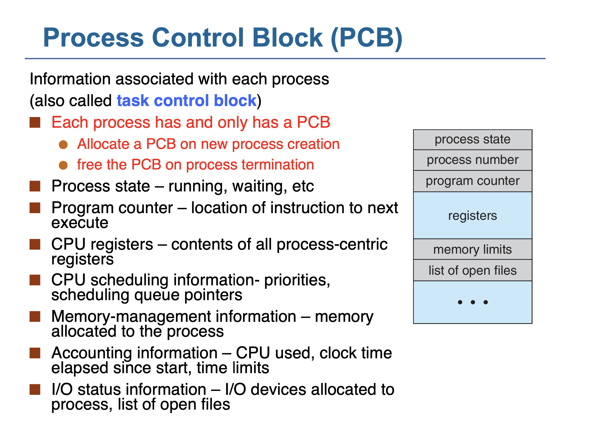
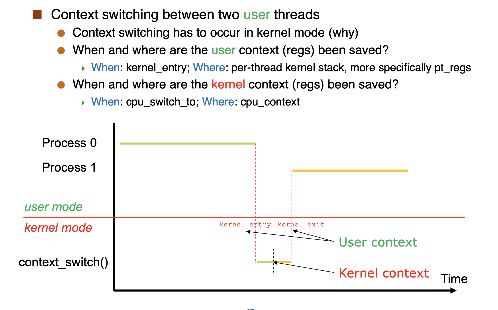
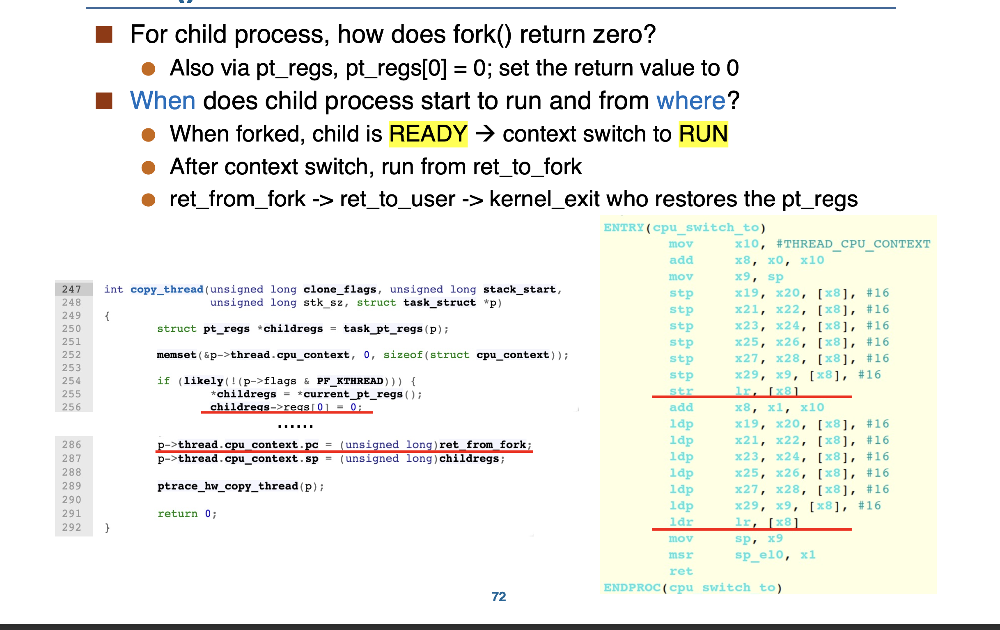

<font face = Times New Roman>

> 10.30 also复习课


## 0 & 1 Introduction

* data type不会存在memory中，取决于你怎么解释它，我们自己知道哪一块是地址，哪一块是数据

> 比如int a = 1; a是地址，1是数据，但是在memory中，只有1，没有a

* 操作系统：资源的 abstracter and allocator
* boot loader：加载操作系统 -- Not OS

> Event

* Interrupt
* Exception
* System Call

> How the OS achieves resource allocator and abstracter

* Add a mode bit -- OS in privileged mode, user in unprivileged mode

> 浏览器 not part of OS

> Mode

* RISC-V : 3.5 


* ARM : 4

> pt_regs

* When a system call is made, the kernel saves the user context in a structure called pt_regs

```cpp
/* 线程切换入口函数 */
void switch_to(struct task_struct *next);
struct pt_regs{
    uint64_t regs[32];
    uint64_t sepc;
    uint64_t sstatus;
    uint64_t sscratch;
};
```

> Main OS Services

* Process Management
* Memory Management
* Storage Management
* I/O Management
* Protection and Security
## 2. OS Structure

> What is the structure of Linux?

* Monolithic Kernel [Also Unix]
* 


>System Call

System Call is an **interface** provided by the kernel to the user program to do some **privileged** operations

* System call number : index in system call table
* Approx 300 system calls in Linux
  



> Note : syscall number in eax


> std

* stdin : 0
* stdout : 1
* stderr : 2

> ELF 



* static const in .rodata
* static var in .data
* .BSS : uninitialized  var ; no space in ELF, but has space in memory -- 运行时对其赋值



* first colum : code
* second colum : rodata
* third colum : data
* /lib/x86_64-linux-gnu/ld-2.31.so **Loader ask OS to map the file to memory**

> Running a program



* Who setups the library? -- Loader call system call to ask OS to do it
* Who setups ELF file mapping? Who setups stack and heap? -- os

> Polict & Mechanism

* Mechanism : how to do it
* Polict : What will be done


## Process

> What come from ELF

* code (also called the text)& data section  

> PCB


> Why fork() can return twice?

* `fork()` copy the user space context, so it can return twice [CHILD return 0]


> Signal and Interrupt has no relationship


>Interrupt

* x86-32 : int 0x80
* x86-64 : syscall
* ARM : svc
* RIsc-V : ecall
* Control C : SIGINT

> Context switch

* stack 
* PC : ret [change return address] 

* CPU switch to return to B's CPU switch to **caller** -- ret address set when B is swapped in

* context save in PCB
* context switch must happen in kernel mode?
  * Because it determines the use of CPU -- IMPORTANT
  * Yes, It must happen in kernel mode





## 3. Thread


## Syncronization

* Memory barries 不考
* Hardware Instruction : which one is realized?


</font>