

# Lecture 10 - Main Memory

> Partition not realized
> 早期x86实现了segmentation
> Linux也使用了segmentation

## Logical Address [Virtual Address]

### Partition

* Divide the memory into fixed size partitions.
* Use Base and Limit registers to map logical addresses to physical addresses.
* Base added to all addresses
* Limit checked on all memory references
* In context switch, the base and limit registers **are changed!**

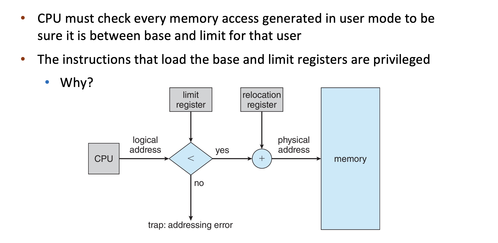

* Load base and limit registers are **Privileged Instructions**!!

* If logical > limit -> Segmentation Fault

#### Advantages

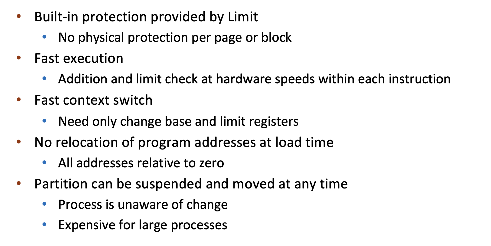

#### Fixed partitions

• All processes must fit into partition space

• Find any free partition and load process

> What is the “right” partition size?

> Problem – Internal Fragmentation : **Unused memory in partition not available to other processes**

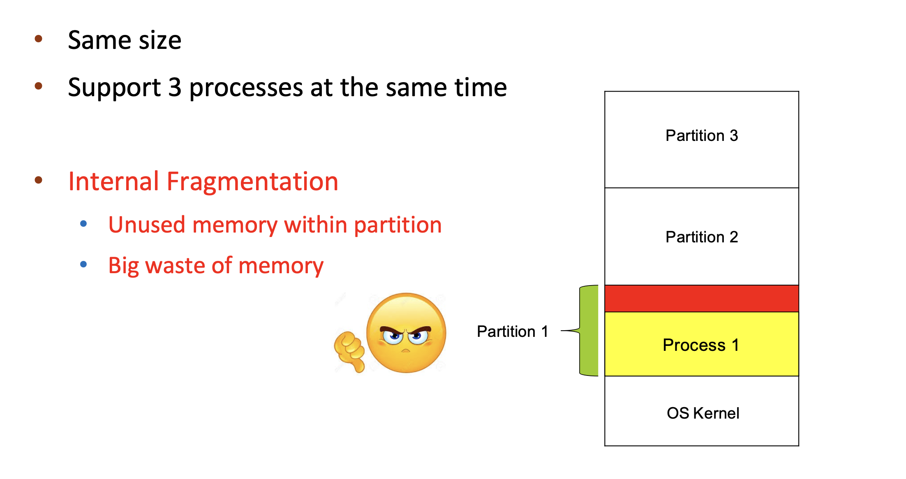

* This size difference is memory internal to a partition, but not being used
* Sophisticated algorithms are designed to avoid fragmentation

#### Variable partitions

Memory is dynamically divided into partitions based on process needs

More complex management problem

* Need data structures to track free and used memory
* New process allocated memory from **hole large enough to fit it**

> Problem – External Fragmentation Unused memory between partitions too small to be used by any processes

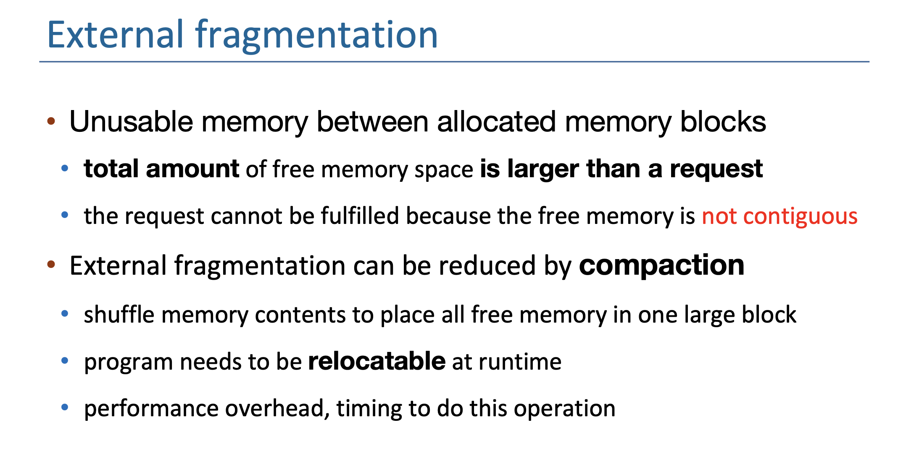
##### Algorithms to allocate memory

* First Fit:allocate from the first block that is big enough
* Best Fit : allocate from the smallest block that is big enough
* Worst Fit : allocate from the largest hole

### Segmentation [Still Partition]

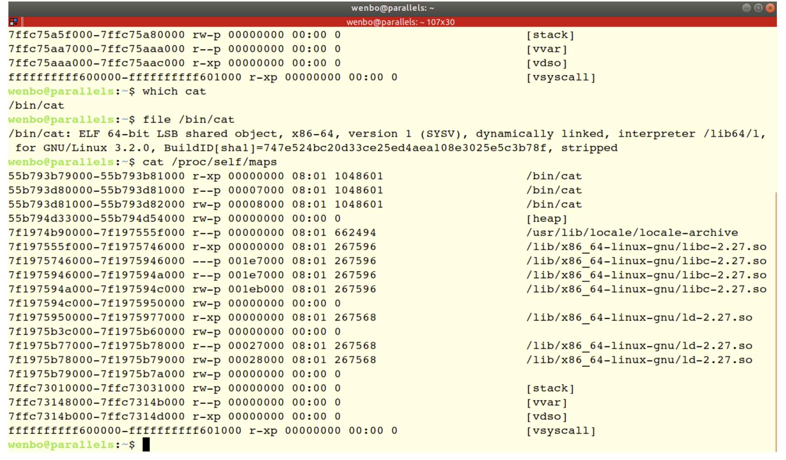

* Multiple partitions -- each partition is a segment

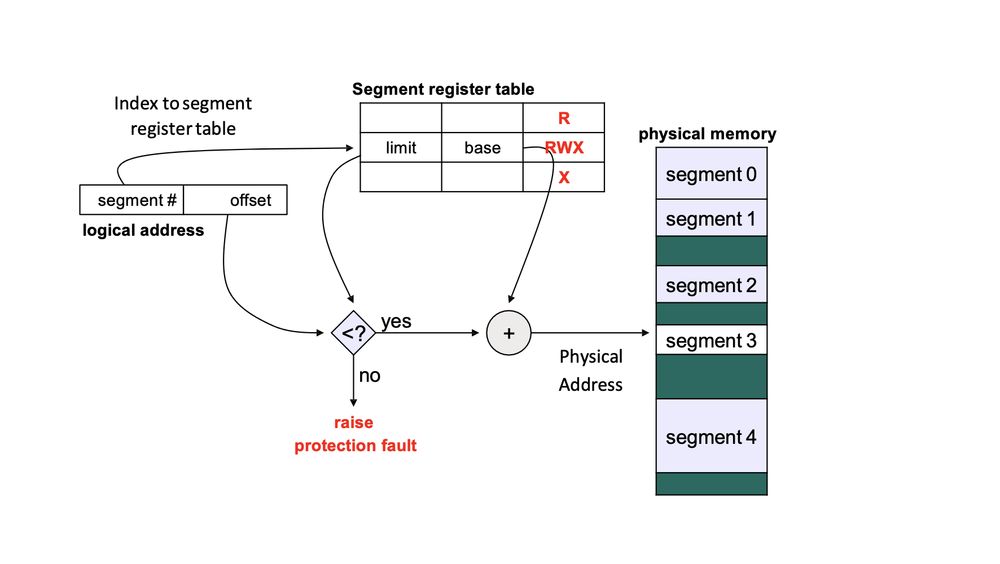

> Problem – **External Fragmentation** Unused memory between segments too small to be used by any processes

So how to solve this problem? **Paging**

### Address Binding

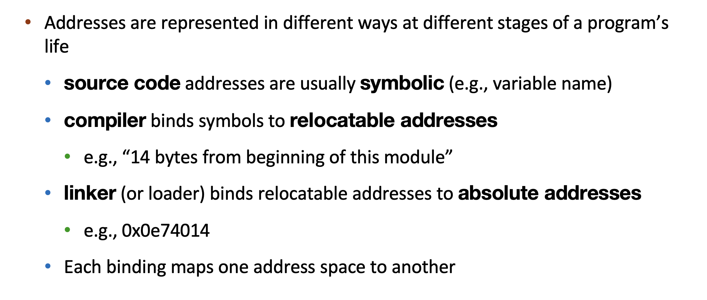
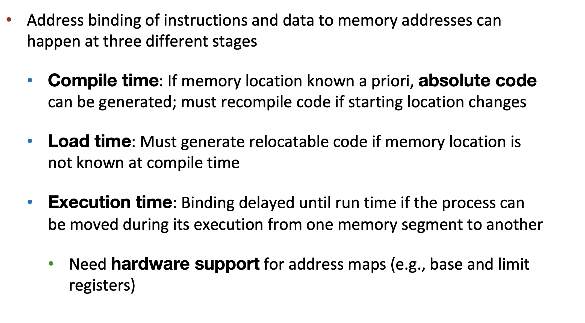

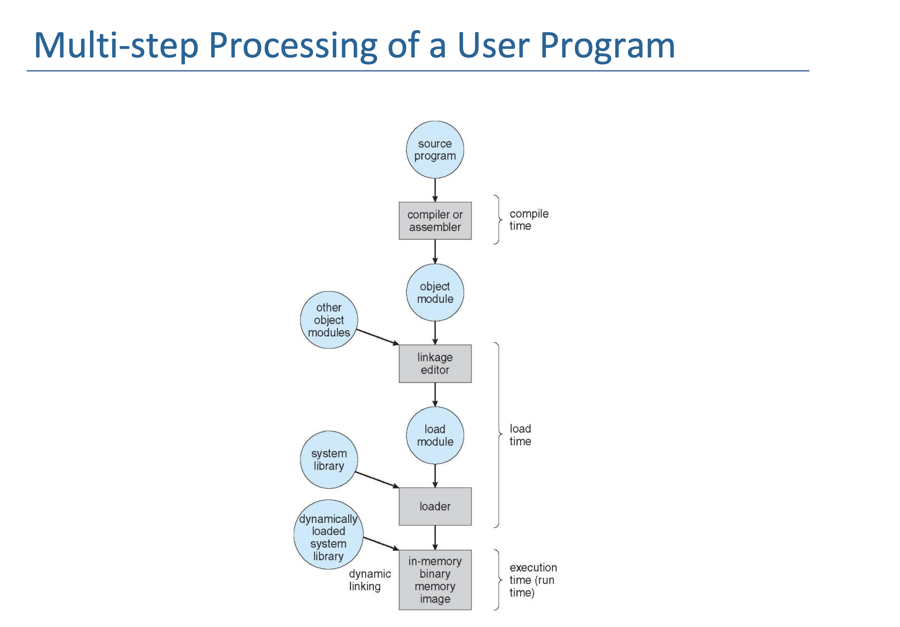

### Memory-Management Unit (MMU)

Hardware device that at run time maps logical to physical address

* CPU uses logical addresses
* Memory unit uses physical address
* Like speaking “different languages”, MMU does the translation

### Paging [From Fixed length Partition]

> **Physicla Frame** and **Virtual Page**

**Contiguous to Noncontiguous**

* Physical address space of a process can be **noncontiguous**
* process is allocated physical memory whenever the latter is available

* Divide physical address into fixed-sized blocks called frames
*  Divide logical address into blocks of same size called pages
*  Keep track of all free frames
*  To run a program of size N pages, need to find N free frames and load program
*  Set up a mapping to translate logical to physical addresses
*  This mapping is called **page table**

> Problem – **Internal Fragmentation** Unused memory in **last frame** not available to other processes
> 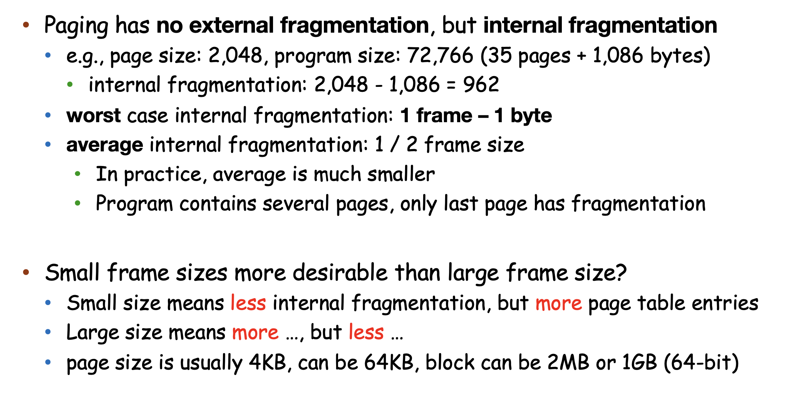

> Small frame sizes more desirable than large frame size?

* Small size means **less internal fragmentation**, but **more page table entries**

#### Page Table & Frame Table

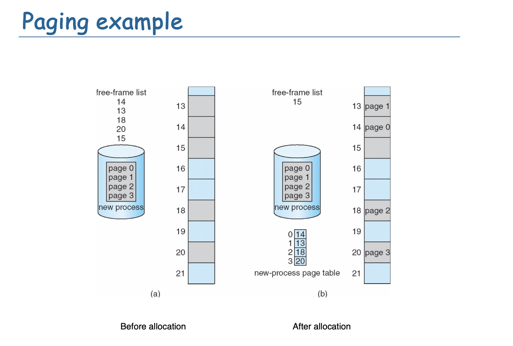

* Page table store **Frame Number** , **Page Number** is **naturally the index of the table**

#### Page Translation

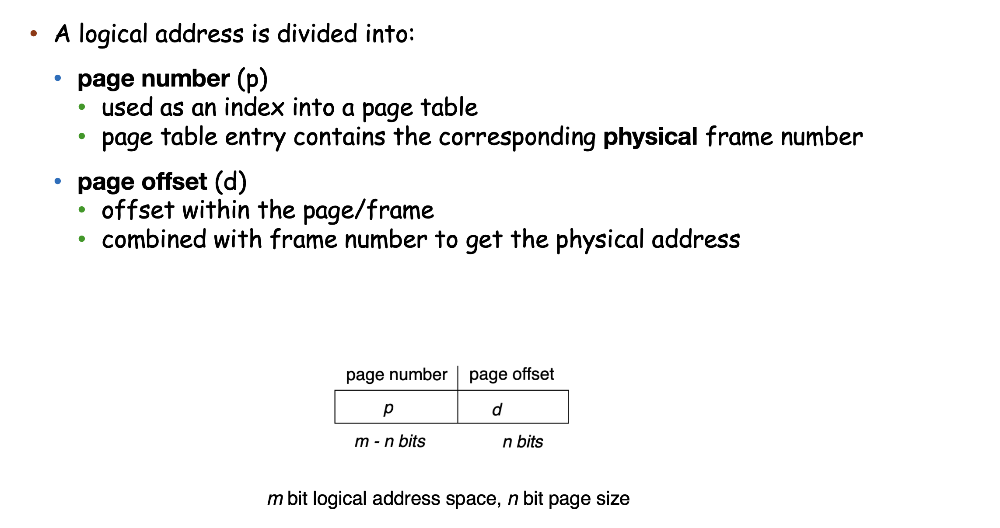
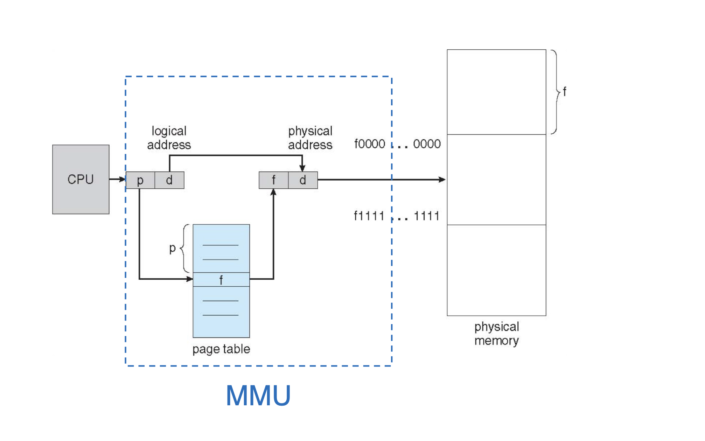

> Example

* 4KB page size : offset is 12 bits
* So 20 bits for page number

#### Page Table Hardware Support

##### Simplest Case [❌]

Page table is in a set of **dedicated registers**

Advantages: very efficient - access to register is fast
Disadvantages:

* register number is limited because the **table size is very small**
* the context switch need to **save and restore these registers**

##### Alternative Way [✅]

> **page-table base register**

* in x86 -- **CR3**
* in arm64 -- **TTBR0** for user space per process, **TTBR1** for kernel space
* in RISC-V -- **satp** [Supervisor Address Translation and Protection]

One **big page table** maps logical address to physical address

* the page table should be kept in main memory
* page-table base register **(PTBR)** points to the page table
  - does PTBR contain physical or logical address?
* page-table length register (PTLR) indicates the size of the page table

Every data/instruction access requires two memory accesses

* One for the page table and one for the data / instruction
* How to reduce memory accesses caused by page table?
  - CPU can cache the translation to avoid one memory access **(TLB)**

> Problem : 多了一次对page table的访问
> Solution : **Translation Lookaside Buffer (TLB)** 

### Translation Lookaside Buffer (TLB)

TLB (translation look-aside buffer) caches the address translation

* if page number is in the TLB, no need to access the page table
* if page number is not in the TLB, need to replace one TLB entry
* TLB usually use a fast-lookup hardware cache called associative memory
* **TLB is usually small, 64 to 1024 entries**

Use with page table

* TLB contains a few page table entries
* Check whether page number is in TLB
* If -> frame number is available and used
* If not -> TLB miss access page table and then fetch into TLB

> When context switch, **TLB should be flushed!!**

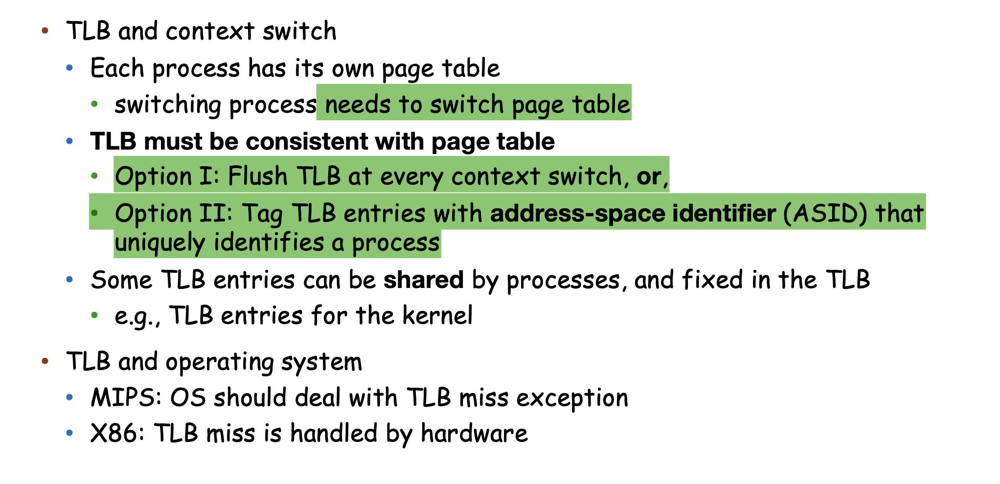

* Realized by Associative Memory

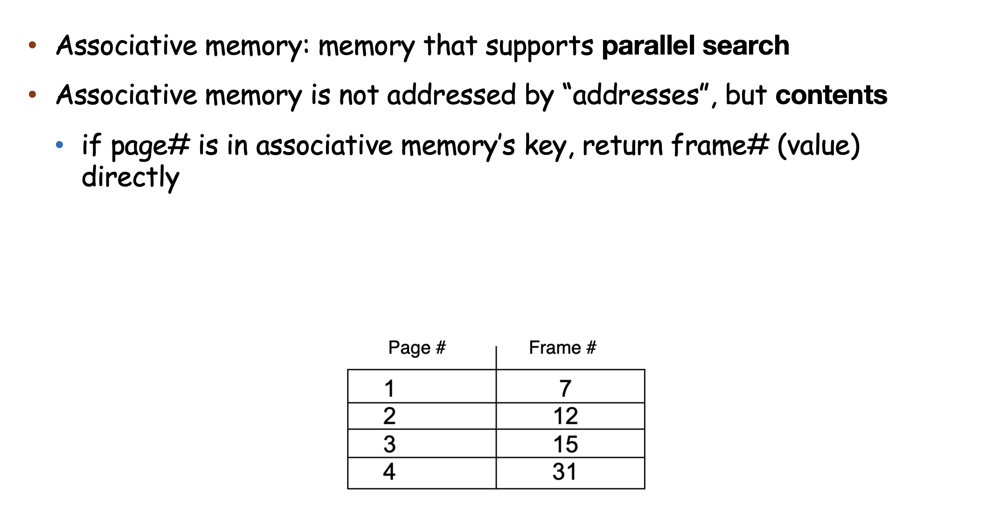

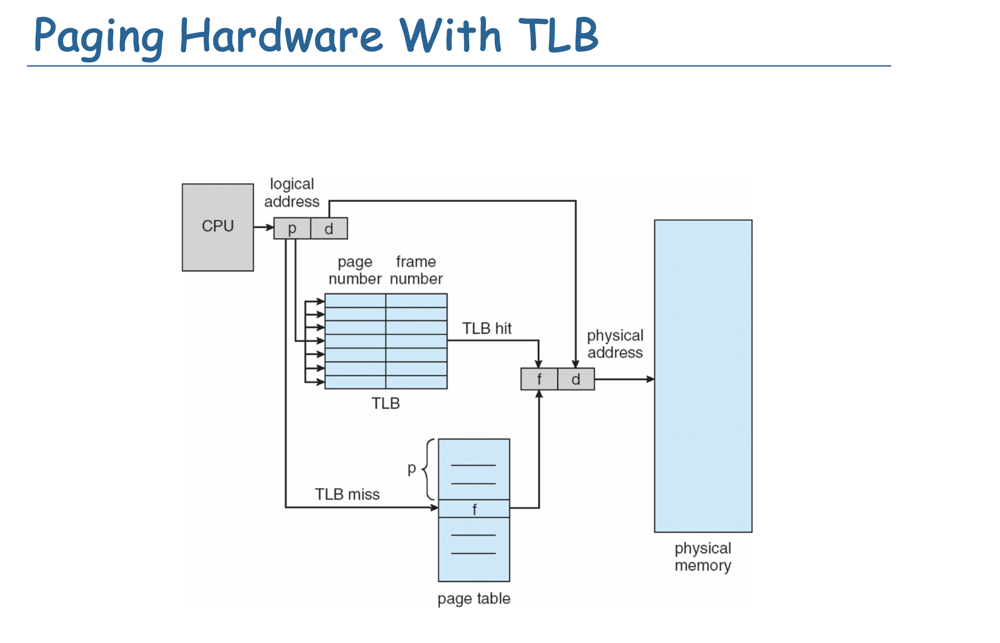

#### Effective Access Time

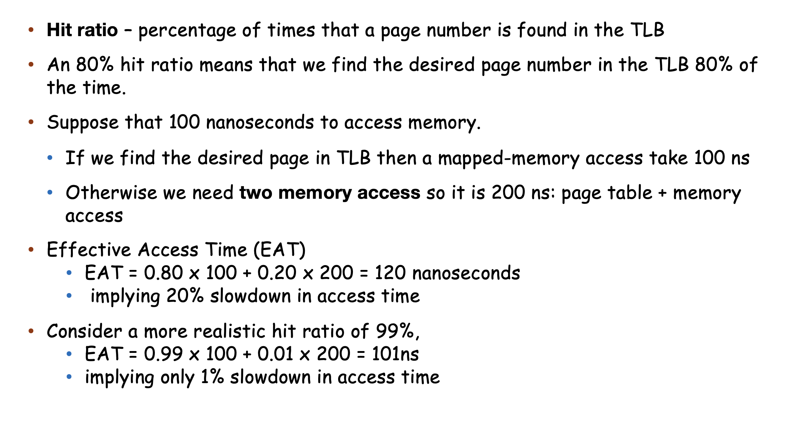

> In real time, the TLB hit rate is usually approximately 100% [after warm-up]

* So if increase **page size**, the **TLB hit rate** will **increase** and the **TLB miss rate** will **decrease**

## Memory Protection

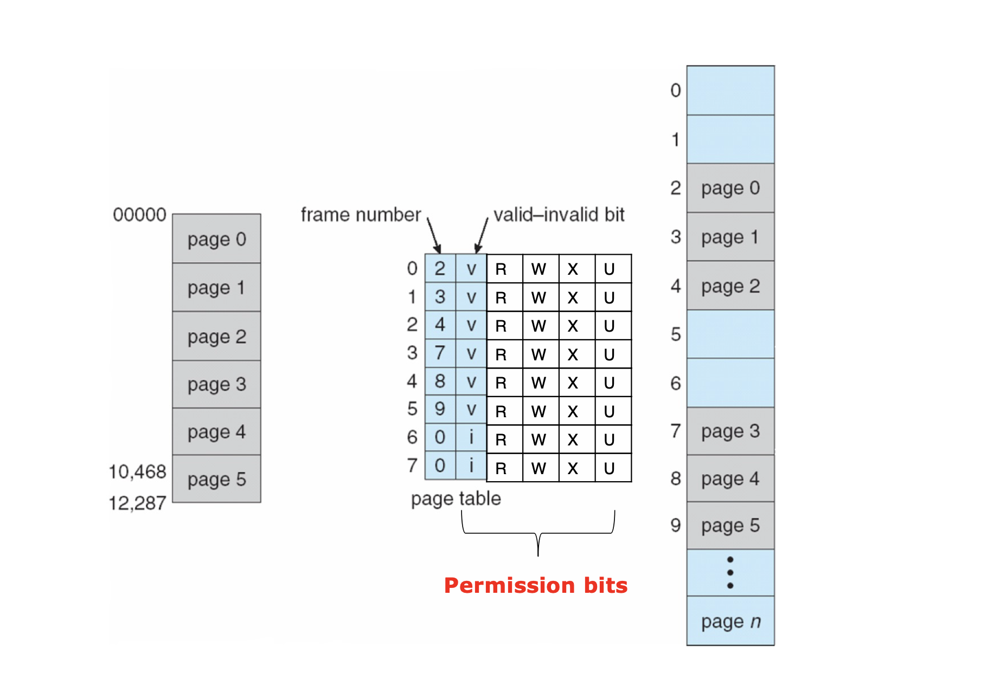

### Page Sharing

**IMPORTANT**

1. page table 需要物理连续！ 因为是base register指向的，且硬件MMU walk page table，完全不知道虚拟地址的存在
2. page table内存的都是**物理地址!!**
3. page table base registers 是**物理地址!!**

## Page Table Structure

### One-level Page Table

e.g., **32-bit** logical address space and **4KB** page size

* page table would have**1 M entries** ($2^{32} / 2^{12}$)
* if each entry is **4 bytes** ➔ **4 MB!!** of memory for page table alone 
* each process requires its own page table
* page table must be physically contiguous -- TOO LARGE

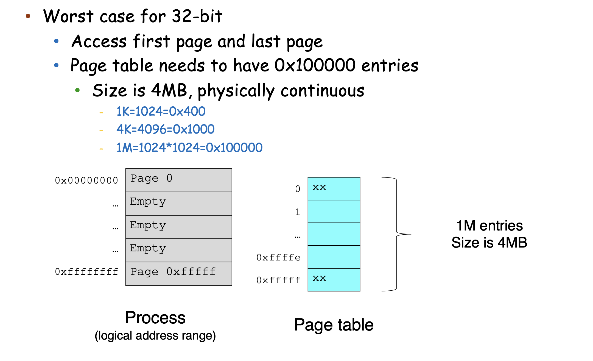

### Two-level Page Table

**32-bit** logical address space and **4KB** page size

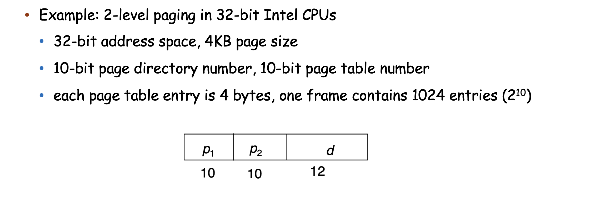

* if each entry is **4 bytes** ➔ 1k entries per one page
* We need 1M entries, so we need 1M / 1k = **1k** pages
* This **1k** pages can be stored in **one page** (1k * 4 = 4KB)

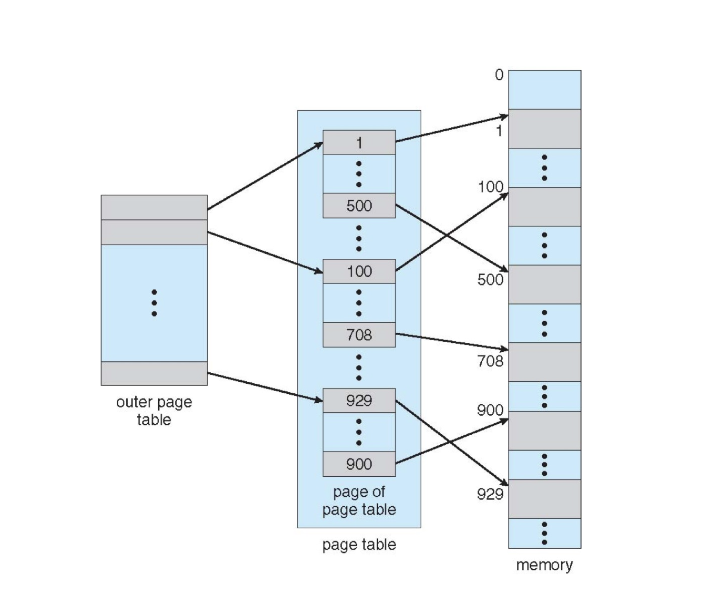
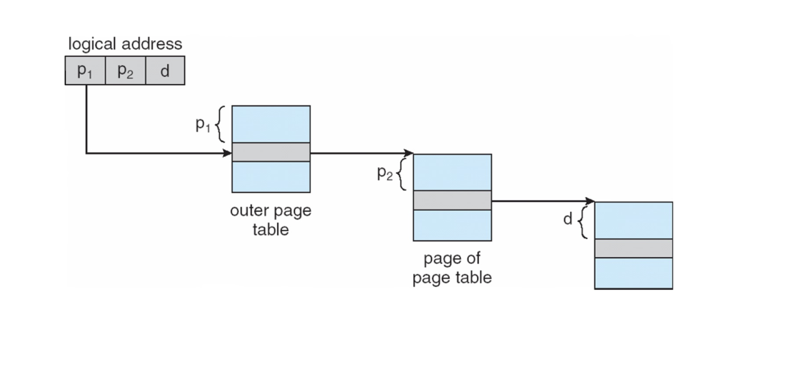

> If page table entry change to 64bits 

* 64-bit logical address space and 4KB page size
* **12 bits for offset**, 52 bits for page number **--12**
* Each page table entry is **8 bytes**, so 512 entries per page **-- 9**

* 9+ 9+ 9+12 = 39 bits
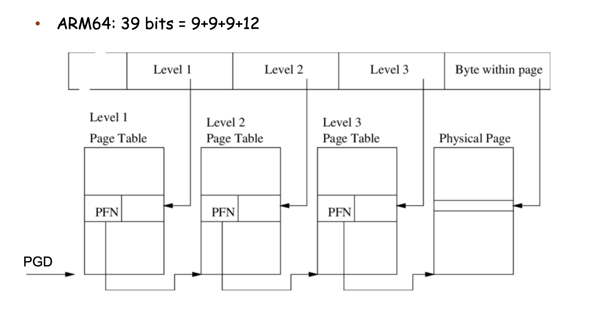

### Hashed Page Tables

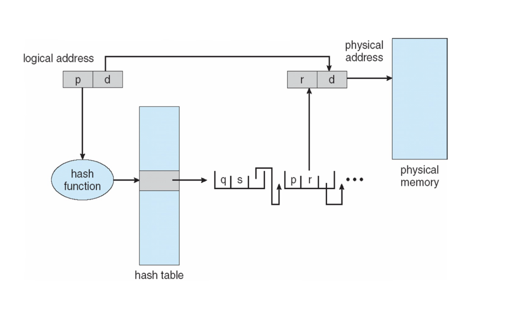

* Complicated & Hash slow
* Conflict list too long -- performance overhead

> Benefits

* Large address space and **sparse access**

### Inverted Page Table

Inverted page table tracks allocation of physical frame to a process

* One entry for each physical frame ➔ **fixed amount of memory for page table**
* Each entry has the process id and the page# (virtual address)

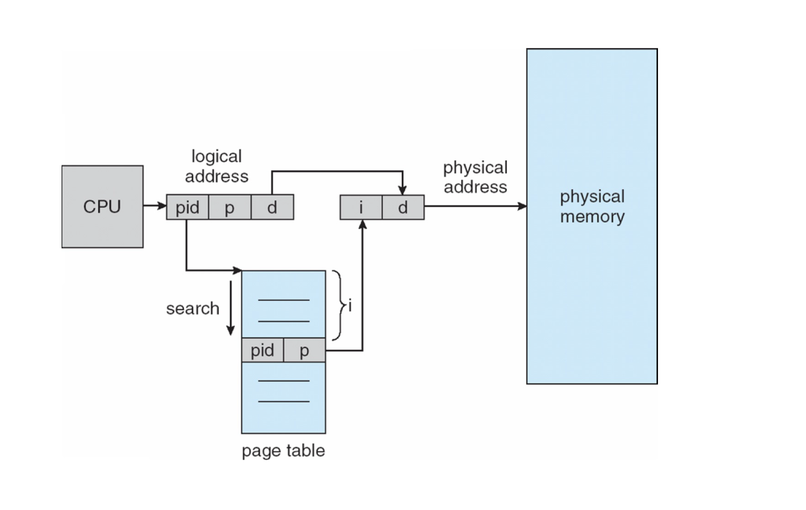

* 每次要遍历整个页表，效率低下
* 这样不能共享内存（因为一个物理帧只能映射到一个页）

## Swapping

Swapping extends physical memory with backing disks

A process can be swapped temporarily out of memory to a backing store

* Backing store is usually a (fast) disk

The process will be brought back into memory for continued execution

* Does the process need to be swapped back in to same physical address?

Swapping is usually only initiated under memory pressure

**Context switch time can become very high due to swapping**

* If the next process to be run is not in memory, need to swap it in
* Disk I/O has high latency

 
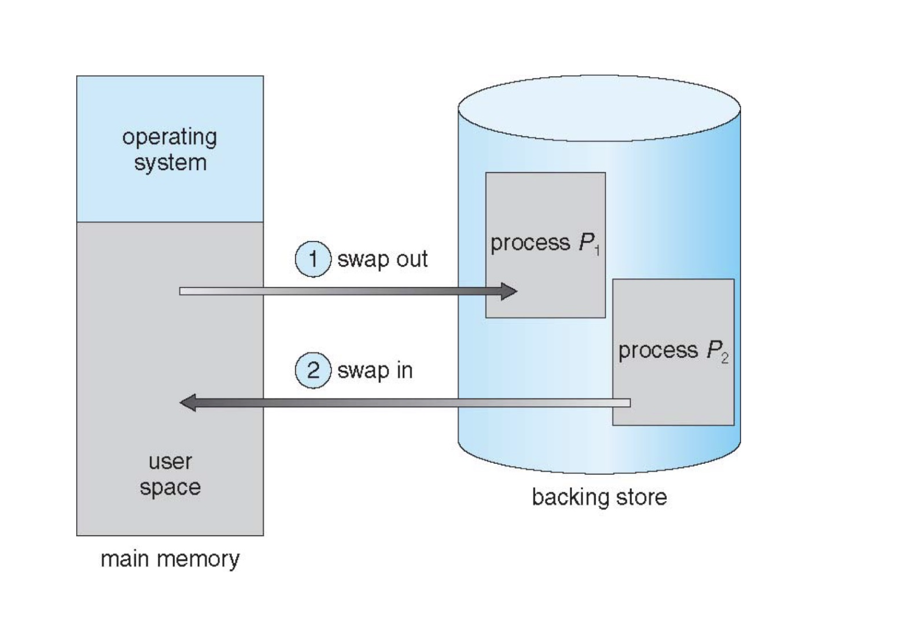

* Swap with paging

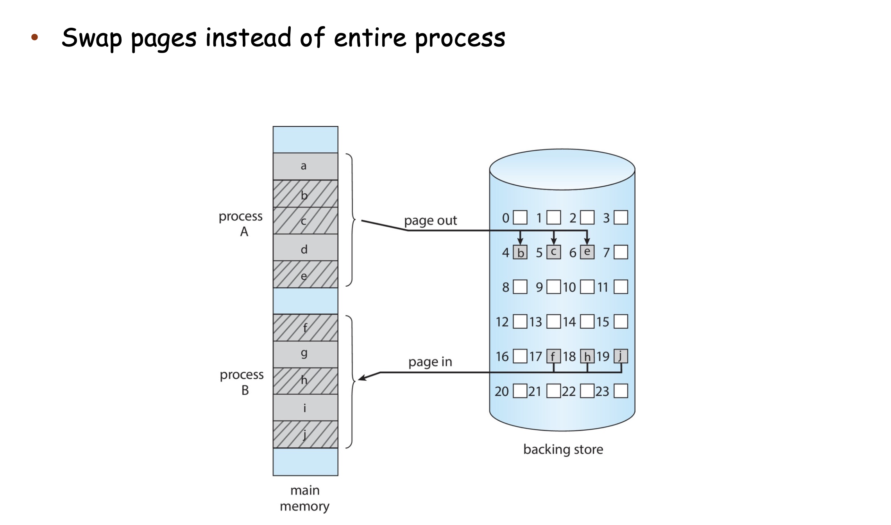

## Real time Implementation

### IA-32

* Segmentation + Paging

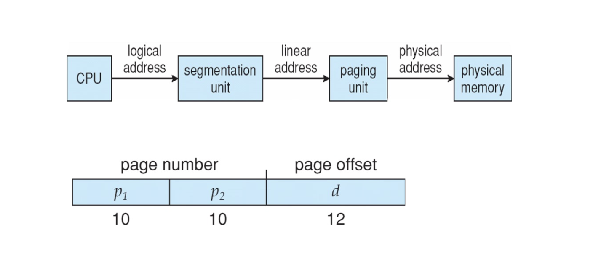

> Other See Slides

## Quiz

1. In 32-bit architecture, for 1-level page table, how large is the whole page table?

   * **4MB** = 1M[page table entry count] $\times$ 4B[each entry size]

2. In 32-bit architecture, for 2-level page table, how large is the whole page table?
   
      1) How large for the 1st level PGT?
        **4KB** = 1K[page table entry count] $\times$ 4B[each entry size] 

      2) How large for the 2nd level PGT?
        **4MB** = 1K[page table entry count per page] $\times$ 4KB[page size]

3. Why can 2-level PGT save memory?

   * We can have invalid entries in the 2nd level PGT, so we can save memory

4. For 39-bit VA, 4KB page size
   
    1) How large for the 1st level PGT?
        **4KB** = 512[page table entry count] $\times$ 8B[each entry size]

    2) How large for the 2st level PGT?
        **2MB** = 512[page table entry count] $\times$ 4KB[page size]

    3) How large for the 3st level PGT?
        **1GB** = 512[page table entry count] $\times$ 512[page table entry count] $\times$ 4KB[page size]

5.  How about page size is 64KB

a. What is the virtual address format for 32-bit?
  
    1) 16-bit offset
   
    2) 64KB/4B = 16K -- 14-bit 2st page number 
   
    3) 32 -16 -14 = 2-bit 1st level page number
   
b. What is the virtual address format for 64-bit?
  
    1) 16-bit offset
   
    2) 64KB/8B = 8K -- 13-bit page number

> 39-bit VA
> 48-bit VA

