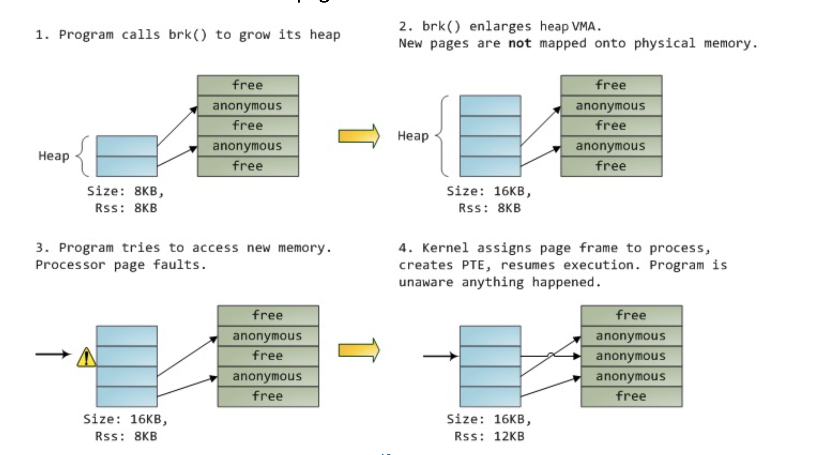

# Lecture 11 - Virtual Memory

## Demand Paging

Demand paging brings a page into memory only when it is demanded

* demand means access (read/write)
* if page is invalid (error) ➠ abort the operation **[segmentation fault]**
* if page is valid but not in memory ➠ **bring it to memory**
  1. Memory here means physical memory
  2. This is called page fault
  3. via swapping for swapped pages
  4. via mapping for new page
  5. no unnecessary I/O, less memory needed, slower response, more apps

> What causes page fault? -- User space program accesses an address

> Which hardware issues page fault? -- MMU

> Who handles page fault? -- Operating system

