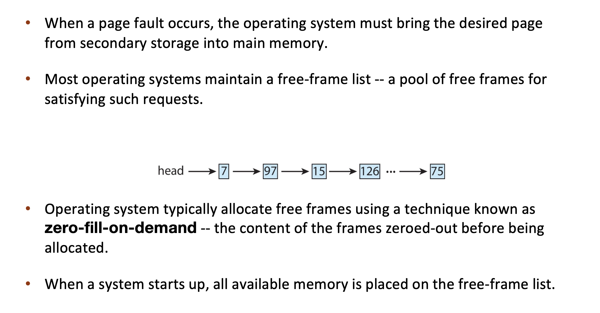

# Lecture 11 - Virtual Memory

## Demand Paging

Demand paging brings a page into memory only when it is demanded

* demand means access (read/write)
* if page is invalid (error) ➠ abort the operation **[segmentation fault]**
* if page is valid but not in memory ➠ **bring it to memory**

  1. Memory here means physical memory
  2. This is called page fault
  3. via swapping for swapped pages
  4. via mapping for new page
  5. no unnecessary I/O, less memory needed, slower response, more apps

> What causes page fault? -- User space program accesses an address

* Kernel 会直接分配，不回lazy allocation

> Which hardware issues page fault? -- MMU

* !Use **VM area struct** to record whether the page "SHOULD" be in memory -- demand paging
* If not in vm_area_struct, then it is segementation fault
* Also, If 权限不对，也是 segmentation fault

* In Linux, vm_area_struct : 平衡树

> Who handles page fault? -- Operating system

* **[MAJOR PAGE FAULT]** Data 和 Text段是 file-backed -- Above Scenerio
* **[MINOR PAGE FAULT]** 如果是stack/heap发生的falut : 3, 4都不会发生

First reference to a **non-present** page will trap to kernel: page fault

Operating system looks at memory mapping to decide:

* invalid reference ➠ deliver an exception to the process : Via check vma in Linux
* valid but not in physical memory ➠ bring in
  
  1. get an empty physical frame
  2. bring page into frame via disk operation **[Schedule I/O,Sleep on Disk]**
  3. set page table entry to indicate the page is now in memory
  4. restart the instruction that caused the page fault

> Suppose we have a page fault when access a static linked library, if ELF entry is 0xaaaa...

> Is there a "demand segmenting?" -- No, 粒度太大了 一次fault就把整个segment都load进来了

### Page Fault - swapper

* Pre-Paging ➠ bring in multiple pages at once 空间换时间

### Page Fault – Get Free Frame

### Stages in Demand Paging – Worse Case
 
1. Trap to the operating system
2. Save the user registers and process state
3. Determine that the interrupt was a page fault
   
   * 3.1 Check that the page reference was legal

4. Find a free frame
5. Determine the location of the page on the disk, issue a read from the disk to the free frame:

   * 5.1 Wait in a queue for this device until the read request is serviced
   * 5.2 Wait for the device seek and/or latency time
   * 5.3 Begin the transfer of the page to a free frame

6. While waiting, **allocate the CPU to other process**
7. Receive an interrupt from the disk I/O subsystem (I/O completed)
   
   * 7.1 Determine that the interrupt was from the disk
   * 7.2 Mark page fault process ready

8. Wait for the CPU to be allocated to this process again

   * 8.1 Save registers and process state for other process
   * 8.2 Context switch to page fault process

9. Correct the page table, mapping new frame
10. Return to user: restore the user registers, process state, and new page table, and then resume the interrupted instruction

> Overhead -- Context switch

### Demand Paging: EAT

Effective Access Time (EAT) = 
$(1-p) \times t_{memory} + p \times(t_{page \ fault\ overhead}\\ +t_{swap\ page\ out} + t_{swap\ page\ in} +t_{instruction\ restart\ overhead})$

### Demand Paging Optimizations

Swap space I/O faster than file system I/O even if on the same device

* Swap allocated in larger chunks, less management needed than file system

Copy entire process image from disk to swap space at process load time

* Then page in and out of swap space
* Used in older BSD Unix

Demand page in from program binary on disk, but discard rather than paging out when freeing frame (and reload from disk next time)

> Code can be discarded because it is already in the binary file

Following cases still need to write to swap space

* Pages not associated with a file (like stack and heap) – anonymous memory
* Pages modified in memory but **not yet written back** to the file system

Mobile systems

* Typically don’t support swapping
* Instead, demand page from file system and reclaim read-only pages (such as code)

### Copy-on-Write

## Page Replacement

find the location of the desired page on disk
find a free frame:

* if there is a free frame, use it
* if there is none, use a **page replacement policy** to pick a victim frame, write victim frame to disk **if dirty**

bring the **desired page** into the free frame; **update the page tables**
restart the instruction that caused the trap

Note now potentially **2 page I/O** for one page fault ➠ increase EAT

### Page Replacement Algorithms

#### FIFO

#### Optimal 

#### LRU

 

##### Counter-based implementation

* every page table entry has a counter
* every time page is referenced, copy the clock into the counter
* when a page needs to be replaced, search for page with smallest counter
* min-heap can be used

##### Stack-based implementation

* keep a stack of page numbers (in double linked list)
* when a page is referenced, move it to **the top of the stack**
* each update is **more expensive**, but no need to **search** for replacement

> LRU Approximation Implementation

Counter-based and stack-based LRU have high performance overhead
Hardware provides a reference bit

> LRU approximation with a reference bit

* associate with each page a reference bit, initially set to 0
* when page is referenced, set the bit to 1 (done by the hardware)
* replace any page with reference bit = 0 (if one exists) We do not know the order, however

> Additional-Reference-Bits Algorithm

* 11000100 more recently used -- 比大小即可

> Second-chance algorithm

Generally FIFO, plus hardware-provided reference bit

**Clock replacement**

If page to be replaced has

* Reference bit = 0 -> replace it
* reference bit = 1 then:
  1. set reference bit 0, leave page in memory
  2. replace next page, subject to same rules

> Enhanced Second-Chance Algorithm -- modify bit

### Counting-based Page Replacement

Keep the number of references made to each page

#### LFU

Replaces page with the smallest counter

* A page is heavily used during process initialization and then never used

#### MFU

Replaces page with the largest counter

* Based on the argument that page with the smallest count was probably just brought in and has yet to be used

## Page-Buffering Algorithms

> Kernel Worker Thread

Keep a pool of free frames, always

* frame available when needed, no need to find at fault time
* Read page into free frames **without waiting for victims to write out** : Restart as soon as possible
* When convenient, **evict victim**

Possibly, keep list of modified pages

* When disk idles, write pages there and set to non-dirty: this page can be replaced without writing pages to backing store

Possibly, keep free frame contents intact and note what is in them - **a kind of cache**

* If referenced again before reused, no need to load contents again from disk
* cache hit

#### Double Buffering

Memory intensive applications can cause double buffering - a waste of memory

* OS keeps copy of page in memory as I/O buffer
* Application keeps page in memory for its own work

Operating system can given direct access to the disk, getting out of the way of the applications - Raw disk mode.

赋予操作系统直接访问磁盘的权限

## Allocation of Frames

Two major allocation schemes for process memory allocation

### Equal allocation

* For example, if there are 100 frames (after allocating frames for the OS) and 5 processes, give each process 20 frames
* Keep some as free frame buffer pool
### Proportional allocation

* Allocate according to the size of process
* Dynamic as **degree of multiprogramming**, process sizes change

> In Linux just demand paging, no equal/proportional allocation

### Global replacement

process selects a replacement frame **from the set of all frames**; one process can take a frame from another

* But then process execution time can vary greatly - depends on others 
* But greater throughput so more common

#### Reclaiming Pages

* A strategy to implement global page-replacement policy
* All memory requests are satisfied from the free-frame list
* Rather than waiting for the list to drop to zero before we begin selecting pages for replacement, page replacement is triggered when **the list falls below a certain threshold**.
* This strategy attempts to ensure there is always sufficient free memory to satisfy new requests.

Reclaim pages aggressively

* Kill some processes
* According to **OOM score**
* how likely it is to be terminated in case of low available memory

> When above max threshold, **stop** reclaiming pages

 
### Local replacement

each process selects from only its own set of allocated frames

* More consistent per-process performance
* But possibly underutilized memory

## Non-Uniform Memory Access

## Thrashing

If a process doesn’t have “enough” pages（frames）, page-fault rate may be high

* page fault to get page, replace some existing frame
* but quickly need replaced frame back
* this leads to:
  
  1. low CPU utilization ➠
  2. kernel thinks it needs to increase the degree of
  3. multiprogramming to maximize CPU utilization ➠ 
  4. another process added to the system

**Thrashing**: a process is busy swapping pages in and out

> Kill some processes can help stop thrashing

### Demand Paging and Thrashing

> Why does demand paging work?

* process memory access has high locality
* process migrates from one locality to another, localities
may overlap

> Why does thrashing occur?

* total memory size < total size of locality

### Resolve Thrashing

> Option1

> Option2

#### Working-Set Model

Working-set window(Δ): a fixed number of page references

* if Δ too small ➠ will not include entire locality
* if Δ too large ➠ will include several localities
* if Δ = ∞ ➠ will include entire program

Working set of process pi (WSSi): total number of pages referenced in the most recent Δ (varies in time)

Total working sets: D = $\Sigma WSS_i$

* approximation of total locality
* if D > m ➠ possibility of thrashing
* to avoid thrashing: if D > m, suspend or swap out some processes

> Challenge: Keeping Track of the Working Set

## Other Considerations

> See Slides

### Slab Allocation

> https://note.hobbitqia.cc/OS/chap09/#slab-allocation

* every user process has its **own page table**
* user don't have access to "kernel frame" -- kernel has its own page table

