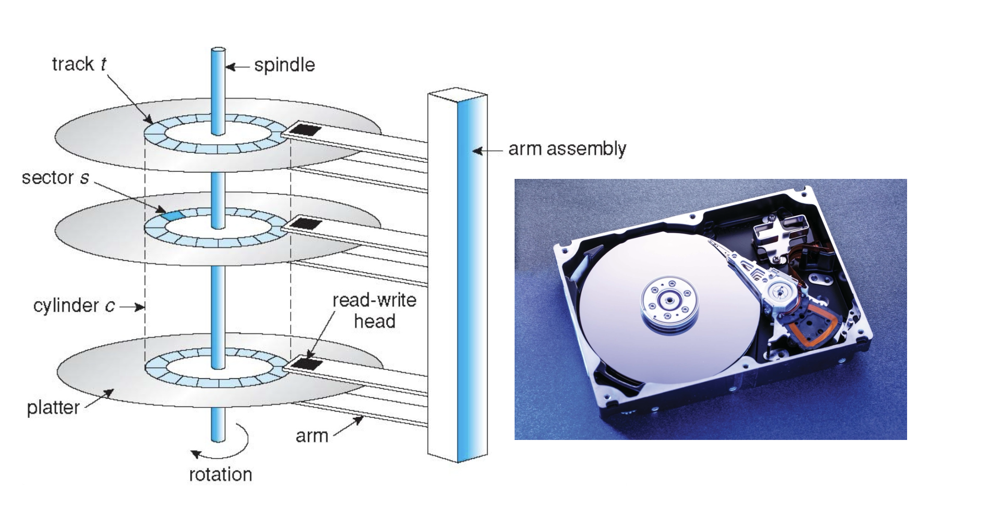

# Lecture 12 - Mass Storage

Positioning time is time to move disk arm to desired sector

* Positioning time includes seek time and rotational latency
* Seek time: move disk to the target cylinder
* Rotational latency: for the target sector to rotate under the disk head

> Positioning time is also called random-access time

Performance

* Transfer rate: theoretical 6 gb/sec; effective (real) about 1gb/sec
* Transfer rate is rate at which data flow between drive and computer
* Seek time from 3ms to 12ms (9ms common for desktop drives)
* Latency based on spindle speed: 1/rpm * 60
* Average latency = ½ latency

## Disk Scheduling

### FCFS

### SSTF

Selects the request with minimum seek time from the current head position

* SSTF scheduling is a form of **SJF scheduling**, starvation may exist

### SCAN

SCAN algorithm sometimes is called the elevator algorithm

* Disk arm starts at one end of the disk, and moves toward the other end 
* Service requests during the movement until it gets to the other end
* Then, the head movement is reversed and servicing continues.

### C-SCAN

> One Directional SCAN

Circular-scan is designed to provides a more uniform wait time

* Head moves from one end to the other, servicing requests while going
* When the head reaches the end, it i**mmediately returns to the beginning**
* Without servicing any requests on the return trip
* It essentially treats the cylinders as a circular list

### LOOK/C-LOOK

SCAN and C-SCAN moves head end to end, even no I/O in between

* In implementation, head only goes as far as last request in each direction
* LOOK is a version of SCAN, C-LOOK is a version of C-SCAN

> SSD -- FCFS is good because SSD 没有 seek time[没有磁道]

* SSTF is common and is a reasonable choice for the default algorithm
* LOOK and C-LOOK perform better for systems that have heavy
I/O load

### Nonvolatile Memory Devices

 
> FCFS is good for SSD / Nonvolatile Memory Devices

### Magnetic Tape

* Cheap but **Sequential access**

> Use for **backup**

## Disk Management

> See Slides

Root partition contains the OS, other partitions can hold other OSes, other file systems, or be raw

* Mounted at boot time
* Other partitions can mount automatically or manually

At mount time, file system consistency checked

* Is all metadata correct?
* If not, fix it, try again
* If yes, add to mount table, allow access

Boot block can point to boot volume or boot loader set of blocks that contain enough code to know how to load the kernel from the file system

* Or a boot management program for multi-OS booting

**Raw disk** access for apps that want to do their own **block management**, keep OS out of the way (databases for example)

## Swap-Space Management

## Disk Attachment

### host-attached storage

* hard disk, RAID arrays, CD, DVD, tape…

Disks can be attached to the computers directly via an I/O bus

### network-attached storage

NAS is storage made available **over a network** instead of a local bus

* client can remotely attach to file systems on the server
* NFS, CIFS, and iSCSI are common protocols
* usually implemented via remote procedure calls (RPCs)
* typically over TCP or UDP on IP network
  * iSCSI protocol uses IP network to carry the SCSI protocol

### storage area network

## RAID

Disks are unreliable, slow, but cheap

> Simple idea: let’s use redundancy

* Increases reliability -- If one fails, you have another one
* Increases speed -- Aggregate disk bandwidth if data is split across disks

**Redundant Array of Independent Disks (RAID)**

* The OS can implement it with multiple bus-attached disks
* A RAID controller in hardware
* A “RAID array” as a stand-alone box

### RAID 0

splits data evenly across two or more disks without parity bits

* No redundancy -- So no error correction

Data is striped across multiple disks -- Using a fixed strip size

Gives the illusion of a larger disk with high bandwidth when reading/writing a file -- Accessing **a single strip** is not faster
### RAID 1

An exact copy (or mirror) of a set of data on two disks

Mirroring (also called shadowing) -- Write every written byte to 2 disks

* Uses twice as many disks as RAID 0

Reliability is ensured unless you have (extremely unlikely) simultaneous failures

Performance can be boosted by reading from the disk with the fastest seek time

* The one with the arm the closest to the target cylinder

 
### RAID 2

> 要读一个字节，需要读取所有的磁盘，然后校验组装 -- 效率太低

* Not used in practice!

### RAID 3

**Bit-interleaved parity**

* Data is striped across multiple disks, with one dedicated parity disk that stores the parity information for all the data disks
* Each write goes to all disks, with each disk storing one bit
* A parity bit is computed, stored, and used for data recovery

> Example with 4 disks and 1 parity disk

* Say you store bits 0 1 1 0 on the 4 disks
* The parity bit stores the XOR of those bits: (((0 xor 1) xor 1) xor 0) = 0
* Say you lose one bit: 0 ? 1 0: You can XOR the remaining bits with the parity bit to recover the lost bit: (((0 xor 0) xor 1) xor 0)= 1
* Say you lose a different bit: 0 1 1 ?:  The XOR still works: (((0 xor 1) xor 1) xor 0) = 0
* Bit-level striping increases performance
* XOR overhead for each write (done in hardware)
* **Time to recovery is long (a bunch of XOR’s)**

### ZFS

> RAID cannot address OS-level issues It does not prevent or detect data corruption or other errors

File systems like Solaris ZFS add additional checks to detect errors

* ZFS adds checksums to all FS data and metadata
* Checksum is collocated with pointer to the data/metadata
* Can detect and correct data and metadata corruption

ZFS allocates disks in pools, instead of volumes or partitions

* File systems within a pool share that pool, allocate/free space
from/to pool

