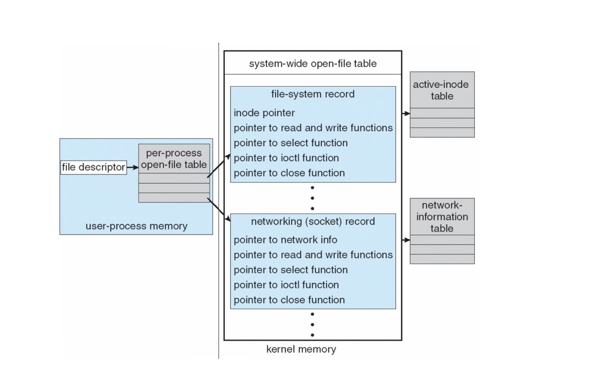

# Lecture 13 - I/O Systems

## Memory-mapped I/O

* Data and command registers mapped to processor address space
* To access (large) on-device memory (graphics)

## Polling

> CPU主动查询设备状态

For each I/O operation:

* **Busy-wait if device is busy** (status register) -- Cannot accept any command if busy
* Send the command to the device controller (command register)
* Read status register until it indicates command has been executed
* Read execution status, and possibly reset device status

Polling requires busy wait

* Reasonable **if device is fast**; inefficient if device slow

> How to avoid busy-wait?

* Like samephore, but for I/O devices -- record into waiting queue, sleep on the waiting queue of the [**corresponding device**]

* Use Interrupts to tell CPU **when device is ready**
* When device is ready, it will interrupt the CPU, and the CPU will **do scheduling**!

## Interrupts

> 设备主动通知CPU

操作系统等一个event : 包括 interrupt, exception...

Polling requires busy-wait, inefficient use of CPU resource
Interrupts can avoid busy-wait

* device driver (part of OS) send a command to the controller (on device), and return
* OS can schedule other activities
* device will interrupt the processor when command has been executed
* OS retrieves the result by handling the interrupt

Interrupt-based I/O requires context **switch at start and end**

* if interrupt frequency is extremely high, context switch wastes CPU time
* solution: use polling instead
* example: NAPI in Linux enables polling under very high network load

Interrupt is also used for exceptions

* protection error for access violation
* page fault for memory access error
* software interrupt for system calls

Multi-CPU systems can **process interrupts concurrently**

* sometimes **a CPU may be dedicated to handle interrupts**
* interrupts can also have CPU affinity

> Polling vs. Interrupts

* Use polling if **Device is fast!!**, CPU is relatively slow

## Direct Memory Access

> Device driver runs on CPU!
> All Controller runs on Device!

DMA transfer data **directly** between I/O device and memory

* OS only need to issue commands, data transfers **bypass the CPU**
* No programmed I/O (one byte at a time), data transferred in large blocks
* It requires **DMA controller** in the device or system

OS issues commands to the DMA controller

* A command includes: operation, memory address for data, count of bytes…
* Usually it is the pointer of the command written into the command register
* When done, device **interrupts CPU to signal completion**

syscall `ioctl` can be used to control DMA controller

> xPU access memory 算DMA吗？ -- 广义上，可以绕过CPU，可以算DMA

## Application I/O Interface

I/O system calls encapsulate device behaviors in generic classes

* in Linux, devices can be accessed **as files**; low-level access with `ioctl`

Device-driver layer hides differences among I/O controllers from kernel

* each OS has its own I/O subsystem and device driver frameworks
* new devices talking already-implemented protocols need no extra work

## Characteristics of I/O Devices

Broadly, I/O devices can be grouped by the OS into

* block I/O: read, write, seek
* character I/O (Stream)
* memory-mapped file access
* network sockets
* OSs have usually an escape/back door that passes any IO

commands from app to device

* Linux’s ioctl call to send commands to a device driver

Block devices access data in blocks, such as disk drives…

* commands include read, write, seek
* raw I/O, direct I/O, or file-system access
* memory-mapped file access possible (e.g., memory-mapped files)
* DMA

Character devices include keyboards, mice, serial ports…

* very diverse types of devices

Popular interface for network access is the socket interface

* it separates network protocol from detailed network operation
* some non-network operations are implemented as sockets
* e.g., Unix socket

**Clocks and timers can be considered as character devices**

* very important devices as they provide current time, elapsed time, timer
* Normal resolution about 1/60 second, some OS provides higher-resolution ones

## Synchronous/Asynchronous I/O

> Kernel I/O Subsystem and other see slides!

## I/O Protection

OS needs to **protect I/O devices**

* e.g., keystrokes can be stolen by a **keylogger** if keyboard is not protected
* always assume user may attempt to obtain illegal I/O access

To protect I/O devices:

* define all I/O instructions to be privileged
* I/O must be performed via system calls
* memory-mapped I/O and I/O ports must be protected too

## UNIX I/O Kernel Structure

* Everything in linux is a file -- convenient for file's open, close, read, write 的接口
  
> File Descriptor Table -- In Process Control Block

## Performance

I/O is a major factor in system performance:

* CPU to execute device driver, kernel I/O code
* context switches due to interrupts
* data buffering and copying
  > network traffic especially stressful

> Example see slides!

* 每个IO device注册成文件的时候会明确其需要对应的函数

