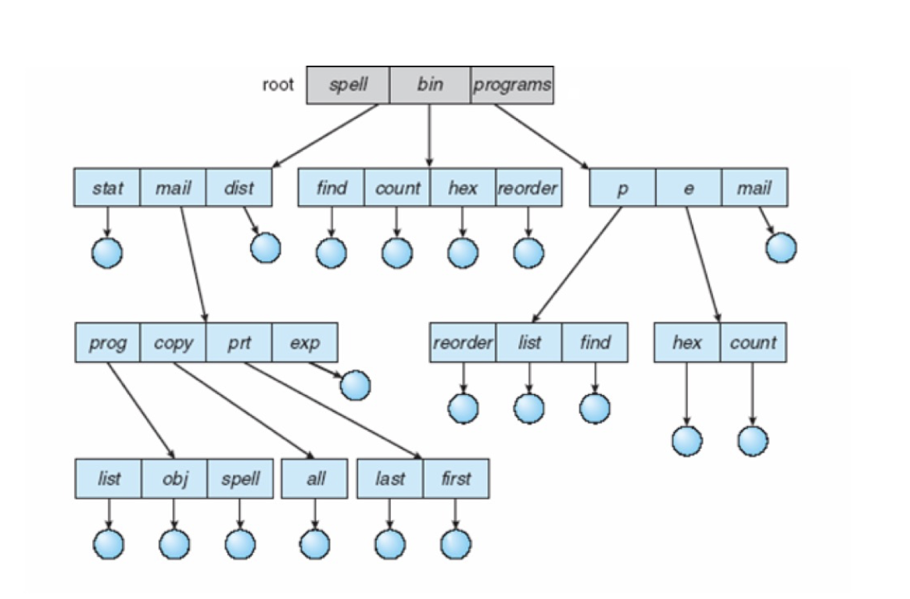
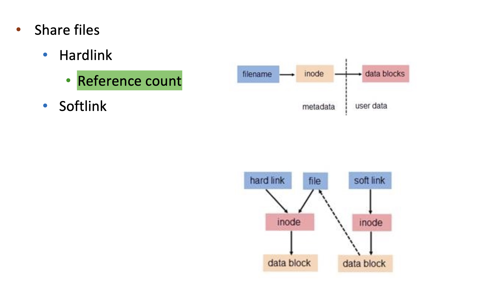

# Lecture 14 - File System

* CPU is abstract to **processes**
* Memory is abstracted to **address space**
* Storage is abstracted to **file system**

There are different types of file:

* data: character, binary, and **application-specific** program
  1. character: text files like `.txt, .c`.
  2. binary: executable files like `.exe, .elf, .out`
  3. application-specific: configuration files, like `.pptx, .docx, .xlsx`
* special one: proc file system - use file-system interface to retrieve system information

> pie: position independent executable - can be loaded anywhere in memory

> File Control Block (FCB) - inode.

## File System Interface

* Magic number : saved in the header of the file, to identify the file type.

### Access Methods

#### Sequential access

* a group of elements is access in a predetermined order
* for some media types, the only access mode (e.g., tape)

#### Direct access

* access an element at an arbitrary position in a sequence in(roughly) equal time, independent of sequence size
* it is possible to emulate random access in a tape, but access time varies
* sometime called random access
* Add index to the file to access it directly

### Directory structure

* Disk can be subdivided into **partitions**
* A partition containing file system is known as a **volume**
* Each volume tracks file system info in the volume’s table of contents
* Disk or partition can **be used raw** (without a file system)

Directory is a collection of nodes containing information **about all files**

* Both the directory structure and the files reside on disk

#### Tree-Structured Directories

#### Acyclic-Graph Directories

* Dangling pointer problem: Because a file can be pointed by multiple directories, if one directory is deleted, the file is still there, but the **pointer is lost**.

Solution: back pointers/reference counter

* Back pointers **record all the pointers to the entity, a variable size record**
* Or count `#` of links to it and only (physically) delete it when counter is zero -- **Hard Link**

#### General Graph Directory

#### File System Mounting

A file system must be mounted before it can be accessed

* mounting links a file system to the system, usually forms a single name space
* the location of the file system being mounted is call the mount point
* a mounted file system makes the old directory at the mount point invisible

### Protection

* ACL: Access Control List

## File System Implementation

[TODO] 

## File System In Practice

[TODO] 

