<font face = "Times New Roman">

# Lecture 15 -- Security and Protection

* Linux : 90/91 

## Common Concepts
### Trusted computing base (TCB)

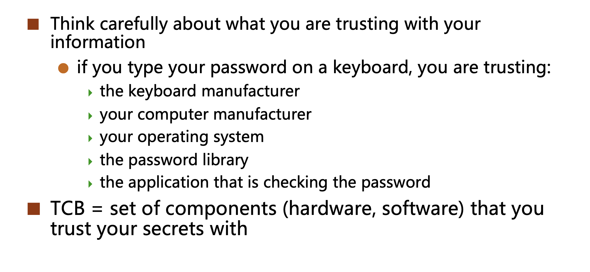

TCB issues
* The larger the TCB is, the more difficult it is to make it secure.
* The TCB should be as simple as possible
  1. Minimize misuse
  2. Enable better verification

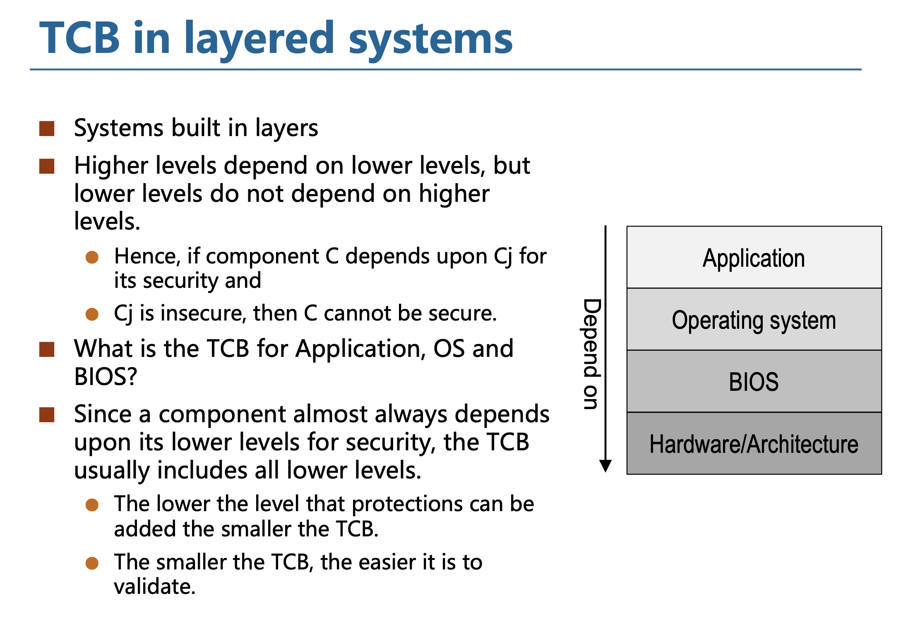

### Attacking Surface

The attack surface is the number of all possible points, or attack vectors, where an unauthorized user can access a system and extract data.

* The smaller the attack surface, the easier it is to protect.

### Defense in Depth

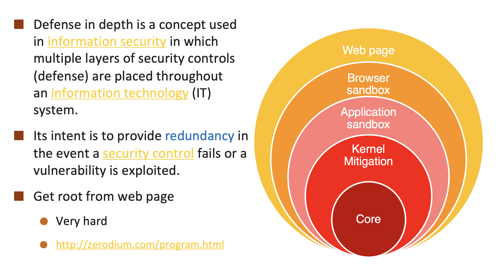

## Protection - Access Control

### Authentication

Identify the user

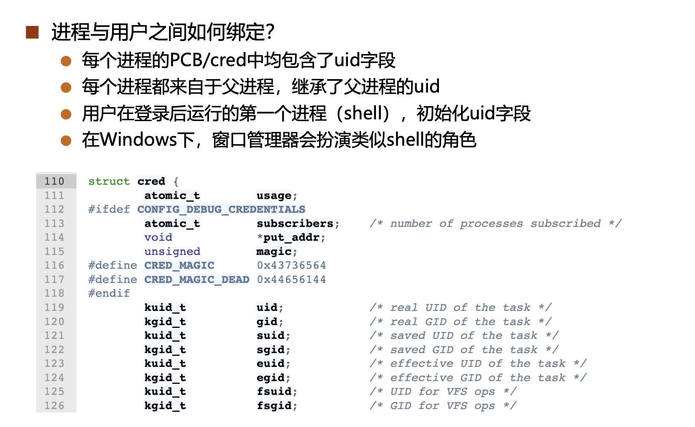

### Authorization

Determine what access users and programs have to things

> Access Control Matrix

```plaintext
| Object | User1 | User2 | User3 |
|--------|-------|-------|-------|
| File1  |  R,W  |  R    |       |
| File2  |  R    |  R,W  |  R    |
| File3  |  R,W  |  R,W  |  R,W  |
...
```

**Problem**: The matrix is too large to be stored in memory.

#### Role-based access control (RBAC)

Each user is assigned to a role, and each role is assigned a set of permissions.

**OSIX的文件权限**

Users can be assigned to three types of roles: 文件拥有者、文件拥有组、其他用户组

* 每个文件只需要用9个bit即可：3种权限（读-写-执行） x 3 类用户

何时检查用户权限？

* 每次打开文件时，进行权限检查和授权
  1. open()包含可读/可写的参数，OS根据用户组进行检查
  2. 引入fd，记录本次打开权限（授权），作为后续操作的参数

* 每次操作文件时，根据fd信息进行检查

#### setuid

* passwd in /etc/shadow **Linux**
  * Only **root** can read/write
  * passwd is setuid root
  * passwd can read/write /etc/shadow


**How to ensure that passwd is not modified by a malicious user [When it is given the root privilege]?**

  1. SUID: 在passwd的inode中增加一个SUID位，使得用户仅在**执行该程序时才会被提权**，执行完后恢复，从而将进程提权的时间降至最小
     1. `su`
     2. `passwd`
  2. passwd程序本身的逻辑会保证某一个用户只能修改其自身的密码

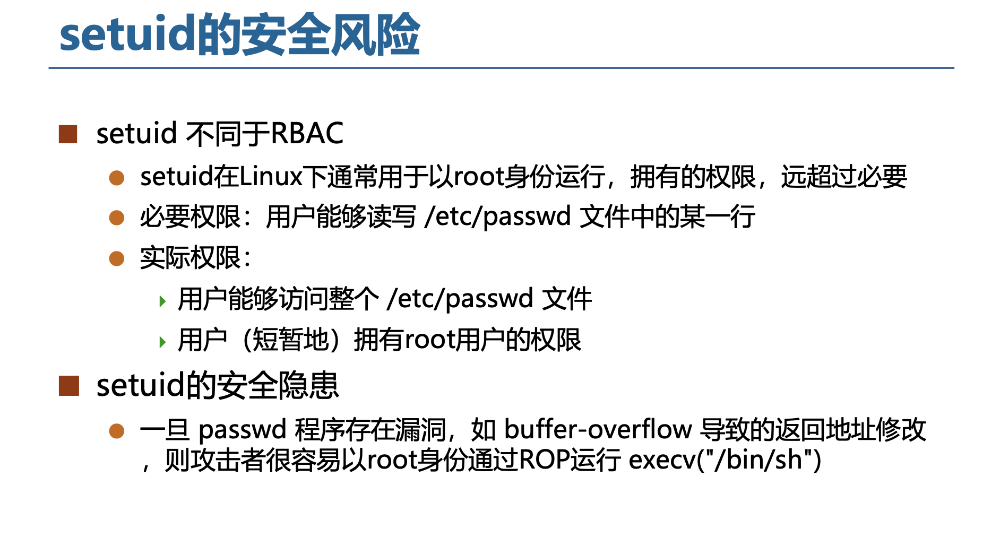

### Capabilities

提供细粒度控制进程的权限：基本的思想是把root的能力拆分，分为几十个小的能力，称为capability

Drawback: 

* 理想状态：41个capabilities均分 root能力
* 现实：`CAP_SYS_ADMIN` 占据了1/3的 permission checks

* [New Root](https://lwn.net/Articles/486306/)

> 使用混乱


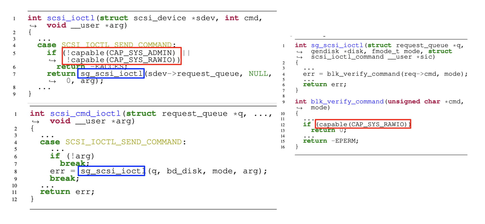

### Auditing

Record what users and programs are doing for later analysis

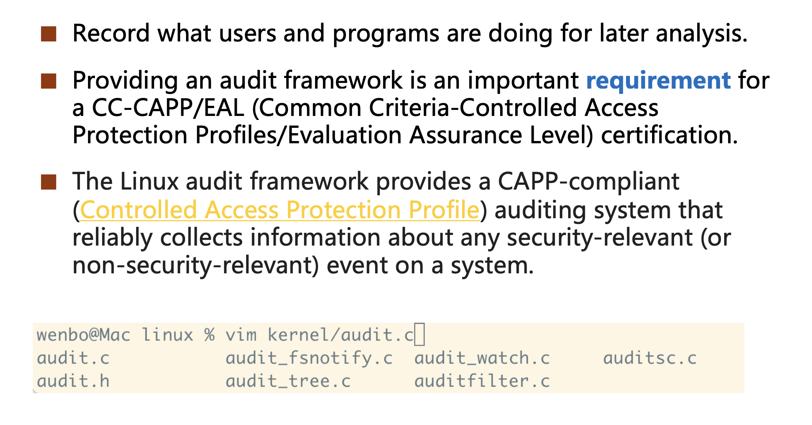

### Reference monitor

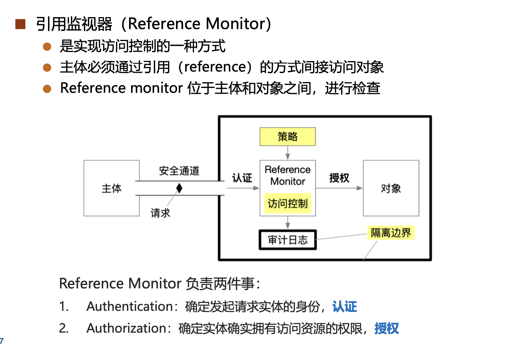

* 引用监视器机制必须保证其不可被绕过(Non-bypassable)。
* 设计者必须 充分考虑应用访问对象的所有可能路径，并保证所有路径都必须通过引用才能进行。
  1. 例如，应用必须通过文件描述符来访问文件，而无法直接访问磁盘上的数据或通过 inode 号来访问文件数据。文件系统此时就是引用监视器，文件描述符就是引用。

### DAC and MAC

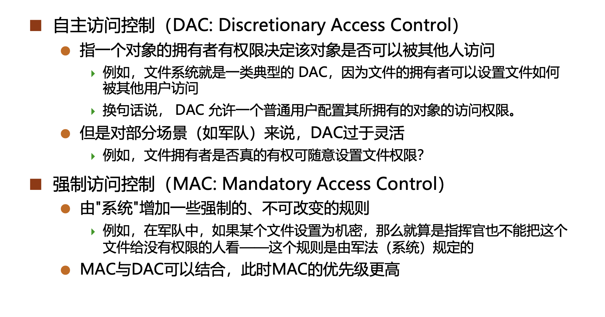

## Security

### Code injection attack
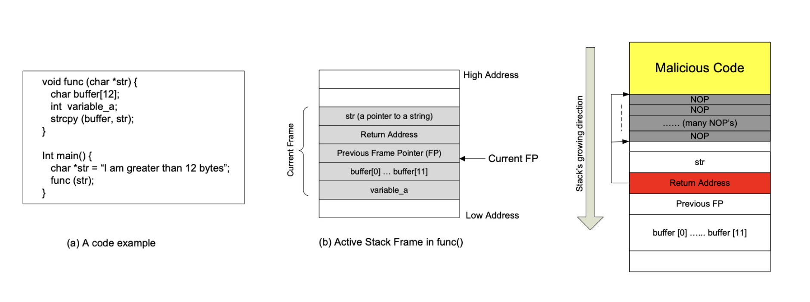

* 图1`buffer`在栈分配，攻击者overflow -- 通过禁止栈的x权限来防护

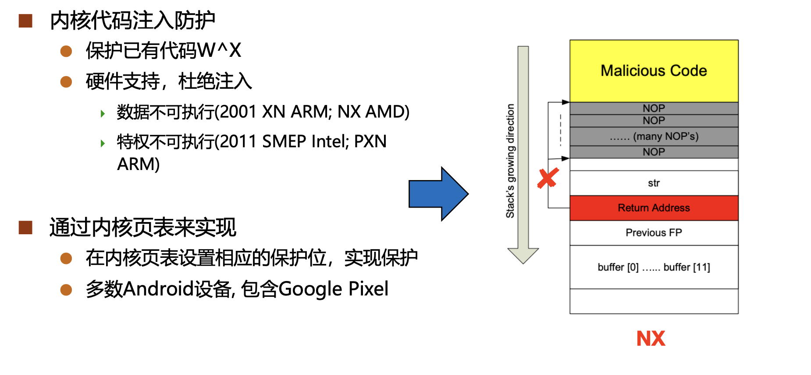

* 但是可以通过先攻击页表来解决

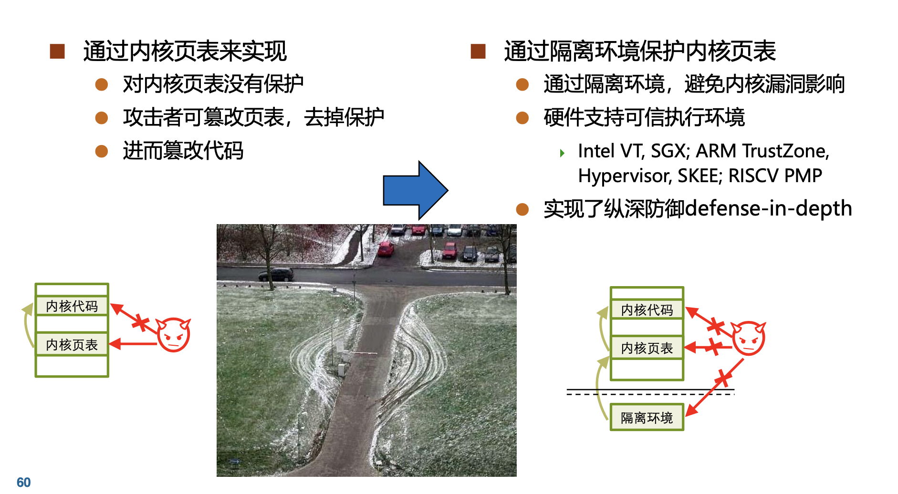

### Code reuse attack

#### ROP Attack

ROP (**Return-Oriented Programming**) attack is a type of code reuse attack. It manipulates the stack to execute existing code in the program.

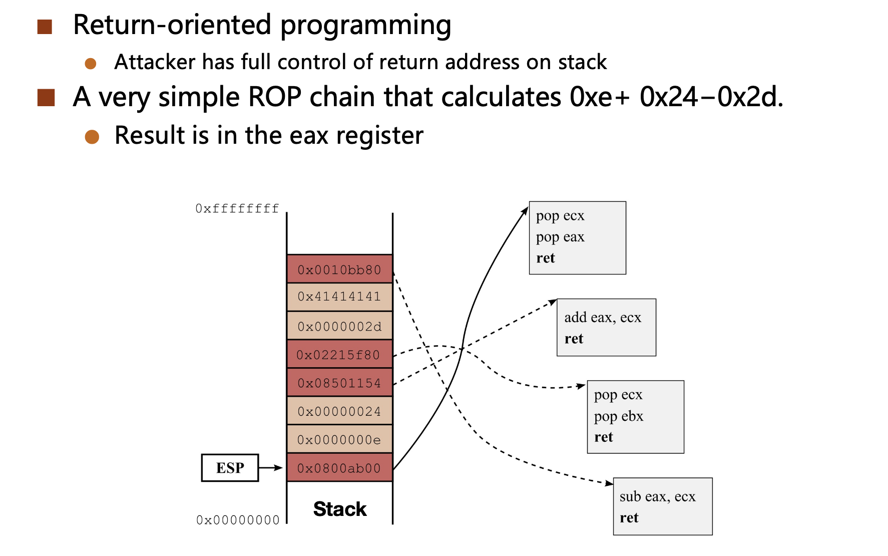
 
#### JOP Attack

JOP (**Jump-Oriented Programming**) attack is a type of code reuse attack. It manipulates the stack to execute existing code in the program.

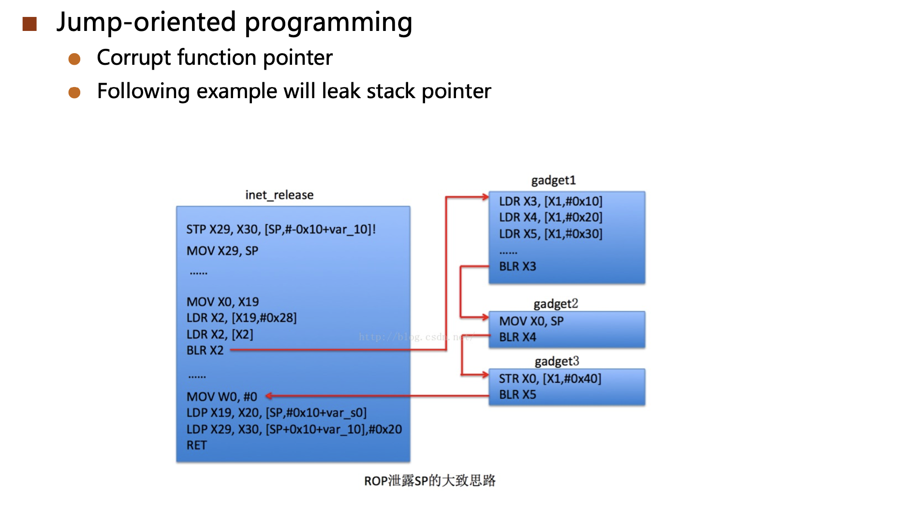
 
**防护**

* 保护返回地址
* 保护函数指针

### Non-control-data attack

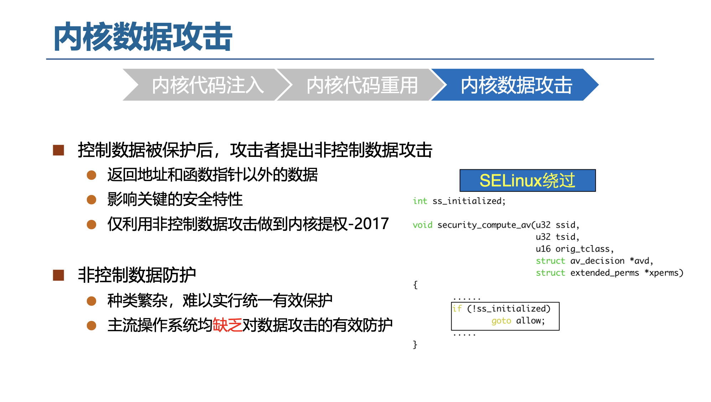

```cpp
int ss_initialized;
{
  ...
  if(!ss_initialized) {
    goto allow;
  }
  ...
}
```
> 通过修改`ss_initialized = 0`直接goto


</font>