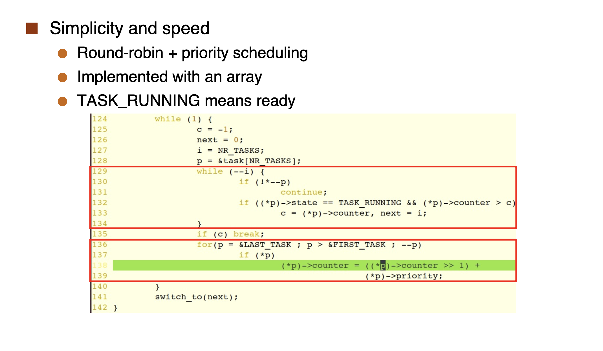

# Lecture 4 -  CPU Scheduling

* Non-preemptive scheduling vs. preemptive scheduling
  * Non-preemptive scheduling: once a process starts running, it will continue to run until it completes or blocks itself.
  * Preemptive scheduling: the OS can interrupt a process and move it to the ready queue.

Preemptive scheduling is good
* No need to have processes willingly give up the CPU
* The OS remains in control

Preemptive scheduling is complex
* Opens up many thorny issues having to do with process synchronization
  * Consider access to shared data
  * Consider preemption while in kernel mode
  * Consider interrupts occurring during crucial OS activities

## Scheduling Objectives

* Maximize CPU Utilization: Fraction of time the CPU isn't idle
* Maximize Throughput: Amount of “useful work” done per time unit
* Minimize Turnaround Time: Time from process creation to process completion
* Minimize Waiting Time: Amount of time a process spends in the READY state
* Minimize Response Time: Time from process creation until the “first response” is received

## Dispatcher

* Dispatcher: module that gives control of the CPU to the process selected by the short-term scheduler
  * switching to kernel mode
  * Switching context
  * Switching to user mode
  * Jumping to the proper location in the user program to restart that program

* Dispatch latency: time it takes for the dispatcher to stop one process and start another running

## Scheduling Algorithms

### Gantt Chart

* Gantt chart: a timeline that shows when each process is running
* Useful for visualizing the performance of a scheduling algorithm

### First-Come, First-Served (FCFS)

* Simplest scheduling algorithm
* Non-preemptive
* Processes are scheduled in the order they arrive
* Convoy effect: s**hort processes stuck behind long processes**

### Shortest-Job-First (SJF)

* Associate with each process the length of its next CPU burst
* Use these lengths to schedule the process with the shortest time

Two schemes:
* Non-preemptive: once a process starts running, it will continue to run until it completes or blocks itself

* Preemptive: the OS can interrupt a process and move it to the ready queue

A known result is: SJF is provably **optimal** for average wait time

**[Big Problem]**: How can we know the **burst durations**???

### Round Robin (RR)

* Each process gets a small unit of CPU time (time quantum)
* If a process doesn't complete within its time quantum, it is moved to the end of the ready queue
* Ready Queue is a FIFO queue

* Time quantum is a key parameter
  * If time quantum is too large, RR degenerates to FCFS
  * If time quantum is too small, **overhead** of context switching becomes significant 

In practice, %CPU time spent on switching is very low
* time quantum: 10ms to 100ms
* context-switching time: 10μs

### Priority Scheduling

* Each process is assigned a priority
* The process with the highest priority is selected to run

#### Priority Scheduling w/ Round-Robin

* Each process is assigned a priority
* The process with the highest priority is selected to run
* If two processes have the same priority, they are scheduled in a round-robin fashion

#### Problem: Starvation

* Low-priority processes may never execute
* Solution: Aging
  * As time progresses, increase the priority of the process

### Multilevel Queue Scheduling

Simple idea: use one ready queue per class of processes

**Scheduling within queues**

* Each queue has its own scheduling policy
* e.g., High-priority could be RR, Low-priority could be FCFS

**Scheduling between the queues**

* Typically preemptive priority scheduling
* A process can run only if all higher-priority queues are empty
* Or time-slicing among queues
* e.g., 80% to Queue #1 and 20% to Queue #2

### Multilevel Feedback Queue Scheduling

> Example

A new process arrives and is placed in the highest-priority queue Q0 with RR quatum = 8
   1. If it doesn’t use it all, it’s likely a **I/O-bound** process and should be kept in the high-priority queue so that it is assured to get the CPU on the rare occasions **that it needs it**
   2. If it does use it all, then it gets demoted to Q1 and, at some points, is given a quantum of 16
   3. If it does use it all, then it’s likely a CPU-bound process and it gets demoted to Q2
   4. At that point the process runs only when no non-CPU-intensive process needs the CPU

### Multiple-Processor Scheduling 

* Soft affinity – the operating system attempts to keep a thread running on the same processor, but no guarantees.
* Hard affinity – allows a process to specify a set of processors it may run on.

## Operating System Examples

### Windows
1. Priority-based, time quantum-based, multi-queue, preemptive scheduling
2. 32-level priority scheme: high number, high priority
3. When a thread “wakes up”, its priority is boosted
   * It’s likely an IO-bound thread

4. The idle thread:
   * Win XP maintains a “bogus” idle thread
   * “runs” (and does nothing) if nobody else can run
   * Simplifies OS design to avoid the “no process is running” case

### Linux

1. Lower priority number, higher priority

> Drawbacks of Linux Scheduling 0.11

1. $O(n)$ scheduling algorithm
2. Responsiveness is not guaranteed.

* See Slides for more details `[05 scheduling.pdf]`

