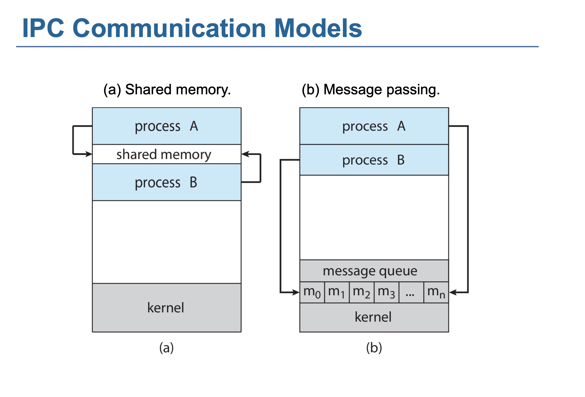
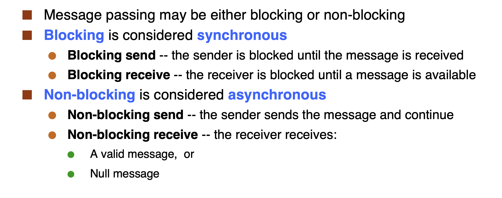
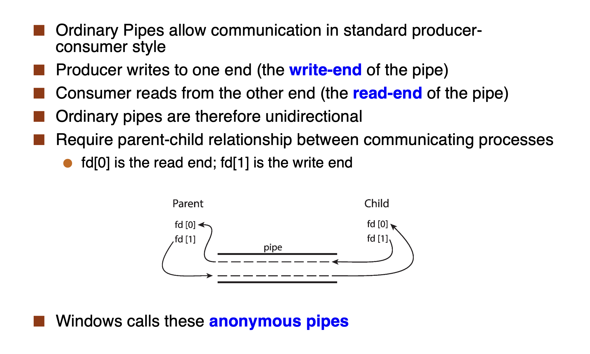
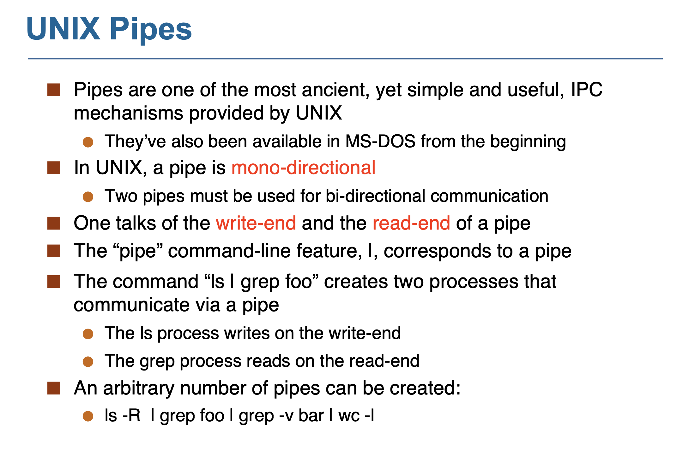

# Lecture 5 - Inter-Process Communication

## Message Passing

* high-overhead: one syscall per communication operation

> Why syscall? Because we need to switch from user mode to kernel mode to access the kernel's data structures.

We have to implement two calls

* send(Q, message): send a message to process Q
* recv(Q, message): recv a message from process Q

### Direct Communication

Processes must name each other explicitly:

* send (P, message) – send a message to process P
* receive(Q, message) – receive a message from process Q
* Between each pair there exists exactly one link

Drawbacks:

* Need so many links

### Indirect Communication

Messages are directed and received from mailboxes (also referred to as ports)

* Each mailbox has a unique id
* Processes can communicate only if they **share a mailbox**

* Link established only if processes share a common mailbox
* A link may be associated with many processes
* Each pair of processes may share several communication links
* Link may be unidirectional or bi-directional

### Synchronization

### Buffering

Queue of messages attached to the link.

Implemented in one of three ways

1. Zero capacity – no messages are queued on a link. Sender must wait for receiver
2. Bounded capacity – finite length of n messages. Sender must wait if link full
3. Unbounded capacity – infinite length. Sender never waits

## Shared Memory

* One process creates a shared memory segment
* Processes can then “attach” it to their address spaces

>Note that this is really contrary to the memory protection idea central to multi-programming!

* Processes communicate by reading/writing to the shared memory region
  
  1. They are responsible for not stepping on each other’s toes
  2. The OS is not involved at all

`shmget()`, `shmat()`, `shmdt()`, `shmctl()`

* Disadvantages
  1. Processes must coordinate access to shared memory
  2. No protection **from other processes**: Once another process has the **id of the shared memory segment**, it can attach to it and read/write to it

## Signals

> In Lecture 4, we discussed how a process can be terminated by another process. Signals are a way to do this.

## Pipes

### Ordinary pipes 
Cannot be accessed from outside the process that created it. 

>Typically, a parent process creates a pipe and uses it to communicate with a child process that it created.

### Named pipes 

* Named Pipes are more powerful than ordinary pipes
* Communication is bidirectional
* No parent-child relationship is necessary between the communicating processes
* Several processes can use the named pipe for communication
* Provided on both UNIX and Windows systems

`ls | grep foo`

> What will shell do ?

1.	`fork()` - Shell 首先创建一个子进程来执行 ls 命令。
2.	创建管道（pipe） - 在 `fork()` 之后，shell 创建一个管道，管道有两个文件描述符：

	•	写端（供 ls 使用）

	•	读端（供 grep 使用）

3.	子进程1（ls） - 在子进程中：

	•	关闭标准输出（stdout），将其重定向到管道的写端。

	•	关闭管道的读端（子进程不需要读）。

	•	使用 `exec()` 替换进程镜像，执行 ls 命令。

4.	`fork()` - Shell 创建第二个子进程来运行 grep foo。
5.	子进程2（grep） - 在第二个子进程中：

	•	关闭标准输入（stdin），将其重定向到管道的读端。

	•	关闭管道的写端（子进程不需要写）。

	•	使用 `exec()` 替换进程镜像，执行 grep foo 命令。
6.	父进程（Shell）：

	•	关闭管道的写端和读端（父进程不直接参与管道的读写）。
	
	•	等待两个子进程结束。

7.	ls 写入管道 - ls 命令的输出通过管道写入。
8.	grep 从管道读取 - grep foo 从管道的读端接收数据，进行匹配。
9.	ls 完成 - ls 命令完成执行并退出。
10.	grep 完成 - grep foo 完成过滤操作，输出匹配结果后退出。

## Client-Server Communication

### Sockets

Sockets are the most widely used communication mechanism for client-server communication.

* A socket is an endpoint for communication
* A socket is identified by an IP address concatenated with a port number

### RPC, RMI......
