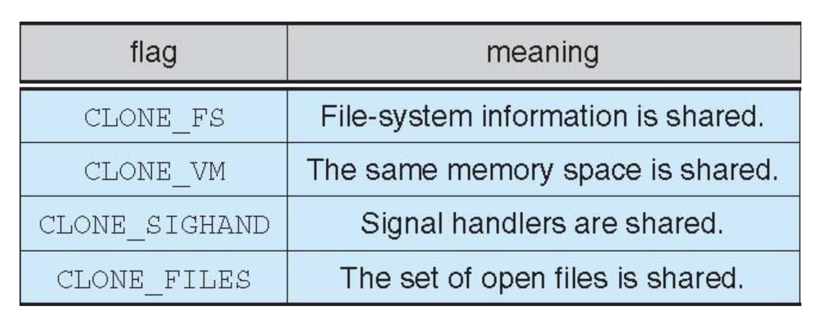

# Lecture 6 - Thread

* A thread is a **basic unit of execution** within a process

> 线程是进程内的基本执行单元，进程是资源分配和隔离[allocation and protection]的基本单元

* A Process contains at least one thread, and can contain multiple threads

> Revisit IMPORTANT!!

## Advantages of Threads

#### Economy:

* Creating a thread is cheap: Much cheaper than creating a process -- Code, data and heap are already in memory
* Context-switching between threads is cheap: Much cheaper than between processes -- No cache flush
#### Resource Sharing: 

* Threads **naturally share memory**
  
  1. With processes you have to use possibly complicated IPC (e.g., Shared Memory Segments)
  2. IPC is not needed

> NOTE: Threads DO NOT share the following:
> 
> 1. Registers
> 2. Stack
> 3. Program Counter
> 4. thread ID

> It shares the following with other threads within the same process
> 
> 1. code section
> 2. data section
> 3. the heap (dynamically allocated memory)
> 4. open files and signals

* Concurrency: A multi-threaded process can do multiple things at once

* Having concurrent activities in the same address space is very powerful -- But fraught with danger

#### Responsiveness

* A program that has concurrent activities is more responsive
  
  1. While one thread blocks waiting for some event, another can do something
  2. e.g. Spawn a thread to answer a client request in a client-server
  
* This is true of processes as well, but with threads we have better sharing and economy

## Drawbacks of Threads

* 隔离差

## Models of Threading

* Linux : One-to-One

### Many-to-One Model

### One-to-One Model

> 耗资源

* Removes both drawbacks of the Many-to-One Model
* Creating a new threads requires work by the kernel
  
  1. Not as fast as in the Many-to-One Model

* Example: Linux Windows Solaris 9 and later

### Many-to-Many Model

### Two-Level Model

## Threading Issues

1. `fork()` and `exec()` 
   
   1. `fork()` fork which thread or **all threads**?
   > Linux will fork the caller thread only
   2. `exec()` exec which thread or **all threads**?
   > Linux : all threads are “wiped out” anyway

## Safe Thread Cancelation

### Asynchronous cancellation

* One thread terminates another immediately

### Deferred cancellation [Default]

* A thread periodically checks whether it should terminate

## Thread Scheduling

process-contention scope (PCS)

* 每个进程分到时间片一样，然后进程内部再对线程进行调度。

system-contention scope (SCS)

* 所有线程进行调度。

## Linux Thread 

* In Linux, a thread is also called a light-weight process (LWP)
* The clone() syscall is used to create a thread or a process

### Thread Control Block -- Task Struct [TCB & PCB]

* When the **FIRST** thread is created, its Thread ID is the same as the Process ID -- Leading Thread
* `struct list_head thread_group`
  * All threads in the same process are linked together 

* User Space Stack 大小不固定

