<font face = "Times New Roman">

# Lecture 7 - Synchronization


## Race Condition

Several processes (or threads) access and manipulate the **same** data **concurrently** and the outcome of the execution depends on the particular order in which the access takes place, **is called a race-condition**.

* Single Core **will have race condition** -- Interupts

## Critical Section

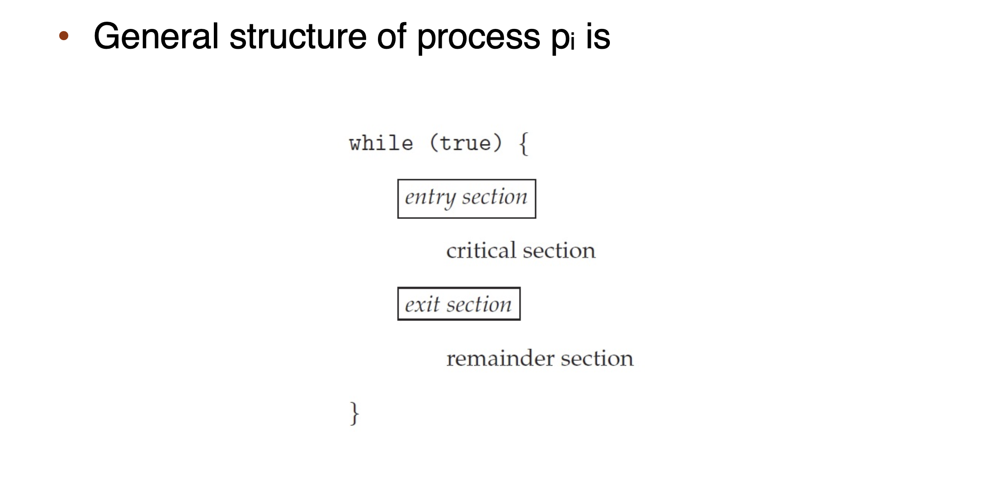

**Only one process can be in the critical section**

* when one process in critical section, no other may be in its critical section
* each process must **ask permission** to enter critical section in entry section
* the permission **should be released in exit section**
* Remainder section

How to achieve protection of critical section in single core system? 

>Stop the Interrupts?

Protection of critical section can only be achieved by **Synchornization** in multi-core system.

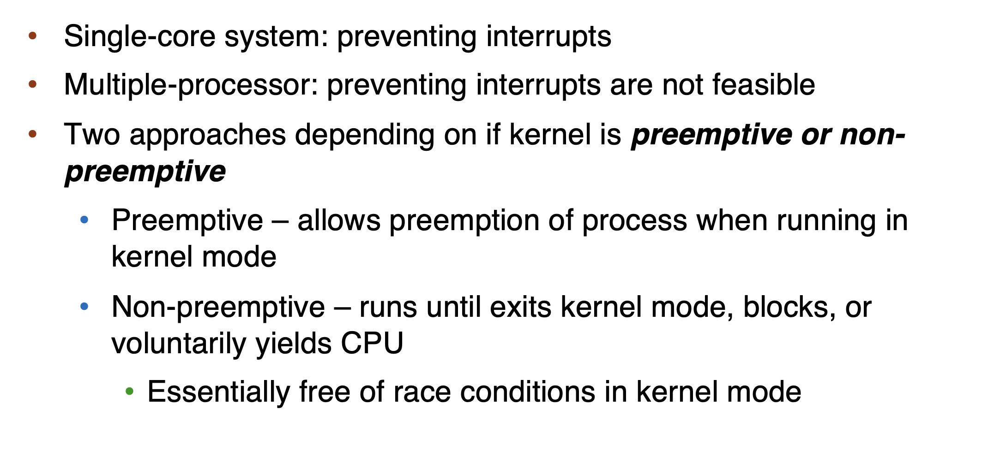

> Solution to Critical-Section: Three Requirements [Important]!

**1. Mutual Exclusion**

* only one process can execute in the **critical section**

**2. Progress**

* if no process is executing in its critical section and some processes wish to enter their critical section, then only those processes **that are not executing in their remainder sections** can participate in deciding which will enter its critical section next, and this selection cannot be postponed indefinitely
* 线程没有在执行critical section时，必须在申请进入critical section的线程中选择一个进入，允许其执行，不能无限期地推迟

**3. Bounded waiting**

* There exists a bound, or limit, on the number of times that **other processes are allowed to enter their critical sections after a process has made a request to enter its critical section and before that request is granted**
* It prevents starvation

## Solutions

### Peterson's Solution

> Only works for two processes!
> It assumes that **LOAD** and **STORE** are atomic

Two processes share two variables

* `boolean flag[2]`: whether a process is ready to enter the critical section
* `int turn`: whose turn it is to enter the critical section

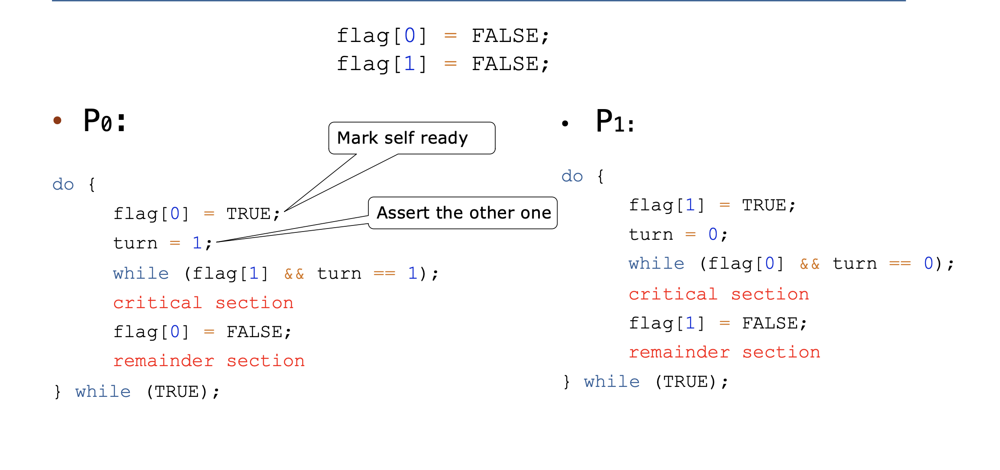

> Mutual exclusion is preserved

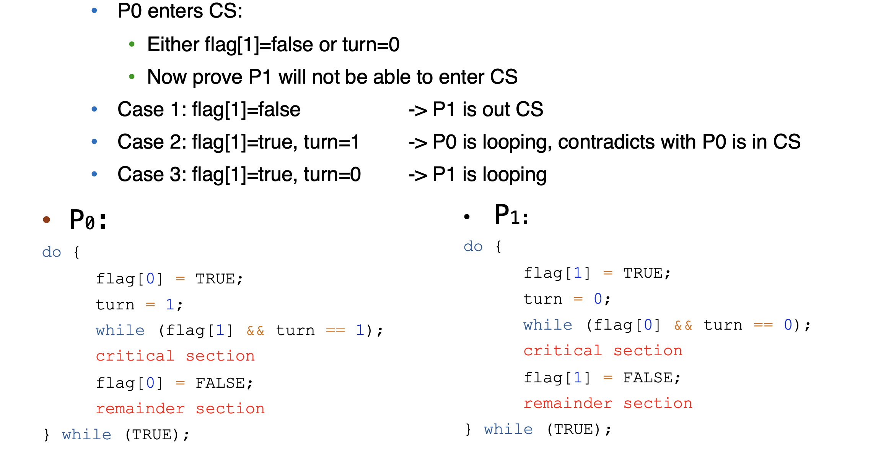

> Progress is preserved

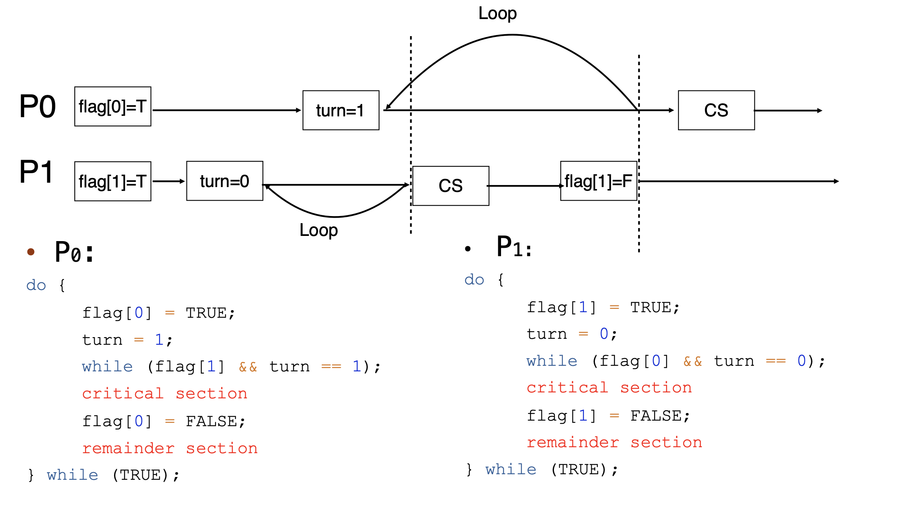

> Bounded waiting is preserved

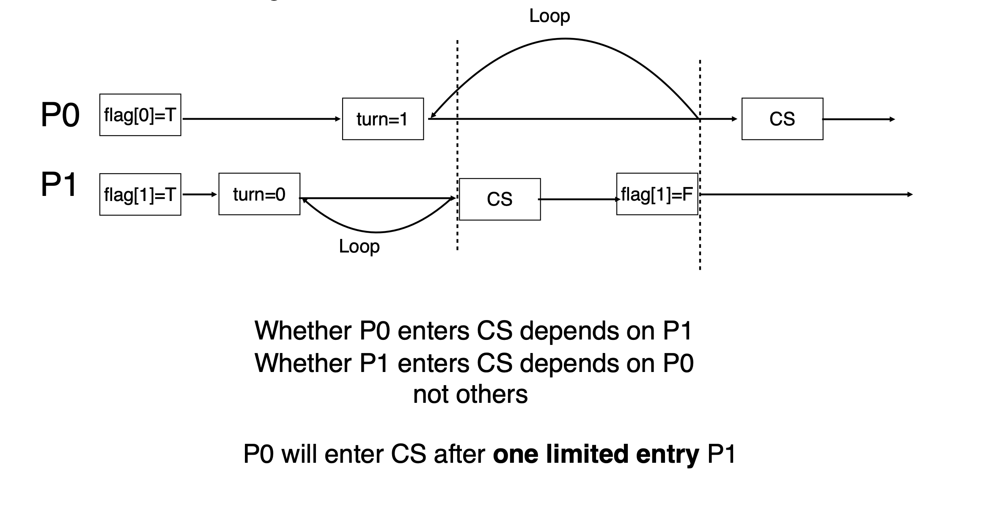

* 不能调整代码顺序，否则可能会出现问题

## Hardware Support Synchronization


### Memory Barriers [不考]

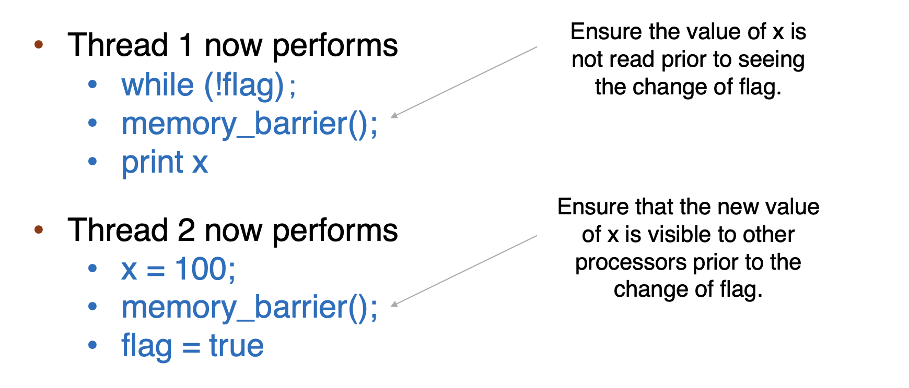

###  Hardware instructions
#### test-and-set: either test memory word and set value

```cpp
bool test_set (bool *target)
{
    bool rv = *target;
    *target = TRUE;
    return rv:
}
```

```cpp
bool lock = FALSE
do {
    while (test_set(&lock)); // busy wait
    critical section
    lock = FALSE;
    remainder section
} while (TRUE);
```

* Mutual Exclusion is preserved
* Progress is preserved
*  Bounded waiting is not preserved!

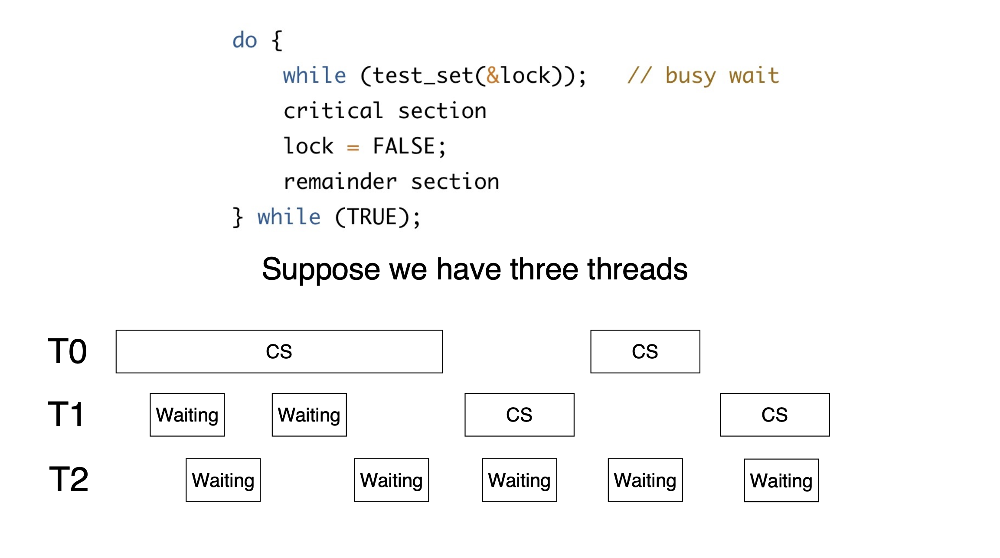

> Solution: 

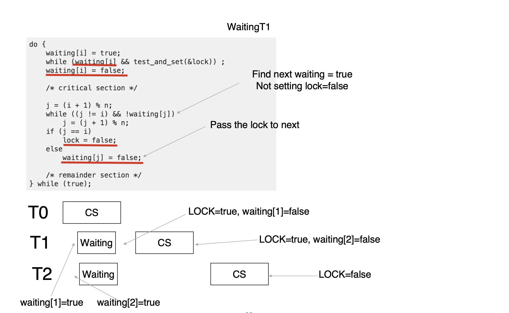

#### compare-and-swap: compare and swap contents of two memory words
```cpp
int compare_and_swap(int *value, int expected, int new_value)
{
    int temp = *value;
    if (*value == expected)
        *value = new_value;
    return temp;
}
```

* Executed atomically
* Returns the original value of passed parameter value
* Set the variable value the value of the passed parameter `new_value` but only if `*value == expected` is true. That is, the swap takes place only under this condition.

```cpp
while (true)
{
    while (compare_and_swap(&lock, 0,1)!= 0); /* do nothing */
    /* critical section */
    lock = 0;
    /* remainder section */
}
```

#### In Practice

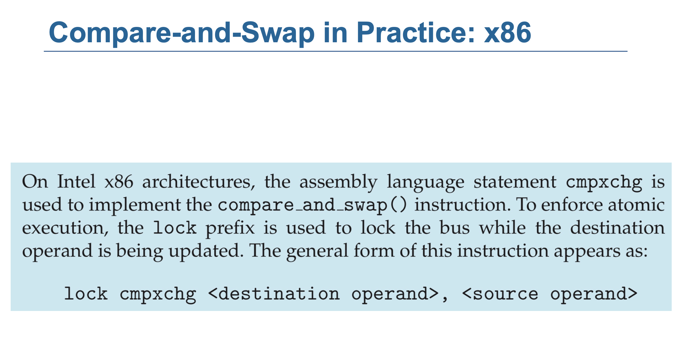

* In ARM, `LDREX` and `STREX` instructions are used to implement `compare-and-swap`

ARM 的 LDXR 和 STXR 机制

* LDXR (Load Exclusive Register):从一个内存地址加载值，并在硬件层面进入 Exclusive Access 状态。这种状态由一个 本地监视器 (local monitor) 管理。
* Exclusive Access 状态表示线程声明对这块内存的独占权限。
* STXR (Store Exclusive Register): 试图将一个值写入 LDXR 加载的内存地址，但只有当 local monitor 保持 Exclusive Access 状态时，写入才能成功。
* 如果 local monitor 检测到 Exclusive Access 状态被破坏（例如，其他线程也访问了该地址），STXR 写入会失败。
* STXR 会返回一个状态码来指示操作是否成功：
  * 成功：Exclusive Access 状态未被破坏，写入成功，状态码为 0。
  * 失败：Exclusive Access 状态被破坏，写入失败，状态码为 1。


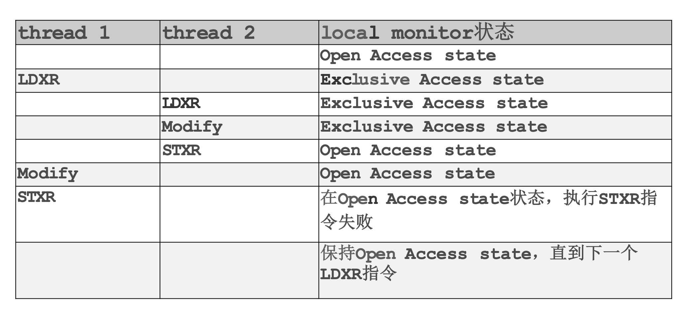

1.	thread 1 的 LDXR 会使 local monitor 进入 Exclusive Access 状态。
2.	如果 thread 2 也在相同的内存地址执行了 LDXR，local monitor 不会直接变为 Open Access，但会使 thread 1 的独占访问状态失效。
3.	当 thread 1 尝试执行 STXR 写回时，由于 Exclusive Access 状态已经丢失，STXR 写回失败

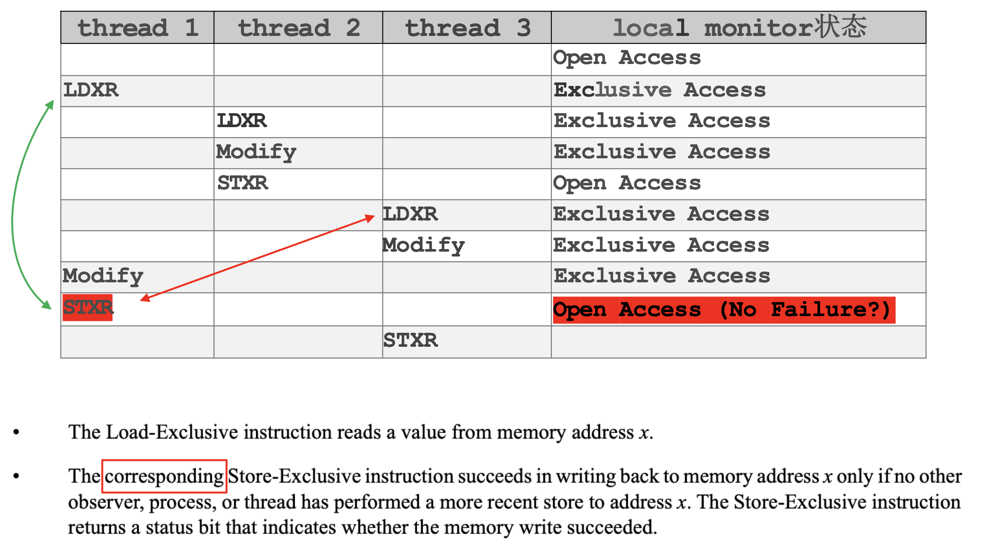

1.	当 thread 1 在执行 STXR 前，如果 thread 2 或其他线程（比如 thread 3）对相同的内存地址执行了 LDXR，thread 1 的 Exclusive Access 状态就会失效。
2.	如果此时 thread 3 

* 当 thread 3 执行 LDXR 时， 重新进入 Exclusive Access 状态
* 如果此时 thread 1 尝试执行 **STXR 写回**，由于 Exclusive Access 状态已经丢失，STXR 写回失败 -- LDXR 和 STXR 是 **coresponding** 的！

### Atomic variables

Typically, instructions such as compare-and-swap are used as **building blocks** for other synchronization tools.

One tool is an atomic variable that provides atomic (uninterruptible) updates on basic data types such as integers and booleans.

For example, the **increment()** operation on the atomic variable sequence ensures sequence is incremented without interruption:

```cpp
void increment(atomic_int *v) {
int temp;
do {
    temp = *v;
 }while (temp != (compare_and_swap(v,temp,temp+1)));
}
```

> In case another modification occurs 

### Mutex Locks

```cpp
bool locked = false;
acquire() {
    while (compare_and_swap(&locked, false, true))
    ; //busy waiting
}
release() {
    locked = false;
}
```

* These two functions must be implemented **atomically**.
* Both test-and-set and compare-and-swap can be used to implement these functions.

**Problem**: Busy waiting is inefficient 

* This lock therefore called a spinlock

> Too Much Busy Waiting!

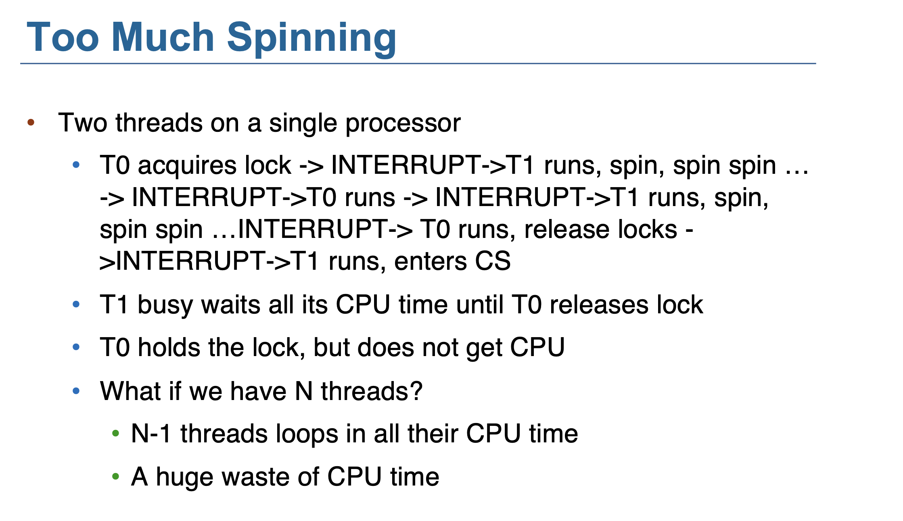

```cpp
void init() {
    flag = 0;
}
void lock() {
    while (test_set(&flag, 1) == 1)
        yield(); // give up the CPU
}
void unlock() {
    flag = 0;
}
```

How to implement?

### Semaphores

* Add a queue
* When the lock is locked, change process’s state to SLEEP, add to the queue, and call `schedule()`

* Semaphore Contain S – integer variable
* Can only be accessed via two indivisible (atomic) operations
  * wait() and signal() (Originally called P() and V()Dutch)
```cpp
wait(S) {
while (S <= 0) ; // busy wait
    S--;
}
signal(S) {
    S++;
}
```

* Counting semaphore: S can range over an unrestricted domain
* Binary semaphore: S can only be 0 or 1
* Can implement a counting semaphore S as a binary semaphore

#### Waiting Queue

* With each semaphore there is an associated waiting queue
* Each entry in a waiting queue has two data items:
  1. value (of type integer)
  2. pointer to next record in the list

```cpp
typedef struct {
    int value;
    struct list_head * waiting_queue;
} semaphore;
```

Two operations:

* block – place the process invoking the operation on the appropriate waiting queue
* wakeup – remove one of processes in the waiting queue and place it in the ready queue

```cpp
wait(semaphore *S) {
    S->value--;
    if (S->value < 0) {
        add this process to S->list;
        block();
    }
}

signal(semaphore *S) {
    S->value++;
    if (S->value <= 0) {
        remove a proc.P from S->list;
        wakeup(P);
    }
}
```


wait(semaphore *S)
1.	S->value--：减少信号量的值。
	
* 如果 S->value >= 0：说明有可用的资源，当前进程成功获取资源。
* 如果 S->value < 0：说明资源已被占用，当前进程需要等待资源，进入阻塞状态。
	
2.	如果信号量值小于 0：

* 当前进程被加入到信号量的等待队列 S->list。
* 调用 block()，让当前进程进入阻塞状态，等待资源。

signal(semaphore *S)

1.	S->value++：增加信号量的值。

* 如果 S->value > 0：说明没有进程在等待，直接结束。
* 如果 S->value <= 0：说明有进程在等待，唤醒等待队列中的一个进程。

2.	如果有进程在等待队列中：

* 从等待队列中移除一个等待的进程（比如 P）。
* 调用 wakeup(P)，将进程 P 移到就绪队列中，准备运行。


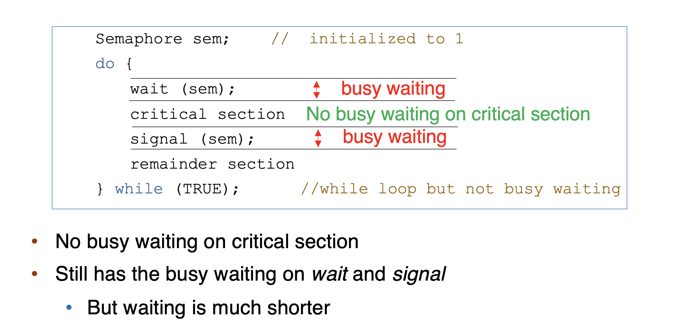


`wait()` 和 `signal()` 操作是**原子操作**，不会被中断。-- 也需要**Mutex Lock** 

* 所以 critical section 没有busy waiting 但是 `wait()` 和 `signal()` 有busy waiting

### Comparison between mutex and semaphore
#### Mutex or spinlock
* Pros: no blocking
* Cons: Waste CPU on looping
* Good for short critical section

#### Semaphore
> Critical section short -- constant context switch is time-consuming

* Pros: no looping
* Cons: **context switch is time-consuming**
* Good for **long critical section**

> In Linux Kernel, spinlock is more common.

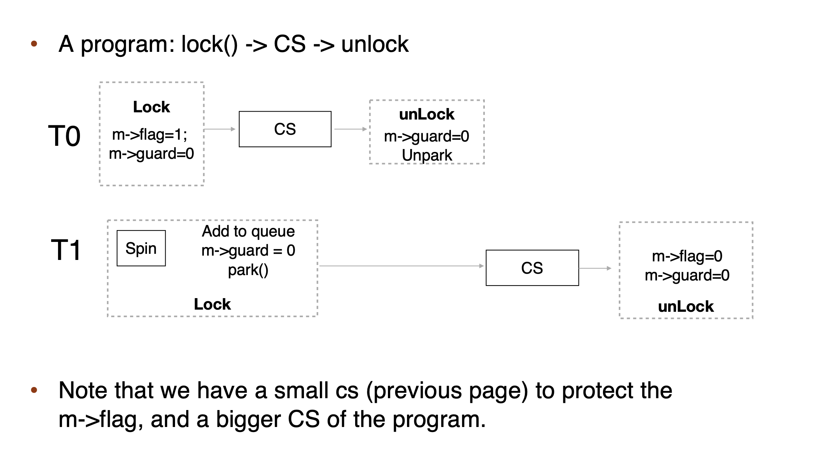


* Starvation **不一定死锁**，但是死锁一定饥饿

## Priority Inversion

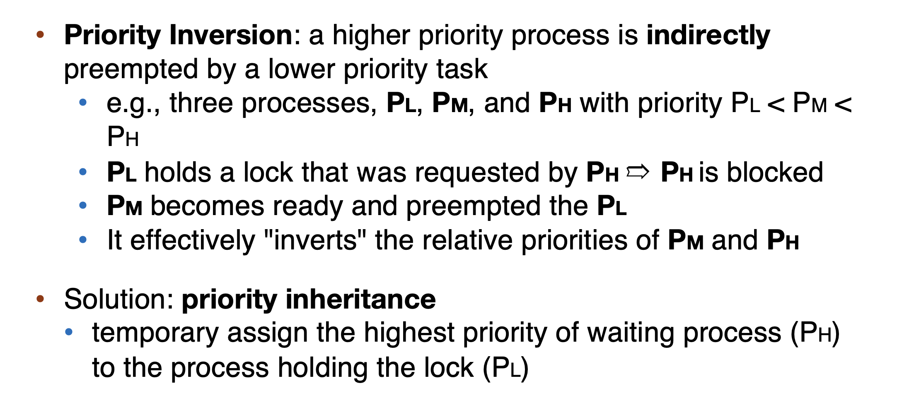

## Linux Implementation

> See Slides

## POSIX Synchronization

### mutex locks

* Creating and initializing the lock
```cpp
#include <pthread.h>
pthread_mutex_t mutex;
/* create and initialize the mutex lock */
pthread_mutex_init(&mutex, NULL);
```

* Acquiring and releasing the lock
```cpp
/* acquire the mutex lock */
pthread_mutex_lock(&mutex);
/* critical section */
/* release the mutex lock */
pthread_mutex_unlock(&mutex);
```

### semaphores

* Named semaphores & Unnamed semaphores

### condition variable

> See Slides
</font>