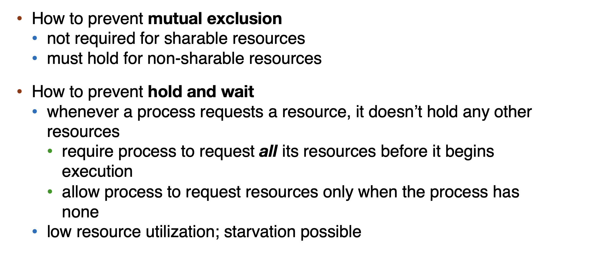
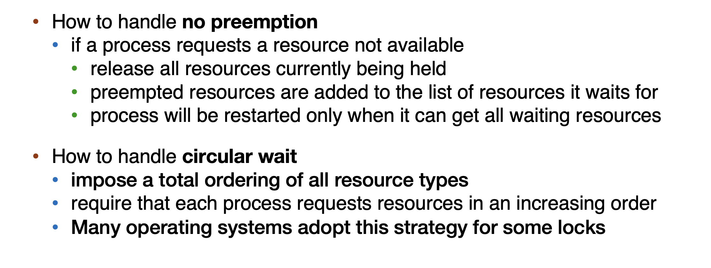
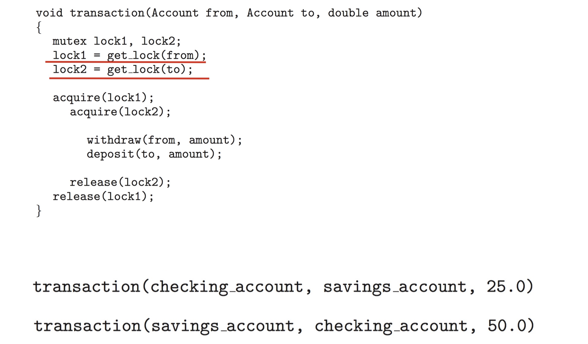
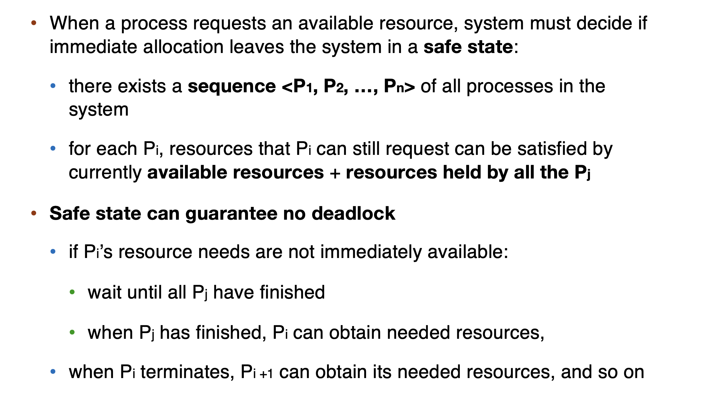
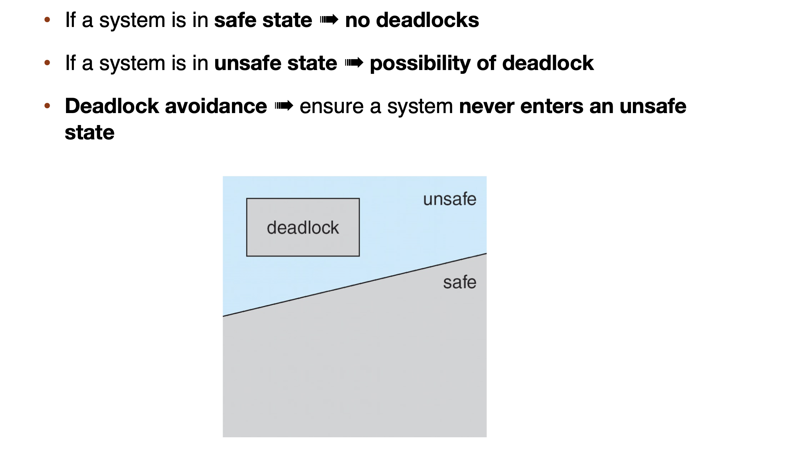
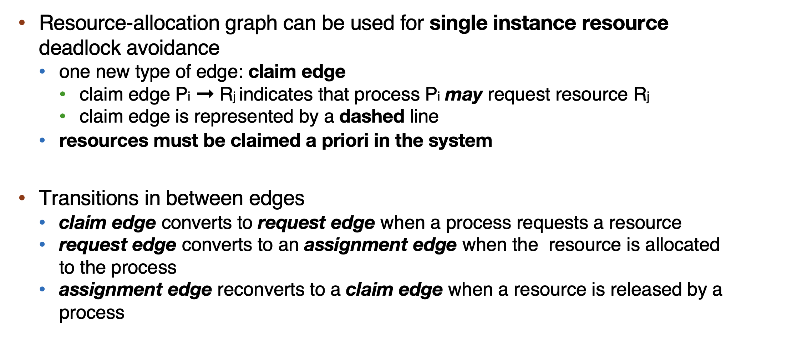
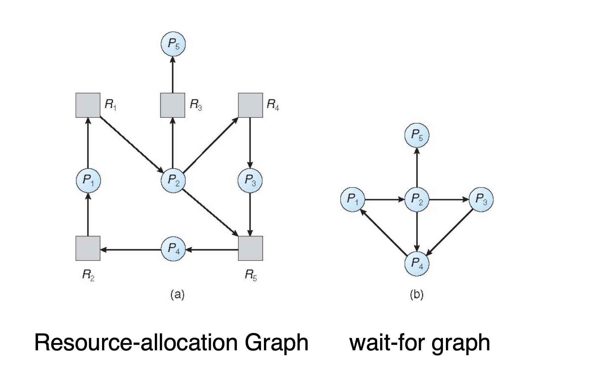

<font face = "Times New Roman">

# Lecture 9 - Deadlocks

## Conditions for Deadlocks

* Mutual exclusion: a resource can only be used by one process at a time
* Hold and wait: a process holding at least one resource is waiting to acquire additional resources held by other processes
* No preemption: a resource can be released only voluntarily by the process holding it, after it has completed its task
* Circular wait: there exists a set of waiting processes {P0, P1, …, Pn}

> P0 is waiting for a resource that is held by P1
> 
> P1 is waiting for a resource that is held by P2…
> 
> Pn–1 is waiting for a resource that is held by Pn
> 
> Pn is waiting for a resource that is held by P0

* **Circular wait does not imply deadlock, but it is a necessary condition.**

## Solutions to Deadlocks

### Deadlock Prevention





#### For Circular Wait [More Specifically]

* Invalidating the circular wait condition is most common.
* Simply assign each resource (i.e. mutex locks) a unique number.
* Resources must be acquired in order.

```cpp
/* thread one runs in this function */
void *do_work_one(void *param){
    pthread_mutex_lock(&first_mutex);
    pthread_mutex_lock(&second_mutex);
    /* Do some work*/
    pthread_mutex_unlock(&second_mutex);
    pthread_mutex_unlock(&first_mutex);
    pthread_exit(0);
}
/* thread two runs in this function */
void *do_work_two(void *param){
    pthread_mutex_lock(&second_mutex);
    pthread_mutex_lock(&first_mutex);
    /* Do some work*/
    pthread_mutex_unlock(&first_mutex);
    pthread_mutex_unlock(&second_mutex);
    pthread_exit(0);
}
```

* We can not use the above code as it will lead to deadlock.
* change the order of mutex locks in one of the threads.

```cpp
/* thread one runs in this function */
void *do_work_one(void *param){
    pthread_mutex_lock(&first_mutex);
    pthread_mutex_lock(&second_mutex
    /* Do some work*/
    pthread_mutex_unlock(&second_mutex);
    pthread_mutex_unlock(&first_mutex);
    pthread_exit(0);
}
/* thread two runs in this function */
void *do_work_two(void *param){
    pthread_mutex_lock(&first_mutex);
    pthread_mutex_lock(&second_mutex
    /* Do some work*/
    pthread_mutex_unlock(&second_mutex);
    pthread_mutex_unlock(&first_mutex);
    pthread_exit(0);
}
```

* 有的时候，给锁排序的方法不适用：在银行转账的时候，如果都先锁 from 再锁 to，就会死锁。
* A 取存到 B，B 取存到 A，如果都先锁 from 再锁 to，就会死锁。




#### Safe State





### Deadlock Avoidance

> Impractical because we do not know how many resources a process will need in the future.


#### Single-instance Deadlock Avoidance



The request can be granted only if:

* converting the request edge to an assignment edge does not result in the formation of a cycle

#### Banker’s Algorithm

n processes, m types of resources

* **available**: an array of length m, instances of available resource `available[j] = k`: k instances of resource type Rj available
* max: a `n x m` matrix : `max [i,j] = k`: process Pi may request at most k instances of resource Rj
* allocation: `n x m` matrix : `allocation[i,j] = k`: Pi is currently allocated k instances of Rj
* need: `n x m` matrix : `need[i,j] = k`: Pi may need k more instances of Rj to complete its task
* `need [i,j] = max[i,j] – allocation [i,j]`

> Example: Banker’s Algorithm see slides

### Deadlock Detection

#### Single-instance Deadlock Detection

#### Wait-for Graph



* A directed edge from Pi to Pj means that Pi is waiting for Pj to release a resource

* A cycle in the graph implies a deadlock
* Complexity: $O(n^2)$

#### Multiple-instance Deadlock Detection
> Example: Multiple-instance Deadlock Detection see slides

## Deadlock Recovery

1. abort all deadlocked processes
2. abort one process at a time until the deadlock cycle is eliminated

   * In which order should we choose to abort?
   * priority of the process
   * how long process has computed, and how much longer to completion
   * resources the process has used
   * resources process needs to complete
   * how many processes will need to be terminated
   * is process interactive or batch?

3. Resource preemption

   * Select a victim
   * Rollback
   * Starvation : How could you ensure that the resources do not preempt from the same process?


</font>