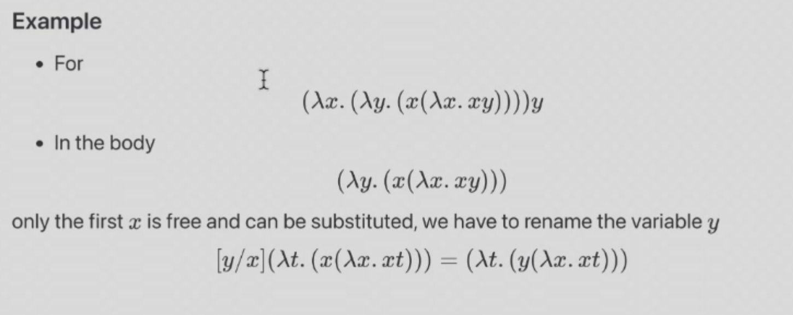
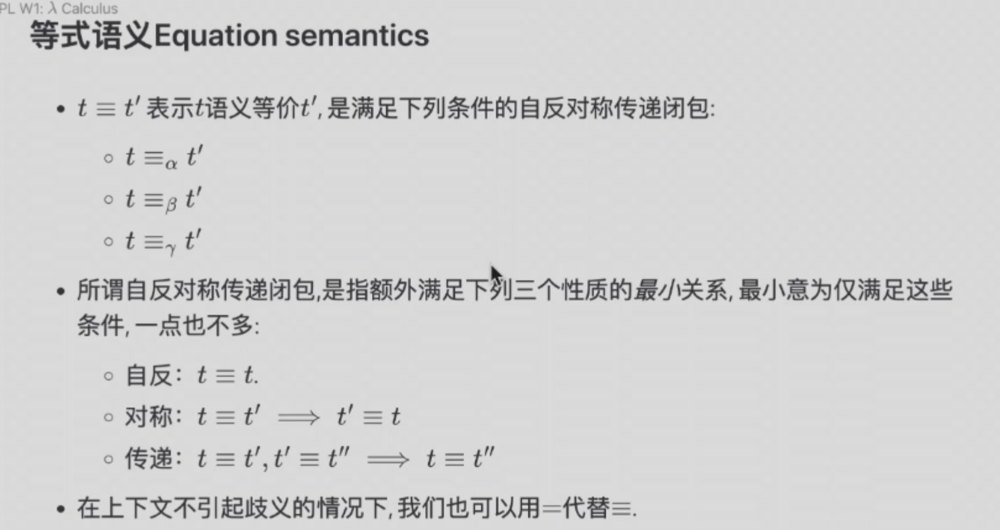

# Lec 1  $\lambda$-Calculus
Lambda calculus is a formal system in mathematical logic for expressing computation based on function abstraction and application using variable binding and substitution.
## Definition
- Variables: $x, y, z, \ldots$
- Abstraction: $\lambda x.M$ where $x$ is a variable and $M$ is a lambda term.
- Application: if $M$ and $N$ are lambda terms, then $(M N)$ is a lambda term.
## Example

- Identity function: $\lambda x.x$ 
- Constant function: $\lambda x.y$
- $\lambda x.(\lambda y.y x)$ is a function that takes two arguments and returns the second one. -- Abstraction (Definition)
  - Example: $(\lambda x.(\lambda y.y x)) a b \rightarrow (\lambda y.y a) b \rightarrow b a$
- $(\lambda x.x)y$ is a function that takes one argument and returns the argument. -- Application
  - Example: $(\lambda x.x)y \rightarrow y$
- $(\lambda x.x) (\lambda y.y x)$ is a function that takes one argument and returns the identity function. -- Application 
  - Example: $(\lambda x.x) (\lambda y.y x) \rightarrow \lambda y.y x$

## Free and Bound Variables
- A variable $x$ is free in $M$ if $x$ is not bound by any $\lambda$ in $M$.
- A variable $x$ is bound in $M$ if $x$ is bound by some $\lambda$ in $M$.

### Example
- In $\lambda x.x$, $x$ is bound.
- In $\lambda x.y$, $y$ is free.
- In $\lambda x.y x$, $x$ is bound and $y$ is free.
- In $(\lambda y,y)(\lambda x.xy)$, represented as $MN$ where $M = (\lambda y.y)$ and $N = (\lambda x.xy)$, $x$ is bound in $N$ and $y$ is bound in $M$.
  - In M: $y$ is bound.
  - In N: $x$ is bound and $y$ is free. also $y$ has nothing to do with the $y$ in $M$.
- In $\lambda x.(\lambda y.y xz)$, $x$ is bound by the first $\lambda$ and $y$ is bound by the second $\lambda$ and $z$ is free.
### Free Variable
**CANNOT CHANGE NAME OF FREE VARIABLE**

* $FV(x) = \{x\}$
* $FV(\lambda x.t') = FV(t') - \{x\}$
* $FV(t_1 t_2) = FV(t_1) \cup FV(t_2)$

### Bound Variable
**CAN CHANGE NAME OF BOUND VARIABLE**
* $BV(x) = \emptyset$
* $BV(\lambda x.t') = BV(t') \cup \{x\}$
* $BV(t_1 t_2) = BV(t_1) \cup BV(t_2)$

### Example2
* $BV(\lambda x.y x) = \{x\}$ ; $FV(\lambda x.y x) = \{y\}$
* $BV(xyz) = \emptyset$ ; $FV(xyz) = \{x, y, z\}$
* $BV(\lambda x.\lambda y.x) = \{x,y\}$ ; $FV(\lambda x.\lambda y.x) = \emptyset$
* $BV(\lambda x.\lambda y.y)=\{x,y\}$ ; $FV(\lambda x.\lambda y.y) = \emptyset$

## Closed Term
* A term with no free variables is called a closed term: $FV(t) = \emptyset$
* Term $t$ 相对于 term $t'$封闭 if and only if $FV(t) \cap BV(t') = \emptyset$
  * $t$ 's free variables are not bound by $t'$
* Closed term s is a closed term relative to any term $t$.
## Substitution
* $[N/x]M$ implies that all occurrences of $x$ in $M$ are replaced by $N$.
* In M, there cannot be any bound variable with the same name as the free variable in N.
### $\alpha$-Renaming
* $\forall x$ and $\forall term\ t'$ $\lambda x.t' =_{\alpha} \lambda y.[y/x]t'$.
* If $t' =_{\alpha} t''$, then $\lambda x.t' =_{\alpha} \lambda x.t''$.
* If $t_1 =_{\alpha} t_1'$ and $t_2 =_{\alpha} t_2'$, then $t_1 t_2 =_{\alpha} t_1' t_2'$.
### $\beta$-Reduction
* $\forall x$ and $\forall term\ t_1'$ and $t_2$, if   $t_2$ is closed relative to $t_1'$, then $(\lambda x.t_1')t_2 =_{\beta} [t_2/x]t_1'$.
* If $t_1 =_{\beta} t_1'$ and $t_2 =_{\beta} t_2'$, then $t_1 t_2 =_{\beta} t_1' t_2'$.
* If $t_1 =_{\beta} t_1'$, then $\lambda x.t_1 =_{\beta} \lambda x.t_1'$.

### $\eta$-Conversion
* $\forall x$ and $\forall term\ t'$, $\lambda y.(\lambda x.t')y =_{\eta} \lambda x.t'$ 
* if $t_1 =_{\eta} t_1'$ and $t_2 =_{\eta} t_2'$, then $t_1 t_2 =_{\eta} t_1' t_2'$.
* if $t_1 =_{\eta} t_1'$, then $\lambda x.t_1 =_{\eta} \lambda x.t_1'$.
  
### EquationSemantics

## Function Composition

* composition operator: $\circ$
* $(f \circ g )(x) = f(g(x))$
* $f \circ g = \lambda x.f(g(x))$
* $\circ$ itself is a function : $\lambda f.\lambda g.\lambda x.f(g(x))$

## Application
### Representing Boolean Values
#### True and False

**True**: $\lambda x.\lambda y.x$

**False**: $\lambda x.\lambda y.y$

**Example**: (in steps):

* $(\lambda x.\lambda y.x) a b \rightarrow (\lambda y.a) b \rightarrow a$
* $(\lambda x.\lambda y.y) a b \rightarrow (\lambda y.y) b \rightarrow b$

**not**

* $\lambda b.b\ (\lambda x.\lambda y.y)\ (\lambda x.\lambda y.x)$

**and**

* $\lambda a. \lambda b. a\ b\ a$
* and True False : 
  
$$
\begin{align*}
&(\lambda a. \lambda b. a\ b\ a)\ (\lambda x.\lambda y.x)\ (\lambda x.\lambda y.y)\\
&\rightarrow (\lambda b.(\lambda x.\lambda y.x)\ b\ (\lambda x.\lambda y.x))\ (\lambda x.\lambda y.y)\\
&\rightarrow (\lambda x.\lambda y.x)\ (\lambda x.\lambda y.y)\ (\lambda x.\lambda y.x) note :\ True\ chooses\ the\ first\ one \\ 
&\rightarrow(\lambda x.\lambda y.y)\\
\end{align*}
$$

**or**

* $\lambda a. \lambda b. a\ a\ b$

**xor**

* $\lambda a. \lambda b. a\ (not\ b)\ b$

### Representing Natural Numbers

$$
\begin{align*}
&\bar{0} = \lambda s.\lambda z.z =z\\
&\bar{1} = \lambda s.\lambda z.s\ z\\
&\bar{2} = \lambda s.\lambda z.s\ (s\ z)\\
&\bar{3} = \lambda s.\lambda z.s\ (s\ (s\ z))\\
& ...\\
&\bar{n} = \lambda s.\lambda z.s^n\ z\\
\end{align*}
$$

#### Define z and s

* The representation $\bar{n}$ iterates its first argument $n$ times on its second argument.
 
$$
\bar{n}fx = f^b(x)
$$

 

* To define a successor function that satisfies succ $\bar{n} = \overline{n+1}$, we need to define $s$ and $z$.

$$
\begin{align*}
&zeor = \bar{0} = \lambda s.\lambda z.z\\
&succ = \lambda n.\overline{n+1} = \lambda n.\lambda s.\lambda z.s(n\ s\ z)\\
\end{align*}
$$

* To define addition, we need to define $add$.
  
$$
\begin{align*}
&add = \lambda m.\lambda n.m\ succ\ n\\
\end{align*}
$$

* To define multiplication, we need to define $mul$.
  
$$
\begin{align*}
&mul = λm. λn. λf. m (n f)\\
\end{align*}
$$

>Let's walk through a concrete example of the multiplication function in lambda calculus, using **Church numerals** to represent numbers. The Church numeral for a natural number \( n \) is defined as a function that applies a given function \( f \) to an argument \( x \), \( n \)-times. Here’s a quick refresher on the Church numerals:

- 0: \( \lambda f. \lambda x. x \)
- 1: \( \lambda f. \lambda x. f(x) \)
- 2: \( \lambda f. \lambda x. f(f(x)) \)
- 3: \( \lambda f. \lambda x. f(f(f(x))) \)
- And so on.

>  Multiplication Function:
The multiplication function is:
\[
mul = \lambda m.\lambda n.\lambda f. m (n f)
\]
This means \( m \) is applied \( n \)-times to a function \( f \).

> Example: Multiply 2 and 3
To demonstrate, we'll compute \( 2 \times 3 \) using Church numerals for 2 and 3.

- \( 2 \) is \( \lambda f. \lambda x. f(f(x)) \)
- \( 3 \) is \( \lambda f. \lambda x. f(f(f(x))) \)

Now, let’s compute \( mul(2)(3) \):

1. **Apply \( mul \) to 2**:

$$
\begin{align*}
&mul\ 2 = \lambda n.\lambda f. 2 (n f)\\
&\text{Substituting } 2 = \lambda f.\lambda x.f(f(x)):\\
&mul\ 2 = \lambda n.\lambda f. (\lambda f.\lambda x. f(f(x))) (n f)\\
\end{align*}
$$

1. **Apply \( mul(2) \) to 3**:

$$
\begin{align*}
&\text{Now,apply} n = 3 = \lambda f. \lambda x. f(f(f(x)))\\
&mul\ 2\ 3 = \lambda f. (\lambda x. f(f(x))) (3 f)\\
&\text{Substituting } 3 f = \lambda x. f(f(f(x))):\\
&mul\ 2\ 3 = \lambda f. (\lambda x. f(f(x))) (\lambda x. f(f(f(x))))\\
\end{align*}
$$
 

1. **Simplify the Expression**:

$$
\begin{align*}
&\text{Now, apply } \lambda x. f(f(x)) \text{ to } \lambda x. f(f(f(x))), \text{ replacing } x \text{ in } f(f(x)) \text{ with } \lambda x. f(f(f(x))), \text{ resulting in:}\\
&mul\ 2\ 3 = \lambda f. \lambda x. f(f(f(f(f(f(x))))))\\
\end{align*}
$$

Thus, \( mul\ 2\ 3 = \lambda f. \lambda x. f(f(f(f(f(f(x)))))) \), which is the Church numeral for 6.

> Conclusion:
This result shows that applying the multiplication function to the Church numerals for 2 and 3 correctly gives the Church numeral for 6, as expected.

* To define exponentiation, we need to define $exp$.
  
$$
\begin{align*}
&exp = \lambda m.\lambda n.n\ m\\
\end{align*}
$$

In lambda calculus, **exponentiation** (`exp`) can be defined as repeated application of multiplication. Specifically, exponentiation can be thought of as applying a number \( n \) (the exponent) to a function \( m \) (the base) a number of times. This means we can define **exponentiation** in terms of **function application**.

> Explanation:
- \( m \) is the base, which is a Church numeral.
- \( n \) is the exponent, which is also a Church numeral.
- In lambda calculus, \( n\ m \) means applying \( m \), \( n \)-times. Since a Church numeral represents the number of times to apply a function, this effectively results in exponentiation.

This function takes two Church numerals \( m \) and \( n \), and applies the base \( m \), \( n \)-times. The result is \( m^n \), which is the Church numeral representing the result of exponentiation.

> Example: \( 2^3 \)
Let’s compute \( 2^3 \) using this definition.

1. **Church Numerals**:
   - \( 2 = \lambda f. \lambda x. f(f(x)) \)
   - \( 3 = \lambda f. \lambda x. f(f(f(x))) \)

2. **Exponentiation Function**:

$$
\begin{align*}
&exp = \lambda m. \lambda n. n\ m\\
\end{align*}
$$

1. **Apply \( exp \) to \( 2 \) and \( 3 \)**:
  
$$
\begin{align*}
&exp\ 2\ 3 = 3\ 2\\
&\text{Substituting } 3 = \lambda f. \lambda x. f(f(f(x)))\\ 
&\text{this becomes:}\\
&exp\ 2\ 3 = (\lambda f. \lambda x. f(f(f(x))))\ 2\\
\end{align*}
$$

1. **Simplification**:
   
$$
\begin{align*}
&\text{Now, apply } 2 = \lambda f. \lambda x. f(f(x)) \text{ to } 3 = \lambda f. \lambda x. f(f(f(x))), \text{ resulting in:}\\
&exp\ 2\ 3 = \lambda x. 2(2(2(x)))\\
\end{align*}
$$

Expanding this, each application of \( 2 \) adds another layer of function application:

$$
\begin{align*}
&= \lambda x. 2(2(f(f(x)))\\
&= \lambda x. 2(f(f(f(f(x))))\\
&= \lambda x. f(f(f(f(f(f(f(f(x)))))))\\
\end{align*}
$$

   This result corresponds to the Church numeral for \( 8 \), which is \( 2^3 \).

