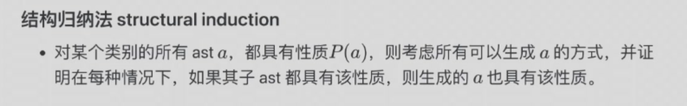
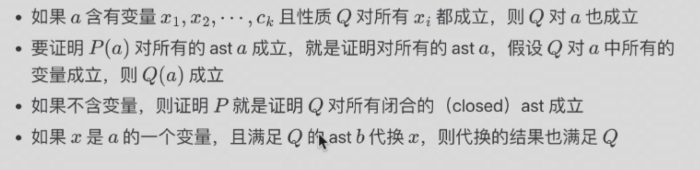

<font face = "Times New Roman">

# Lec 2  Abstract Syntax Trees

## Definition

- Abstract Syntax Tree (AST) is a tree representation of the abstract syntactic structure of source code written in a programming language. 

**Operand and arity**

* 运算符的元数arity规定了运算符的类别，以及参数的个数n和每个参数的类别$s_1,s_2,...,s_n$.计作$(s_1,s_2,...,s_n)s$.
* 运算符的元数规定了运算符参数的个数和类别，以及运算符的类别.
* 一个类别为s,元数为$s_1,s_2,...,s_n$的运算符能将$n\geq 0$个类别为$s_1,s_2,...,s_n$的ast转换为一个类别为s的ast.
  
### Example
#### Example 1
* operator `num[n]` $n\in \mathbb{N}$
* operator `plus`,`times`,每个参数都是Exp的ast
* $2 +(3 \times x)$ is
  * `plus (num[2] ;times( num[3]; x])`
  ```
  EST can be drawn as:
      plus
    /       \
    num[2]    times
            /      \
         num[3]     x
  ```


## Structural Induction




</font>