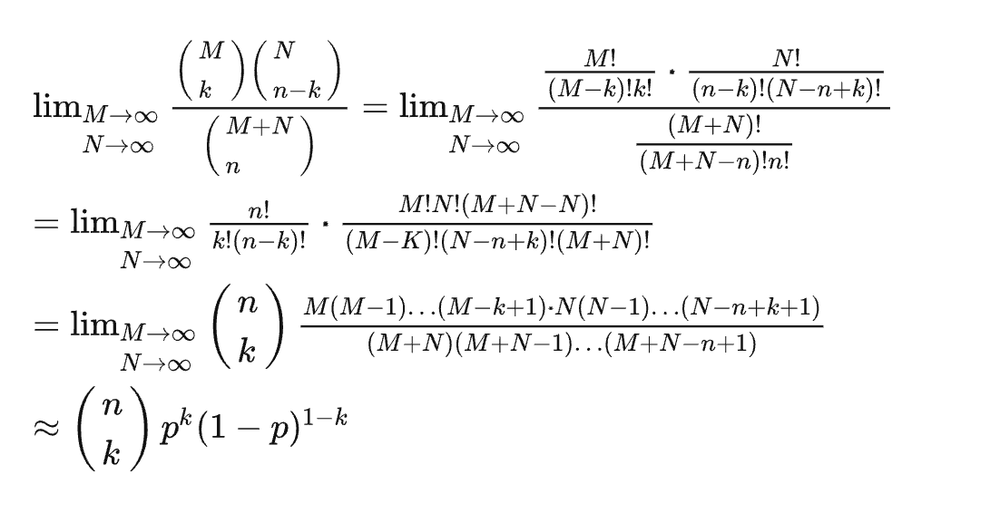
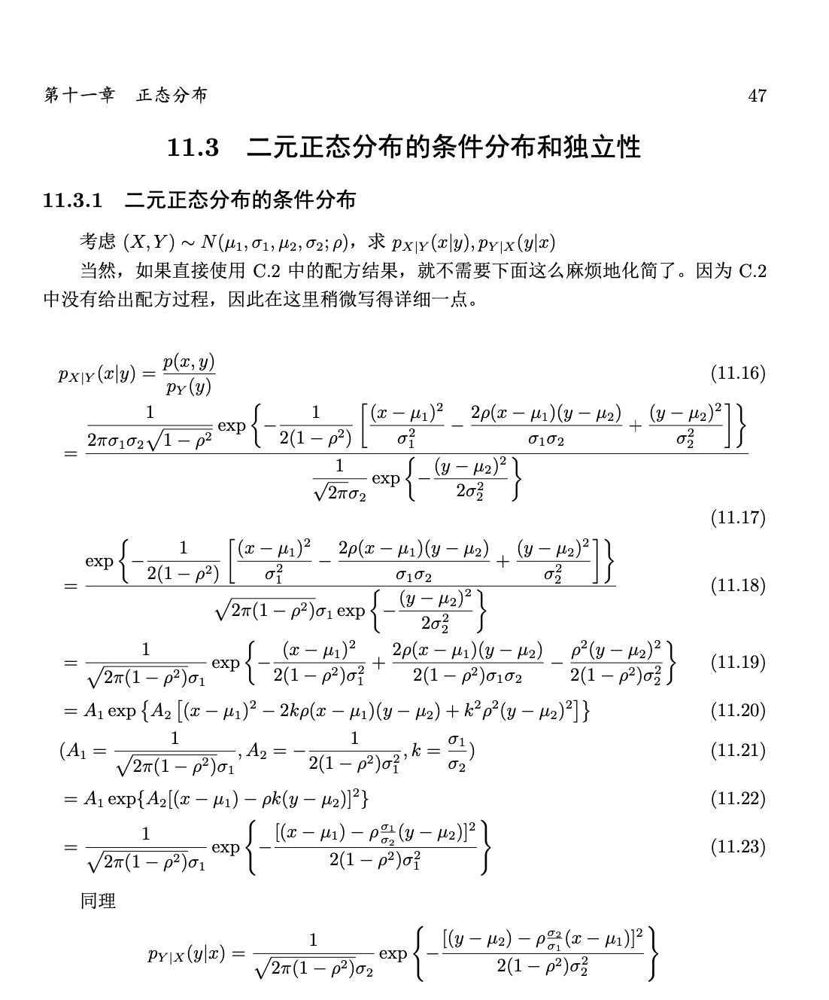

# Probability Theory

## 随机变量与分布函数

### 随机变量

#### 分布函数

$F (x) = P (ξ ⩽ x), −∞ < x < +∞$

* Properties

>(1) $a < b, F (a) ⩽ F (b)$
>
>(2). $lim_{x\rightarrow-\infty} F(x)=0\\ lim_{x\rightarrow +\infty} F(x)=1$
>
>(3) $∃F(x−0)= lim_{h→0+}F(x−h)$  -- 处处左极限存在
>$F(x+0)= lim_{h→0+} F(x+h)=F(x)$ -- 右连续

注意，如果修改分布函数定义为$F (x) = P (ξ < x), −∞ < x < +∞$那么 (3) 应该修改为处处右极限存在，左连续。

#### 密度函数

若随机变量$\epsilon$可取某个区间中的一切值，并且存在某个非负的可积函数$p(x)$ , 使分布函数$F(x)$满足$F(x)=\int_{-\infty}^xp(y)dy$ 则称$\epsilon$ 为连续性随机变量，称p(x)为$\epsilon$的概率密度函数

* $F'(x)=p(x)$
* $P(a\le\epsilon \le b)=F(b)-F(a)=\int_a^b p(y)dy$
* $p(x)\ge 0$
* $\int_{-\infty}^{+\infty} p(x)=1$

#### 随机向量

**1.分布函数**

**2.密度函数**

* Properties

>（1）基本同随机变量的情况
>
>（2）$\frac{\partial^nF(x_1,x_2,……,X_n)}{\partial x_1……\partial x_n}=p(x_1,x_2,……,x_n)$

**3.边际密度**

#### 独立性

对于离散型随机变量，用分布函数定义的随机变量的独立性条件$F(x,y) = F_ξ(x)F_η(y)$ 可以通过数学归纳推出其特有独立性条件$p_{ij} = p_i· p_j$ 同理，很方便地可以用后者反推出前者。因此在离散型随机变量中，这两种定义是等价的

设 $p(x, y)$与 $p_ξ (x), p_η (y)$ 分别为连续型随机向量 $(ξ, η)$的联合密度和边际密度, 则 $ξ, η$相互独立的充要条件是$p(x, y) = p_ξ (x)p_η (y)$

#### 条件分布

* 离散型

* 连续型

条件分布函数  $P(\eta \le y | \epsilon =x)=\int_{-\infty}^{y}\frac{p(x,v)}{p_\epsilon(x)}dv$

条件密度函数   $p_{\eta | \epsilon}(y|x)=\frac{p(x,y)}{p_\epsilon(x)}$

* 给定随机变量下的条件概率

$P(A)=P(A,-\infty<x<+\infty)=\int_{-\infty}^{+\infty} P(A|X=x)p_X(x)dx=\int_{-\infty}^{+\infty}g(x)P_X(x)dx$

> BOOK p79 2.24

#### 随机变量的函数及其分布

* **离散卷积**
* **一维连续型随机变量函数的分布**

 *Therom 1* 

假设f(x)严格单调，反函数有连续导数，则$\eta = f(\epsilon)$也是连续性随机变量，其密度函数为

$g(y)=\left\{\begin{array}{**lr**}p(f^{-1}(y)|f^{-1}|(y))'| y\in f(x)的值域\\0\ \ \ \  其他\end{array}\right.$

**note** 在不重叠的区间上逐段严格单调，各段的反函数都有连续倒数

$g(y)=\left\{\begin{array}{**lr**}\sum p(h_i(y)|h'_i|(y)|) y\in 各h_i(y)的定义域\\0\ \ \ \  其他\end{array}\right.$

*Therom 2*

设$\epsilon$ 有连续的分布函数$F(x)$,求$\theta=F(\epsilon)$的分布 $P_{\theta}(y)=y$ 服从[0,1]上的均匀分布

*Therom 3*

若 $\theta$ 服从[0,1]上的均匀分布,F(x)满足分布函数的三个性质，$\epsilon=F^{-1}(\theta)$ 则 $P_{\epsilon}(x)=F(x)$

* **随机向量函数的分布律**

*Therom 1*卷积公式

*Therom 2* 若$(\epsilon_1 \epsilon_2)$是连续性随机向量，则$\eta=\frac{\epsilon_1}{\epsilon_2}$是连续型随机变量，其密度函数为

$p_{\eta}(z)=\int_{-\infty}^{+\infty}p(zx,x)|x|dx$

$F_{\eta}(y)=\int_{-\infty}^yp_{\eta}(z)dz$

**次序统计计量分布**

* **随机向量的变换**

> P89-93

设随机变量X和Y相互独立，并且Z仅是X的函数，W仅是Y的函数；Z=g(X) W=h(Y) 其中g和h都是波雷尔可测函数，那么Z和W依旧独立

#### 常见离散型随机变量分布

**1.退化分布** $P(\epsilon = c)=1$

**2.两点分布** $\begin{bmatrix}x1&x2\\p&q\end{bmatrix}$  $p+q=1 p,q>0$

**3.帕斯卡分布** $P(\epsilon=k)=\begin{pmatrix}k-1\\r-1\end{pmatrix}p^rq^{k-r}$

**4.二项分布**

* $b(k,n,p)=b(n-k,n,1-p)$
* $\frac{b(k,n,p)}{b(k-1,n,p)}=1+\frac{(n+1)p-k}{kq}$
  * $(n+1)p$是整数 ： $(n+1)p \ (n+1)p-1$ 为最有可能的成功次数
  * $(n+1)p$是不整数： $k=[(n+1)p]$ 最有可能的成功次数 $[x]$表示$x$最大整数部分
* 递推公式 $P(\epsilon=k+1)=\frac{p(n-k)}{(k+1)q}P(\epsilon=k)$
* $n \rightarrow +\infty$ 「泊松定理」

> 若存在正常数$\lambda$ 当$n \rightarrow+\infty$时，有$bp_n \rightarrow +\lambda$ ,则
>
> $lim_{n \rightarrow+\infty} b(k,n,p)=\frac{\lambda^k}{k!}e^{-\lambda}$
>
> 通常，n与p无关，但是n很大，p很小，np不是很大的时候，可近似地取$\lambda=np$

* 德莫佛-拉普拉斯定理 $npq \rightarrow +\infty$

> $P(\epsilon_n=j)\approx \frac{1}{\sqrt{2\pi npq}}e^{-x^2/2} \ \ x=\frac{j-np}{\sqrt{npq}}$

**4.泊松分布**

$P(\epsilon=k)=\frac{\lambda^k}{k!}e^{-\lambda}$

**5.几何分布**「无记忆性」

$P(\epsilon=k)=pq^{k-1}$

**6.超几何分布**

* $P(\epsilon=k)=\frac{ \begin{pmatrix}M\\k\end{pmatrix} \begin{pmatrix}N-M\\n-k\end{pmatrix}}{\begin{pmatrix}N\\n\end{pmatrix}}$  $k=0,1,2,……，min(n,M)$
* $N\rightarrow +\infty\ \frac{M}{N}\rightarrow p$, 超几何分布可以用二项分布近似计算

「修正：M+N-n 有大小写错误」

#### **常见连续型随机变量分布**

**1.均匀分布**

**2.正态分布**

* *BASIC* $p(x)=\frac{1}{\sqrt{2\pi}\sigma}e^{-\frac{(x-a)^2}{2\sigma^2}}$

$Proof$

$\begin{align*}(\frac{1}{\sqrt{2\pi}\sigma}\int_{-\infty}^{+\infty} e^{-\frac{(t-a)^2}{2\sigma^2}}dt)^2 &= (\frac{1}{\sqrt{2\pi}}\int_{-\infty}^{+\infty} e^{-\frac{t^2}{2}}dt)^2\\&=\frac{1}{2\pi}\int_{-\infty}^{+\infty} \int_{-\infty}^{+\infty} e^{\frac{t^2+s^2}{2}}dtds\\ &=\frac{1}{2\pi} \int_{0}^{2\pi}d\theta\int_{0}^{+\infty}  re^{-\frac{r^2}{2}}dr\\ &=1\end{align*}$

* $a=0\ \sigma=1$ 标准正态分布 $\Phi(x)=\frac{1}{\sqrt{2\pi}}e^{-\frac{x^2}{2}}$
* $\Phi(-x)=1-\Phi(x)$

**2.2 n维正态分布**

设 $B = (b_{ij} )$ 为 n 维正定对称矩阵, $|B|$ 为其行列式, $B^{−1}$ 为其逆,

又设 $x = (x1, x2, · · · , xn)^T$ , $a = (a1, a2, · · · , an)^T$ , 则称

$p(\vec{x})=\frac{1}{(2\pi)^{n/2}|B|^{1/2}} exp(-\frac{1}{2}(x-a)^TB^{-1}(x-a))$ 为n维正态密度函数

**2.3 二维的情况**

$B=\begin{pmatrix}\sigma_1^2 & r\sigma_1\sigma_2\\ r\sigma_1\sigma_2&\sigma_2^2\end{pmatrix}. B^{-1}=\begin{pmatrix}\sigma_2^2 & -r\sigma_1\sigma_2\\ -r\sigma_1\sigma_2&\sigma_1^2\end{pmatrix}$

$p(x,y)=\frac{1}{2\pi\sigma_1\sigma_2\sqrt{1-r^2}}exp(-\frac{1}{2(1-r^2)}\times[\frac{(x-a)^2}{\sigma_1^2} - \frac{2r(x-a)(y-b)}{\sigma_1\sigma_2} + \frac{(y-b)^2}{\sigma_2^2}])$

简记作 $(\epsilon,\eta)$ ~ $N(a,b,\sigma_1^2,\sigma_2^2,r)$

* 二元正态分布的边际函数仍是正态分布 $\eta$~$N(b,\sigma_2^2)$ [反过来则不一定]
* $\epsilon\ \  \eta$ 独立 等价于 $r=0$

**2.4 条件分布**

**2.5  正态分布的函数**

* $\epsilon$ ~ $N(0,\sigma^2) \ \eta = k\epsilon+b\ \eta$~ $N(ka+b,k^2\sigma^2)$
* $\epsilon$~ $N(a_1,\sigma_1^2)$ $\eta$~$N(a_2,\sigma_2^2)$   $\eta + \epsilon$~$N(a_1+a_2,\sigma_1^2+\sigma_2^2)$

* $\epsilon$ ~ $N(0,\ 1) \ \eta = \epsilon^2$

* 若$(X,Y)$~$N(\mu_1,\mu_2,\sigma_1^2,\sigma_2^2,r)$ 则 $C_1X+C_2Y$~$N(C_1\mu_1+C_2\mu_2,C_1^2\sigma_1^2+C_2^2\sigma_2^2+2C_1C_2r\sigma_1\sigma_2)$

**2.6 多维正态分布** P93

$\vec{\eta}=C\vec{\epsilon}+a$  则 $\vec{\eta}$ ~ $N(C\vec{\mu}+a,C\Sigma C^T)$

**3.指数分布**

$p(x)=\left\{\begin{array}{**lr**}\lambda e^{-\lambda x}\ x\ge 0 \\0  \ \ \ \ \ \ \ \ \ x < 0\end{array}\right.$

$F(x)=\left\{\begin{array}{**lr**}1-e^{-\lambda x}\ x\ge 0 \\0  \ \ \ \ \ \ \ \ \ \ \ \ \ \ x < 0\end{array}\right.$

* 无记忆性 ： $P(\epsilon > s+t | \epsilon > s)=P(\epsilon > t)$

4.T分布

**5.威布尔分布**

**6.帕累托分布**

**7.$\beta$分布** 

**8.柯西分布**

