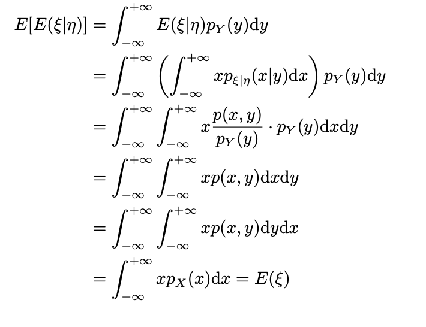
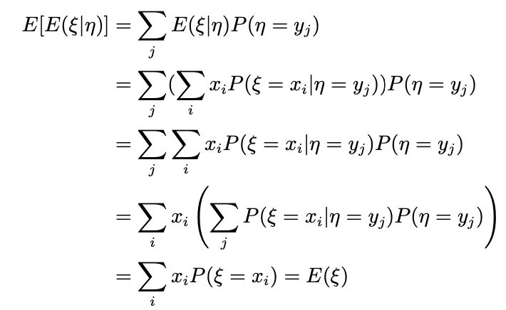

## 数学期望

### 离散型随机变量的数学期望

设置离散型随机变量$\epsilon$ 的分布列为

$\begin{bmatrix}x_1&x_2&……&x_k&……\\p_1&p_2&……&p_k&……\end{bmatrix}$

如果级数$\sum_kx_kp_k$绝对收敛，则称此级数的和为$\epsilon$ 的数学期望或均值$(mean)$，计作$E\epsilon=\sum_kx_kp_k$

### 连续型随机变量的数学期望

设$\epsilon$为连续型随机变量，有密度函数$p(x)$当$\int_{-\infty}^{+\infty}|x|p(x)dx<\infty时$ 称$E\epsilon=\int_{-\infty}^{+\infty}xp(x)dx$为$\epsilon$的数学期望

### 一般定义

设随机变量$\epsilon$有分布函数$F(x)$，若$\int_{-\infty}^{+\infty}|x|d F(x)<\infty$ 称$E\epsilon=\int_{-\infty}^{+\infty}xd F(x)$为$\epsilon$的数学期望

* 斯提尔吉斯(Stieltjes)积分

### 随机变量函数的数学期望

* 设$\epsilon\ \eta$为随机变量分布函数分别为$F_{\epsilon}(x)\ F_{\eta}(x)$ ；$f(x)$是一元波雷尔函数，计$\eta=f(\epsilon)$  则 $E_{\eta}=\int_{-\infty}^{+\infty}xdF_{\eta}(x)=\int_{-\infty}^{+\infty}f(x)dF_{\epsilon}(x)$

* (Stein 引理) $P119$

### 数学期望的基本性质

#### 性质1

若$a\le \epsilon \le b $则 $E\epsilon$ 存在且$a\le E\epsilon\le b$

#### 性质1‘

若$|\epsilon| < \eta$ 且$E\eta$ 存在 则$E\epsilon$存在 且$|E\epsilon|\le E|\epsilon|\le E\eta$

#### 性质2

$E_{\epsilon_1},E_{\epsilon_2},E_{\epsilon_3}…… E_{\epsilon_n}$存在，则对任意常数$c_1,c_2,……c_n$和b $E(\sum_{i=1}^nc_i\epsilon_i+b)$存在，且$E(\sum_{i=1}^nc_i\epsilon_i+b)=\sum_{i=1}^nc_iE\epsilon_i+b$

特别地：$E(\sum_{i=1}^n\epsilon_i)=\sum_{i=1}^nE\epsilon_i$  $E(c\epsilon)=cE\epsilon$

* Exercise :$p121$

#### 性质3

若$\epsilon_1,\epsilon_2……\epsilon_n$相互独立，各$E_{\epsilon_i}$存在，则$E(\epsilon_1,\epsilon_2……,\epsilon_n)=E\epsilon_1E\epsilon_2……E\epsilon_n$

#### 性质4(有界收敛定理)

假设对任意$\omega\in\Omega$ 有$\lim_{n\rightarrow\infty}\epsilon(\omega)=\epsilon(\omega)$并且，对一切的$n >=1$  $|\epsilon_n|\le M$ M为常数，则$\lim_{n\rightarrow\infty}E\epsilon_n=E\epsilon$

### 条件期望

$p125$

#### 条件期望

$E(\eta|\epsilon=x)=\int_{-\infty}^{+\infty}ydF_{\eta|\epsilon}(y|x)$

$E(\eta|\epsilon=x)=\int_{-\infty}^{+\infty}yp_{\eta|\epsilon}(y|x)dy$

$E(\eta|\epsilon=x)=\sum yp_{\eta|\epsilon}(y|x)dy$

再对$E(\eta|\epsilon=x)$求期望，会得到$E[E(\eta|\epsilon=x)]=E\eta$

#### 全期望公式

**连续型**

**离散型**

#### 条件期望的性质

## 方差，协方差与相关系数

### 方差 

$Var\epsilon=E(\epsilon-E\epsilon)^2=E\epsilon^2-(E\epsilon)^2$

#### Chebyshev 不等式

$P(|ξ−Eξ|≥ε)≤ Varξ$

$P(|ξ − Eξ| ≥ ε) =\int_{|x-Eξ|>=\epsilon}dF(x)\le \int_{|x-Eξ|>=\epsilon}\frac{(x-Eξ)^2}{\epsilon^2}dF(x)\\ \le \frac{1}{\epsilon^2}\int_ {-\infty}^{+\infty}(x-Eξ)^2dF(x) =\frac{Varξ}{\epsilon^2}$

* 性质1

  $Varξ=0 \Leftrightarrow P(ξ=c)=1$ (c是常数)

* 性质2

  $Var(cξ+b)=c^2Varξ$

* 性质3

  若 $c \ne Eξ\  \ \ varξ<E(ξ-c)^2$

  $p130$最佳预测问题

* 性质4

  $Var (\sumξ_i )= \sum Varξ_i +2\sum_{1\le i<j\le n} E(ξ_i −Eξ_i)(ξ_j −Eξ_j)$

### 协方差

### 相关系数

### 矩

## 特征函数
