<font face="Times New Roman" >

# 3D Gaussian Splatting for Real-Time Radiance Field Rendering
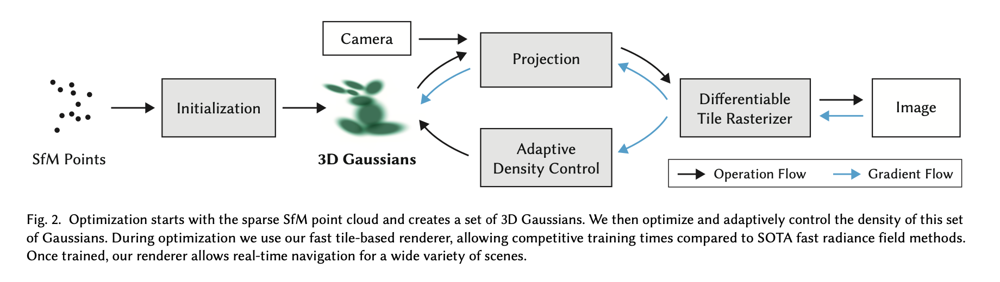

## Differentiable 3D Gaussian Splatting 
### 3D Gaussian
* **Gaussian** : $G(x) = \frac{1}{\sqrt{2\pi}\sigma}e^{-\frac{(x-\mu)^2}{2\sigma^2}}$
* **3D Gaussian** : $G(x) = \frac{1}{(2\pi)^{3/2}\sigma^3}e^{-\frac{||x-\mu||^2}{2\sigma^2}}$

* reference : [3D高斯](http://www.yindaheng98.top/%E5%9B%BE%E5%BD%A2%E5%AD%A6/3DGaussianSplatting.html#_3d-gaussians-3d-gaussian%E7%82%B9)

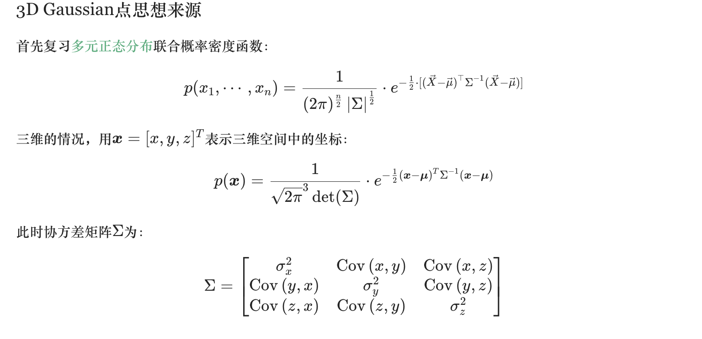
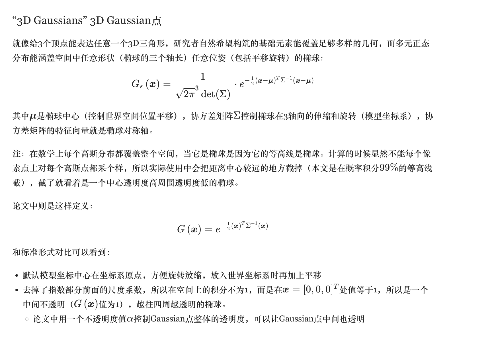

* **note**: Because the covariance matrix is semi-definite, so we represent it as $\Sigma = R\Lambda R^T$ where $\Lambda$ is a diagonal matrix and $U$ is an orthogonal matrix. Also if we use $S = (\Lambda)^{1/2}$, then $\Sigma = RSS^TR$

### 3D Gaussian Rendering

* reference : [3D高斯渲染](http://www.yindaheng98.top/%E5%9B%BE%E5%BD%A2%E5%AD%A6/3D%E9%AB%98%E6%96%AF%E6%95%B0%E5%AD%A6%E6%8E%A8%E5%AF%BC.html#derivation-of-transformation)


Project the 3D Gaussian to 2D Gaussian and then render it.

#### **Projection** :

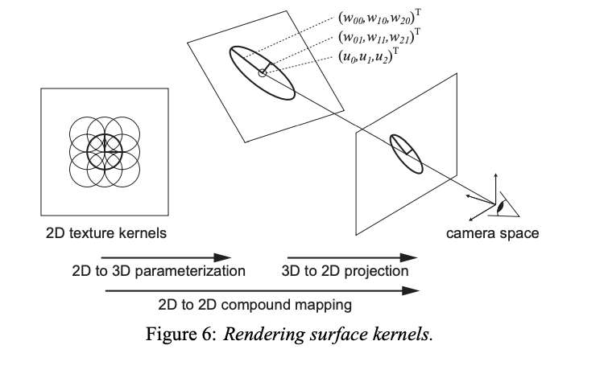

**Conclusion**

$\Sigma^{'} = JW\Sigma W^TJ^T$ where W is a view transformation and J is the Jacobian of the **affine approximation of the projective transformation**


**Derivation**
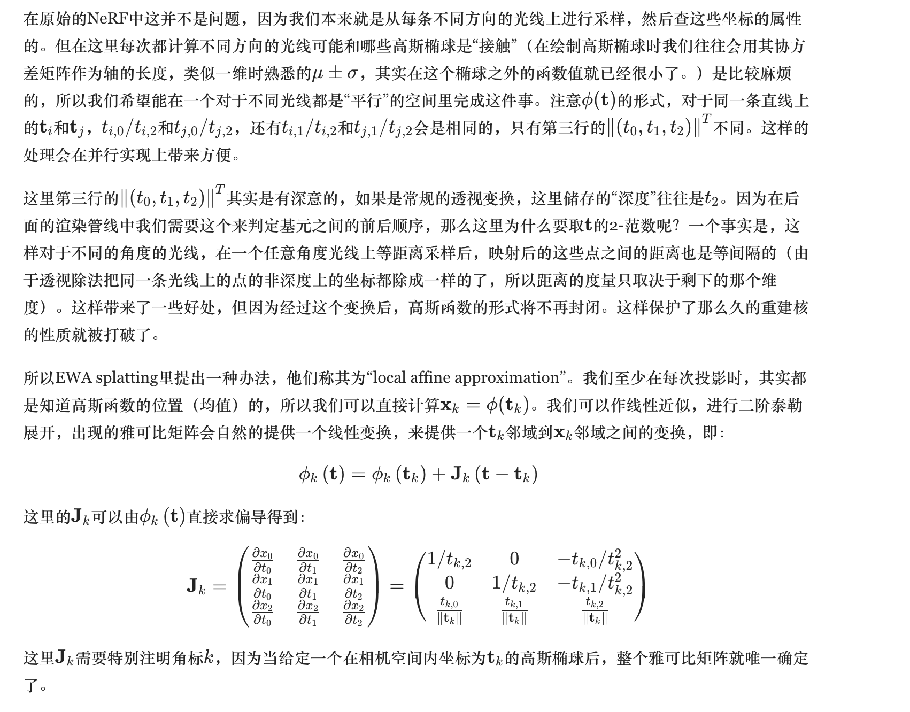
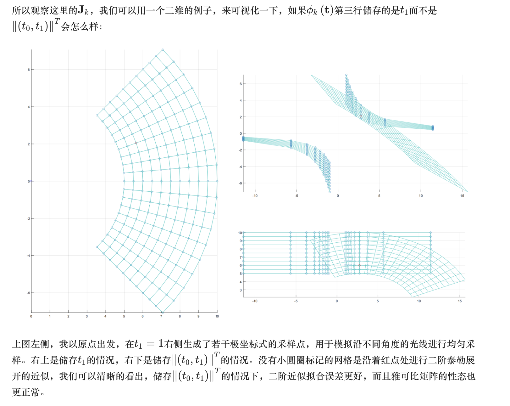
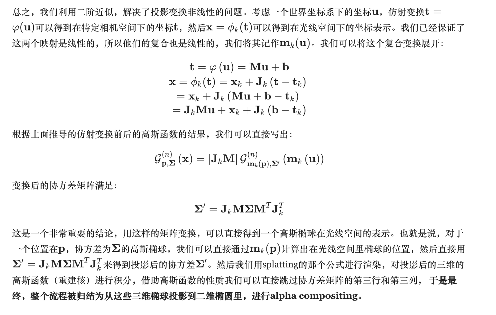

##### The viewing transformation:
  
Denote the Gaussian reconstruction kernels in *object space* by $r_{k}''(\mathbf{t})=\mathcal{G}_{\mathbf{V''}}(\mathbf{t}-\mathbf{t_k})$, where $\mathbf{t_k}$ are the voxel positions of center of kernel.
  
Denote camera coordinates by a vector $\mathbf{u}=(u_0,u_1,u_2)^{T}$. Object coordinates are transformed to camera coordinates using an affine mapping $\mathbf{u}=\varphi(\mathbf{t})=\mathbf{Wt+d}$, called *viewing tranformation*.
  
Now we can transform the reconstruction kernels $\mathcal{G}_{\mathbf{V''}}(\mathbf{t}-\mathbf{t_k})$ to camera space: 

 $$\mathcal{G}_{\mathbf{V''}}(\varphi^{-1}(\mathbf{u})-\mathbf{t_k})=\frac{1}{|\mathbf{W}^{-1}|}\mathcal{G}_{\mathbf{V'}_{k}}(\mathbf{u}-\mathbf{u_k})=r_{k}'(\mathbf{u})$$

where $\mathbf{u_k}=\varphi(\mathbf{t_k})$ is the center of the Gaussian in camera coordinates and $\mathbf{V'}_{k}=\mathbf{W}\mathbf{V''}_{k}\mathbf{W}^{T}$ is the variance matrix in camera coordinates.

##### The Projective Transformation

In camera space, The ray intersecting the center of projection and the point $(x_0, x_1)$ on the projection plane is called a viewing ray.

To facilitate analiytical integration of volumn function, we need to transform the camera space to ray space such that the viewing rays are parallel to a coordinate axis. The projective transformation converts camera coordinates to ray coordinates.

Camera space is defined such that the origin of the camera coordinate system is at the center of projection and the projection plane is the plane $u_{2}=1$. Camera space and ray space are related by the mapping $\mathbf{x=m(u)}$. 

$$
\begin{pmatrix}
x_0\\
x_1\\
x_2\\
\end{pmatrix}
=\mathbf{m(u)}=
\begin{pmatrix}
u_{0}/u_{2}\\
u_{1}/u_{2}\\
\Vert(u_{0},u_{1},u_{2})^{T}\Vert\\
\end{pmatrix}\\\\
~\\\\
\begin{pmatrix}
u_0\\
u_1\\
u_2\\
\end{pmatrix}
=\mathbf{m^{-1}(u)}=
\begin{pmatrix}
x_{0}/l\cdot x_2\\
x_{1}/l\cdot x_2\\
1/l\cdot x_2\\
\end{pmatrix}
$$

where $l=\Vert(x_{0},x_{1},1)^{T}\Vert$.

Unfortunately, these mappings are not affine. The Gaussian after the transformation may not still Gaussian. To solve this problem, we introduce the *local affine approximation* $m_{uk}$ of the projective transformation. It is defined by the first two terms of the Taylor expansion of $\mathbf{m}$ at the point $\mathbf{u}_k$:

$$
\mathbf{m_{u_k}(u)=x_k+J_{u_k}\cdot (u-u_k)}\\\\
~\\
\mathbf{J_{u_k}}={\frac{\partial \mathbf{m}}{\partial \mathbf{u}}}(\mathbf{u}_k)
$$

where $\mathbf{x}_k=\mathbf{m(u_k)}$ is the center of a Gaussian in ray space and the Jacobian $\mathbf{J_{u_k}}$ is given by the partial derivatives of $\mathbf{m}$ at the point $\mathbf{u}_k$.

This yields the local affine approximation of reconstruction kernels to ray space:

$$
\begin{aligned}
r_{k}(\mathbf{x})&=\frac{1}{|\mathbf{W}^{-1}|}\mathcal{G}_{\mathbf{V'}_{k}}(\mathbf{m^{-1}(x)}-\mathbf{u_k})\\
&=\frac{1}{|\mathbf{W}^{-1}||\mathbf{J}^{-1}|}\mathcal{G}_{\mathbf{V}_{k}}(\mathbf{x}-\mathbf{x_k})
\end{aligned}
$$

where $\mathbf{V}_k$ is the variance matrix in ray coordinates:

$$
\begin{aligned}
\mathbf{V}_{k}&=\mathbf{J}\mathbf{V'}_{k}\mathbf{J}^{T}\\
&=\mathbf{JW}\mathbf{V''}_{k}\mathbf{W}^{T}\mathbf{J}^{T}
\end{aligned}
$$

#### Rasterizer
* See Below for the Rasterizer

#### Representing Colour

http://www.yindaheng98.top/%E5%9B%BE%E5%BD%A2%E5%AD%A6/%E7%90%83%E8%B0%90%E7%B3%BB%E6%95%B0.html#%E7%90%83%E9%9D%A2%E9%AB%98%E6%96%AF%EF%BC%88spherical-gaussian%EF%BC%89


## Optimization With Adaptive Density Control of 3D Gaussians
### Gradient Caculation

* Reference : [grads推导](http://www.yindaheng98.top/%E5%9B%BE%E5%BD%A2%E5%AD%A6/3D%E9%AB%98%E6%96%AF%E6%95%B0%E5%AD%A6%E6%8E%A8%E5%AF%BC.html#derivation-of-gradient)

* 四元数 : [四元数](https://www.bilibili.com/video/BV1SW411y7W1/?spm_id_from=333.788.recommend_more_video.0&vd_source=770437002a403fccdaf0ff2a150cee20)

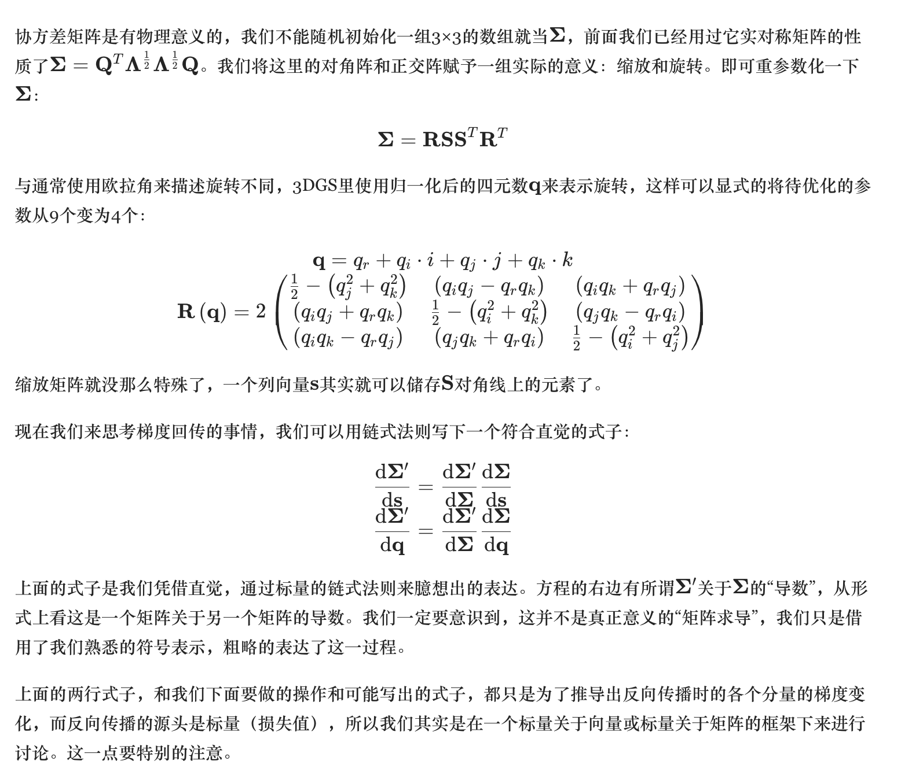
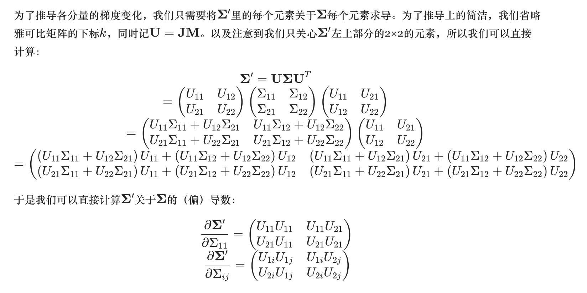
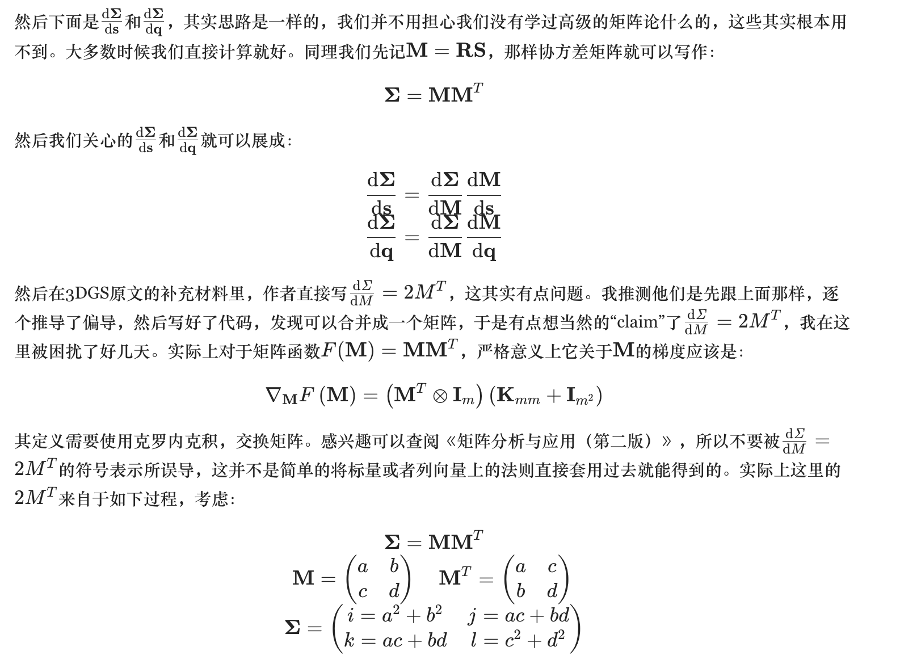
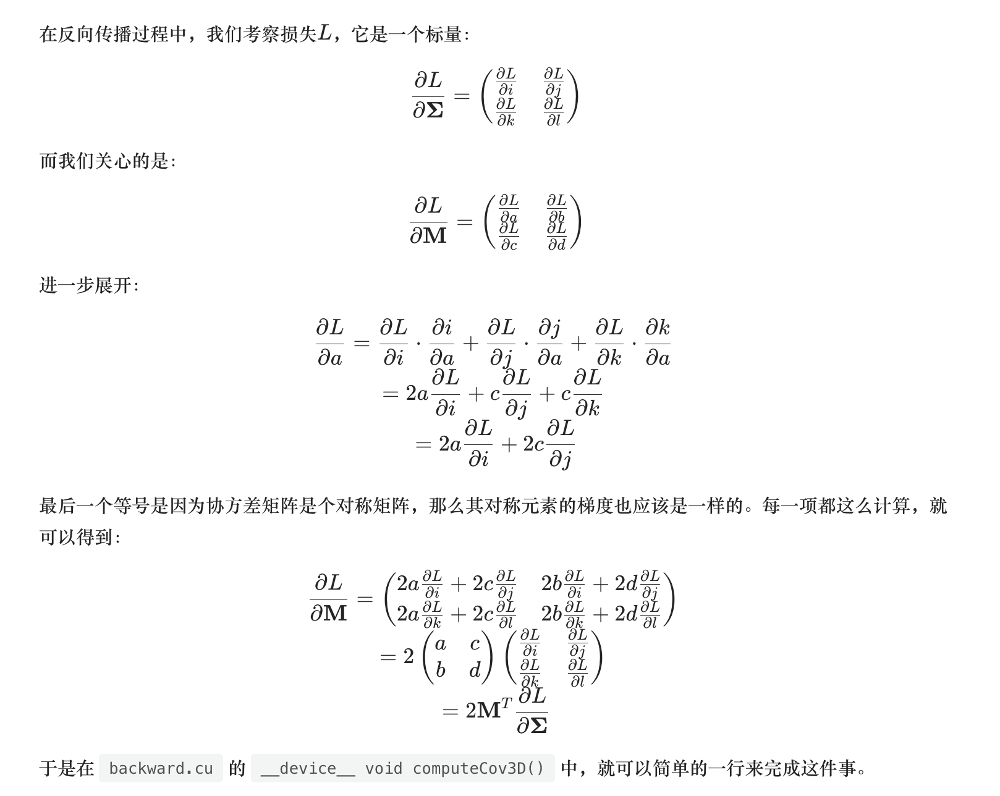

```C
// Compute loss gradient w.r.t. matrix M
// dSigma_dM = 2 * M
glm::mat3 dL_dM = 2.0f * M * dL_dSigma;
```

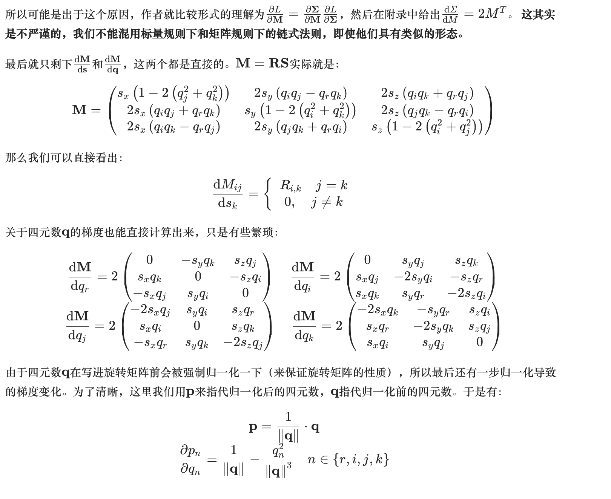
### Adaptive Control of Gaussians
* “欠重构区”(under-reconstruction)：位置梯度很大但值很小的Gaussian点 -- 缺少Gaussian点的区域
  复制这个Gaussian点，再沿位置梯度进行移动


* “过重构区”(over-reconstruction)：位置梯度很大且值很大的Gaussian点 -- 每个Gaussian点覆盖很大范围的区域
  
  减小这个Gaussian点的值，再复制这个Gaussian点，再沿位置梯度进行移动

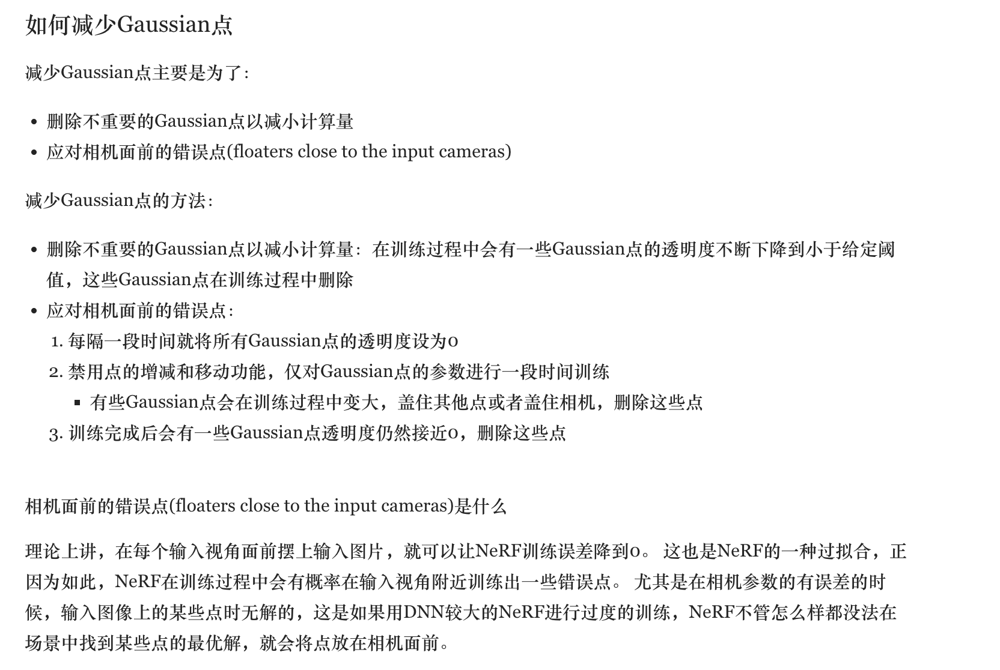

## Fast Differentiable Rasterization For Gaussians

### Pipeline

1. 屏幕分割 : Split the screen into 16x16 tiles
2. 视锥体裁剪 : 假设我们有一组3D高斯splat，每个splat代表一个体积数据点。首先，我们需要检查这些splat是否与视锥体相交: 
   
   Only keep the splats that have 99% confidence of intersecting the view frustum.
   
   > 例如，如果有一个splat的中心位于视锥体之外，我们就不会考虑它。

3. Use guard band to trivially reject splats that are at extreme positions : computing their 2D variance would be unstable.
4. 实例化和排序
   
   * 假设一个splat与5个瓦片相交，我们为这个splat创建5个实例
  
   * 每个实例根据其在视空间中的深度和瓦片ID获得一个唯一的键
  
   * 使用GPU Radix排序算法，我们根据这些键对所有实例进行排序
5. Rasterization
   
   * 对于每个瓦片，我们确定排序后第一个和最后一个影响该瓦片的splat实例
  
   * 假设瓦片(5,5)首先加载了影响它的splat实例列表到共享内存
  
   * 对于瓦片(5,5)中的像素(5,5)，我们从列表的开始到结束遍历splat实例，累积颜色和α值
  
   * 当像素(5,5)的α值达到1时，我们知道它已经饱和，不再需要更多的splat实例来影响它的颜色 

## Results

Compared to the state-of-the-art NeRF, 3DGS achieves much faster rendering speed with comparable visual quality (But the memory consumption is higher).


> Details see the paper
</font>