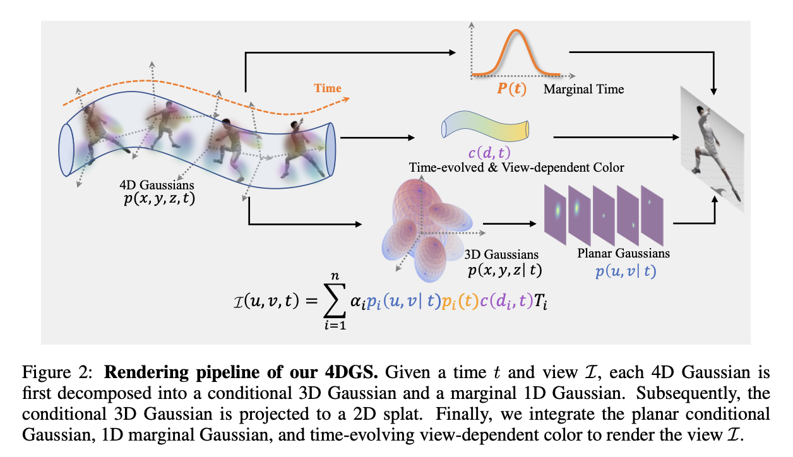

# Real-Time Photorrealistic Dynamic Scene Representation And Rendering With 4D Gaussian Splatting

## Problem Formulation and 4D Gaussian Splatting

### Problem Formulation

$$
\mathbb{I}(\mu,v,t)=\sum_{i=1}^{N} p_i(\mu,v,t) \alpha_ic_i(d)\prod_{j=1}^{i-1} (1-p_j(\mu, v,t)\alpha_j)
$$

* $p_i(\mu,v,t)$ can be factorized as a product of a conditional Gaussian and a marginal 1D Gaussian

$$
p_i(\mu,v,t) = p_i(\mu,v|t)p_i(t)
$$

> Helper Proof see Appendix

## Representaion of 4D Gaussian

### 4D Gaussian

**4D Gaussian** : In the same way as in 3D Gaussian, we can define decomposition of 4D Gaussian as $\Sigma = R\Lambda R^T$ where $\Lambda$ is a diagonal matrix and $U$ is an orthogonal matrix. Also if we use $S = (\Lambda)^{1/2}$, then $\Sigma = RSS^TR$

S is a 4x4 scaling matrix (diagonal matrix) so it can be represented as $S = diag(s_x, s_y, s_z, s_t)$

R is a 4x4 rotation matrix so it can be decomposed into 2 isotropic 2 rotations, each of which represented by a quaternion. So $R = L(q_l)R(q_r)$ where $q_l$ and $q_r$ are left and right quaternions respectively.

$q_l = (a, b, c, d)$ and $q_r = (p, q, r, s)$

$$
R(q_l)=
\begin{pmatrix}
a&-b&-c&-d\\
b&a&-d&c\\
c&d&a&-b\\
d&-c&b&a
\end{pmatrix}
$$

$$
R(q_r)=
\begin{pmatrix}
p&-q&-r&-s\\
q&p&s&-r\\
r&-s&p&q\\
s&r&-q&p
\end{pmatrix}
$$

the mean of the Gaussian is represented by a 4D vector $\mu = (\mu_x, \mu_y, \mu_z, \mu_t)$

### Derivation of the conditional 3D Gaussian and marginal 1D Gaussian

#### Conditional 3D Gaussian

The conditional 3D Gaussian is the Gaussian distribution of the first 3 dimensions given the 4th dimension. It can be derived by the following formula:

$$
\begin{aligned}
\Sigma_{3|1} &= \Sigma_{1,2,3} - \Sigma_{1,2,4}\Sigma_{4}^{-1}\Sigma_{1,2,4}^T\\
\mu_{3|1} &= \mu_{1,2,3} - \Sigma_{1,2,3}\Sigma_{4}^{-1}(\mu_{4} - \mu_{4})
\end{aligned}
$$

>
$$
\Sigma = \begin{pmatrix}
\Sigma_{1,2,3} & \Sigma_{1,2,4} \\
\Sigma_{1,2,4}^T & \Sigma_4
\end{pmatrix}
$$

#### Marginal 1D Gaussian

The marginal 1D Gaussian is the Gaussian distribution of the 4th dimension. It can be derived by the following formula:

$$
\begin{aligned}
\Sigma_{4} &= \Sigma_{4}\\
\mu_{4} &= \mu_{4}
\end{aligned}
$$

## 4D spherindrical harmonics

### spherindrical harmonics

$$
\begin{aligned}
Y_{l}^m(\theta, \phi) &= \sqrt{\frac{2l+1}{4\pi}\frac{(l-|m|)!}{(l+|m|)!}}P_l^m(\cos(\theta))e^{im\phi}\\
P_l^m(x) &= (1-x^2)^{|m|/2}\frac{d^{|m|}}{dx^{|m|}}P_l(x)\\
P_l(x) &= \frac{1}{2^ll!}\frac{d^l}{dx^l}(x^2-1)^l
\end{aligned}
$$

* Spherical harmonic functions are a series of orthogonal functions defined on the surface of a sphere, which can be use to approximate function in spherical coordinate:

$$
f(t)\approx \sum_{l}\sum_{m=-l}^{l}c_{l}^{m}Y_{l}^{m}(\theta,\phi)
$$

* $l$: the degree (non-negative integer)

* $m$: the order (integer such that $−l\leq m\leq l$)

* $c_{l}^{m}$: SH coefficients

$$
c_{l}^{m}=\int_{\Omega}f(w)Y_{l}^{m}(w)dw
$$

* $Y_{l}^{m}$: SH functions, where $P_{l}^{m}$ are the associated Legendre polynomials, $\theta$ is the colatitude(0 to $\pi$), and $\phi$ is the longitude(0 to $2\pi$)

$$
Y_{l}^{m}=\sqrt{\frac{(2l+1)(l-m)!}{4\pi (l+m)!}}P_{l}^{m}(cos\theta)e^{im\phi}
$$

* Reference: [Spherical Harmonics](https://zhuanlan.zhihu.com/p/359856625)
* Reference: [Spherical Harmonics](https://zhuanlan.zhihu.com/p/363600898)

### 4D spherindrical harmonics

* 4D spherindrical harmonics are the extension of spherical harmonics to 4D space. It can be defined as:

$$
Z_{nl}^m(t, \theta, \phi) = cos(\frac{2\pi nt}{T})Y_{l}^m(\theta, \phi)
$$

