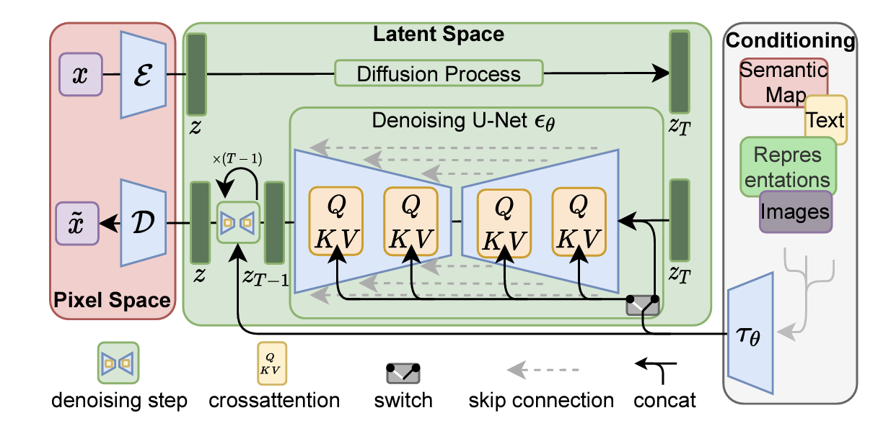

# High-Resolution Image Synthesis with Latent Diffusion Models

## Architecture

### Perceptual Image Compression
- **Encoder**:  given an image $x \in \mathbb{R}^{H \times W \times 3}$ in RGB space, the encoder $\epsilon$ encodes $x$ into a latent representation $z = \epsilon(x)$. where $z \in \mathbb{R}^{h \times w \times C}$.
- **Decoder**: given a latent representation $z$, the decoder $\delta$ decodes $z$ into an image $\hat{x} = \delta(z)$.
- **Regularization**: the encoder and decoder are trained to minimize the reconstruction error between the input image $x$ and the decoded image $\hat{x}$ 
  -  KL-reg 
  -  VQ-reg
### Generative Modeling of Latent Representations
* A Time-conditioned UNet
### Conditioning Mechanisms
* conditional denoising autoencoder $\epsilon_{\theta}(z_t,t,y)$
* Add cross-attention mechanism to the Unet architecture
* To pre-process y from various modalities (such as language prompts) we introduce a domain specific encoder $τ_θ$ that projects y to an intermediate representation $τ_θ(y) \in \mathbb{R}^{h \times w \times C}$, which is then mapped to the intermediate layers of the UNet via a cross-attention layer implementing 
* $Attention(Q,K,V) = softmax(QK^T/\sqrt{d})V$, 
  with $Q = \epsilon_{\theta}(z_t,t,y)$, $K = τ_θ(y)$, and $V$ being the intermediate feature maps of the UNet.
* $\tau_θ$ and $\epsilon_θ$ are trained jointly with the rest of the model.
