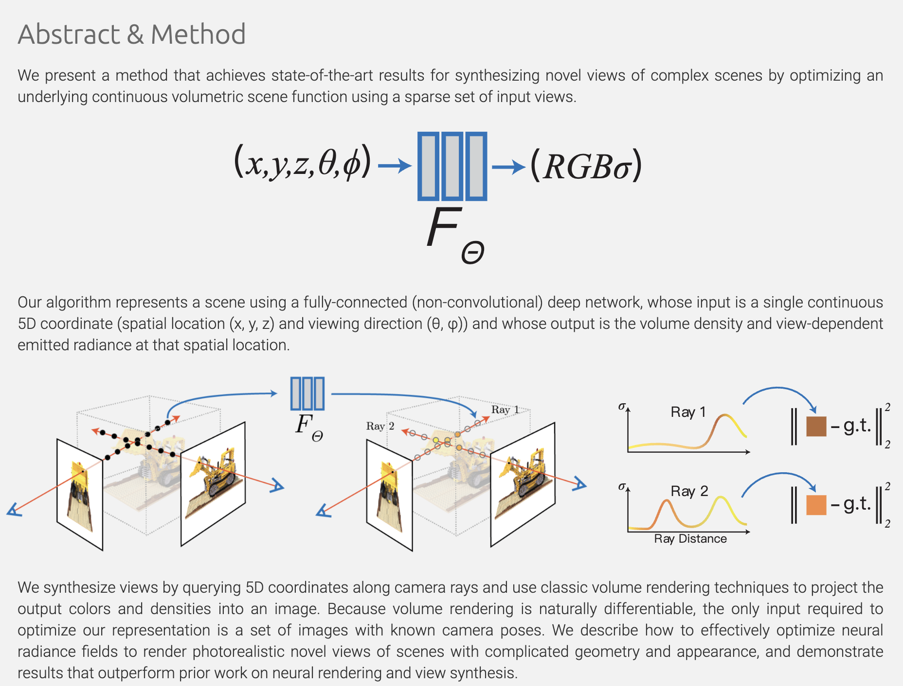
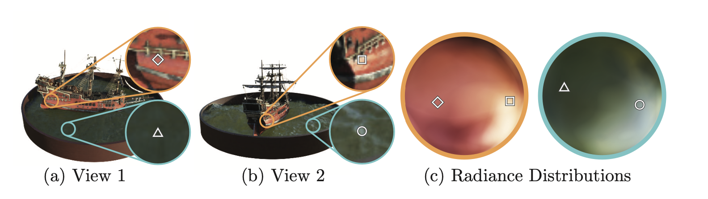
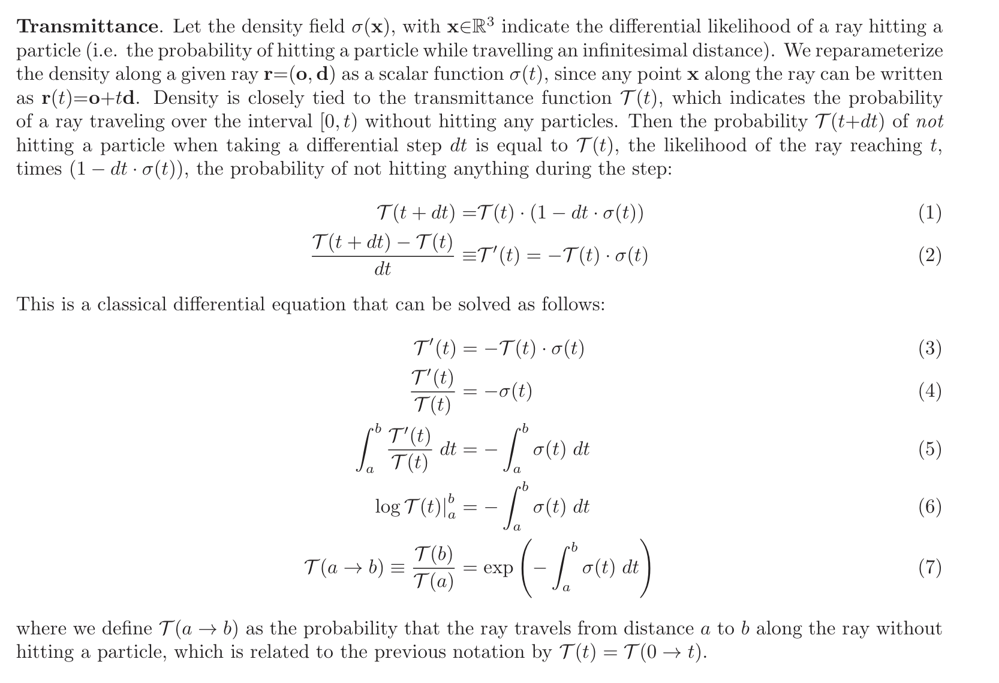
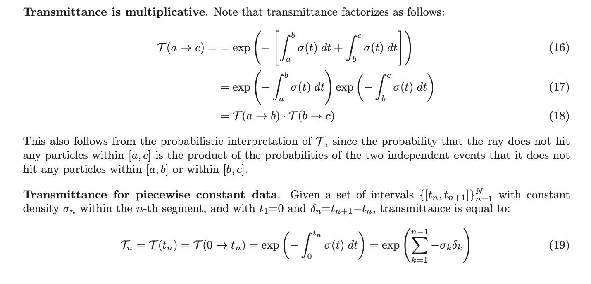
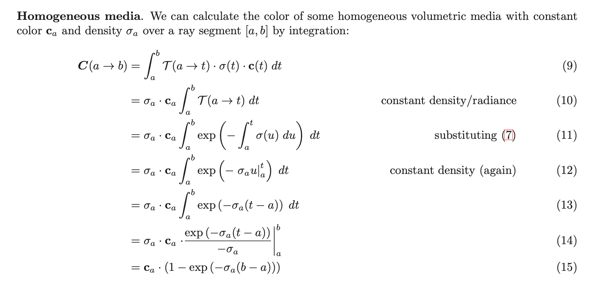
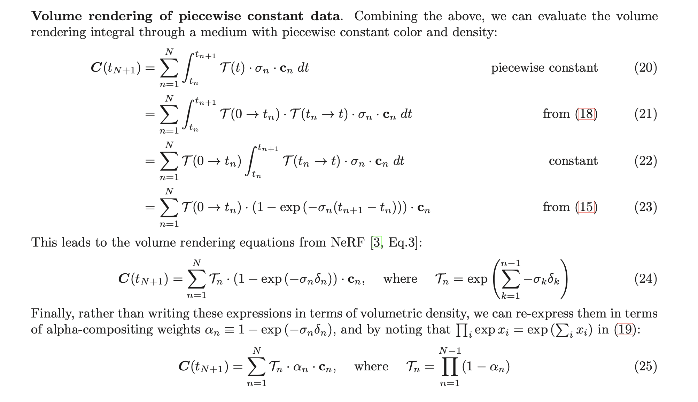
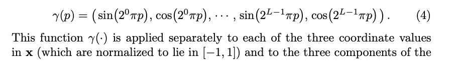
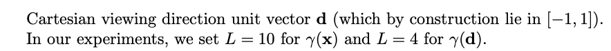
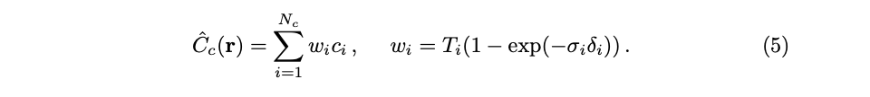
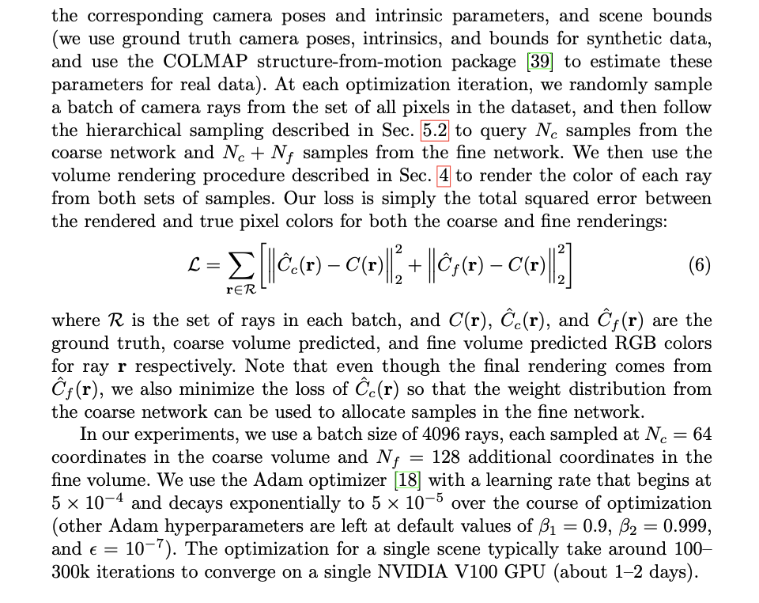

# NeRF: Representing Scenes as Neural Radiance Fields for View Synthesis

## Introduction

**Overfit a single neural network for a particular scene to train an overfitted nerual network which represents the scene.**

**Input : $(x,y,z,\theta,\phi)$: $(x,y,z)$ is the space location and $(\theta,\phi)$ is the viewing direction**  

**Output : (colour, density)**

Therefore, when the network is well-overfitted, it can give you results depending on the given viewing directions -- Catch Transparency and Colour.

### Overview

**a.** Sample 5D coordinates along camera rays.

**b.** Feed those locations into an **MLP** to produce a color and volume density.

> $F_{\Theta}$ : 
>
> 1. Process the input 3D coordinate with **8 fully-connected layers** (with **ReLU** activations and **256** channels per layer)
>
> 2. Output $\sigma$ and a **256-dimensional feature vector**.
>
> 3. Concatenate the feature vector with the camera ray's viewing direction and passed to one additional **fully-connected layer** (using **ReLU activation** and **128 channels**.)
> 4. It outputs the **view-dependent** RGB colour.

From above we can see that, NeRF encourages the representation to be multivies consistent by restricting the network to predict the volume density $\sigma$ as a function of **ONLY** the location, while we allow the RGB colour to be predicted as a fucntion of **both** location and viewing direction.

**c.** Use volume rendering techniques to composite these values into an image

**d.** The rendering function is differentiable, we optimize the scene representation by minimizing the residual between synthesized and ground truth observed images.

**The weight is the scene**

### Detailed Parts 

### Neural Radiance Field Scene Representation

* Volume density $\sigma(x)$ : differential probability of a ray terminating at an infinitesimal particle at location **x** 

* $C(\bold{r})$ : The expected color of ray $\bold{r}(t) = \bold{o}+t\bold{d}$  with near and far bound $t_n$ and $t_f$​

* $T(t)$ : accumulated transmittance along the ray from $t_n$ to $t$ ,i.e., the **probability** that the ray travels from $t_n$ to $t$ without hitting any other particle. And therefore $T(t)=exp(-\int_{t_n}^{t}\sigma(\bold{r}(s))ds)$​

  

  

Thus , $C(\bold{r}) = \int_{t_n}^{t_f} T(t) \sigma(\bold{r}(t))\bold{c}(\bold{r}(t),\bold{d})dt$​  : Clearly color depends on both position and direction.

Numerically estimate this continuous integral using **quadrature** and finally we get:

### Optimizing a Neural Radiance Field

#### Positional Encoding

**Better Performace at representing high-frequency variation**

Reform $F_{\theta}$ as a composition of two functions $F_{\theta}=F_{\theta}'*\gamma$ one learned and one not.

* $\gamma$ is a mapping from $\R$ into a higher dimensional space $\R^{2L}$ and $F_{\theta}'$ is still simply a regular MLP.

#### Hierarchical volume sampling

Implement two networks: Use the result of the coarse network to determine where to sample in the fine network. 

* one "coarse"
* one "fine"

To do this, we rewrite the **alpha composited color** from thecoarse network $\hat{C}_c(\bold{r})$ as a weighted sum of all sampled colors $c_i$​ along the ray.

Normalize the wights as $\hat{w}_i=\frac{w_i}{\sum_{j=1}^{N_c}w_j}$ , we sample a second set of $N_f$ locations from the distribution using **inverse transform sampling** (https://en.wikipedia.org/wiki/Inverse_transform_sampling)

Compute the final result using all $N_c + N_f$​ samples(Training Time), at test time use **ONLY** fine network.

### Implementation Details

