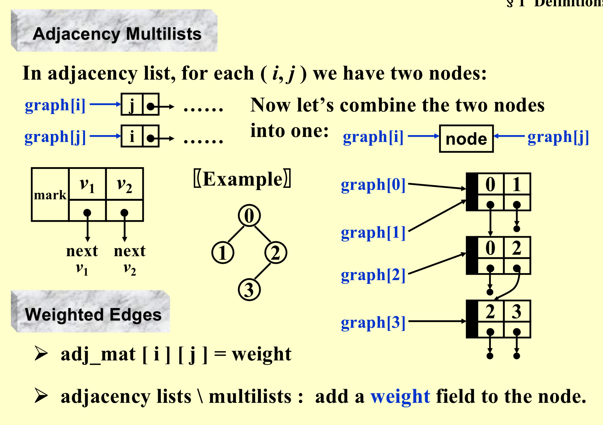

<font face = 'Times New Roman'>

## Graphs

### Some defs

* Complete graphs

  > $Undirected \ V=n \ \ \ \  E=C_n^2=\frac{n(n-1)}{2}$

  > $Directed \ V=n \ \ \ \  E=2*C_n^2=n(n-1)$

* Adjacent

> $Undirected \ : (v_i,v_j)\ is \ incident \ on\ v_i\ and\ v_j$

> $Directed \ : v_i \ is\ adjacent\ to \ v_j \ \ \ \  \ v_j \ is\ adjacent\ from \ v_i$

* Subgraph

* Simple Path

* Connected

  > $Undirected:$  An undirected graph G is connected if every pair of distinct $v_i$ and $v_j$ are connected
  >
  > * A tree = a graph that is connected and acyclic.

  > $Directed:$  
  >
  > > Strongly connected directed graph G = for every pair of $v_i$ and $v_j$ in V( G ), there exist directed paths from $v_i$ to $v_j$ and from $v_j$ to $v_i$. 
  > >
  > >  If the graph is connected without direction to the edges, then it is said to be weakly connected
  >
  > > Strongly connected component :  the maximal subgraph that is strongly connected
  >
  > * A DAG = a directed acyclic graph.

* Degree: Number of edges incident to v.
  * For a directed G, we have in-degree and out-degree. 
  
* $r=v-e+2$

### Representation of Graphs

#### Adjacency Matrix

$adj_- mat[i][j]=\left\{\begin{array}{l} 1 \ if (v_i,v_j) \ or <v_i,v_j> \in E(G)\\0\ \ otherwise \end{array}\right.$

> If G is undirected the matrix is symmetric,thus sorting only half of the matrix

> > The trick is to store the matrix as a 1-D array: adj_mat [ $n(n+1)/2 $] = ${ a_{11}, a_{21}, a_{22}, ..., a_{n1}, ..., a_{nn} }$
>
> > The index for $a_{ij}$  is  $i( i - 1 )/2+j$.

$\begin{align*}degree(i) &= \sum_{j=0}^{n-1}adj_-mat[i][j] \ (If\ G\ is\ undirected)\\ & \ \ +\sum_{j=0}^{n-1}adj_-mat[j][i]\ (If\ G\ is\ directed)\end{align*}$

#### Adjacency Lists

* Undirected


> Degree( $i$ ) = number of nodes in graph[ $i$ ] (if $G$ is undirected).
>
> T of examine (whether complete)  E(G) = O( n + e ) 

* Directed

A. Add inverse adjacency lists

B.Multilists

#### Adjacency Multilist




* The space taken :$(n+2e)$ ptrs + $2e$ ints  and “mark” is not counted.
* Sometimes we need to mark the edge after examine it,and then find the next edge.This representation makesit easy to do so.

### Topological Sort

#### AOV Network

Digraph G in which V( G ) represents activities ( e.g.  the courses ) and E( G ) represents precedence relations

* i  is a predecessor of j $:$ there is a path from i  to j.
* i  is an immediate predecessor of  j $:$  $< i,  j >\in E( G )$  then $j$ is called a successor ( immediate successor ) of i.
* Partial order $:$ a precedence relation which is both transitive and irreflexive.

> If the precedence relation is reflexive, then there must be an i such that i is a predecessor of i.  
>
> That is, i must be done before i is started.   Therefore if a project is feasible, it must be irreflexive.

* Feasible AOV network must be a dag (directed acyclic graph).

####  topological order

A topological order is a linear ordering of the vertices of a graph such that, for any two vertices, i, j, if i is a predecessor of j in the network then i precedes j in the linear ordering.

* Test an AOV for feasibility, and generate a topological order if possible.

* Method One $T=O(|V|^2)$


```C
void Topsort( Graph G )
{   int  Counter;
    Vertex  V, W;
    for ( Counter = 0; Counter < NumVertex; Counter ++ ) {
		V = FindNewVertexOfDegreeZero( );
		if ( V == NotAVertex ) {
	    Error ( “Graph has a cycle” );   break;  }
		TopNum[ V ] = Counter; /* or output V */
		for ( each W adjacent to V )
	    	Indegree[ W ] – – ;
    }
}
```

* Method Two. $T = O( |V| + |E| )$

```C
void Topsort( Graph G )
{   Queue  Q;
    int  Counter = 0;
    Vertex  V, W;
    Q = CreateQueue( NumVertex );  MakeEmpty( Q );
    for ( each vertex V )
	if ( Indegree[ V ] == 0 )   Enqueue( V, Q );
    while ( !IsEmpty( Q ) ) {
	V = Dequeue( Q );
	TopNum[ V ] = ++ Counter; /* assign next */
	for ( each W adjacent to V )
	    if ( – – Indegree[ W ] == 0 )  Enqueue( W, Q );
    }  /* end-while */
    if ( Counter != NumVertex )
	Error( “Graph has a cycle” );
    DisposeQueue( Q ); /* free memory */
}
```

### Midterm Review

Which of the following statements is TRUE about topological sorting? (5分)

* If a graph has a topological sequence, then its adjacency matrix must be triangular.
* If the adjacency matrix is triangular, then the corresponding directed graph must have a unique topological sequence.
* In a DAG, if for any pair of distinct vertices *Vi* and *Vj*, there is a path either from *Vi* to *Vj* or from *Vj* to *Vi*, then the DAG must have a unique topological sequence.
* If *Vi* precedes *Vj* in a topological sequence, then there must be a path from *Vi* to *Vj*.

3 is true

### Shortest Path Problem

#### 1.Single-Source Shortest Path Problem

* Unweighted Shortest Path

```C
void unweighted(Table T){
  	int CurrDist;
  	Vertex V,W;
  	 for(CurrDist=0;CurrDist<NumVertex;CurrDist++){
      for(each vertex V){      
        if(!T[V].Known&&T[V].Dust==CurrDist){
          R[V].Known=true;
          for(each W adjacent to V){
            if(T[W].Dist==infinity){
              T[W].Dist=CurrDist+1;
                T[E].Path=V;
            }
          }
        }
      }
    }
}
```

But the time complexity is $O(|V|^2)$

* Note: If V is unknown yet has $Dist < Infinity$,then Dist is either $CurrDist$ or $CurrDist +1$(Remember Tree?)

> Improvement

```C
void unweighted (Table T){
  Queue Q;
  Vertex V,W;
  Q=CreateQueue(NumVertex);MakeEmpty(Q);
  Enqueue(S,Q);
  while(!isEmpty(Q)){
    V=Dequeue(Q);
    T[V].known=true;//not really necessary
    for(each W adjacent to V){
      if(T[W].Dist==Infinity){
        T[W].Dist=T[V].Dist+1;
        T[W].Path=V;
        ENqueue(W,Q)
      }
    }
  }
  DisposeQueue(Q);
}
```

* $T=O(|V|+|E|)$

#### Dijkstra's Algorithm(for weighted shortest paths)

```C
void Dijkstra(Table T){
  //T is initialized by Figure 9.30 on p 303
  Vertex V,W;
  for(;;){
    V=smallest unknown distance vertex;
    if(V==NotAVertex){break;}
    T[V].known=true;
    for(each W adjacent to V){
      if(!T[W].Known){
        if(T[V].Dist+Cvw<T[W].Dist){
          Decrease(T[W].Dist to T[V].Dist+Cvw);
          T[W].Path=V
        }
      }
    }
  }
}
```

* Implementation 1

  $T = O( |V|^2 + |E| )$

  * **Initialization:** The initialization phase involves traversing all vertices, setting their distances to infinity, and setting the initial vertex's distance to 0. The time complexity of this step is O(V), where V is the number of vertices.

  * **Main Loop:** The number of iterations in the main loop depends on the number of vertices. In each iteration, the algorithm selects the smallest unknown distance vertex V and then traverses all vertices W adjacent to V. For each W, it checks if there is a shorter path through V to W, and if so, it updates the distance of W. 

    The time complexity of this step is $O(V^2)$, as, for each vertex V, all vertices adjacent to V are considered.

  * **Finding the Minimum Distance Vertex:** In the main loop, the algorithm needs to find the smallest unknown distance vertex V. The time complexity of this step is O(V^2), as it needs to check the distance of each vertex.

  In summary, the time complexity of the Dijkstra algorithm is $O(V^2)$.

* Implementation 2

  * **V = smallest unknown distance vertex:**  Keep distances in a priority queue and call DeleteMin – $O(log|V|)$

  * **Decrease( T[ W ].Dist  to  T[ V ].Dist + Cvw )**

    * Method 1: DecreaseKey – $O(log|V|)$

    $T = O( |V|log|V|+|E|log|V|)=O(|E|log|V|)$  ----**Good if the graph is sparse**

    * Method 2: insert $W$ with updated Dist into the priority queue. 

      Must keep doing DeleteMin until an **unknown** vertex emerges

      $T = O(|E| log|V| )$ but requires $|E|$ DeleteMin with $|E|$ space

#### Graphs with Negative Edge Costs

* Why don’t we simply add a constant to each edge and thus remove negative edges? --**Path with different count of PATHS!**

```C
void  WeightedNegative( Table T )
{   Queue  Q;
    Vertex  V, W;
    Q = CreateQueue (NumVertex );  MakeEmpty( Q );
    Enqueue( S, Q ); /* Enqueue the source vertex */
  	while (!IsEmpty(Q)){
      V=Dequeue(Q);/* each vertex can dequeue at most |V| times */
      for(each W adjacent to V){
        if ( T[ V ].Dist + Cvw < T[ W ].Dist ){/* no longer once per edge */
            T[ W ].Dist = T[ V ].Dist + Cvw;
            T[ W ].Path = V;
            if(W is not already in Q){Enqueue(W,Q)}
        }/* end-if update */                                              
      }
    }/* end-while */
    DisposeQueue( Q ); /* free memory */
}
```

#### Acyclic Graphs

If the graph is acyclic, vertices may be selected in topological order since when a vertex is selected, its distance can no longer be lowered without any incoming edges from unknown nodes.

$T=O(|E| + |V|)$ and no priority queue is needed.

> Application: AOE ( Activity On Edge ) Networks           —— scheduling a project


#### All-pairs Shortest path problem

### Network Flow Problem

#### Ford-Fulkerson Algorithm

* If the edge capabilities are rational numbers, this algorithm always terminate with a maximum flow.

* The algorithm works for G with cycles as well.

> Analysis

#### 1.An augmenting path can be found by an unweighted shortest path algorithm.

$T = O( f\cdot|E| )$  where  f  is the maximum flow.


#### 2.always choose the augmenting path that allows the largest increase in flow.

$「modify\ Dijkstra’s\ algorithm\ 」$

$\begin{align*}T&=T_{argmentation}*T_{find\ a\ path}\\ &=O(E)log(cap_{max})*O(|E|log|V|)\\ &= O( |E|^2log|V|).\end{align*}$ if capmax is a small integer

#### 3.Always choose the augmenting path that has the least number of edges.

Simple $BSF$ Unweighted shortest path algorithm

$\begin{align*}T&=T_{argmentation}*T_{find\ a\ path}\\ &=O(E)*O(|E||V|)\\ &= O( |E|^2|V|).\end{align*}$

* If every v $\notin$ { s, t } has either a single incoming edge of capacity 1 or a single outgoing edge of capacity 1, then time bound is reduced to $O( |E| |V|^{1/2} )$.
* The min-cost flow problem is to find, among all maximum flows, the one flow of minimum cost provided that each edge has a cost per unit of flow.

### Minimum Spanning Tree

* A spanning tree of a graph G is a tree which consists of $V( G )$ and a subset of $E( G )$
  * The minimum spanning tree is a tree since it is acyclic -- the number of edges is |V| – 1.
  * It is minimum for the total cost of edges is minimized.
  * It is spanning because it covers every vertex.
  * A minimum spanning tree exists iff G is connected.
  * Adding a non-tree edge to a spanning tree, we obtain a cycle.

#### Algorithm 

(1)  we must use only edges within the graph

(2)  we must use exactly |V| -1 edges

(3)  we may not use edges that would produce a cycle.

#### 1.Prim’s Algorithm – grow a tree

#### 2.Krukal’s Algorithm – grow a tree

```C
void Kruskal ( Graph G )
{   T = { } ;
    while  ( T contains less than |V| - 1 edges 
                   && E is not empty ) {
        choose a least cost edge (v, w) from E ; /* Delete Min */
        delete (v, w) from E ;
        if  ( (v, w) does not create a cycle in T )     /Union Find/
	add (v, w) to T ;*
        else     
	discard (v, w) ;
    }
    if  ( T contains fewer than |V| - 1 edges )
        Error ( “No spanning tree” ) ;
}
```

### Applications of Depth-First Search

```C
void DFS ( Vertex V )  /* this is only a template */
{   visited[ V ] = true;  /* mark this vertex to avoid cycles */
    for ( each W adjacent to V )
        if ( !visited[ W ] )
	DFS( W );
} 
/* T = O( |E| + |V| ) as long as adjacency lists are used */
```

#### Biconnectivity

* v is an articulation point if G’ = DeleteVertex( G, v ) has at least 2 connected components.
* G is a biconnected graph if G is connected and has no articulation points.
* A biconnected component is a maximal biconnected subgraph.

#### find  the biconected components of a connected undirected graph G


#### Directed case

Refert to https://www.baeldung.com/cs/scc-tarjans-algorithm

A directed graph is strongly connected if there is a path between all pairs of vertices. A strongly connected component (**SCC**) of a directed graph is a maximal strongly connected subgraph. 

- DFS search produces a DFS tree/forest 
- Strongly Connected Components form subtrees of the DFS tree. 
- If we can find the head of such subtrees, we can print/store all the nodes in that subtree (including the head) and that will be one SCC. 
- There is no back edge from one SCC to another (There can be cross edges, but cross edges will not be used while processing the graph).

- **Case1 (Tree Edge):** If node v is not visited already, then after the DFS of v is complete, a minimum of low[u] and low[v] will be updated to low[u]. 
  low[u] = min(low[u], low[v])
- **Case 2 (Back Edge):** When child v is already visited, then a minimum of low[u] and Disc[v] will be updated to low[u]. 
  low[u] = min(low[u], disc[v]); 

#### Euler Circuit

- 欧拉回路（Euler circuit）为包含所有边的简单环，欧拉路径（Euler path）为包含所有边的简单路径
- 无向图
  - 无向图 G 有欧拉回路当且仅当 G 是连通的且每个顶点的度数都是偶数
  - 无向图 G 有欧拉路径当且仅当 G 是连通的且有且仅有两个顶点的度数是奇数
- 有向图
  - 有向图 G 有欧拉回路当且仅当 G 是弱连通的且每个顶点的出度等于入度
  - 有向图 G 有欧拉路径当且仅当 G 是弱连通的且有且仅有一个顶点的出度比入度大 1，有且仅有一个顶点的入度比出度大 1，其余顶点的出度等于入度

#### DFS

* The path should be maintained as a linked list.
* For each adjacency list, maintain a pointer to the last edge scanned.
* T = $O( |E| + |V| )$

```C
#include <iostream>
#include <cstring>
using namespace std;
const int maxn = 1005;  // 假设最大节点数为1005
int G[maxn][maxn];      // 邻接矩阵表示图
int deg[maxn];          // 节点的度
int ans[maxn];          // 存储结果的数组
int ansi = 0;           // 结果数组的索引
bool visited[maxn];     // 标记节点是否被访问过
void dfs(int x) {
    for (int y = 1; y <= maxn; ++y) {
        if (G[x][y]) {
            G[x][y] = G[y][x] = 0;
            dfs(y);
        }
    }
    ans[++ansi] = x;
}
int main() {
    // ... 读取输入，初始化 G 和 deg
    int cnt = 0, root = 0;
    for (int i = 1; i <= maxn; ++i) {
        if (deg[i] % 2) {
            cnt++;
            if (!root) root = i;
        }
    }
    if (!root) {
        for (int i = 1; i <= maxn; ++i) {
            if (deg[i]) {
                root = i; break;
            }
        }
    }
    if (cnt && cnt != 2) {
        cout << "No Solution\n";
        return 0;
    }
    dfs(root);
    // 输出结果
    for (int i = ansi; i > 0; --i) {
        cout << ans[i] << ' ';}
    cout << '\n';
    return 0;
}
```

#### Hamilton cycle


</font>

