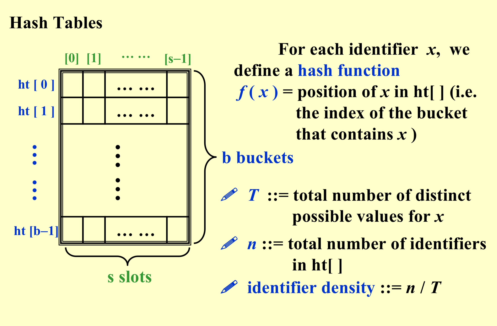
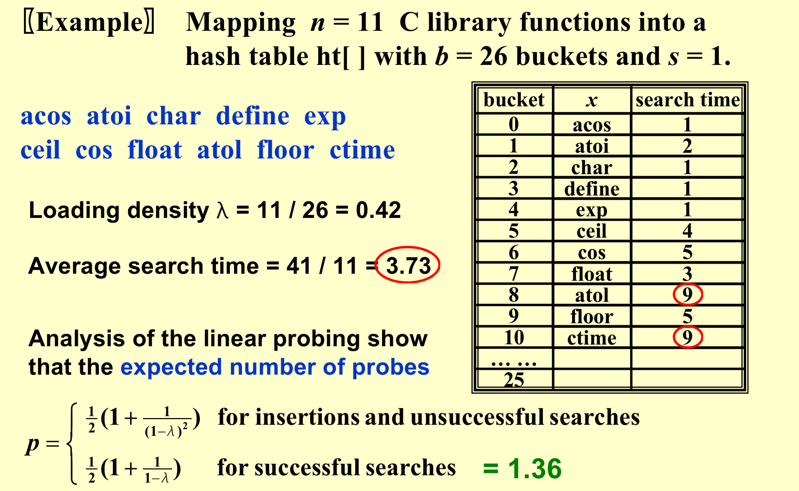
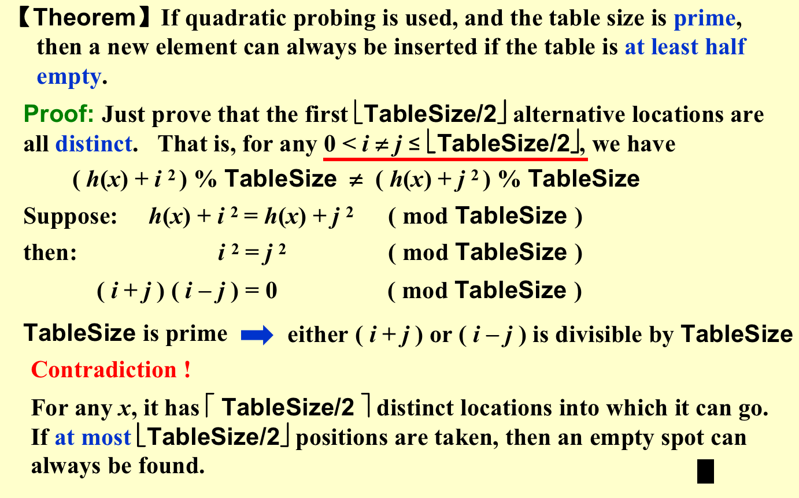

# HASHING

### Interpolation Search

Interpolation Search is a searching algorithm used to find a specific element in a sorted array. Similar to binary search, it employs a divide-and-conquer strategy, but it differs by estimating the probable position of the target value based on the distribution of the search key and array elements at each step.

The algorithm proceeds as follows:

1. Assume the array is sorted.

2. Calculate the interpolation position using the formula:

   $position=low+⌊\frac{(high−low)×(key−arr[low])}{arr[high]−arr[low]⌋}$

   Here, $arr$ is the array, and $low$ and $high$ are the array indices, while $key$ is the element to be searched.

3. If $arr[position]=key$, the target element is found, and the position positionposition is returned.

4. If $arr[position]<key$, continue the search in the right half by updating $low=position+1$

5. If $arr[position]>key$, continue the search in the left half by updating $high=position−1$

6. Repeat steps 2 to 5 until the target element is found or $low>high$.

Interpolation Search excels when dealing with uniformly distributed sorted arrays, as it efficiently estimates the target element's position, reducing the number of search iterations. However, its effectiveness relies on the assumption of a roughly uniform distribution of array elements. In cases of uneven data distribution, other search algorithms may outperform Interpolation Search. Binary search, for instance, could be more stable as it is less sensitive to the distribution of array elements.

### Hash Tables

https://www.geeksforgeeks.org/hashing-data-structure/#introduction



* Without overflow,$T_{search} = T_{insert} = T_{delete} = O( 1 )$

### Hash Functions

For numbers：

（1）求余法

（2）平方取中

（3）折叠法

（4）数字分析法

* Eg. To Hash "Strings"

$f(x)=(\sum x[N-i-1]*32^i)\%TableSize$

```C
Index Hash3( const char *x, int TableSize ) {
	unsigned  int  HashVal = 0; 
/* 1*/ 	while( *x != '\0' ) 
/* 2*/ 	     HashVal = ( HashVal << 5 ) + *x++; 
/* 3*/ 	return HashVal % TableSize; 
} 
```

* If x is too long (e.g. street address), the early characters will be left-shifted out of place.

### Separate Chaining

```C
struct  ListNode; 
typedef  struct  ListNode  *Position; 
struct  HashTbl; 
typedef  struct  HashTbl  *HashTable; 
struct  ListNode { 
	ElementType  Element; 
	Position  Next; 
}; 
typedef  Position  List; 
/* List *TheList will be an array of lists, allocated later */ 
/* The lists use headers (for simplicity), */ 
/* though this wastes space */ 
struct  HashTbl { 
	int  TableSize; 
	List  *TheLists; 
};
```

#### Create an empty table

```C
HashTable  InitializeTable( int TableSize ) 
{   HashTable  H; 
    int  i; 
    if ( TableSize < MinTableSize ) { 
	    Error( "Table size too small" );  return NULL;  
    } 
    H = malloc( sizeof( struct HashTbl ) );  /* Allocate table */
    if ( H == NULL )    FatalError( "Out of space!!!" ); 
    H->TableSize = NextPrime( TableSize );  /* Better be prime */
    H->TheLists = malloc( sizeof( List ) * H->TableSize );  /*Array of lists*/
    if ( H->TheLists == NULL )   FatalError( "Out of space!!!" ); 
    for( i = 0; i < H->TableSize; i++ ) {   /* Allocate list headers */
				H->TheLists[ i ] = malloc( sizeof( struct ListNode ) ); /* Slow! */
				if ( H->TheLists[ i ] == NULL )  FatalError( "Out of space!!!" ); 
				else    H->TheLists[ i ]->Next = NULL;
    } 
    return  H; 
} 
```

#### Find a key from a hash table

```C
Position  Find ( ElementType Key, HashTable H ) 
{ 
    Position P; 
    List L; 
    L = H->TheLists[ Hash( Key, H->TableSize ) ]; 

    P = L->Next; 
    while( P != NULL && P->Element != Key )  /* Probably need strcmp */ 
	P = P->Next; 
    return P; 
} 
```

#### Insert a key into a hash table

```C
void  Insert ( ElementType Key, HashTable H ) 
{ 
    Position  Pos, NewCell; 
    List  L; 
    Pos = Find( Key, H ); 
    if ( Pos == NULL ) {   /* Key is not found, then insert */
			NewCell = malloc( sizeof( struct ListNode ) ); 
			if ( NewCell == NULL )     FatalError( "Out of space!!!" ); 
			else { 
	     		L = H->TheLists[ Hash( Key, H->TableSize ) ]; 
	     		NewCell->Next = L->Next; 
	     		NewCell->Element = Key; /* Probably need strcpy! */ 
	    	  L->Next = NewCell; 
						} 
    	} 
} 
```

### Open Addressing

Solve Collision

```C
Algorithm: insert key into an array of hash table
{
    index = hash(key);
    initialize i = 0 ------ the counter of probing;
    while ( collision at index ) {
			index = ( hash(key) + f(i) ) % TableSize;
			if ( table is full )    break;
			else    i ++;
    }
    if ( table is full )  ERROR (“No space left”);
    else  insert key at index;
}
```

#### Linear Probing

$f(i)=i$



* Although p is small,the worst case can beLARGE.
* Cause **primary clustering**: any key that hashes into the cluster will add to the cluster after several attempts to resolve the collision.

#### Quadratic Probing

$f(i)=i^2$



*  If the table size is a prime of the form 4k + 3, then the quadratic probing  $f(i)=i^2$ can probe the entire table.
* Read Figures $7.15 - 7.16$ for detailed representations and implementations of initialization.

```C
Position  Find ( ElementType Key, HashTable H ) 
{   Position  CurrentPos; 
    int  CollisionNum; 
    CollisionNum = 0; 
    CurrentPos = Hash( Key, H->TableSize ); 
    while( H->TheCells[ CurrentPos ].Info != Empty && H->TheCells[ CurrentPos ].Element != Key) { 
	CurrentPos += 2 * (++CollisionNum)-1; 
	if ( CurrentPos >= H->TableSize )  CurrentPos  = H->TableSize; 
    } 
    return CurrentPos; 
} 
```

* Insert

```C
void  Insert ( ElementType Key, HashTable H ){ 
    Position  Pos; 
    Pos = Find( Key, H ); 
   if ( H->TheCells[ Pos ].Info != Legitimate ) { /* OK to insert here */ 
	H->TheCells[ Pos ].Info = Legitimate; 
	H->TheCells[ Pos ].Element = Key; /* Probably need strcpy */ 
    } 
} 
```

* Delete

> Insertion will be seriously slowed down if there are too many deletions intermixed with insertions.     
>
> Although primary clustering is solved, secondary clustering occurs – that is, keys that hash to the same position will probe the same alternative cells.

#### Double Hashing

$f ( i ) = i * hash_2( x )$   

* hash2( x ) is the 2nd hash function  -- usually $hash_2( x ) = R-(x\% R)$  with R a prime smaller than TableSize, will work well.

### Rehashing

